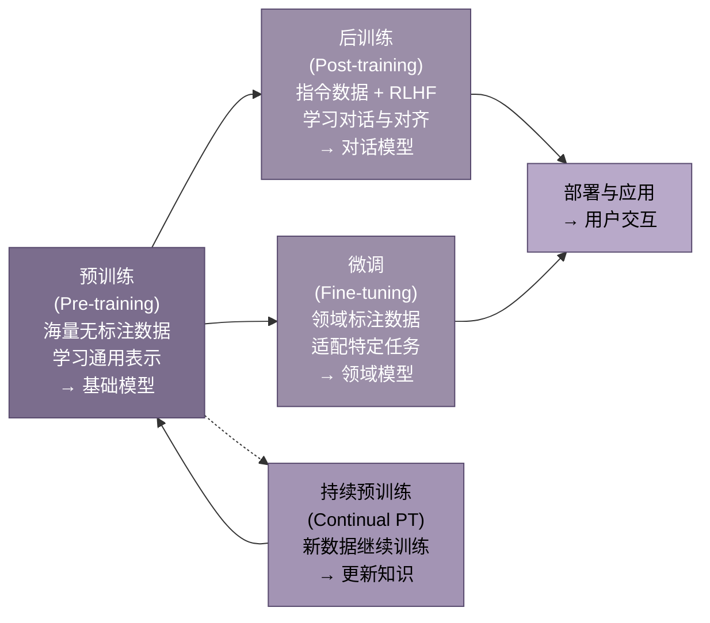
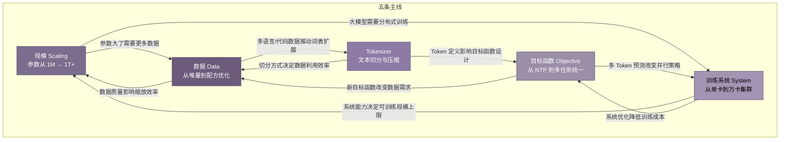

# 导读：先看懂大模型预训练的全景图

## 0.1 什么是预训练

### 0.1.1 预训练的本质

预训练（Pre-training）的核心机制是**自监督学习**（Self-supervised Learning）。模型在无标注文本上训练，用文本自身构造监督信号。具体做法是让模型预测被遮蔽或即将出现的词。这个预测任务迫使模型内化语法规则、语义关联和世界知识。整个过程中没有人工标注，文本本身就是老师。

这一机制的经济意义巨大。传统监督学习需要为每个任务专门标注数据，成本高昂且难以扩展。预训练打破了这一瓶颈。互联网上的文本取之不尽。模型可以从中自动提取学习信号。GPT-3 的训练数据来自数千亿字的网页、书籍和代码。若以人工标注同等规模数据，成本将高到不可能承受。

### 0.1.2 从"语言建模"到"通用智能底座"

预训练的角色经历了根本性转变。2018 年之前，NLP 系统为每个任务单独训练。情感分析用一个模型，机器翻译用另一个模型，问答系统再用一个模型。每个任务都是一座孤岛。

2018 年 BERT 和 GPT 的出现改变了这一切。预训练模型不再是一个专用工具。它变成了**通用底座**——一个可被适配到无数下游任务的起点。先在大规模无标注数据上学习通用能力。再在少量标注数据上微调特定任务。这个"预训练+微调"的两阶段范式成为行业标准。

2020 年 GPT-3 将这一范式推向极致。1750 亿参数的模型无需微调，仅靠输入中的几个示例就能完成新任务。预训练模型从"特征提取器"变成了"任务接口"——输入任务描述，直接得到结果。

### 0.1.3 预训练与微调、后训练的关系

理解预训练的位置，需要看清它与后续阶段的边界。

**预训练**是根基阶段。它决定了模型的知识储备、语言能力和推理上限。一个预训练不足的模型，后续无论如何微调都无法弥补基础缺陷。预训练通常消耗整个训练流程 80% 以上的算力。

**后训练**（Post-training）是 2022 年后兴起的概念，包含指令微调（SFT）和基于人类反馈的强化学习（RLHF）。它的目标不是教模型新知识。而是让模型学会按照人类期望的方式表达：听话、有用、无害。

**微调**面向特定应用场景。医疗问答模型在法律领域微调，就能变成合同审查助手。微调数据量小（数千到数万条），成本低，是产业落地的主要手段。

**持续预训练**则是在已有模型基础上用新数据继续训练。知识需要更新时——新产品、新法规——持续预训练比重新训练更经济。

四者的关系可以概括为：预训练决定"能做什么"。后训练决定"愿意怎么做"。微调决定"具体做哪件事"。

## 0.2 五条主线概览

大模型预训练的技术演进可以归纳为五条相互交织的主线。它们不是独立发展的，而是彼此制约、相互推动。

### 0.2.1 规模：从百万参数到万亿参数

2013 年的 Word2Vec 只有数百万参数。2018 年 BERT-base 有 1.1 亿参数。2020 年 GPT-3 跃升至 1750 亿。2024 年 Mixtral 8×22B 总参数量超过 1400 亿，而 GPT-4 据估计超过 1 万亿。

规模增长不是盲目的军备竞赛。2020 年 OpenAI 提出的 Scaling Law 揭示了参数数量、数据量和计算量之间的数学关系。模型性能可以用这三者的幂律函数预测。这意味着，给定预算，可以算出最优的参数-数据配比。

但规模也带来代价。每增加 10 倍参数，训练成本上升约 100 倍，推理成本上升约 10 倍。这推动了另一条主线——用更少参数获得同等能力的技术探索。

### 0.2.2 数据：从"越多越好"到"配方比原料更重要"

GPT-3 用 3000 亿 Token 训练，主要来自互联网爬取。当时的思路简单粗暴：数据越多越好。

2022 年的 Chinchilla 实验颠覆了这一认知。DeepMind 发现，GPT-3 等早期大模型实际上**训练不足**——它们看到了太多参数、太少数据。最优比例应该是每个参数配约 20 个 Token，而非 GPT-3 的 1.7 个。Chinchilla（700 亿参数、1.4 万亿 Token）击败了参数量 4 倍于它的 Gopher（2800 亿参数、3000 亿 Token）。

这开启了"数据配方"时代。2024 年的 LLaMA 3 用 15.6 万亿 Token 训练 80 亿参数模型。这个数量远超 Chinchilla 最优比例。动机很明确：让小模型在推理时更便宜。数据配比从经验走向科学。代码该占多少、多语言该占多少、高质量文本该占多少。这些比例成为模型差异的核心来源。

### 0.2.3 Tokenizer：文本如何被切割成模型可学习的单位

模型不直接读文本。Tokenizer 将文本切分成离散的 Token（词片段），再转为数字 ID 供模型处理。英文中 1 个 Token 约等于 0.75 个单词，中文中 1 个 Token 约等于 0.5 个汉字。

Tokenizer 的选择直接影响模型能力。词表太小，常见词被切得支离破碎，模型难以学习完整语义。词表太大，嵌入层参数膨胀，训练效率下降。不同语言的 Token 切分效率差异巨大。同样的服务，中文用户的处理成本比英文用户高 30-50%。

从 BPE 到 WordPiece，再到字节级 BPE，Tokenizer 的演进主线很明确。它在压缩率、信息保留和多语言覆盖之间寻找最优平衡。

### 0.2.4 目标函数：从简单语言建模到多任务统一预测

目标函数定义了模型在预训练阶段的"学习任务"。GPT 系列采用**下一个 Token 预测**（Next Token Prediction, NTP）：给定已出现的词，预测下一个词。BERT 采用**遮蔽语言建模**（Masked Language Modeling, MLM）：随机遮蔽部分词，让模型根据上下文还原。T5 采用**片段破坏**（Span Corruption）：遮蔽连续片段再生成。

三条路线在 2024 年走向融合。多 Token 预测（Multi-token Prediction, MTP）成为新方向——模型不再只预测下一个词，而是同时预测未来多个词。这提升了训练效率，也为推理加速提供了新可能。

### 0.2.5 训练系统：从单卡到万卡集群的分布式工程

GPT-3 的训练动用了数千张 V100 GPU，耗资约 1200 万美元。2024 年 DeepSeek-V3 用 2048 张 H800 GPU 在约 280 万 GPU 小时内完成训练，成本降至约 600 万美元——性能却达到 GPT-4 级别。

训练系统的演进贯穿三个并行维度。**数据并行**：不同 GPU 处理不同数据。**张量并行**：同一层计算切分到多卡。**流水线并行**：不同层分配到不同 GPU。三者的组合称为 3D 并行。再加上显存优化技术（ZeRO、激活重计算）和低精度训练（FP16 → BF16 → FP8），效果惊人。万亿参数模型的训练在有限硬件上成为可能。

FlashAttention 系列通过减少 GPU 显存访问次数，将 Attention 计算提速数倍。序列并行（Sequence Parallelism）和环形 Attention（Ring Attention）进一步将上下文长度从 2K 扩展到 128K 乃至百万级。

## 0.3 时间线与技术代际

| 代际 | 时期 | 标志性事件 | 核心突破 | 解决的核心问题 | 代表模型 |
|:---:|:---:|:---|:---|:---|:---|
| 第一代 | 2013–2017 | Word2Vec → GloVe → Seq2Seq + Attention | 分布式词表示；Attention 机制诞生 | 如何让计算机"理解"词的含义；突破 RNN 顺序计算瓶颈 | Word2Vec, GloVe, ELMo |
| 第二代 | 2018–2020 | BERT / GPT-1 / T5 三分天下 | "预训练+微调"范式确立；Transformer 成为标准骨架 | NLP 任务是否需要各自独立的模型架构 | BERT, GPT-2, T5, RoBERTa |
| 第三代 | 2020–2022 | Scaling Law 提出；GPT-3 发布 | 性能可预测；大模型涌现新能力；上下文学习 | 如何科学地规划训练，而非盲目试错 | GPT-3, Gopher, Chinchilla, PaLM |
| 第四代 | 2022–2024 | Chinchilla 最优比；LLaMA 开源；数据配比科学化 | 数据量应约为参数量的 20 倍；数据配方成核心竞争力 | 早期大模型训练不足；如何科学配比多源数据 | Chinchilla, LLaMA 1-3, Mistral, Qwen |
| 第五代 | 2024–2026 | MoE 普及；推理模型兴起；多模态融合 | 稀疏激活降低推理成本；RL 进入预训练阶段 | 稠密模型推理成本过高；模型需要"思考能力" | DeepSeek-V3, GPT-4o, Gemini 1.5, Qwen3 |

第一代的意义常被低估。Word2Vec 证明了一个关键命题。语言模型在无标注文本上训练后，其内部表示捕获了丰富的语义信息。这个词向量时代为后来的 Transformer 预训练奠定了思想基础。2014 年 Seq2Seq 和 Attention 的同年出现，则为 2017 年 Transformer 的诞生铺平了道路。

第二代是范式的确立期。BERT 用双向编码统治了理解任务。GPT 用自回归生成开创了生成任务的预训练路径。T5 则提出"一切文本到文本"的统一框架。三条路线并行探索，最终 GPT 的 Decoder-only 架构因其简洁性和可扩展性成为主流。

第三代是规模方法的确立期。OpenAI 在 2020 年的 Scaling Law 论文证明了一件事。模型损失可以用参数数量、数据量和计算量的幂律函数精确预测。这意味着大模型训练从"碰运气"变成了"可规划工程"。GPT-3 以 1750 亿参数展示了规模化的威力。上下文学习、少样本推理等能力在达到一定规模后自然涌现。

第四代的核心转折是数据意识的觉醒。Chinchilla（2022）证明多数早期大模型严重训练不足。数据量应该与参数量同步增长。最优比例约为 20:1。开源社区迅速跟进。LLaMA-1（650 亿参数、1.4 万亿 Token）证明了一件事：小模型+大数据的路线可以逼近大模型性能。数据配比从经验走向科学。代码、多语言、推理数据各该占多少比例，成为决定模型能力的关键因素。

第五代正在展开。三条主线同时推进。MoE（混合专家）架构用稀疏激活降低了推理成本——DeepSeek-V3 总参数 6710 亿，但每次只激活 370 亿。推理模型（o1/o3、DeepSeek-R1）将强化学习引入训练核心，让模型学会"先思考再回答"。多模态预训练让文本模型扩展到图像、语音、视频。统一的感知-理解-生成能力成为新目标。

## 0.4 本书阅读指南

### 0.4.1 本书不讲代码

本书聚焦三件事。**技术思想的历史脉络**：为什么这条路线赢了那条路线。**关键转折的决策逻辑**：当时面临什么选择，为什么选了 A 而非 B。**当前技术的边界与方向**：什么东西已经确定，什么还在争论。

书中不会出现 Python 代码片段、PyTorch API 调用或训练脚本细节。需要这些内容读者可以查阅官方文档和开源仓库。本书的价值在于帮助你在工程实践中做出正确决策。包括选型、配比、资源分配等。而非帮你写出一行能跑的代码。

### 0.4.2 建议阅读路径

**速读路线**（约 4-6 小时）：阅读本导读 → 第 2 章（Transformer）→ 第 3 章（GPT 路线）→ 第 9-10 章（Scaling Law 与 GPT-3）→ 第 11 章（Chinchilla）→ 第 26-27 章（LLaMA 3 与 DeepSeek-V3）。这条路线覆盖最核心的技术转折。读完它，足以让你理解大模型预训练的主要脉络。

**精读路线**：按顺序阅读全书 30 章。章节编排遵循技术发展的时间线和逻辑依赖关系。前五部分（第 1-21 章）覆盖从 Transformer 到分布式训练的核心技术，是精读的重点。后三部分（第 22-30 章）聚焦 2024-2026 年的最新进展，可根据兴趣选择阅读顺序。每条主线的完整论证都分布在多个章节中，精读需要跨章节追踪。例如，Tokenizer 主线贯穿第 6-8 章，Scaling Law 主线贯穿第 9-12 章，分布式训练主线贯穿第 17-21 章。如果你想深入某条主线，按对应章节连续阅读即可。

