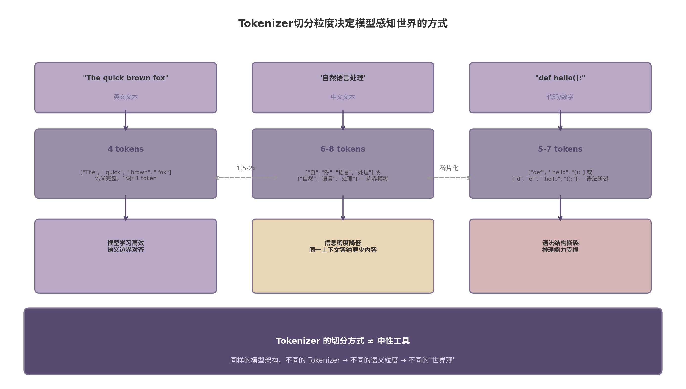

# 第6章 Tokenizer 的核心问题

## 6.1 Tokenizer 解决的不是分词，而是压缩与泛化

### 6.1.1 Tokenizer 本质任务

Tokenizer 常被误解为"分词工具"——将句子拆成单词的预处理步骤。这个理解偏离了实质。Tokenizer 的核心任务是将可变长度的文本序列压缩为固定集合中的整数索引序列[^1^]。它决定了模型以何种"粒度"感知文本，直接影响信息密度、序列长度和泛化行为。

从信息论视角看，Tokenizer 是一种有损压缩器。原始文本（UTF-8 字节流）被映射到词汇表中的离散符号。压缩率由 fertility 指标衡量：每个词对应的平均 token 数。英文的 fertility 约为 1.3（即平均每词拆成 1.3 个 token），中文约为 1.8-2.0，泰米尔语可达 4-6[^25^]。 fertility 越高，压缩率越低，模型处理相同语义内容需要更长的序列。

BPE（Byte Pair Encoding）最初由 Gage 于 1994 年提出，是一种数据压缩算法[^5^]。Sennrich 等人 2016 年将其引入 NLP 领域时，本质思想并未改变：用频繁的字符对替换单一符号，逐步降低序列长度[^1^]。这一压缩导向的设计哲学贯穿了此后所有子词 Tokenizer 的演进。

### 6.1.2 压缩率与信息密度平衡

压缩率与信息密度之间存在张力。词表过小（如字符级 256 个符号），序列过长，自注意力的二次复杂度使计算成本剧增。词表过大（如 500K+），嵌入层和输出层膨胀为显存瓶颈，且低频词训练不充分[^43^]。

Tao 等人（NeurIPS 2024）发现词表大小与训练损失之间存在对数线性关系[^41^]。Hayou 和 Liu（2025）进一步指出：当词表大小 m 远大于嵌入维度 d 时，最优嵌入学习率应按 $\sqrt{d}$ 缩放，而非传统的线性缩放[^44^]。这些结果表明词表大小不是可随意调整的超参数，而是与模型训练动态深度耦合的结构性选择。

信息密度还体现在词表构造的统计特性上。Token 分布服从类 Zipf 定律：少数高频 token 覆盖大部分文本，大量低频 token 仅出现数次[^42^]。分布越偏离幂律（熵越高），模型学习效率越低。

### 6.1.3 泛化能力

Tokenizer 影响泛化的机制常被忽视。合理的子词拆分使模型能够从已知词素组合推断未见过的新词。例如，模型若在学习"unhappy"和"comfortable"时分别接触到"un-"和"-able"这两个子词单元，便能推断"uncomfortable"的含义——即使训练语料中从未出现过该词[^1^]。

这种组合泛化是子词级 Tokenizer 取代词级方案的核心原因。字符级和字节级虽然也能实现组合泛化，但粒度过细，模型必须在更长的序列上学习跨度更大的依赖关系。子词级在压缩效率和组合灵活性之间取得了平衡。

## 6.2 字符、词、子词、字节：四种粒度的取舍

### 6.2.1 字符级

字符级 Tokenizer 将文本拆分为 Unicode 字符。词汇表极小（通常 <10K），无未知字符（OOV, Out-Of-Vocabulary）问题。代价是序列长度剧增：一篇英文文档的字符数约为词数的 5-6 倍。自注意力的 O(n²) 复杂度使长序列训练成本高昂。Clark 等人 2022 年的 CANINE 模型在字符级编码器上做了探索，但需要特殊架构优化才能保持效率[^52^]。

### 6.2.2 词级

词级 Tokenizer 以空格和标点为界切分。词汇表随语料规模线性膨胀，轻松达到数百万。GPT-3 的词级基线版本需 1.4M+ 词汇才能覆盖其训练数据中的大部分词[^17^]。词级方案无法处理拼写变体（如 "color" vs "colour"）、新造词和错别字——每一个未在词表中出现的形式都会变成 OOV。现代 LLM 已不采用纯词级方案，但理解其缺陷有助于理解子词方案的设计动机。

### 6.2.3 子词级

子词级是当前 LLM 的主流方案。BPE 从字符开始，迭代合并训练语料中最频繁的相邻字符对，直到达到目标词表大小[^1^][^2^]。高频词保留为完整单元（如 "the"），低频词拆为子词片段（如 "tokenization" → "token" + "ization"）。

WordPiece 采用不同的合并标准：逐点互信息（PMI, Pointwise Mutual Information），优先选择共现频率高于各自独立频率预期值的字符对[^7^]。Schuster 和 Nakajima 2012 年为 Google's 日/韩语音搜索开发该算法[^6^]，后被 BERT 采用。BPE 和 WordPiece 在实践中差异有限，但 PMI 标准理论上对语义边界更敏感[^8^]。

### 6.2.4 字节级

字节级 BPE（BBPE, Byte-level BPE）由 GPT-2 引入[^17^]。它直接在 UTF-8 字节上运行 BPE，而非 Unicode 字符。任何文本都可表示为 256 个字节的序列，彻底消除 OOV[^18^]。GPT-2 的词表大小为 50,257（50,000 合并 token + 256 字节 token + 1 特殊 token）[^19^]。

代价是序列膨胀。UTF-8 编码中，英文字母占 1 字节，中文占 3 字节，泰米尔文占 3 字节。非拉丁文字的 token 序列比子词级长 1.5-3 倍[^20^]。这构成了"字节溢价"（Byte Premium）问题——非拉丁语言用户为相同语义内容支付更多计算成本[^28^]。

### 6.2.5 四种粒度对比表

| 维度 | 字符级 | 词级 | 子词级（BPE/WordPiece） | 字节级（BBPE） |
|:---|:---|:---|:---|:---|
| 典型词表大小 | 100-10K | 100K-1M+ | 32K-200K | 50K-260K |
| 序列长度（相对词级） | 5-6x | 1x | 1.2-1.5x | 2-4x（非拉丁文） |
| OOV 处理 | 无 OOV | 严重 OOV | 罕见 OOV | 无 OOV |
| 组合泛化 | 强（需长距离） | 无 | 强 | 强（需长距离） |
| 嵌入层显存占用 | 极小 | 极大 | 中等 | 中等 |
| 多语言友好度 | 高 | 低 | 中（依赖词表分配） | 高但序列长 |
| 代表模型/系统 | CANINE[^52^] | 早期 NMT | GPT, LLaMA, BERT | GPT-2, GPT-4[^17^] |

子词级占据主流地位的原因清晰：它在序列长度（效率）和 OOV 控制（覆盖）之间取得了最优平衡。字节级方案虽然理论上最优雅（无 OOV、语言无关），但序列长度惩罚使其在 Transformer 架构下面临注意力计算的瓶颈。字符级和词级分别困于序列过长和 OOV 过多，已被现代 LLM 弃用。

## 6.3 词表大小如何影响训练效率、上下文长度和多语言能力

### 6.3.1 嵌入层参数量

词表大小 V 直接决定嵌入矩阵和输出头矩阵的参数量：$2 \times V \times d$（输入嵌入 + 输出投影，d 为嵌入维度）。以 Llama 3（V=128K, d=4096）为例，嵌入层约占 1B 参数，占总参数的 12%（8B 模型）。若词表扩至 262K（Gemma 3），嵌入层占比进一步上升[^41^]。

嵌入层的显存占用在推理阶段尤为突出。大词表意味着更大的内存 footprint 和更慢的 softmax 计算。Tao 等人（2024）发现：Llama 2 的 32K 词表对 7B 模型是最优的，但对 70B 变体，计算最优的词表应至少为 216K——实际使用的词表小了约 7 倍[^41^]。词表大小应该是模型大小的函数，而非固定常量。

### 6.3.2 词表与序列长度权衡

扩大词表有两个互斥效应。正面：更大的词表产生更短的序列，降低自注意力计算量。负面：嵌入层膨胀，增加每步推理的前向/后向计算开销。存在一个计算最优的词表大小，取决于模型规模、序列长度分布和硬件特性。

2023-2026 年间，主流词表大小增长了约 8 倍：Llama 2（32K）→ Llama 3（128K）→ GPT-4o（~200K）→ Gemma 3（262K）[^41^]。这一扩张由两个因素驱动：多语言覆盖需求和非英语 token 效率改善。

GPT-4o 的 o200k_base 是词表扩张的典型案例。词表从 cl100k_base 的 100K 翻倍至 200K 后，中文 tokenization 效率提升约 1.4 倍，日文 1.4 倍，韩文 1.7 倍。印地语 token 数量减少 79%，泰卢固语 77%，泰米尔语 74%。同一句泰米尔文从 68 tokens 降至 21 tokens（3.2 倍压缩）[^23^][^24^]。

| 模型 | 年份 | 词表大小 | 嵌入维度 | 嵌入层占比 | 主要设计动机 |
|:---|:---|:---|:---|:---|:---|
| Llama 2 | 2023 | 32K | 4096 | ~8%（7B） | 英语为主，效率优先 |
| Llama 3 | 2024 | 128K | 4096 | ~12%（8B） | 多语言扩展 |
| GPT-4 | 2024 | ~100K | 未知 | 未知 | 代码+多语言 |
| GPT-4o | 2024 | ~200K | 未知 | 未知 | 非拉丁语言优化[^23^] |
| Gemma 3 | 2025 | 262K | 未知 | 更高 | 119 语言覆盖 |

词表扩张的趋势有明确上限。过大的词表导致低频词训练不充分——一个词表中的 token 若在训练数据中出现次数不足，其嵌入向量无法被充分学习。BLT（Byte Latent Transformer）团队的研究表明，固定推理成本下，字节级模型展现出比大词表 token 模型更好的 scaling 特性[^38^]。

### 6.3.3 多语言词表挑战

多语言词表面临一个结构性矛盾：为容纳不同语言的字符集和构词模式，词表必须扩大；但词表扩大带来的嵌入层开销对所有语言一视同仁地"征税"。

Petrov 等人（2023）的开创性研究量化了这一问题。他们提出"Tokenization Premium"指标：$\text{premium} = n_{\text{tokens}}(\text{language}) / n_{\text{tokens}}(\text{English})$。Premium 为 1.0 表示与英语平等；2.0 表示处理相同语义内容需要 2 倍 token[^25^]。

在 cl100k_base 中，相同句子的泰米尔语需要 6 倍于英语的 token，印地语 4.6 倍，中文约 2 倍[^27^]。即使专为特定语言设计的模型（如 CamemBERT 法语模型），英语仍获得最低的 premium——这反映了训练数据中英语的主导地位和 Tokenizer 的内在偏差[^25^]。使用英语 Tokenizer 处理非英语文本可导致高达 68% 的额外计算成本和 10-15 个百分点的零样本准确率下降[^29^]。

缓解方向包括按语言使用频率动态分配词表空间、SuperBPE 等跨越空白合并技术（200K 固定词表下比标准 BPE 减少 33% token）[^45^]，以及为低资源语言专门扩展词表[^50^]。

## 6.4 Tokenizer 为什么会影响模型的"世界观"

### 6.4.1 Token 是模型感知文本的基本单位

模型不直接"看到"字符、词或句子。它看到的是整数序列——每个整数对应词表中的一个嵌入向量。Token 是模型与文本世界交互的最小原子。Tokenizer 的切分方式决定了哪些语义单元被编码为不可分割的原子，哪些被拆分为需要模型重新组合的碎片。

这一选择并非中性。当 "artificial intelligence" 被切分为 ["artificial", " intelligence"] 两个 token 时，模型可以学习二者之间的修饰关系；但若切分为 ["art", "ificial", "intel", "ligence"] 四个无意义片段，模型必须首先在嵌入层恢复语义边界，才能学习概念间的关系。

上图展示了三类文本经过 Tokenizer 后的命运分野。英文作为 Tokenizer 优化的主要目标语言，token 边界与语义边界高度对齐。中文被拆为更细的粒度，信息密度降低。代码的语法结构遭遇碎片化，语义完整性受损。

### 6.4.2 英文 vs 中文 Token 不对等

英文中 1 个 token 平均对应 0.75 个词（约 4 个字符），中文 1 个 token 平均对应 0.5-0.7 个汉字。这一不对等有深远影响。

**有效上下文容量差异**：一个 4096 token 的上下文窗口，英文可装约 3000 词（约 6 页 A4 纸），中文仅能装约 2000-2800 字（约 3-4 页 A4 纸）。中文用户在相同付费额度下获得的有效信息容量更少。

**模型能力偏差**：模型在 token 边界处学习依赖关系。英文的 token 边界通常落在词边界，模型学习的是词与词之间的语法和语义关系。中文的 token 边界常落在字与字之间，模型需要额外学习跨 token 的组词逻辑。中文模型需要"先组词、再理解"，英文模型可直接"理解词"。

**训练信号密度差异**：Nie 等人（2025）的 TokDrift 研究表明，即使是微小的格式变化（如空格编辑）也可能导致模型输出发生重大变化——Qwen2.5-Coder-32B-Instruct 在 tokenization 改变时预测变化率为 6.09%[^30^]。中文的 token 边界不确定性更高，模型从相同训练数据中提取的稳定信号更少。

### 6.4.3 代码、数学公式的 Token 碎片化

代码和数学公式对 Tokenizer 提出了不同于自然语言的挑战。

**代码的语法不对齐**：TokDrift 研究揭示了一个根本问题——BPE 基于频率统计而非语法进行分词，导致 token 边界与编程语言的语法 token 边界严重不对齐[^30^]。变量名、函数名常被无意义地拆分为子词片段。PLBART 等代码预训练模型被迫引入特殊预处理：将 `\n` 和缩进替换为 `NEW_LINE`、`INDENT`、`DEDENT` 等特殊 token[^32^]。这些符号在 Python 语法中具有结构性意义，不应被 BPE 的统计合并随意破坏。

**数学公式的符号密集性**：LaTeX 表达式包含大量特殊字符（`\`, `_`, `^`, `{`, `}`），标准 BPE 将其分割为无意义的子词单元。长数字序列也被拆分为多个子 token，影响算术能力。数字 "123456789" 可能被切分为 ["123", "456", "789"] 或 ["12", "34", "56", "78", "9"]——模型必须学习这些数字片段的数值关系，而非直接操作完整数字。

**glitch token 问题**：词表中存在训练时未被完整学习的 token——它们来自语料预处理中的噪声片段或边界情况。这些"故障 token"（glitch tokens）在推理时可能触发异常输出，甚至构成安全漏洞[^53^]。Tokenizer 的词表构造不是纯粹的工程优化问题，它直接影响模型的行为稳定性和安全性。

Tokenizer 的设计选择——词表大小、合并策略、预分词模式——共同塑造了模型感知文本的"视网膜"。同样的模型架构，配备不同的 Tokenizer，会在多语言公平性、代码理解、长文本处理上表现出系统性差异。理解这一点，是理解 LLM 能力边界和局限性的必要前提。
