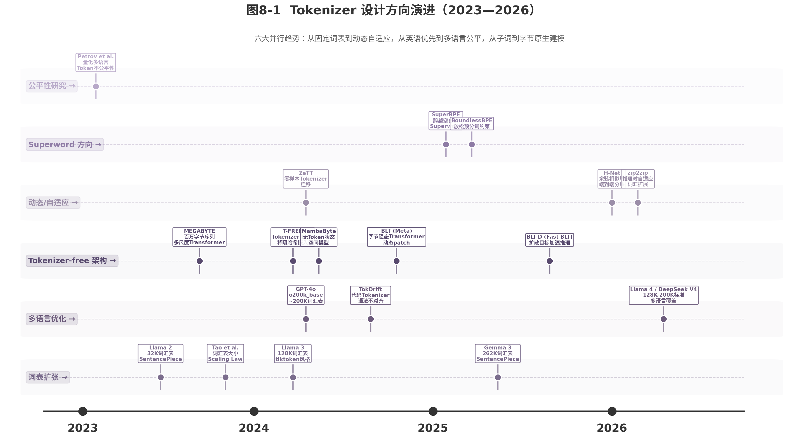

# 第8章 2023-2026：Tokenizer 的新问题

第7章梳理了 BPE、WordPiece、SentencePiece 的算法原理与演进脉络。2023 年后，大模型的应用场景急剧扩张——多语言对话、代码生成、数学推理、长文档处理成为标配。这些新场景对 Tokenizer 提出了前所未有的挑战：多语言之间的处理成本鸿沟、代码的语法碎片化、长上下文下的有效容量缩水，以及一个根本性问题——Tokenizer 是否终将退场？

## 8.1 多语言模型中的 Token 预算不公平问题

### 8.1.1 中英文 Token 数不对等

Tokenizer 的首要任务是压缩文本。但压缩率对不同语言差异极大。以 cl100k_base（GPT-4 使用）为例，同样一句语义等价的话，英语仅需 10 个 token，中文需要 20 个，泰米尔语高达 60 个[^27^]。

Petrov 等人（2023）定义了 **Tokenization Premium** 指标：`premium = n_tokens(language) / n_tokens(English)`[^25^]。Premium 为 1.0 表示与英语等价；2.0 意味着处理成本翻倍。这一指标将"不公平"从定性抱怨变成了可量化的数字。

cl100k_base 中，泰米尔语的 premium 高达 6.0，印地语 4.6，中文约 2.0[^27^]。这种差异的直接后果是：非英语用户支付更高的 API 费用，模型在处理非英语文本时能"看到"的上下文更短，训练数据中低资源语言的信号被稀释。

### 8.1.2 "多语言诅咒"

将这一现象称为"诅咒"并不为过。即使 tokenizer 声称支持多语言，词表分配仍严重偏向英语及高资源语言[^25^]。Petrov 等人的研究发现，低资源语言用户需要支付 2-15 倍的费用才能获得同等信息量的处理[^25^]。

更深层的问题是：即使为特定语言专门训练的模型（如 CamemBERT 法语模型、GottBERT 德语模型），英语仍然获得最低的 premium[^25^]。这反映了一个结构性偏见——训练数据中英语的主导地位与 tokenizer 的内在偏差相互强化。

使用英语 tokenizer 处理非英语文本可导致高达 68% 的额外计算成本，以及 10-15 个百分点的零样本准确率下降[^29^]。API 计费按 token 数收费，premium 直接从技术问题转化为经济问题。这种经济压力对东南亚、非洲和南亚的低资源语言用户尤为突出——他们既是数字服务增长最快的群体，又是 LLM 处理成本最高的群体。

### 8.1.3 词表分配优化

缓解这一问题的最直接手段是扩大词表并重新分配。OpenAI 的 o200k_base（2024 年 5 月发布）将词汇表从 100K 翻倍至约 200K，非英语 token 效率显著改善：中文压缩率提升约 1.4 倍，日文 1.4 倍，韩文 1.7 倍；印地语 token 数量减少 79%，泰卢固语 77%，泰米尔语 74%[^23^][^24^]。泰米尔文的典型案例：同一句子从 68 tokens 骤降至 21 tokens（3.2 倍压缩）[^24^]。

Llama 3（2024）从 Llama 2 的 32K 跃升至 128K，采用 tiktoken 风格词表；Gemma 3（2025）进一步扩展至 262K[^41^]。词汇表扩张成为 2023-2025 年间最主流的缓解策略。

2025 年后，社区开始发展标准化的公平性度量和缓解方法：为每种语言确定最优词汇表大小、添加缺失的 Unicode 字符 token、使用 SuperBPE 跨越空白合并等[^50^]。

**表 8-1 主要 Tokenizer 的多语言 Tokenization Premium 对比（相对英语倍数，数值越低越好）**

| Tokenizer | 词汇表大小 | 英语 | 中文 | 印地语 | 泰米尔语 | 发布时间 |
|:---|:---|:---|:---|:---|:---|:---|
| GPT-2 (p50k_base) | ~50K | 1.0 | ~2.5 | ~5.5 | ~7.0 | 2019 |
| GPT-4 (cl100k_base) | ~100K | 1.0 | ~2.0 | ~4.6 | ~6.0 | 2023 |
| Llama 2 (SentencePiece) | 32K | 1.0 | ~1.8 | ~4.2 | ~5.5 | 2023 |
| Llama 3 (tiktoken-style) | 128K | 1.0 | ~1.5 | ~3.0 | ~3.5 | 2024 |
| GPT-4o (o200k_base) | ~200K | 1.0 | ~1.4 | ~1.8 | ~2.5 | 2024 |
| Gemma 3 (SentencePiece) | 262K | 1.0 | ~1.3 | ~1.6 | ~2.0 | 2025 |

上表呈现出一个清晰的收敛趋势：2023 至 2025 年间，主流 tokenizer 的非英语 premium 整体下降约 50-70%。词汇表从 32K 扩展到 262K 是主要驱动力。但扩展并非无上限——过大的词汇表会增加嵌入矩阵内存占用和模型开销[^43^]。Tao 等人（NeurIPS 2024）发现词汇表大小与训练损失之间存在对数线性关系，存在计算最优的词汇表大小[^41^]。Hayou 和 Liu（2025）进一步指出，当词汇表大小远大于嵌入维度时，嵌入学习率的最优缩放应调整为 `sqrt(d)` 而非线性缩放[^44^]。

## 8.2 代码、数学、表格、公式对 Tokenizer 的挑战

### 8.2.1 代码 Token 碎片化

BPE 基于频率统计进行分词，对自然语言的词边界有一定把握。但代码不是自然语言——它有严格的语法结构：关键字、标识符、运算符、缩进。Nie 等人（2025）的 TokDrift 研究揭示了一个严重问题：BPE 的 token 边界与编程语言的语法 token 边界严重不对齐[^30^]。

TokDrift 的实验令人警醒：即使是微小的格式变化（如空格编辑或标识符重命名），也可能导致模型输出发生重大变化。Qwen2.5-Coder-32B-Instruct 在 tokenization 改变时预测变化率为 6.09%，在某些单条重写规则下高达 60%[^30^]。层分析表明，问题起源于早期嵌入层——子词分割未能捕获语法 token 边界[^30^]。

代码预处理策略（如 PLBART）尝试将 `\n`、缩进替换为 `NEW_LINE`、`INDENT`、`DEDENT` 等特殊 token[^32^]。但这类启发式规则无法覆盖所有编程语言的语法特征，且增加了 tokenizer 的复杂度。Ahmad 等人（2023）的 CodeBPE 研究系统比较了代码预训练中的多种子词分词策略，发现标准 BPE 在代码上的 fertility（每词 token 比率）显著高于自然语言[^32^]。这意味着代码在模型"眼中"比自然语言更加碎片化，模型需要更多步骤来理解同等信息量的代码。

### 8.2.2 数学公式处理

数学表达式包含大量特殊字符（`\`, `_`, `^`, `{`, `}`）和深层嵌套结构。标准 BPE 将 LaTeX 符号往往分割为无意义的子词单元。例如，`\frac{1}{2}` 可能被拆成 5-6 个互不关联的 token，模型需要额外学习这些碎片的组合关系。

数字作为 token 的处理同样棘手。长数字序列（如 `123456789012345`）可能被拆分为多个子 token，影响算术能力[^31^]。这对需要精确数值推理的任务是实质性障碍。

### 8.2.3 表格数据结构

表格数据具有明确的二维行列结构，但 tokenizer 只能将其线性化为一维 token 序列。CSV、Markdown 表格、HTML 表格的线性化方式各不相同，模型需要额外学习从线性序列中重建二维关系。目前的 tokenizer 设计并未针对结构化数据的保真度进行优化，表格的列对齐信息和单元格边界在线性化过程中容易丢失。

## 8.3 长上下文时代：Tokenizer 如何影响有效上下文容量

### 8.3.1 Token 数量决定有效上下文

模型的上下文窗口以 token 为单位计量。GPT-4 的 128K 上下文窗口听起来充裕，但如果处理中文文档，有效容量缩水至约 64K 字的等效文本；处理泰米尔语文档则进一步缩水至约 21K 字[^27^]。

这种缩水不是抽象问题。长文档摘要、代码仓库理解、多轮对话历史——这些任务的有效深度直接受限于 tokenizer 的压缩效率。对于需要处理整本书、整份法律文书或整个代码仓库的应用，20-30% 的容量损失意味着模型可能"看不到"关键段落。更具讽刺意味的是：越长的文档越可能是多语言的（如国际合同、跨国代码库），而 tokenizer 恰恰在多语言场景下压缩效率最差，形成了"长文本+多语言"的双重惩罚。

### 8.3.2 长文档 Token 效率优化

长上下文的需求推动了 tokenizer 向更高压缩率的方向演进。SuperBPE（2025）引入了两阶段训练策略：第一阶段学习标准 subword，第二阶段学习跨越空白的 superword。在 200K 固定词汇表下，比标准 BPE 减少 33% 的 token[^45^]。BoundlessBPE（2025）独立提出放松预分词约束，token 频率分布更均匀（Rényi 效率 +21%），压缩提升约 20%[^46^]。

SuperBPE 在 30 个下游任务上平均提升 4.0% 准确率，MMLU 提升 8.2%[^45^]。压缩率的提升不仅降低成本，还释放了模型的有效上下文容量。

## 8.4 是否可能走向 Tokenizer-free 或更原生的字节建模

### 8.4.1 ByteTransformer 等研究

Tokenizer-free 架构旨在完全消除固定的词汇表分词步骤，直接在原始字节或字符上操作[^33^]。这一方向在 2023-2026 年间取得了实质性突破。

**ByT5**（Xue et al., 2022）是早期标杆：处理 UTF-8 字节序列，无需显式分词，在多语言和噪声鲁棒性上表现优异[^34^]。但受限于序列长度问题，规模难以扩展。

**MEGABYTE**（Yu et al., 2023）提出层次化方案：将字节序列分为固定大小的 patch，全局模型处理 patch 间关系，局部模型处理 patch 内字节，实现百万字节序列的次二次方自注意力[^36^]。

**MambaByte**（Wang et al., 2024）基于选择性状态空间架构（Selective State Space Model），在语言建模任务上优于 subword 和字节级 Transformer[^35^]。

**Byte Latent Transformer（BLT）**（Pagnoni et al., 2024, Meta）是这一方向的关键里程碑。BLT 基于**熵的动态 patching**（dynamic entropy-based patching）：小字节级语言模型计算下一个字节的熵，patch 边界出现在最难预测的位置。简单可预测区域（常见词）获得大 patch，复杂区域（罕见词、代码、数字）获得小 patch[^38^]。

BLT 在 8B 参数规模上**匹配 Llama 3 性能**，同时使用**多达 50% 更少的推理 FLOP**[^38^]。这一结果首次证明：字节级模型可以在大规模上匹敌 BPE 基线。BLT 的另一优势在于消除了 tokenizer 带来的多语言不公平、glitch token 和对输入噪声的敏感性问题。

### 8.4.2 挑战：序列过长

字节级建模的核心瓶颈是序列长度。一个英语单词平均 5 个字母，在 BPE 中约为 1.3 个 token，但在字节级中仍为 5 个字节（加上空格）。序列长度增加 3-5 倍直接影响注意力计算的复杂度（二次方增长）。

层次化架构（如 BLT 的 patch 机制）是主要缓解手段。BLT 通过动态 patch 将平均 patch 大小提升至 4.5-8 字节，接近 BPE 的 token 大小[^38^]。状态空间模型（如 MambaByte）通过线性复杂度的序列建模，绕过了注意力的二次方瓶颈[^35^]。

但实用化仍面临挑战：BLT 在推理 FLOP 上有优势，但实际 wall-clock 时间优势尚不明确；字节级模型的训练基础设施（数据加载、序列并行、检查点）与现有 token-based 生态不完全兼容。Fast BLT（BLT-D，2026）尝试用扩散目标实现字节级并行生成来加速推理[^40^]，但尚未在大规模部署中验证。H-Net（2025）则提出了另一种端到端学习的分块方法，使用相邻表示的余弦相似度决定分块边界，为动态 patching 提供了新思路[^39^]。

### 8.4.3 表格对比：Tokenizer-based vs Tokenizer-free

**表 8-2 Tokenizer-based 与 Tokenizer-free 架构对比**

| 维度 | Tokenizer-based（BPE 等） | Tokenizer-free（BLT 等） |
|:---|:---|:---|
| 词汇表 | 固定（32K-262K） | 无 |
| 序列长度 | 短（每词 1-2 token） | 长（每字符 1-2 字节），但 patch 后可比拟 |
| 未知字符处理 | 依赖 byte fallback | 原生支持所有 UTF-8 |
| 多语言公平性 | Premium 1.0-6.0x | 本质公平（UTF-8 统一编码） |
| 压缩效率 | 静态，由词表决定 | 动态，熵高处分块更细 |
| 推理 FLOP | 固定每 token | 可节省 30-50%（BLT）[^38^] |
| 训练成本 | 成熟生态，工具链完善 | 需额外基础设施投入 |
| 噪声鲁棒性 | 差（glitch token 敏感） | 强（字节级输入） |
| 代码/数字处理 | 碎片化（TokDrift 问题）[^30^] | 粒度可控 |
| 与现有模型兼容性 | 高 | 需迁移（ZeTT 等方法）[^47^] |

上表的核心结论是：Tokenizer-free 架构在 2024 年跨越了从"概念研究"到"可实用"的分水岭。BLT 证明字节级模型可以在 8B 规模上匹配 BPE 基线，同时打开了一条新的 scaling 维度——patch 大小与模型大小可以同时增长[^38^]。然而，工程生态的成熟度和更大规模（70B+）的验证仍需时间。短期内，tokenizer-free 更可能在特定场景（多语言优先、噪声环境、多模态字节流处理）中率先取代 BPE。

## 8.5 新模型时代的 Tokenizer 设计趋势

### 8.5.1 更大词表

词汇表大小呈指数增长。2023 年 Llama 2 使用 32K，2024 年 Llama 3 跃至 128K，GPT-4o 达约 200K，2025 年 Gemma 3 扩展至 262K[^41^]。两年间增长了约 8 倍。

驱动这一趋势的两个因素相互强化：多语言覆盖需要为更多文字系统分配词表 slot；更大词表产生更短序列，降低自注意力计算量。但 Tao 等人的研究警告：词汇表大小与训练损失之间存在对数线性关系，超过最优点后收益递减[^41^]。Llama 2 的 32K 词汇表对于 7B 模型是最优的，但对于 70B 变体，计算最优的词汇表应至少为 216K——实际使用的 7 倍大[^41^]。这说明词汇表大小应该是模型大小的函数，而非固定常量。

### 8.5.2 多语言和代码优化

2023 年后，所有主要模型发布都将多语言 token 效率作为关键指标。o200k_base、Llama 3 128K 等明确以改善非英语 tokenization 为设计目标[^23^]。代码 token 效率同样受到关注——特殊 token 如 FIM（Fill-in-the-Middle）被引入以支持代码补全[^22^]。

领域自适应词汇扩展成为常见做法：Youtu-LLM 从 o200k 词汇表出发，保留前 100K ASCII token，然后训练中文特定 token 和代码/数学专用 token[^48^]。

### 8.5.3 更注重压缩率

评估 tokenizer 的指标正在从"能支持多少语言"转向"每字节的压缩效率"。Rényi 效率、power-law deviation、fertility 等内在指标被用于衡量 token 分布的质量[^42^]。压缩率的提升直接转化为：更短的序列、更低的推理成本、更大的有效上下文窗口。

SuperBPE 和 BoundlessBPE 的出现标志着 tokenizer 设计从"静态词表"向"智能分块"的范式转变。传统 BPE 的预分词约束（不在空白处合并）被人为放松，允许跨越完整单词的合并，显著提升了压缩率[^45^][^46^]。

### 8.5.4 趋势图

图 8-1 展示了 2023-2026 年间 Tokenizer 设计的六大并行趋势：词表持续扩张、多语言优化、Tokenizer-free 架构从概念走向实用、动态/自适应方法兴起、Superword 方向突破、公平性研究制度化。

六大趋势中，词表扩张和多语言优化是当前最成熟的工程实践，已在主流模型中标准化。Tokenizer-free（以 BLT 为代表）最具颠覆性潜力，但工程生态尚需成熟。动态/自适应方法（ZeTT、zip2zip、H-Net）代表了灵活性方向——ZeTT 使用超网络将训练好的 LLM 迁移到新 tokenizer，大幅降低多语言工作负载的重新 tokenize 成本[^47^]；zip2zip 是首个实现推理时动态词汇扩展的方法，无需重新训练即可根据输入上下文构建新 token[^49^]。Superword（SuperBPE、BoundlessBPE）则是对传统 BPE 的增量但实质性改进，短期内最易落地。公平性研究则将持续影响所有 tokenizer 的设计原则，推动从"英语优先"到"全球公平"的范式转换。

从产业视角看，2026 年主流 LLM 的 tokenizer 已趋于收敛：128K-200K 词汇表、tiktoken 风格或 SentencePiece Unigram、强多语言覆盖成为事实标准。但根本性问题尚未解决：Tokenizer 作为文本与模型之间的"翻译层"，其设计选择仍在每个环节 shaping 模型的认知方式。无论是走向更大的词表、更智能的分块，还是彻底的字节原生建模，核心目标始终一致——让模型以最高效、最公平的方式"阅读"人类世界的全部信息。
