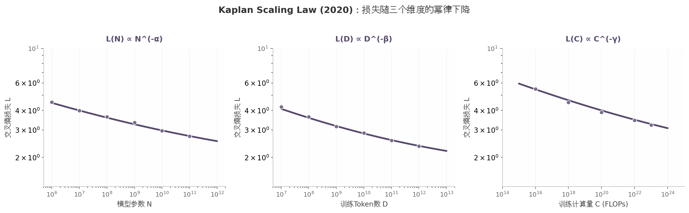

# 9. 2020：Scaling Law 的提出

2020年之前，训练语言模型是一门手艺。工程师们凭经验选择模型大小、数据量和训练轮数，然后在验证集上观察损失曲线是否下降。没有人知道一个10亿参数的模型需要多少Token才能收敛，也没有人能在训练开始之前预测最终的损失值。这种试错模式在百万美元级别的实验成本面前显得愈发脆弱。

Kaplan等人2020年1月发表的《Scaling Laws for Neural Language Models》从根本上改变了这一局面[^51^]。这篇论文证明：语言模型的交叉熵损失随模型规模、数据规模和训练计算量呈可预测的幂律下降，且这一规律跨越超过七个数量级[^51^]。换言之，只要知道三个变量中的任意一个，就能在训练开始之前预测模型的最终表现。

## 9.1 模型规模、数据规模、计算量三者的关系

### 9.1.1 Kaplan et al.（2020）核心发现

Kaplan团队使用参数范围从约77K到约14亿（1.4B）的Transformer模型，在不同数据量和训练计算量配置下进行系统实验[^51^]。他们发现了一个统一的规律：当其他因素不受限时，损失L分别与模型参数量N、训练Token数D、训练计算量C（FLOPs）服从幂律关系。

幂律（Power Law）指两个变量之间的关系可表示为y = a·x^(-k)，即在双对数坐标下呈现直线。这与指数衰减不同——幂律的下降速度更慢，意味着继续扩大规模始终能带来收益，只是收益递减。

核心发现可归纳为三点[^51^][^76^]：

**第一，三大维度各自独立服从幂律。** 无论增加参数、增加数据还是增加计算量，损失的下降轨迹在双对数坐标下都是直线。这意味着每个维度都有独立且可量化的贡献。

**第二，更大的模型样本效率更高。** 在相同的数据量下，大模型收敛到更低的损失值。这暗示了参数规模在三个维度中的特殊地位——它不仅直接影响容量，还间接影响数据利用效率。

**第三，计算最优策略偏向大模型、少数据。** Kaplan发现，在给定固定计算预算时，最优策略是将大部分预算分配给模型参数，而非数据。这一结论直接催生了GPT-3（175B参数）的设计决策[^76^]。

### 9.1.2 三大Scaling维度的量化关系

Kaplan论文给出了具体的标度公式和指数。下表汇总了三大维度的幂律关系及其关键参数：

| 标度维度 | 幂律公式 | 标度指数 | 实验范围 | 说明 |
|:------:|:------:|:------:|:------:|:------|
| 模型规模 | L(N) ∝ N^(-α) | α ≈ 0.076 | 10^5 ~ 10^9 参数 | 增加参数→提升函数逼近能力 |
| 数据规模 | L(D) ∝ D^(-β) | β ≈ 0.095 | 10^7 ~ 10^12 tokens | 增加数据→覆盖更多语言模式 |
| 计算量 | L(C) ∝ C^(-γ) | γ ≈ 0.050 | 10^14 ~ 10^21 FLOPs | C ≈ 6ND，反映总训练开销 |
| 计算最优N | N_opt ∝ C^0.73 | — | 从小规模外推 | 预算分配偏向参数 |
| 计算最优D | D_opt ∝ C^0.27 | — | 从小规模外推 | 预算分配偏向数据 |

[^40^][^51^][^77^][^111^][^109^]

这张表是Kaplan Scaling Law的全部精华。三个标度指数α、β、γ均为正数且远小于1，这意味着损失随规模增大而下降，但下降速度逐渐减缓——每增加一个数量级的投入，损失的降低幅度越来越小。

指数之间的大小关系值得注意。β（数据，0.095）> α（参数，0.076），说明单纯增加数据对降低损失的边际效应略高于增加参数。但由于Kaplan发现的大模型样本效率优势，在计算预算受限时，最优分配仍然偏向参数。

计算最优分配公式 N_opt ∝ C^0.73 和 D_opt ∝ C^0.27 揭示了一个直观结论：如果把训练计算预算增加10倍，应该将约5.4倍（10^0.73）用于扩大模型，约1.9倍（10^0.27）用于增加数据[^111^]。参数增长速度约为数据的2.8倍。这一"大参数优先"的结论后来被称为**Kaplan配方**。

下图直观展示了三个维度的幂律下降趋势。在双对数坐标下，损失随每个维度的增长呈直线下降——这是Scaling Law最标志性的视觉特征。

### 9.1.3 Kaplan方法的局限

Kaplan的实验设计存在几个方法论局限，这些局限在两年后被Chinchilla研究逐一修正[^111^]：

**只计数非嵌入参数。** Kaplan的N只包含Transformer层中的参数，不包括词嵌入和输出层嵌入。对于小模型，嵌入参数占比显著，这一省略导致了系统偏差[^111^]。

**超参数未充分调优。** Kaplan使用固定的学习率warmup步数，对小模型而言这个warmup期过长。学习率调度也未针对不同规模进行精细调优[^111^]。

**最大模型仅约14亿参数。** 这意味着所有关于千亿参数模型的结论都是从小规模外推得来的。虽然外推结果后来大体得到验证，但外推本身引入了不确定性[^109^]。

Pearce等人2024年的调和研究确认，Kaplan与Chinchilla之间的差异**主要归因于参数计数方式的不同**，次要原因是超参数调优问题[^111^]。当我们在相同条件下使用总参数（而非非嵌入参数）重新拟合时，Kaplan的系数会向Chinchilla方向移动。

## 9.2 Loss 为什么可以被幂律规律预测

### 9.2.1 神经网络损失的幂律本质

Scaling Law不是偶然的统计拟合。它背后有深层的学习理论支撑。

从函数逼近的角度看，神经网络本质是一个高维函数逼近器。参数N增加时，模型能够表示的函数空间扩大，对真实数据分布的逼近误差随之下降。Bahri等人2024年的研究将标度机制分为四类：方差受限（variance-limited，数据不足时主导）和分辨率受限（resolution-limited，参数不足时主导），分别对应数据和参数两个维度[^117^]。

标度指数（α、β、γ）的大小与数据流形的**内在维度**相关。如果数据分布位于一个低维流形上，模型学习它的难度由流形的曲率和维度决定。标度指数正是对这些几何属性的宏观度量[^117^]。

2025年的一项理论研究将Transformer的学习动态形式化为常微分方程（ODE）系统，证明存在明显的相变：初始优化阶段超额风险随计算量指数衰减；一旦跨越特定资源分配阈值，进入统计相，泛化误差遵循幂律衰减Θ(C^(-1/6))[^108^]。这从理论上解释了为什么幂律在足够大的规模下才会显现。

### 9.2.2 数据量和计算量如何协同影响损失

Kaplan论文的一个核心洞察是：模型规模、数据量和计算量三者并非独立，而是通过一个约束方程相互关联。对于标准Transformer训练，计算量C与N和D的关系近似为：

**C ≈ 6ND**

这里的系数6来自前向传播（约2ND）和反向传播（约4ND）的浮点运算量之和[^109^]。这个等式意味着三个变量中只有两个是独立的——给定计算预算C，选择N就等价于选择了D。

当模型规模和数据量同时增加时，损失的下降并非两个独立效应的简单叠加。Kaplan发现了**联合标度律**[^51^]：

**L(N, D) = E + A/N^α + B/D^β**

其中E是不可约误差（irreducible error），代表语言本身固有的预测难度。这个公式表明，最终损失是三个独立项之和：固有难度、模型容量不足带来的误差、数据不足带来的误差。当其中任一项远大于其他项时，继续增加该项的资源收益递减——应该把预算投向瓶颈更大的维度。

### 9.2.3 Scaling Law的物理直觉

 Scaling Law有一个直观的物理解释：语言数据服从复杂的统计分布，建模这个分布需要足够的"分辨率"（参数）和足够的"观测"（数据）。

参数提供分辨率。就像用更多的像素可以呈现更精细的图像，更多的参数可以捕捉数据分布中更细微的模式。数据提供观测样本。即使分辨率再高，如果观测不足，模型也会过拟合——它记住了有限的训练样本，而非学到了真实的分布。

计算量是连接两者的催化剂。每处理一个Token，模型的参数都会微调以更好地拟合数据。计算量决定了参数和数据之间进行了多少轮交互。当计算量充足时，模型能够充分吸收数据中的信息；当计算量不足时，即使参数和数据都很大，模型也来不及收敛。

这个直觉解释了为什么三个维度各自服从幂律，也解释了为什么Kaplan推荐"大参数、少数据"——因为在计算量受限时，更大的参数空间使每一次数据观测的利用效率更高[^51^]。

## 9.3 规模化训练从"经验主义"走向"预算规划"

### 9.3.1 之前：试错式训练

在Scaling Law出现之前，训练大模型是一个高度经验化的过程。团队通常的做法是：先选一个模型大小（比如"比上一个版本大4倍"），然后用尽可能多的数据训练，观察验证损失何时停止下降。如果损失还在下降但预算已用完，就申请更多预算；如果损失早已平坦，就感叹"浪费了不少算力"。

这种模式有几个根本问题。**不可逆的沉没成本**——一次训练运行可能需要数百万美元，失败后很难获得再次尝试的资源。**无法横向比较方案**——"A方案用10B参数训练100B tokens"与"B方案用5B参数训练200B tokens"哪个更好？没有理论工具可以回答。**缺乏向上管理能力**——CTO问"训练这个模型需要多少钱？能到什么水平？"工程师只能回答"我们先试试"。

### 9.3.2 之后：给定预算可预测损失

Scaling Law将上述所有问题转化为可计算的优化问题。给定计算预算C，可以通过N_opt ∝ C^0.73和D_opt ∝ C^0.27直接算出最优配置，然后用L(C) ∝ C^(-γ)预测最终损失[^77^][^111^]。

这个转化带来了三个实际改变：

**训练前可做AB测试。** 不需要真的训练两个完整模型，只需在小规模上拟合标度指数，就能外推不同方案的性价比。

**风险可量化。** 投资委员会可以收到这样的报告："投入2000万美元训练一个50B参数模型，预测最终损失为2.1 nats，下游任务准确率约为X%。"

**迭代节奏加快。** 团队可以用小模型快速探索超参数空间，利用Scaling Law外推到大模型，而非每次都在大模型上试错。

### 9.3.3 Scaling Law成为立项依据

2020年之后，Scaling Law迅速成为AI研究机构和科技公司内部立项的核心依据。OpenAI、DeepMind、Google、Meta等实验室的模型训练规划中，Scaling Law分析是标准流程[^109^]。

一个典型的立项流程变为：(1)确定目标性能水平→(2)用Scaling Law反推所需计算量→(3)根据计算最优配比确定N和D→(4)估算成本→(5)申请预算。这个流程将大模型训练从艺术变成了工程。

Scaling Law还催生了"标度预测"这一新工种——专门负责在小规模实验上拟合标度指数，为大规模训练提供预测支持。这些团队的工作直接影响着数十亿美元的算力分配决策。

## 9.4 Scaling Law 对大模型产业化的影响

### 9.4.1 训练成本可预测

大模型产业化面临的最大障碍之一是成本的不确定性。传统软件开发中，项目超支20%已经令人头痛；而大模型训练中，成本偏差可能达到数倍。Scaling Law将训练损失和成本纳入同一套预测框架，使CFO和CTO可以用同一套语言对话。

更重要的是，Scaling Law使得**不同规模的投资可以被统一比较**。一个1亿美元的训练项目和一个1000万美元的项目，可以通过Scaling Law放在同一曲线上评估其预期回报，而不受规模差异的干扰[^109^]。

### 9.4.2 推动千亿美元级AI基础设施投资

Scaling Law的一个直接后果是：它证明了"花钱买规模"是一条有回报的投资路径。既然损失随计算量可预测地下降，且下降轨迹在七个数量级内保持一致[^51^]，那么投入更多算力就意味着更好的模型——这在逻辑上是成立的。

这一论证为微软、谷歌、Meta、亚马逊等公司的AI基础设施投资提供了理论背书。2020年至2025年间，全球四大云厂商的AI相关资本支出累计超过3000亿美元。这些投资决策的内部论证材料中，Scaling Law曲线几乎必定出现——它是将"更多算力=更好模型"这一直觉转化为可量化商业预期的关键工具。

当然，这个逻辑链条有一个隐含假设：Scaling Law会持续成立。2024-2025年间，前沿实验室开始报告纯参数标度的递减回报[^109^]，同时高质量训练数据的稀缺问题日益突出[^71^]。但Scaling Law框架本身并未失效——它只是需要被扩展到包含数据质量、推理成本等新维度。

### 9.4.3 核心竞争壁垒

Scaling Law看似简单——几个幂律公式，几个标度指数。但在实践中，准确拟合和应用Scaling Law是一门需要大量经验的技艺。

**标度指数的测量精度**本身就是壁垒。不同团队在小规模实验上的方法论差异（超参数调优、数据质量、评估指标）会导致拟合出的标度指数出现偏差。Kaplan与Chinchilla之争已经证明，即使是顶级研究机构的结论也可能存在显著分歧[^111^]。

**外推的可靠性**取决于实验设计。在小规模实验中模拟大规模行为，需要精心控制超参数、数据分布和评估条件。一个小错误在小规模上可能看不出来，但在大规模外推时会被放大数个数量级。

**专有数据的标度特性**是更深层的壁垒。公开论文中的标度指数基于公开数据集（如WebText、C4），但各家公司内部的训练数据分布不同，其标度行为也可能不同。掌握自己数据的标度特性，意味着能在相同预算下做出更优的分配决策。

因此，Scaling Law能力成为了大模型公司的核心竞争壁垒之一。它不仅决定了"能不能高效花钱"，还决定了"能不能准确预测投资回报"。在这个意义上，Scaling Law团队成为了大模型公司的"战略参谋部"——他们的预测直接影响着技术路线选择和资源分配优先级。

---

2020年Kaplan论文发表时，很少有人预料到这几个幂律公式会在五年内重塑整个AI产业的资源配置逻辑。Scaling Law的价值远不止于几个预测公式——它提供了一套**将规模变量纳入统一框架**的思维方式，使得模型训练从反复试错转变为可规划的工程实践。这套思维方式，连同它带来的预算可预测性和投资风险量化能力，构成了大模型时代技术决策的底层操作系统。
