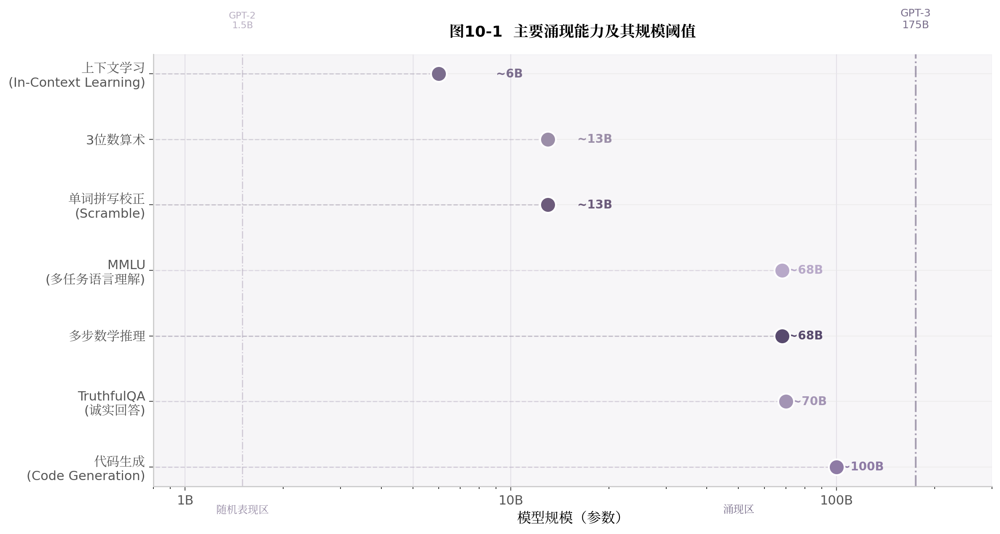

# 第10章 2020：GPT-3 与"大模型涌现"的转折

2020年5月，OpenAI发表论文 *Language Models are Few-Shot Learners*，推出了GPT-3——一个拥有1750亿参数的稠密Transformer模型[^116^]。GPT-3的规模是其前代GPT-2（15亿参数）的**117倍**，训练数据从40GB膨胀到3000亿tokens。这个数字跨越不仅是量变。GPT-3展示了一种此前从未被观察到的新能力：**上下文学习**（In-Context Learning，ICL）。给模型几个示例，它就能推断任务模式并生成正确答案，无需任何参数更新[^116^]。

这一发现改写了预训练模型的使用方式。此前，模型是"特征提取器"——预训练后还需在特定任务的标注数据上微调才能使用。GPT-3之后，模型变成了"任务接口"——预训练结束即可直接面向终端用户。任务设计从"准备数据集和训练脚本"变成了"写一段好提示"。整个行业的开发范式发生了根本迁移。

---

## 10.1 175B 参数模型带来的范式变化

### 10.1.1 GPT-3规模突破：175B参数、300B tokens、数千张V100

GPT-3的训练规模在2020年空前。1750亿参数，3000亿训练tokens，批次大小达320万tokens，学习率在前3.75亿tokens内线性上升至峰值，再按余弦衰减至10%[^116^]。训练在Microsoft Azure的V100集群上运行了数周。

支撑这个规模的是Kaplan等人刚刚提出的Scaling Law（第9章）。Kaplan定律给出了明确的扩展指引：更大的模型在固定计算量下样本效率更高，应该优先扩大参数规模[^51^]。GPT-3正是这一理论的第一个大规模验证——它验证了Scaling Law在小规模实验上拟合的外推预测，并发现外推后的结果甚至超出了预期。

GPT-3采用了与GPT-2相同的Transformer Decoder架构，但在深度、宽度和上下文长度三个维度上同步扩展。96层、12288维的隐藏表示、96个注意力头、2048的上下文窗口——这些数字共同构成了当时最大的稠密神经网络。架构不变而规模剧增，这一选择本身传递了重要信号：Transformer架构具有足够的扩展性，瓶颈不在结构本身，而在计算和数据。

### 10.1.2 训练成本跃升到百万美元级别

GPT-3的训练总计算量约为3.14×10²³ FLOPs[^116^]。按2020年云计算价格折算，单次训练成本在460万至1200万美元之间。加上实验迭代、调试和超参数搜索，总研发成本更高。

这个成本量级标志着一个转折点：大模型预训练从"研究实验室的小成本实验"变成了"需要大额资本投入的战略项目"。从此，训练基础设施的规模和资金实力成为进入前沿模型竞争的第一道门槛。

### 10.1.3 GPT-3与前代模型规模对比表

| 维度 | GPT (2018) | GPT-2 (2019) | GPT-3 (2020) | GPT-3相对GPT-2增幅 |
|------|-----------|-------------|-------------|------------------|
| 参数量 | 117M | 1.5B | 175B | **117×** |
| 训练数据 | BooksCorpus (4.5GB) | WebText (40GB) | CommonCrawl+WebText+Books+Wikipedia (570GB) | **14×** |
| 训练Tokens | ~0.8B | ~10B | ~300B | **30×** |
| 层数 | 12 | 48 | 96 | 2× |
| 注意力头维度 | 768 | 1,600 | 12,288 | **7.7×** |
| 批次大小(tokens) | 32 | 512 | 3.2M | **6,250×** |
| 论文标题 | *Improving Language Understanding* | *Unsupervised Multitask Learners* | *Few-Shot Learners* | — |

上表揭示了三个深层趋势。**第一**，参数、数据和批次大小同步暴涨，GPT-3不是简单的"堆层"，而是在所有可扩展维度上同时推进。**第二**，数据来源从精心筛选的书籍转向大规模网络爬取——这标志着"规模优先于质量"路线的确立。**第三**，论文标题的演变本身讲述了一个故事：从"改善语言理解"到"无监督多任务学习"再到"少量示例学习"，研究重心从模型能"理解"什么转向模型能"做"什么[^116^]。

---

## 10.2 Few-shot / Zero-shot 为什么改变了任务设计

### 10.2.1 传统范式：预训练→微调→部署

在GPT-3之前，预训练模型的使用遵循固定流水线。首先在一个大规模无标注语料上预训练模型，学习通用语言表示；然后针对每个下游任务收集标注数据，在任务数据上微调模型参数；最后部署微调后的专用模型[^116^]。

这个范式有几个固有成本。**每个新任务都需要标注数据**，标注成本与任务数量成正比。**每个部署任务都需要一个独立的模型副本**，存储和推理开销与任务数量成正比。**微调过程需要工程基础设施支持**，包括训练框架、GPU资源、超参数调优等。

### 10.2.2 GPT-3范式：预训练→Prompt→直接推理

GPT-3提出了根本不同的使用方式。模型预训练完成后不做任何参数更新，直接在推理阶段通过**提示**（Prompt）指定任务。提示可以包含任务说明（zero-shot）、一个示例（one-shot）或几个示例（few-shot）。模型读取提示后即时生成答案[^116^]。

这种范式的关键优势：**零标注成本**——新任务不需要任何标注数据；**零训练成本**——不需要GPU训练，只需要文本提示；**统一接口**——所有任务共享同一个模型，无需维护多个模型副本。

GPT-3论文在42个基准任务上系统测试了zero-shot、one-shot和few-shot三种设置[^116^]。结果是：几乎所有任务都表现出性能随模型规模单调提升的规律；few-shot一致优于one-shot，one-shot优于zero-shot。这表明上下文学习是一种可随规模扩展的真实能力，而非偶然现象。

### 10.2.3 上下文学习（In-Context Learning）

上下文学习的本质是什么？给模型一段由几个输入-输出对组成的提示，模型能够识别其中隐含的模式，并将其应用到新的输入上。这种能力之所以令人惊讶，是因为**它发生在推理阶段，不涉及任何梯度计算或参数更新**[^116^]。

GPT-3论文注意到一个关键模式：最大的few-shot性能提升出现在"难以用语言精确描述但通过示例容易演示"的任务上[^116^]。例如，告诉模型"请把以下英语句子翻译成法语"需要精确描述翻译规则；而给三个英-法翻译示例，模型就能自动推断任务并执行。这意味着上下文学习扩展了模型可执行任务的边界，覆盖了大量难以形式化描述的能力。

上下文学习的机制至今未有完全定论。一种解释认为，大规模预训练使模型的参数空间中编码了海量任务模式的前兆结构（task-relevant priors），示例提示的作用不是"教会"模型新技能，而是**激活**预训练中已经形成的潜在表征路径。这种解释与后续研究中"能力是涌现的"观点一脉相承——不是模型在示例中"学习"，而是示例帮助模型将已有的知识组织成正确的输出形式[^116^]。

### 10.2.4 表格对比微调 vs Few-shot

| 对比维度 | 传统微调 (Fine-tuning) | Few-shot Prompting |
|---------|----------------------|-------------------|
| 是否需要标注数据 | 是，每个任务需要数千至数万条 | 否，仅需2-10个示例即可 |
| 是否需要参数更新 | 是，需要反向传播和梯度更新 | 否，纯推理阶段，参数冻结 |
| 是否需要GPU训练 | 是，每个任务需要训练资源 | 否，仅推理即可 |
| 多任务部署成本 | 每任务一个模型副本 | 所有任务共享同一模型 |
| 新任务上线时间 | 小时至天（训练+部署） | 秒至分钟（写提示即可） |
| 对长尾任务的覆盖 | 受限于标注预算 | 仅受限于提示工程想象力 |
| 性能上限 | 接近人类标注质量 | 随模型规模持续提升 |
| 知识遗忘风险 | 微调过程可能遗忘预训练知识 | 无此风险 |
| 数据隐私 | 训练数据需上传至服务器 | 示例可留在本地 |

上表对比了两种范式的全维度差异。GPT-3的价值不仅在于它让few-shot成为可行的替代方案，更在于它证明了**足够大的模型可以内化海量任务模式，以至于外部微调不再是必要的**。值得注意的是，few-shot并非在所有场景下都优于微调——在数据充足、任务明确的场景下，微调仍是性能上限更高的选择。GPT-3的意义在于**大幅扩展了"不需要微调就能用"的任务空间**，将大模型从研究工具转化为可直接面向用户的通用接口。

---

## 10.3 预训练模型从"特征提取器"变成"任务接口"

### 10.3.1 BERT时代：特征提取器

BERT及其后续模型（RoBERTa、ALBERT等）本质上是被设计为"特征提取器"。预训练后的BERT需要接入任务特定的上层结构：文本分类接全连接层，序列标注接CRF层，问答任务接span预测头。模型本身不直接产生任务输出，而是提供表示（representation），由外部组件完成最终决策[^116^]。

这个架构的隐含假设是：**预训练和任务解决之间存在一条鸿沟**。预训练学习的是通用语言表示，需要用任务特定的数据和架构来"桥接"到具体目标。微调就是这个桥梁。

### 10.3.2 GPT-3时代：任务接口

GPT-3消除了这座桥梁。它本身就是一个完整的输入-输出系统：你输入一段包含任务描述的文本，它直接输出结果。分类、翻译、摘要、问答、算术——所有任务被统一为"文本到文本"的映射[^116^]。

这个转变的技术前提是**规模**。小模型无法从几个示例中可靠推断任务模式；足够大的模型则可以将海量预训练知识组织成可即调即用的形式。GPT-3证明了当规模突破某个临界点后，模型本身就能承担"任务解析器"的角色。

### 10.3.3 范式转变意义

从"特征提取器"到"任务接口"的转变，意味着AI应用开发成本的根本性重构。此前，每新增一个AI功能，需要数据标注、模型训练、服务部署的全链路投入。GPT-3之后，新增功能只需要写好提示词。这个变化使NLP应用的开发门槛从"需要ML团队"降到了"会写自然语言描述"[^116^]。

更重要的是，它为后续的**指令微调**（Instruction Tuning）和**对齐**（Alignment）奠定了基础。GPT-3展示了通用模型直接响应用户意图的可能性。接下来只需要让模型学会更好地"理解"指令意图，而不是仅模仿示例——这就是ChatGPT诞生的技术前奏。

---

## 10.4 大模型能力与规模之间的复杂关系

### 10.4.1 涌现能力

GPT-3发布后，研究者开始系统性地观察到一个现象：某些能力只在模型达到一定规模后才突然出现，在此之前模型表现与随机猜测无异。Wei等人（2022）将这种现象命名为**涌现能力**（Emergent Abilities），定义为"在较小规模模型中不存在、在较大规模模型中出现的能力"[^42^]。

典型涌现能力包括：

- **算术能力**：GPT-3在约130亿参数规模时突然展现3位数加减法能力，此前完全不具备[^42^]。
- **多任务语言理解（MMLU）**：约100亿参数以下模型在57个学科问答上的平均表现不超过随机猜测，70B-280B参数模型大幅超越随机水平[^42^]。
- **TruthfulQA**（诚实回答）：小模型倾向于编造答案，表现不超过随机水平；超过一定规模后答案真实性跳跃式提升[^42^]。

这些能力的共同特征是**非线性跃迁**——不是在所有规模上缓慢改善，而是在某个阈值附近突然"开启"。上下文学习本身也可以被视为一种涌现的元能力：它是"学习如何学习"的底层机制，使其他具体任务能力的涌现成为可能。没有上下文学习，few-shot范式的可行性本身就无从谈起。

### 10.4.2 涌现能力的争议：Schaeffer"度量选择假象"

2023年，Schaeffer等人发表了 *Are Emergent Abilities of Large Language Models a Mirage?*，对涌现现象提出了根本性挑战[^159^]。

核心论点：**涌现能力可能是评估指标选择的产物**。当使用非线性或不连续指标（如多选题准确率、精确匹配）时，模型能力的连续改善被"放大"为突发性涌现。当改用线性连续指标（如对数似然、Brier分数、编辑距离）时，同样的能力提升呈现平滑、连续、可预测的趋势[^159^]。

这一发现的技术含义深刻。涌现反映的**不是模型能力本身的相变**，而是评估指标的**非线性映射**特性[^157^]。当你用一个阶梯函数去度量一个连续提升的能力时，必然会在阶梯的拐点处看到"突变"。

后续研究进一步将涌现解释为**两个竞争标度趋势的交汇**[^117^]。复杂任务呈现U型标度（先变差后变好），简单任务呈现倒U型标度，所谓"涌现"阈值正是这两种趋势交互的区域。这个解释比"神秘的质变"更具分析力——它暗示涌现现象可以通过标度分析来预测和理解。

**实践启示**：尖锐的基准测试跳跃不应被视为模型获得某种"超自然能力"的证据，而应被拆解为标度趋势和指标映射的综合结果[^107^]。这一争议对研究者提出了方法论要求：在宣称发现"涌现"之前，应先确认所观察到的突变是否能在连续指标下复现。

### 10.4.3 主要涌现能力和规模阈值

图10-1汇总了已知主要涌现能力及其出现的参数规模阈值。各能力的门槛差异显著：上下文学习和基础算术在约60-130亿参数时开始显现，而MMLU、多步推理和TruthfulQA需要接近700亿参数才开始涌现，代码生成能力的可靠涌现则需要超过1000亿参数[^42^]。

需要强调两点。**第一**，这些阈值是近似估计，具体数值因架构、训练数据和评估指标而异。**第二**，涌现阈值的存在并不意味着小模型完全不具备相关能力——只是这些能力在当前评估体系下低于可检测阈值。Schaeffer的度度假说暗示：换一个更敏感的评估指标，"涌现"可能会提前出现[^159^]。

GPT-3的175B参数恰好跨越了图中大部分涌现门槛的上限。这解释了为什么GPT-3在当时被认为"突然"获得了如此多新能力——不是因为这些能力真的同时凭空出现，而是因为175B参数恰好一次性跨过了多个评估指标的可检测阈值[^116^]。

---

GPT-3之后的两年，整个行业沿着"更大模型"的路线狂奔。但一个根本性问题逐渐浮现：GPT-3的训练配方正确吗？175B参数配300B tokens，每个参数仅约1.7个训练token——这个比例是否合理？Kaplan定律推荐的"优先扩大参数"路线是否最优？对这些问题的重新审视，引出了2022年Chinchilla Scaling Law的发现——下一章将详细展开。

