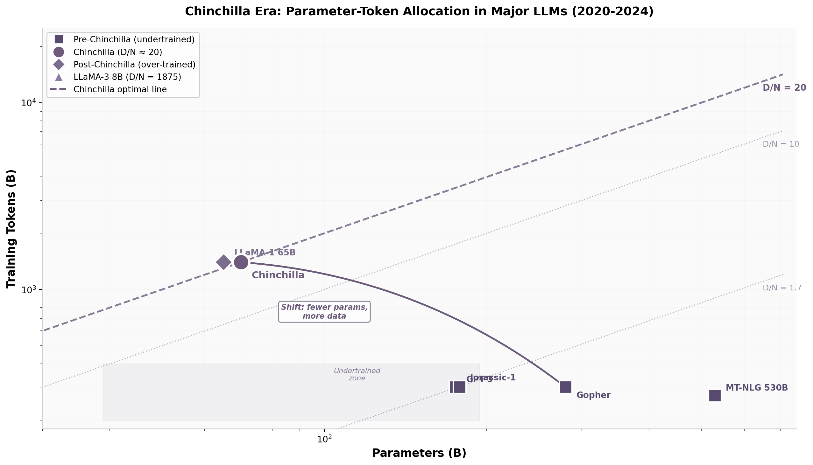

# 第11章 2022：Chinchilla Scaling Law 与"数据比参数更重要"

GPT-3证明了"大参数"路线的威力。但在2022年，DeepMind的一支研究团队提出了一个反直觉的结论：GPT-3以及同时代的所有大模型，实际上都训练错了——它们的参数规模相对数据量而言过大，每个参数摄入的token数量严重不足。Jordan Hoffmann等人通过更严格的实验，推翻了两年前的Kaplan Scaling Law，重新定义了"计算最优训练"的含义。

## 11.1 为什么很多早期大模型其实是"训练不充分"的

### 11.1.1 Kaplan的误导：N ∝ C^0.73，过度强调参数、低估数据

Kaplan et al.（2020）的核心结论可以用一句话概括：给定更多算力，应该主要用来扩大模型参数，而非增加数据。具体来说，Kaplan推荐的计算最优分配为 N_optimal ∝ C^0.73 和 D_optimal ∝ C^0.27 [^111^][^109^]。这意味着计算预算每增加10倍，参数应扩大约10^0.73 ≈ 5.4倍，数据量仅需增加约10^0.27 ≈ 1.9倍。参数增长比数据快近3倍。

这个结论源于三个方法论缺陷 [^111^]：

第一，Kaplan只计数非嵌入参数（non-embedding parameters），忽略了词嵌入和位置嵌入层。在小规模模型中，嵌入层占总参数的很大一部分，忽略它们会系统性偏倚标度系数。Pearce et al.（2024）的调和研究确认，这是Kaplan与Chinchilla结论差异的主要来源 [^111^]。

第二，Kaplan的实验规模有限。拟合标度曲线时使用的最大模型仅约1B参数。从1B外推到100B+参数区间，外推误差被放大 [^109^]。

第三，超参数调优不充分。Kaplan使用了固定长度的warmup期，对小模型而言过长；学习率调度也未针对每个模型规模单独优化 [^111^]。

这三个缺陷叠加在一起，导致Kaplan系统性高估了参数的重要性、低估了数据的重要性。

### 11.1.2 GPT-3（175B参数、300B tokens）的严重undertrained

按Kaplan的框架，GPT-3（175B参数、300B tokens）是一次合理的计算最优训练。但Chinchilla的透镜揭示了完全不同的事实。

GPT-3的D/N比率（每个参数对应的训练token数）为 300B / 175B ≈ **1.7** [^109^]。Chinchilla框架下，175B参数的计算最优数据量应为 175B × 20 = **3.5T tokens**——这是GPT-3实际训练数据量的11.7倍。换言之，GPT-3实际摄入的数据仅达到其"应有"水平的约8.5%。

另一种等价的视角：给定300B tokens的预算，Chinchilla框架推荐的计算最优参数规模约为300B / 20 = **15B** [^109^]。GPT-3的参数规模是其最优值的11.7倍。两种解读指向同一个结论：GPT-3的训练严重不足。

这不是一个理论上的吹毛求疵。Chinchilla实验表明，一个"正确训练"的小模型可以系统性地击败一个"训练不足"的大模型。

### 11.1.3 Gopher（280B参数、300B tokens）等类似问题

Gopher的情况更为极端。DeepMind自己训练的Gopher拥有280B参数，却只在300B tokens上训练 [^72^]，D/N比率约为**1.07**——每个参数只看了一个token略多。

同期其他大模型同样陷入这个陷阱：

- Jurassic-1：178B参数 / 300B tokens，D/N ≈ 1.7
- Megatron-Turing NLG：530B参数 / 270B tokens，D/N ≈ 0.51

这些模型遵循的是同一套逻辑：Kaplan说参数更重要，所以把参数做大。它们共享同一个假设：数据量不需要与参数规模同步增长。Chinchilla证明这个假设是错误的。

## 11.2 Compute-optimal：给定算力下如何分配参数和Token

### 11.2.1 Hoffmann et al.（2022）的重新实验

Hoffmann等人来自DeepMind的团队系统性地重做了Kaplan的实验，做了三处关键改进 [^65^]。

第一，计数**总参数**（包括嵌入层），而非仅非嵌入参数 [^111^]。这让标度系数回归物理直觉。

第二，使用最大16B参数的模型进行拟合，比Kaplan的1B上限提高了16倍。更大的拟合范围降低了外推的不确定性。

第三，采用正确的余弦学习率调度（cosine decay with warmup），并对每个模型规模单独调优训练步数。这消除了Kaplan实验中固定warmup期带来的系统性偏差。

Hoffmann等人还引入了**IsoFLOP分析**方法：在固定总计算量（FLOPs）的条件下，系统性地变化模型规模N和数据量D，观察哪种组合达到最低损失 [^68^]。这种方法直接从实验数据中确定最优分配，无需依赖外推。IsoFLOP分析的核心洞察是：对于每一个固定的计算量C，总存在一个(N, D)组合使得损失最小；将这些最优组合连起来，就能确定N和D随C增长的最佳轨迹。三种独立方法——固定模型规模变化数据量、IsoFLOP分析、以及直接求解约束优化方程——得出了高度一致的结论，增强了结果的可信度 [^68^]。

### 11.2.2 Chinchilla最优比例：D* ≈ 20 × N

三种独立的分析方法——固定模型规模变化数据量、固定FLOPs变化N和D、以及直接求解约束优化方程——得出了高度一致的结论 [^68^]：

给定计算预算C，最优分配满足 N_optimal ∝ C^0.50 和 D_optimal ∝ C^0.50 [^111^]。参数和数据应**等比例**增长，而非Kaplan建议的3:1偏向参数。

这导出了一个简洁的实用规则：**最优训练token数约为参数量的20倍**，即 D* ≈ 20N。这个比率被称为"Chinchilla最优比率"，成为后续模型设计的重要参考基准 [^72^]。

Pearce et al.（2024）的后续研究确认，当使用与Kaplan相同的非嵌入参数计数方法时，在Chinchilla的实验条件下也会产生接近Kaplan的偏倚系数 [^111^]。这反向验证了Chinchilla结论的稳健性：偏差主要来自参数计数方式，而非其他实验差异。

### 11.2.3 Chinchilla（70B、1.4T）击败Gopher（280B、300B）

Chinchilla自身的实验设计就是对这一结论的最有力证明。

Chinchilla模型：70B参数，1.4T tokens，D/N = 20，严格遵循Chinchilla最优比率 [^72^]。

Gopher模型：280B参数，300B tokens，D/N ≈ 1.07，是Chinchilla时代的4倍参数规模。

两者的训练计算量大致相当。但Chinchilla在几乎所有下游基准测试上都**优于**Gopher [^72^][^76^]。Chinchilla也超越了GPT-3（175B）、Jurassic-1（178B）和Megatron-Turing NLG（530B）[^109^]——后者参数规模分别是Chinchilla的2.5倍、2.5倍和7.6倍。

这个结果改变了Scaling Law的语言。"更大总是更好"的直觉被替换为"更平衡才是更好"。在固定的计算预算下，盲目堆参数是低效的；把一部分参数"预算"转化为数据"预算"，可以获得更好的性能回报。

### 11.2.4 表格对比：Kaplan vs Chinchilla

| 维度 | Kaplan et al. (2020) | Hoffmann et al. (2022, Chinchilla) |
|:---|:---|:---|
| 最优参数标度 | N ∝ C^0.73 | N ∝ C^0.50 |
| 最优数据标度 | D ∝ C^0.27 | D ∝ C^0.50 |
| 参数/数据增长比率 | 参数增长快3倍 | 等比例增长 |
| D/N 最优比率 | ~3 tokens/参数 | **~20 tokens/参数** |
| 参数计数方式 | 非嵌入参数 | 总参数 |
| 最大拟合模型 | ~1B | ~16B |
| 学习率调度 | 固定warmup | 调优余弦衰减 |
| 核心结论 | 大参数优先 | 参数与数据并重 |

表注：C为总训练计算量（FLOPs），N为参数量，D为训练token数。数据来源：Kaplan et al. [^51^]，Hoffmann et al. [^65^]，Pearce et al. [^111^]。

上表的关键差异在第三行和第四行。Kaplan框架下，计算预算每翻一倍，大部分增量应投入参数；Chinchilla框架下，参数和数据应平分增量。D/N比率从~3跃升到~20，这个变化对后续模型设计的影响是结构性的——它解释了为什么2020-2021年的大模型集体"训练不足"。

## 11.3 从"更大参数"转向"更多高质量Token"

### 11.3.1 LLaMA-1的转变

Chinchilla论文发表后，行业训练策略迅速转向。最具标志性的转变是Meta的LLaMA-1系列（2023年2月发布）。

LLaMA-1 7B在约1T tokens上训练，D/N ≈ 143:1，远超Chinchilla最优的20:1。LLaMA-1 65B在约1.4T tokens上训练，D/N ≈ 22:1，接近Chinchilla最优 [^109^]。这种"小参数+大数据"的策略产生了令人惊讶的结果：一个7B参数的模型在多个基准上超越了参数大25倍的GPT-3（175B）。

LLaMA-1向整个开源社区传递了一个信号：参数规模不再是唯一的护城河。一个精心训练的小模型可以匹敌甚至超越一个仓促训练的大模型。这一发现直接催生了后续"小模型竞赛"——社区不再将注意力集中在谁拥有最大的GPU集群，而是转向谁拥有最高质量的数据和最高效的训练配方。

### 11.3.2 推理成本的权衡

"小参数+大数据"策略的经济逻辑不仅在于训练效率，更在于推理成本。

大模型的一次性训练成本虽高，但分摊到模型生命周期中，推理成本往往占主导 [^71^]。一个175B参数的模型每生成一个token需要175B次浮点运算；一个7B参数的模型仅需7B次。如果后者通过更多数据训练达到了相近的能力水平，推理阶段每次查询的成本将降低约25倍。

Sardana et al.（2023）将推理成本纳入计算最优配方，发现当考虑全生命周期成本时，最优模型应比标准Chinchilla推荐更小、训练更久 [^115^]。后续研究进一步统一了预训练和测试时计算，提出T2T（Train-to-Test）标度律，结论一致：应在预训练中考虑推理成本，用更多数据训练更小的模型 [^112^]。

以GPT-4级别模型的实际部署为例。假设一个175B参数的稠密模型每天服务10亿次查询，每次查询平均生成500个token，一年的推理计算量约为 175B × 10^9 × 500 × 365 ≈ 3.2 × 10^22 FLOPs。相比之下，训练该模型的一次性计算量约为 6 × 175B × 1T ≈ 1.05 × 10^21 FLOPs。在模型服役一年内，推理计算量是训练计算量的约30倍。将模型缩小到7B参数（推理量减少25倍），同时用更多数据补偿性能损失，在经济上是划算的——即使训练成本增加数倍，推理阶段的节省也足以覆盖。

### 11.3.3 "小而多数据"成为共识

到2023年底，"小而多数据"已成为高效模型训练的共识策略。这不仅是学术发现，更是商业决策：在推理成本占主导的商业模式中，过训练（over-training）——即D/N比率显著高于Chinchilla最优值——是全生命周期成本最优的选择。

这一共识推动了数据工程的升级。数据收集、清洗、筛选和配比从"后勤工作"上升为模型训练的核心竞争力。模型的差异化不再仅仅来自参数规模，更来自数据质量和数据量的竞争。

## 11.4 Chinchilla对后续开源模型训练配方的影响

### 11.4.1 LLaMA系列数据量增长

Chinchilla之后的LLaMA系列演进展示了数据规模持续扩张的趋势：

- LLaMA-1（2023年2月）：7B-65B参数，1T-1.4T tokens
- LLaMA-2（2023年7月）：7B-70B参数，2T tokens [^109^]
- LLaMA-3（2024年4月）：8B-70B参数，最高达15T tokens [^109^]

LLaMA-3 8B在15T tokens上训练的D/N比率约为**1875:1**，是Chinchilla最优比率的近94倍。这标志着一个范式转变：Chinchilla定义的"最优"不再是目标，而是一个起点。实际训练已系统性地走向"超训练"（over-training）——用远超Chinchilla推荐的token数量训练相对较小的模型。

Google的Gemma系列同样遵循这一趋势。Gemma-7B在6T tokens上训练，D/N ≈ 857:1 [^112^]；Gemma 2-9B在8T tokens上训练，D/N ≈ 889:1 [^112^]。这些数字都远超Chinchilla推荐的20:1。

### 11.4.2 过训练趋势

过训练模型指D/N比率显著高于Chinchilla最优值（20:1）的模型 [^79^]。过训练的主要动机是**推理效率** [^71^]：更小的模型每次查询的推理成本更低，如果模型在生命周期中主要被用于推理而非重复训练，过训练在环境和经济上都有益。

2026年的最新研究进一步扩展了这一分析。当考虑测试时计算（test-time compute）——如o1/o3类推理模型使用的重复采样和链式思考——时，最优模型应比标准Chinchilla推荐的"更小且更过训练" [^112^]。T2T标度律联合优化模型规模N、训练tokens D和推理采样次数k，两种独立建模方法一致得出相同结论 [^112^]。

过训练并非没有代价。当数据总量有限时，重复训练同一数据多次会导致边际收益递减。Muennighoff et al.（2023）发现，在数据约束条件下，重复训练最多4个epoch对损失的影响可忽略不计，有意义的收益延伸到约16个epoch，约40个epoch后收益基本消失 [^158^][^65^]。

这一发现构成了"过训练上限"的实证边界。LLaMA-3使用15T tokens训练8B参数模型（约1875:1的D/N比率），意味着数据被重复使用了约94次（假设数据总量约160T tokens中精选出15T）。但高质量数据经过去重和筛选后，实际唯一数据量可能远低于这个数字。理解重复训练的边际收益曲线，对于规划数据收集策略和设定合理的训练epoch数至关重要。

### 11.4.3 表格对比：主要模型参数/数据比例与Chinchilla偏离度

| 模型 | 参数 (B) | 训练Tokens (B) | D/N 比率 | Chinchilla偏离度 | 备注 |
|:---|---:|---:|---:|---:|:---|
| GPT-3 | 175 | 300 | 1.7 | -91.5% | 严重欠训练 [^109^] |
| Gopher | 280 | 300 | 1.07 | -94.7% | 欠训练最为极端 [^72^] |
| MT-NLG | 530 | 270 | 0.51 | -97.5% | 最大参数、最少数据 |
| Jurassic-1 | 178 | 300 | 1.7 | -91.5% | 与GPT-3同期同策略 |
| **Chinchilla** | **70** | **1400** | **20** | **0%** | **最优基准** [^72^] |
| LLaMA-1 7B | 7 | 1000 | 143 | +615% | 早期过训练探索 |
| LLaMA-1 65B | 65 | 1400 | 22 | +10% | 接近最优 |
| LLaMA-2 70B | 70 | 2000 | 28.6 | +43% | 适度过训练 [^109^] |
| LLaMA-3 8B | 8 | 15000 | 1875 | +9275% | 极端过训练 [^109^] |
| Gemma-7B | 7 | 6000 | 857 | +4185% | 推理成本驱动 [^112^] |
| Gemma 2-9B | 9 | 8000 | 889 | +4345% | 持续过训练趋势 [^112^] |

表注：偏离度 = (D/N - 20) / 20 × 100%。正值为过训练，负值为欠训练。

这张表格清晰呈现了2020-2024年间大模型训练策略的两次范式跃迁。第一阶段（2020-2021）是"欠训练时代"：GPT-3、Gopher、MT-NLG等模型D/N比率在0.5-1.7之间，远低于Chinchilla最优值。第二阶段（2022-2023）是"Chinchilla校准时代"：LLaMA-1 65B接近20:1的最优比率。第三阶段（2023-2024）是"过训练时代"：LLaMA-3、Gemma等模型的D/N比率飙升到数百乃至数千。

下图以可视化方式呈现了这种转变：

**图11-1**：Chinchilla时代主要LLM的参数-数据分配。横轴为参数量（对数刻度），纵轴为训练token数（对数刻度）。虚线代表Chinchilla最优比率（D/N = 20）。2020-2021年的模型集中在图的右下区域（参数大、数据少），2022年后模型向左上方移动（参数小、数据多），反映了从"堆参数"到"堆数据"的战略转移。

这两次跃迁的根本原因不同。第一次从欠训练到Chinchilla最优，是对Scaling Law理解的纠偏——Hoffmann等人证明了Kaplan框架的缺陷。第二次从Chinchilla最优到过训练，则是经济计算的结果——当推理成本成为模型全生命周期成本的主要构成时，用训练阶段的额外计算换取推理阶段的持续节省，是理性的商业选择 [^112^][^71^]。

Chinchilla Scaling Law的真正遗产不在于D/N ≈ 20这个具体数字，而在于它彻底改变了模型训练的决策框架。训练不再是"先定参数规模，再凑数据"的单向流程；参数和数据成为两个可以独立调优的维度，其最优组合取决于计算预算、推理负载、数据可用性和商业模型。这个框架至今仍是所有大模型项目的出发点。
