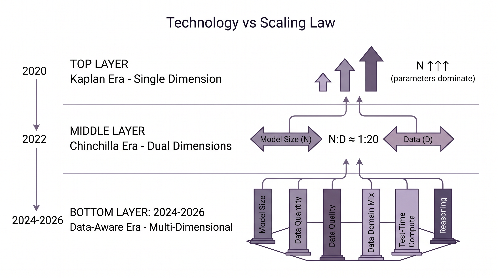

# 12. 2023-2026：Scaling Law 的新阶段

Chinchilla 将 D/N 比率锚定在 20:1，但这个数字很快就被现实超越。LLaMA 3 8B 用 15T tokens 训练——D/N 达到 1875:1，是 Chinchilla 建议值的 90 倍 [^109^]。行业并未忽视 Chinchilla 的教训，而是发现了它的局限：20:1 是在特定假设下推导出的静态最优，当数据质量、推理成本、测试时计算被纳入考量后，最优解会发生根本性偏移。2023 至 2026 年间，Scaling Law 从一个简洁的双变量公式，扩展为一个涉及数据质量、领域组成、重复策略和推理开销的多维优化框架。

## 12.1 从单一 Scaling Law 到数据感知 Scaling Law

Chinchilla 之后的第一波研究聚焦于一个核心问题：如果 Kaplan 低估了数据的重要性，那么 "数据" 本身是否还有内部结构值得建模？

**Farseer 动态比率**（Li et al., 2025）直接挑战了固定的 D/N ≈ 20:1 [^126^]。该研究引入了一个更具表达力的标度公式，其中标度指数本身成为模型规模 N 的函数。核心发现是：最优 D/N 比率应当随计算预算 C 的增加而增加，而非保持恒定。这意味着小模型和大模型的最优训练配方并不相同——在更大的计算规模下，投入更多数据（相对参数而言）的收益递增。Farseer 允许从业者在任意给定计算预算下精确求解最优 D/N 比率，将 Chinchilla 的静态建议升级为动态规划工具 [^126^]。

**数据质量对标度指数的影响**由 Bi et al.（2024）系统验证 [^118^]。他们的实验表明，更干净、逻辑更清晰的数据会提升模型标度指数 α 的数值。标度指数 α 衡量的是"每增加一倍参数，损失下降多少"——α 越大，扩大模型规模的回报越高。高质量数据使得增加参数成为更具成本效益的选择，因为它降低了每个参数需要学习的噪声和矛盾信息量 [^118^]。

**数据混合标度律**（Goyal et al., 2024; Ye et al., 2024）将这一思路延伸到多领域场景 [^151^]。这类方法的核心目标是：预测预训练损失如何随数据领域混合比例变化。从业者可以在小规模实验（如 100M 参数模型）上拟合混合律，然后将最优配比外推到大模型训练中。这避免了在大模型上做昂贵的网格搜索，让数据配比的优化从经验试错转向可预测工程 [^104^]。

三个方向共同指向一个结论：Scaling Law 中的 "D"（数据量）正在分解为"数据量 × 数据质量 × 领域组成"三个子维度，每个子维度都有独立的标度行为和优化策略。

## 12.2 过训练、重复数据与数据枯竭问题

Chinchilla 时代之后的行业实践呈现出一个清晰趋势：模型被有意"过训练"——即使用远超计算最优值的 token 量进行训练。

过训练（Over-training）指 D/N 比率显著高于 Chinchilla 最优值（20:1）的训练策略 [^79^]。其首要动机不是追求训练损失最低，而是推理效率。过训练后的较小模型在推理阶段每次查询的 FLOPs 更低。当模型在其生命周期中处理数十亿次查询时，推理阶段节省的计算可能远超训练阶段的额外开销 [^71^]。LLaMA 3 8B（D/N ≈ 1875:1）、Gemma-7B（D/N ≈ 857:1）、Gemma 2-9B（D/N ≈ 889:1）都是这一逻辑的产物 [^109^][^112^]。

但过训练加剧了一个更深层的问题：**数据枯竭**。Villalobos et al.（Epoch AI, 2023）估计人类历史产生的公开高质量文本总量约 300T tokens [^114^]。按当前训练数据的扩张速度，公开文本可能在 2026 至 2032 年间耗尽 [^114^]。LLaMA 3-70B 已被过训练约 10 倍；若行业普遍采用 100 倍过训练策略，数据耗尽可能提前至 2025 年 [^114^]。

**重复训练的标度行为**成为研究焦点。Muennighoff et al.（2023）的实验显示，在数据约束条件下重复训练最多 4 个 epoch，对损失的影响与使用唯一数据几乎无差别；有意义的收益延伸到约 16 个 epoch，在约 40 个 epoch 时衰减至零 [^158^][^65^]。他们据此提出了数据约束标度律，建模重复 token 的递减价值。

然而，后续研究发现了这一公式的关键缺陷：原始公式强制验证损失单调不增，与实践中重复 epoch 最终导致过拟合、验证损失上升的现象矛盾。2025-2026 年的改进研究引入了 additive overfitting law，通过超线性重复惩罚修正了这一问题。新模型发现，给定固定数据预算，存在一个**计算水平阈值**——超过该阈值后，训练更大的模型（更少的 epoch）反而优于训练更小的模型（更多的 epoch）[^148^]。这意味着重复训练并非万能解药，其有效性取决于可用的计算预算和数据量之间的平衡。

| 数据来源 | 规模估计 | 耗尽预测 | 关键变量 |
|---------|---------|---------|---------|
| 公开高质量文本 | ~300T tokens [^114^] | 2026-2032 年 [^114^] | 过训练倍数、数据增速 |
| 重复训练收益 | 0-4 epoch 无显著损失 [^158^] | 40 epoch 后收益归零 [^65^] | 数据质量、学习率调度 |
| 合成数据潜力 | 理论上无上限 [^71^] | 受质量与多样性约束 [^150^] | 生成模型能力、验证成本 |
| 多模态数据 | 图像-文本对数十亿量级 [^113^] | 远晚于文本枯竭 [^71^] | 标注成本、版权限制 |

上表梳理了数据枯竭问题的四维景观。公开文本的耗尽时间并非固定常数，而是受过训练策略和行业数据需求增速的共同影响。重复训练在短周期内有效，但存在明确的上限。合成数据是唯一理论上无限扩展的来源，但其质量和多样性仍依赖于基础模型能力，形成递归依赖。多模态数据提供了缓冲，但标注成本和版权约束限制了其作为文本替代品的可行性。这四条路径共同决定了行业在 2026 年后的数据战略空间。

## 12.3 高质量数据的边际收益如何变化

如果数据总量存在上限，那么从每单位数据中提取更多价值就成为 Scaling Law 的新核心问题。

Sorscher et al.（2022）的关键发现是：通过剪枝数据集中的冗余示例，可以在数据集规模上达到**指数级（而非幂律）标度** [^84^]。这意味着数据筛选不只是"去掉坏数据"——它改变了损失随数据量下降的根本速率。从幂律到指数级的跃迁意味着，在理想筛选条件下，数据量的边际价值远高于传统 Scaling Law 的预测。

Bi et al.（2024）的实验进一步量化了"质量 = 规模"的等价关系 [^118^]。他们的结果表明，高质量数据在标度行为上等价于数倍规模的低质量数据。这种等价关系并非线性：在某些质量阈值以下，数据对模型性能的贡献几乎为零；超过阈值后，每单位高质量数据的贡献远超低质量数据。

数据质量的定义本身也在细化。实践中常用的维度包括：语言正确性（语法和拼写质量）、信息密度（每 token 承载的知识量）、教育价值（对推理能力的促进程度）和多样性（主题和风格的覆盖范围）。不同维度对不同能力的贡献并不均匀——教育价值高的数据对数学和推理能力的提升最大，而多样性对通用语言能力的贡献更为关键。

**FineWeb-Edu** 的发现是这一逻辑的典型验证。该数据集仅使用 1.3T 经教育价值筛选的高质量 tokens，就在多项基准测试上超越了使用 15T 原始未筛选 tokens 训练的模型。筛选标准基于一个简单直觉：像教科书和学术文章一样具有"教学性质"的文本，比随意网络对话更能教会模型系统性的知识和推理模式。这个结果表明，在极端过训练场景下，数据质量的筛选ROI（投资回报率）可能远超简单堆叠更多原始数据。

## 12.4 多模态、代码、数学、长上下文中的 Scaling Law

文本领域的 Scaling Law 不能直接套用到其他数据类型。2023-2026 年的研究逐步揭示了不同领域的差异化标度行为。

**代码的 Scaling Law** 展现出显著的偏离。Li et al.（2025）发现，代码数据具有根本不同的统计属性：严格语法约束和复杂长程依赖使得代码 LLM 的 D/N 比率显著偏离自然语言标度律的预测 [^126^]。代码模型处于一个更"数据饥渴"（data-hungry）的标度状态——即给定相同参数规模，代码模型需要比自然语言模型更多的训练 tokens 才能达到计算最优 [^126^]。这一发现解释了为什么现代代码模型（如 Codex、CodeLlama、StarCoder）普遍采用极端过训练策略。

**多模态标度律**（视觉-语言模型）遵循修改后的幂律形式，但标度指数显著低于纯文本模型 [^113^]。数据显示：数据标度 L_data = 406.4 × D^(-0.34)，模型标度 L_model = 410.7 × N^(-0.28) [^113^]。将指数与 Kaplan 的原始值（α ≈ 0.076, β ≈ 0.095）对比可见，视觉-语言模型的标度指数绝对值更大——这意味着多模态模型对数据和参数规模的增长更为敏感，但也暗示了每单位扩展的边际收益递减更快。多模态模型还需要处理视觉编码器的参数开销（约增加 20% 参数量）和最优视觉:语言参数比（约 1:3）的额外约束 [^113^]。

**下游任务性能的可预测性**是 Scaling Law 面对的最大挑战。传统标度律只预测预训练 loss，不直接预测下游任务准确率。Lourie et al.（2025）的系统性评估发现，仅约 **39%** 的下游任务展现出可预测的线性标度 [^100^]。剩余 61% 的任务中，相似 loss 的模型可能展现截然不同的能力——Liu et al.（2023）的实验直接验证了这一现象 [^100^]。

这一问题的根源在于：下游标度律依赖于三个因素的交互——预训练数据分布、验证数据分布和下游任务本身的结构。改变其中任何一个因素，都可能逆转哪种预训练设置对特定下游任务更优 [^108^]。当前主流的解决方案是**两阶段方法**：先用小规模模型拟合 "计算 → loss" 的标度关系，再通过校准函数（通常线性或 sigmoid）将 loss 映射到特定任务的准确率 [^104^][^109^]。

| 领域 | 标度行为特征 | D/N 偏离度 | 关键约束 | 代表研究 |
|------|------------|-----------|---------|---------|
| 自然语言 | 标准幂律，α≈0.076 [^40^] | Chinchilla 建议 20:1 [^65^] | 数据枯竭、重复训练上限 | Kaplan 2020, Chinchilla 2022 |
| 代码 | 更数据饥渴，标度指数偏离 [^126^] | 显著高于 20:1 | 语法约束、长程依赖 | Li et al. 2025 |
| 视觉-语言 | 修改幂律，β≈-0.34 [^113^] | 需额外视觉编码器参数 | 模态对齐、数据效率低 | 多模态 Scaling Law 2024 |
| 数学/推理 | 涌现性强，可预测性低 [^100^] | 高价值数据稀缺 | 仅~39%任务线性可预测 [^100^] | Lourie et al. 2025 |
| 长上下文 | 与上下文长度联合标度 | 训练数据构造复杂 | 二次复杂度、位置编码 | 渐进式扩展策略 |

上表对比了五个领域的差异化标度行为。自然语言仍然是标度律研究最成熟的领域，但代码和视觉-语言领域已展现出需要专门标度模型的明确信号。数学和推理任务的可预测性最低，这意味着在这些领域依赖小规模实验外推大规模性能的风险更高。长上下文的标度行为仍处于早期研究阶段，其计算复杂度（ Attention 的二次增长）和位置编码的外推能力是两个核心约束。

## 12.5 新问题：规模是否仍然是唯一答案

2024-2026 年间，一个根本性的质疑浮现：如果模型在推理时可以"思考更久"——生成更多中间推理 token——预训练阶段的规模扩张是否仍然是最优的资源配置？

**推理时 Scaling（Test-time Compute）** 的兴起改变了游戏规则。OpenAI 的 o1/o3 系列和 DeepSeek-R1 证明，让模型在回答前先生成数千个 tokens 的推理链（Chain-of-Thought），可以显著提升复杂任务的准确率。这与传统 LLM 的单次前向传播模式形成鲜明对比：传统模型"想到哪说到哪"，推理模型"想透了再说"。

**T2T Scaling Law**（Train-to-Test, 2026）首次将预训练和推理时计算纳入统一优化框架 [^112^]。该研究联合优化三个变量：模型规模 N、训练 token 数 D 和推理采样次数 k。两种互补的建模方法（建模 NLL 和建模 pass@k）一致得出结论：当考虑测试时计算时，最优策略是训练**更小的模型、更长时间**（大量过训练），然后在推理时通过重复采样或链式思考来放大能力 [^112^]。

Sardana et al.（2023）的前期工作已沿着这一方向展开：他们将推理成本纳入计算最优配方，发现考虑单次查询成本时，模型应当比 Chinchilla 建议的更小 [^115^]。T2T 将这一分析扩展到多次采样的场景，发现结论更加倾向于过训练和测试时计算 [^112^]。

这一理论框架与行业实践高度一致。DeepSeek-R1 使用的基座模型（DeepSeek-V3, 671B 总参数 / 37B 激活参数）远小于 GPT-4 级别的闭源模型，但通过测试时推理计算达到了可比的推理能力。这表明 Scaling Law 的"扩展维度"正在从预训练阶段向推理阶段转移。

**涌现能力理解的深化**也为这一讨论提供了新视角。Schaeffer et al.（2023）的研究表明，许多被认为"涌现"的能力实际上可能是评估指标选择的产物——当使用连续指标（如 Brier 分数）而非离散指标（如多选题准确率）时，性能改善呈现平滑趋势 [^159^]。最新研究进一步将涌现解释为两个竞争标度趋势的交汇——难题呈现 U 型标度（先变差后变好），简单题呈现倒 U 型标度，"涌现"阈值出现在两种趋势的交互点 [^117^]。这意味着涌现并非神秘的相变，而是可预测的标度现象。如果涌现可以被预测，那么测试时计算就可以在特定任务的"涌现阈值"附近被精确配置。

上图概括了 Scaling Law 从 2020 到 2026 的三阶段演进。Kaplan 时代（2020）将参数规模视为唯一扩展维度，"越大越好"成为行业信条。Chinchilla 时代（2022）引入了参数与数据的双维度平衡，D/N ≈ 20:1 成为训练配方的新基准。数据感知时代（2024-2026）进一步将数据质量、领域组成、测试时计算和推理能力纳入框架，Scaling Law 从一个双变量公式扩展为多维优化问题。每个阶段的扩展并非否定前一阶段，而是引入新的约束条件和优化维度。Kaplan 的幂律框架仍然是底层数学结构，但实际应用中的最优解需要在更多变量上求解。

从 Chinchilla 到 T2T 的演进揭示了一个深层趋势：Scaling Law 的研究对象从"训练阶段的固定模型"转向"训练-推理全生命周期的动态系统"。模型的价值不再由预训练结束时的 loss 定义，而是由其在实际部署中每单位计算所能完成的任务量定义。这一视角转换意味着数据、架构、训练策略和推理算法的优化必须被统一考虑——任何单一维度的孤立优化都可能偏离全局最优。

