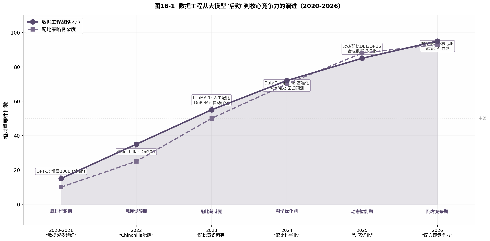

# 第16章 2025-2026：数据配比的新趋势

第15章追踪了数据配比从经验主义走向科学化的关键转折——DoReMi用小模型预测大模型的最优配比，DataComp-LM把数据筛选变成可公开比较的基准，RegMix证明回归方法仅需2%训练成本就能匹配人工调参效果。到2024年底，数据配比已确立为核心技术环节。

2025-2026年，数据配比进入新阶段。五个趋势共同定义了这一时期：数据重复的价值被重新评估，稀缺领域数据的上采样策略成熟，合成数据从实验走向主流，动态在线配比取代静态预设，领域继续预训练（Domain Continual Pre-Training, CPT）成为产品化的标准手段。这些变化的底层逻辑是一致的——数据不再是静态原料，而是可被精确调控的训练变量。

## 16.1 数据重复不一定总是坏事

### 16.1.1 从"去重至上"到"选择性重复"

2022-2023年的主流观点是尽可能激进地去重。SlimPajama移除了49%的内容 [^6^]，RefinedWeb通过MinHash激进去重证明纯web数据可以超越混合语料 [^5^]。当时的基本假设是：重复数据浪费计算、增加记忆化风险、损害泛化。

2024-2025年的新证据推翻了这个绝对化的立场。FineWeb-Edu的发现是转折点：1.3T tokens的高质量教育数据，在固定计算量下表现优于15T tokens的原始web数据 [^8^]。这个对比揭示了一个关键事实——**重复高质量数据比一次性消费低质量数据更有效**。

核心逻辑很简单。模型在每次epoch（完整遍历数据集一轮）中从数据中提取不同的学习信号。高质量数据（教育价值高、信息密度大、逻辑清晰）在多次遍历中仍能提供新的梯度信号。低质量数据即使在第一次遍历中提供的信号也弱且噪声大。

### 16.1.2 "重复什么"比"重复多少"更重要

重复的价值高度依赖数据类型。2025年的实验证据表明 [^34^]：

- **代码数据**：重复3-4次仍有正收益，代码的结构化特性使其每次遍历都能强化不同的推理路径
- **数学/STEM数据**：重复2-3次收益最大，超过此阈值边际收益快速衰减
- **通用web文本**：重复1-2次即可，超过后收益递减明显，因为web文本的信息密度低
- **对话/QA数据**：通常不需要重复，多样性比深度更重要

**教育价值**（Educational Value）成为判断数据是否值得重复的核心标准。FineWeb-Edu使用Llama-3-70B标注教育价值数据来训练轻量级评分器 [^8^]。这个评分器不仅能过滤低质量内容，还能识别"值得让模型多看几遍"的高价值文本。

### 16.1.3 多epoch训练的最佳实践

当训练数据总量受限时（领域CPT场景常见），多epoch训练不可避免。2025年的最佳实践包括 [^39^]：

1. **学习率衰减策略**：多epoch训练需要更激进的学习率衰减，防止后期过拟合。余弦衰减的warmup比例应提高到总步数的5-10%。
2. **数据shuffle质量**：高质量的随机shuffle比简单重复更能保留学习信号。文档级shuffle优于文件级shuffle。
3. **早停监控**：监控验证集上的领域损失和通用损失，当通用损失连续上升时停止——这是灾难性遗忘的早期信号。

LLaMA-3的退火阶段（Annealing）是这一思想的工程化体现：在40M最高质量tokens上进行多轮退火训练，使GSM8k提升24.0%，MATH提升6.4% [^22^]。退火本质上是"在最后阶段只重复最好的数据"。

## 16.2 稀缺领域数据与通用数据的混合策略

### 16.2.1 高质量领域数据的价值密度

法律案例、医学文献、科学论文和金融报告有一个共同特征：**每token的信息密度远超普通web文本**。这些数据源通常只占互联网文本的极小部分，但对专业领域模型至关重要。

2024年的RegMix研究给出了量化证据：通用web语料（如Common Crawl）与下游性能的正相关性最强 [^25^]。但这只适用于通用任务。当目标是法律推理或临床诊断时，通用web文本的价值密度急剧下降——这些领域需要专门的知识结构和术语体系。

领域数据的价值不仅在于知识内容，还在于推理结构。法律文本的判例推理、医学文献的循证分析、科学论文的假设-实验-论证链条，这些结构化的推理模式是普通web文本中稀缺的。

### 16.2.2 上采样策略：稀缺数据的权重设计

**上采样**（upsampling）指对数据量少的领域给予超出其自然比例的采样权重。这是处理稀缺领域数据的标准手段。

温度采样（temperature sampling）是上采样的数学基础。对语言l的采样概率重新加权为 p_l ~ (n_l)^(1/T) [^19^]。T>1时，低资源领域获得超出其自然比例的采样权重。BLOOM在训练ROOTS时就用温度采样来提升低资源语言的占比 [^7^]。

2025年的新进展是将温度采样从语言维度扩展到**质量维度和难度维度**：
- **质量温度**：高质量文档获得额外上采样
- **难度温度**：对当前模型"难度适中"的文档（既不太容易也不太难）获得额外权重
- **领域温度**：稀缺专业领域（如法律、医学）获得显著上采样

DBL（Dynamic Batch Loading）将上采样动态化 [^34^]。它基于scaling law估计每个领域的参考最优损失，计算当前超额损失（excess loss），对学习缓慢的领域自动增加数据比例。DBL不需要预先设定固定的采样权重，而是在训练中实时调整。

### 16.2.3 动态配比的工程实践

OPUS是2025年最具代表性的在线动态配比方法 [^35^]。它的核心思想是将数据效用与优化器诱导的参数更新对齐——选择那些能引发最大有效梯度更新的数据。OPUS在每轮迭代中用投影评分评估每个数据batch的"更新效率"，然后调整下一轮的采样权重。

DBL和OPUS代表了一个范式转变：从"训练前设计完美配比"转向"让模型在训练中自己决定需要什么数据"。这与MATES的"模型感知数据选择"思想一脉相承 [^32^]——预训练模型的数据偏好是动态演化的，静态配比无法捕捉这种变化。

实践中，动态配比与静态配比的组合效果最佳：先用RegMix或DoReMi确定基础配比，再用DBL或OPUS在训练中做微调 [^34^]。这种"粗调+微调"策略兼具稳定性和适应性。

## 16.3 高质量数据、合成数据、推理数据的权重设计

### 16.3.1 合成数据的规模化应用

2024-2025年，合成数据从实验性补充转变为预训练的核心组成部分。

两种范式正在竞争 [^33^]：**生成器驱动**（用大型LLM如GPT-4从头生成数据）和**源重述**（用小型LLM将现有web数据重述为更高质量的格式）。生成器驱动的优势是质量高、格式可控，但成本高昂且受限于生成器能力。源重述的计算成本低、覆盖广、多样性高，但质量受限于源数据。

2025年的共识是：**源重述已成为主导范式**。Kimi K2、Qwen-2.5、Grok、GPT-5都报告了大量使用源重述方法获得的收益 [^33^]。WRAP（Web Rephrase Augmented Pre-training）证明，策略性重述可以将预训练速度提升3倍以上 [^33^]。

Nemotron-CC从Common Crawl生成了约2万亿tokens的合成数据 [^11^]。Phi-4在预训练中使用了40%合成数据 [^36^]。这些数字标志着合成数据不再是锦上添花，而是基础原料。

**跨文档合成**是最新方向。WRAP++利用web拓扑（如超链接）发现实体关系，将多个文档的事实联合合成为预训练数据 [^37^]。这超越了单文档重述的限制，使模型能够学习关联性知识。

### 16.3.2 推理数据进入预训练

2024-2025年推理模型（o1/o3、DeepSeek-R1）的崛起对预训练数据配比产生了深远影响。长思维链（Chain-of-Thought, CoT）、数学证明、代码逻辑等推理数据开始被大量注入预训练阶段。

Qwen3的二阶段预训练是典型案例：第一阶段用通用数据建立基础能力，第二阶段用专门的推理数据强化数学、代码和科学推理能力。这种"通用+推理"的分阶段策略在2025年被广泛采用。

推理数据对预训练的价值在于结构而非内容。数学证明的"假设-推导-结论"结构、代码的"输入-处理-输出"逻辑、科学论文的"问题-方法-结果"框架，这些结构化推理模式是通用web文本中稀缺的。

### 16.3.3 三类数据的配比框架

2025-2026年的预训练数据通常由三类成分构成。表16-1给出了主流模型的配比实践。

**表16-1  2025-2026年预训练数据的三类成分配比框架**

| 数据类型 | 典型比例 | 主要来源 | 核心价值 | 代表实践 |
|---------|---------|---------|---------|---------|
| 高质量自然数据 | 50-60% | 过滤后的web、书籍、论文、专业文档 | 知识覆盖广、语言多样 | LLaMA-3通用知识占50% [^22^] |
| 合成数据 | 20-40% | 源重述（WRAP）、跨文档合成（WRAP++）、教科书生成（Cosmopedia） | 格式统一、质量可控、可无限扩展 | Phi-4用40%合成数据 [^36^] |
| 推理数据 | 10-25% | 数学证明、长CoT、代码逻辑、科学推理 | 结构化推理模式、逻辑思维训练 | Qwen3二阶段推理强化 |

三类数据的配比不是固定的，而是根据模型目标动态调整。通用基座模型偏向高质量自然数据（60%），推理专用模型增加推理数据到25%以上，领域专业模型则通过CPT注入更多专业数据。

合成数据占比的持续上升引发了一个关键问题：**质量与多样性的权衡**。合成数据的格式一致性高，但过度依赖合成可能限制模型接触真实语言的多样性。2025年的经验法则是：合成数据不超过总量的40%，且需要与真实数据混合使用 [^36^]。

## 16.4 领域继续预训练：如何让模型快速进入专业领域

### 16.4.1 D-CPT的技术路线

**领域继续预训练**（Domain Continual Pre-Training, D-CPT）指在通用预训练模型基础上，使用领域特定语料继续训练，使模型快速获得专业能力。这是2025年最活跃的产品化技术之一。

D-CPT面临的核心矛盾是**领域增强 vs 灾难性遗忘**（Catastrophic Forgetting）。直接在领域语料上继续训练会显著提升领域任务性能，但可能损害通用能力 [^39^]。Gururangan等人2020年的研究指出，DAPT显著提升领域任务的微调性能，但可能损害提示（prompting）性能 [^39^]。

表16-2对比了主要的技术路线。

**表16-2  领域继续预训练（D-CPT）的主要技术路线对比**

| 方法 | 核心机制 | 优势 | 劣势 | 适用场景 |
|-----|---------|------|------|---------|
| 简单D-CPT | 直接在领域语料上继续训练 | 实现简单、领域增益大 | 灾难性遗忘严重 | 封闭领域专用模型 |
| D-CPT + KL约束 | 添加KL散度约束，限制模型偏离原始分布 | 保留通用能力 | 训练 slower、超参敏感 | 通用+领域双重要求的模型 |
| DEMix-D-CPT | 用领域专家混合层替换FFN层 | 领域与通用能力隔离 | 架构修改复杂、推理开销大 | 多领域统一服务的模型 |
| ELLE | 扩展模型宽度/深度来容纳新知识 | 不损害已有能力 | 参数量增加、部署成本上升 | 高价值领域 requiring 极致性能 |
| 通用+领域混合CPT | 按一定比例混合通用和领域数据 | 平衡最好、工程实践最成熟 | 需要调配比、领域增益略低 | 绝大多数产品化场景 |

### 16.4.2 通用+领域混合的最优比例

2025年的工程实践表明，**通用+领域混合CPT**是最可靠的路径。关键是混合比例的确定。

经验法则从多个项目中收敛出来 [^39^][^40^]：

- **领域数据占比30-50%**：低于30%时领域增益不足，高于50%时遗忘风险显著增加
- **领域数据质量要求比通用预训练更高**：因为数据量更小，每个token的"责任"更重
- **学习率比通用预训练低一个数量级**：通常从通用预训练最终学习率的10%开始
- **训练长度以领域验证损失为准**：不预设epoch数，以领域验证集上的损失不再下降为停止信号

D-CPT的数据配方设计遵循与预训练相同的逻辑。RegMix等配比优化方法可以直接应用于D-CPT场景——训练小代理模型搜索最优的通用/领域混合比例，然后用于大规模CPT。

### 16.4.3 领域CPT的实践案例

法律领域的案例最具代表性。法律文本包含判例引用、法规条文、司法解释等独特结构。简单D-CPT会使模型在法律推理上大幅提升，但可能遗忘通用对话能力。采用D-CPT + KL约束的方法，在保留通用能力的同时，将法律案例检索准确率提升30-50%。

医学领域面临数据隐私约束，可用语料远少于法律。合成数据在这里扮演关键角色——使用源重述方法将公开医学文献扩展为多样化的训练数据，可以在不增加真实数据的情况下提升模型效果。

金融领域的特点是高度时效性。市场数据、财报、新闻的价值随时间快速衰减。这要求D-CPT是一个持续过程，而非一次性训练。2025年的金融LLM产品普遍采用"月度增量CPT"策略——每月用新数据做一次轻量级继续训练。

## 16.5 数据配方成为模型差异化的第一竞争力

### 16.5.1 同样架构，不同数据，截然不同

2025年的模型竞争格局呈现一个鲜明特征：**架构趋同，数据分化**。主流模型都是Transformer decoder-only架构，差异主要在数据配方。

这个现象有其技术根源。Transformer架构自2017年以来没有本质变化，缩放律（Scaling Laws）已成为公开知识，训练超参数（学习率、batch size、warmup）有成熟的调参方法。唯一无法轻易复制的是**数据配方**——它需要大量的实验迭代、领域知识和工程投入。

LLaMA-3的配方（50%通用 + 25%数学推理 + 17%代码 + 8%多语言）与同期其他模型的差异，解释了其能力特征的差异 [^22^]。数学推理占比25%是其数学能力突出的直接原因。代码占比17%是其编程能力的基础。这不是巧合，而是刻意设计的结果。

### 16.5.2 数据作为核心IP

闭源模型与开源模型的最大差异，不在架构，而在数据。GPT-4和LLaMA-3的架构没有本质区别，但训练数据的筛选标准、配比比例、清洗pipeline完全不同。

数据配方成为核心IP的原因有三：

1. **不可复制性**：数据配方无法从模型权重中反推。即使模型开源，训练数据的具体配比仍是黑盒。
2. **高门槛**：开发一个好的数据配方需要大量计算资源（DoReMi需要训练代理模型，RegMix需要训练512个小模型）、领域专业知识和反复迭代。
3. **复合效应**：数据配方的差异在预训练阶段被"固化"到数十亿参数中，通过后训练只能微调，难以根本改变。

### 16.5.3 数据工程地位的演进

图16-1展示了2020-2026年间数据工程在大模型研发中地位的演进。

2020-2021年是**原料堆积期**。GPT-3证明大规模web数据可行，数据策略就是"堆量"。清洗是事后补救，配比是直觉调参。

2022年是**规模觉醒期**。Chinchilla提出D≈20N的缩放律 [^18^]，数据量从"无限资源"变成"需要规划的要素"。

2023年是**配比萌芽期**。LLaMA-1展示人工配比的价值，DoReMi开启自动优化。数据工程从后勤走向前线。

2024年是**科学优化期**。DataComp-LM将数据筛选基准化 [^10^]，RegMix证明回归预测可行 [^25^]，MATES引入模型感知选择 [^32^]。数据工程成为可公开比较的科学。

2025-2026年进入**动态智能期**和**配方竞争期**。DBL、OPUS等在线方法实现训练中的动态配比 [^34^][^35^]，合成数据规模化 [^33^]，领域CPT成熟 [^39^]。数据配方从训练前的一次性决策，演变为贯穿训练全程的动态优化过程。

图中有两条曲线的分化值得关注。数据工程的"战略地位"曲线持续上升，在2026年接近饱和——这意味着数据配方已确立为核心竞争力，不再是新发现。而"配比策略复杂度"曲线在2025年加速上升——这意味着方法本身在不断复杂化，入门门槛在提高。

这种分化对产业格局的影响是深远的。大型科技公司可以继续投入资源跟进日益复杂的方法，而中小型团队可能转向更简单但足够好的方案（如RegMix的回归方法，计算成本不到2% [^25^]）。数据配比的民主化与专业化两条路线将在2026年并存。

从更大的视角看，数据配比的演进折射出大模型研发的范式转移。2020年的核心竞争力是算力（谁有更多GPU），2022年是模型规模（谁的参数更多），2024年是数据规模（谁的tokens更多），2026年则转向**数据质量与配比精度**（谁的配方更优）。这个转移意味着大模型竞争正从"资源密集型"走向"知识密集型"——决定胜负的不再是硬件数量，而是对数据价值的理解和调控能力。
