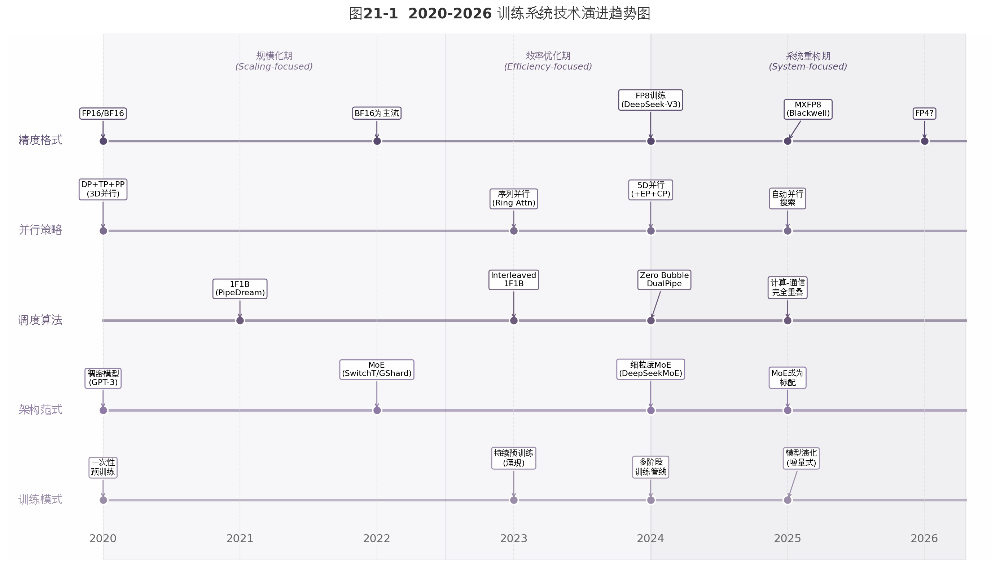

# 第21章 2024-2026：新一代训练系统趋势

第20章讨论了长上下文与高效Attention技术。本章向前展望，聚焦2024-2026年训练系统的五大趋势：低精度训练、MoE架构、专家并行、训练稳定性工程，以及从"一次性预训练"到"持续演化"的范式转变。这些趋势并非孤立出现，而是围绕同一个核心矛盾——在硬件成本约束下持续扩展模型规模——展开的协同进化。

图21-1从精度格式、并行策略、调度算法、架构范式和训练模式五个维度展示了训练系统的演进脉络。2020-2022年为规模化期，核心目标是用3D并行训练更大的稠密模型。2022-2024年为效率优化期，MoE、序列并行和低精度训练成为焦点。2024-2026年进入系统重构期，5D并行、FP8生产化、计算-通信完全重叠和持续预训练构成新的技术栈。

---

## 21.1 FP8 / 低精度训练：降低显存与通信成本

### 从BF16到FP8的跃迁

低精度训练的历史是一条精度持续降低但范围逐步扩展的曲线。2020年前主流使用FP32，2020-2022年过渡到BF16/FP16混合精度，2024年FP8进入生产环境，2025年NVIDIA Blackwell平台进一步将MXFP8推向主流[^205^][^489^]。

FP8（8位浮点数）存在两种标准格式：E4M3（4位指数、3位尾数）偏向精度，适合前向传播；E5M2（5位指数、2位尾数）偏向动态范围，适合反向梯度。DeepSeek-V3的训练实践揭示了一个关键洞察：细粒度量化（tile-wise和block-wise scaling）可以有效扩展FP8的动态范围，使得在前向和反向传播中都使用E4M3格式成为可能[^487^]。

### DeepSeek-V3的FP8混合精度框架

DeepSeek-V3是首个在超大规模（671B参数MoE）上验证FP8训练可行性的公开模型[^487^]。其框架的核心设计是"选择性精度"：计算密集型的GEMM操作使用FP8，数值敏感组件保持BF16或FP32。

具体而言，所有三种Linear层GEMM（前向Fprop、激活梯度Dgrad、权重梯度Wgrad）均以FP8执行。Embedding模块、输出头、MoE路由模块、归一化层和注意力运算保持高精度。主权重、权重梯度和优化器状态也维持高精度存储[^495^]。

为解决激活值中的异常值（outlier）问题，DeepSeek-V3采用细粒度量化策略：激活值按1×128的tile分组缩放，权重按128×128的block分组缩放。这种分组方式与NVIDIA Blackwell的microscaling格式设计理念高度一致[^487^]。

FP8训练带来的收益是实质性的：相比BF16，FP8 GEMM的理论峰值速度提升2倍，显存占用减少约50%。DeepSeek-V3在2048张H800 GPU上完成14.8T token的预训练仅需266.4万GPU小时，FP8功不可没[^478^]。

### MXFP8：Blackwell硬件加速

2025年NVIDIA Blackwell架构引入了对MXFP8（Microscaling FP8）的原生硬件支持。MXFP8为每32个元素分配一个独立的E8M0缩放因子，量化粒度远优于传统的per-tensor缩放。Blackwell的tcgen05.mma指令可直接执行MXFP8 GEMM，无需软件模拟开销[^205^]。

实测数据显示，MXFP8在Blackwell上相比BF16实现约2倍吞吐量提升，端到端训练速度提升22%，峰值显存降低14%[^489^]。在DeepSeek-V3的预训练中，MXFP8相比BF16基线实现了最高41%的速度提升[^205^]。

### FP4：下一个前沿

Blackwell同时引入了对FP4/NVFP4的支持。NVFP4为每16个元素分配一个缩放因子，相比MXFP8进一步将显存占用减半，理论吞吐量提升3倍[^476^][^486^]。但FP4训练的稳定性尚处于早期研究阶段，2025-2026年可能先在小规模实验中验证，大规模生产应用仍需时日。

### 精度演进的关键约束

FP8训练并非没有代价。社区报告表明，不同GPU架构（H100 vs H800）的FP8 Tensor Core实现存在差异，导致相同配置下loss曲线有5-10%的偏差[^206^]。这说明FP8训练的数值稳定性对硬件细节高度敏感。核心经验是：FP8训练需要精心设计的混合精度框架，不能简单地将所有运算切换为FP8。

---

## 21.2 MoE 训练：只激活部分参数，扩大总容量

### MoE的训练效率本质

MoE（Mixture-of-Experts，混合专家模型）的核心思想在第22章有详细讨论。从训练系统角度看，MoE的关键价值在于**解耦模型总参数量与每token计算量**——一个总参数量671B的MoE模型，每个token仅激活37B参数，实际计算成本与37B稠密模型相当，但模型容量（知识存储能力）等同于671B[^478^]。

这种解耦使MoE成为显存受限环境下扩展模型规模的首选方案。2024年后，从GPT-4到DeepSeek-V3再到Qwen3-235B，MoE架构几乎成为大模型的默认选择[^476^]。

### DeepSeekMoE的训练目标创新

DeepSeek-V3在MoE训练目标上引入了两项关键创新。

**Multi-Token Prediction（MTP）**：每个位置不仅预测下一个token，还额外预测未来D个token。DeepSeek-V3使用D=4的MTP模块，每个模块包含独立的Transformer块和投影层，共享embedding层和输出头[^478^][^299^]。MTP的优势是三重的：更高的样本效率（每forward提取多倍学习信号）、训练速度提升约1.3倍、推理时可配合speculative decoding实现2-5倍加速[^299^][^312^]。13B参数模型加入MTP后，在HumanEval和MBPP上比基线多解决17%的问题[^298^]。

**无辅助损失负载均衡**：传统MoE使用辅助损失（auxiliary loss）惩罚不均衡的专家使用，但这会干扰主任务优化。DeepSeek-V3改用动态偏置更新——监测每个专家的使用频率，过度使用的专家降低其router bias，使用不足的则增加bias，学习率仅0.001[^285^]。这种策略消除了辅助损失的超参数调优需求，且不干扰主任务loss。

### MoE训练的系统挑战

MoE训练引入的系统复杂性远超稠密模型。表21-1对比了稠密模型与MoE模型在训练系统层面的关键差异。

| 维度 | 稠密模型（如LLaMA-3 70B） | MoE模型（如DeepSeek-V3 671B/37B） |
|------|------------------------|--------------------------------|
| 总参数量 | 70B | 671B |
| 每token激活参数 | 70B | 37B |
| 单卡参数存储 | 均匀分布 | 专家分片，非均匀 |
| 核心通信模式 | All-reduce | All-to-all |
| 负载均衡要求 | 无 | 必须，否则性能暴跌 |
| 显存峰值 | 可预测 | 依赖路由分布，波动大 |
| 最优并行配置 | DP×TP×PP | DP×EP×PP（常省略TP）[^478^][^280^] |
| 训练框架支持 | 成熟 | 需专门优化（DeepEP等） |

MoE训练的系统复杂度主要来自三个方面。第一，all-to-all通信：每个token需要根据路由决策被发送到持有目标专家的GPU，这种通信模式比稠密模型的all-reduce更难优化。第二，负载不均衡：动态路由导致部分"热专家"接收token远多于"冷专家"，在GLM-5的128专家配置下负载不均衡平均浪费18.6%的GPU时间[^279^]。第三，显存波动：不同batch的路由分布不同，导致峰值显存难以预测。

---

## 21.3 Expert Parallel：专家模型的分布式挑战

### Expert Parallelism的基本原理

Expert Parallelism（EP，专家并行）将不同专家分配到不同GPU。EP degree（并行度）通常等于或小于专家总数。DeepSeek-V3采用EP=64：256个路由专家分布在64个GPU上，每个GPU持有4个专家[^478^]。

EP引入的核心通信操作是dispatch和combine。Dispatch将每个token发送到持有其目标专家的GPU，combine将各专家计算结果收集回原位置。这两个操作本质上都是all-to-all通信变体，在大规模跨节点场景下可能成为训练瓶颈[^280^]。

### 通信优化的工程突破

DeepSeek-V3的DualPipe算法是EP通信优化的里程碑。传统pipeline调度（如1F1B）中，MoE层的all-to-all通信暴露在外，约占训练时间的50%以上[^478^]。DualPipe的核心创新是**双向双通道调度**：

**计算-通信完全重叠**：将每个forward/backward chunk分解为attention、all-to-all dispatch、MLP和all-to-all combine四个组件。通过精心排列这些组件的执行顺序，并配合Zero Bubble式的backward解耦（拆分为input gradient和weight gradient），使得all-to-all通信几乎完全被计算隐藏[^478^]。

**跨节点通信内核优化**：DeepSeek开发了定制的跨节点all-to-all通信内核，充分压榨InfiniBand和NVLink带宽，同时最小化占用GPU的流式多处理器（SM）资源[^478^]。

**省略张量并行**：通过极致的内存优化，DeepSeek-V3在不使用TP的情况下完成训练。TP通常限制在一个NVLink域内（最多8 GPU），省略TP意味着模型的并行策略不受节点拓扑约束，简化了大规模部署[^478^]。

### Megatron-Core MoE的工程化方案

NVIDIA的Megatron-Core提供了另一套EP优化路线。其核心贡献包括[^281^][^282^]：

**Parallel Folding**：解耦attention层和MoE层的并行配置，打破EP degree必须小于等于DP degree的限制。这使得不同层可以使用不同的并行策略，最大化硬件利用率。

**内存优化**：细粒度激活重计算、内存高效permute、CPU激活offload的组合，将DeepSeek-V3每卡内存从199.5GB降至80GB以下，使其可在消费级GPU上训练[^282^]。

**通信-计算重叠**：DeepEP和HybridEP两种token dispatcher设计。HybridEP利用NVLink域内高速带宽处理域内专家通信，跨节点通信量降至最低。在GB200 NVL72上，EP64的通信开销约20%；跨节点EP64在H100上则为40-60%[^280^]。

### 负载均衡的工程影响

负载均衡直接影响EP的训练效率。如果80%的token被路由到20%的专家，那些GPU将过载而其他GPU空闲。Megatron-Core采用动态token dropping策略：当某个专家接收token超过容量上限时，多余token被丢弃并重新路由。这保证了最坏情况下的训练吞吐量，但可能损失部分计算[^281^]。

---

## 21.4 训练稳定性：loss spike、回滚、梯度异常与数值精度

大规模模型训练的稳定性问题在2024年后变得更加突出。FP8的低精度、MoE的动态路由、5D并行的复杂通信拓扑，每一个因素都增加了训练失败的风险。

### Loss Spike的四类根源

**高曲率loss landscape**：模型进入loss曲面的高曲率区域时，有效学习率过大导致参数跳变[^283^]。

**梯度爆炸**：深度网络中梯度逐层相乘累积。SPAM优化器的研究发现，梯度spike的幅值可达正常梯度的1000倍，且跨越层、架构和数据集持续存在[^477^]。

**异常数据批次**：网络抓取的数据中存在极端异常样本，单个bad batch即可trigger loss spike[^283^]。

**优化器状态污染**：一旦大梯度更新Adam的momentum buffer，污染会持续影响后续数百步训练。这是loss spike后恢复困难的根本原因[^283^][^477^]。

### 分级恢复策略

生产环境下的训练稳定性需要分级处理机制[^283^]：

小spike（loss 2-5倍平均值，持续1-3步）：仅监控，不干预。中spike（loss 5-20倍或持续10步以上）：降低学习率10-20%继续500步。大spike（loss 20倍以上或发散到inf）：checkpoint回滚到最近稳定点，同时恢复模型参数和优化器状态，只回滚参数会导致corrupted momentum引发立即重新不稳定[^283^]。

DeepSeek-V3在14.8T token的完整预训练中没有遇到任何不可恢复的loss spike，无需回滚[^327^]。这一事实表明，精心设计的混合精度框架和数值稳定性措施可以使FP8+MoE的大规模训练高度稳定。

### 新一代稳定化技术

2024-2025年涌现了多种专门面向训练稳定性的技术：

**SPAM（Spike-Aware Adam）**：周期性重置Adam的一阶和二阶矩，防止梯度spike在momentum中持续累积。同时引入spike感知裁剪：识别超过阈值的梯度并自适应缩放，保留方向信息但控制幅值[^477^]。

**AdaGC（Adaptive Gradient Clipping）**：动态调整梯度裁剪阈值，基于梯度历史分布自适应确定裁剪边界。相比固定阈值的全局裁剪，AdaGC在1.3B到7B参数规模上均展现出更高的稳定性和最终性能[^487^]。

表21-2汇总了训练稳定性问题的常见故障模式和处理策略。

| 故障模式 | 表现特征 | 根因 | 处理策略 | 预防手段 |
|---------|---------|------|---------|---------|
| 小Loss Spike | Loss突增2-5倍，1-3步恢复 | 异常数据批次、局部高曲率 | 监控不干预 | 数据清洗、梯度裁剪阈值1.0[^283^] |
| 中Loss Spike | Loss突增5-20倍，持续>10步 | 梯度爆炸、优化器状态偏移 | 降学习率10-20%，继续500步[^283^] | SPAM周期性momentum重置[^477^] |
| 大Loss Spike | Loss发散到inf，不可恢复 | 数值溢出、严重梯度爆炸 | Checkpoint回滚+恢复优化器状态[^283^] | 混合精度敏感组件保护[^495^] |
| 负载不均衡 | 部分GPU利用率100%，其他空闲 | 路由偏好、热专家效应 | 动态token dropping、辅助损失[^281^] | 无辅助损失偏置调整[^285^] |
| FP8数值漂移 | Loss曲线与BF16偏差>1% | 量化误差累积、不同GPU架构差异 | 回退到BF16、调整缩放策略[^206^] | 细粒度量化、高精度累积[^487^] |
| 通信死锁 | 训练hang，无进度 | All-to-all同步错误、网络抖动 | 超时检测、重启通信内核 | 定制化通信内核[^478^] |

这张表格的核心启示是：大规模训练的稳定性需要从数据、算法、系统和硬件四个层面协同保障。单一技术手段（如梯度裁剪）无法覆盖所有故障模式，必须建立分层防御体系。

---

## 21.5 从单模型训练到持续预训练、增量训练和模型演化

### 持续预训练的兴起

传统范式将模型训练视为一次性事件：预训练→微调→部署。2024年后，"预训练一次然后用到底"的假设被打破。持续预训练（Continual Pre-training, CPT）——在已有模型基础上继续用新数据训练——成为标准实践[^316^]。

CPT的驱动力来自三个方向。第一，知识更新：模型的知识截止于训练数据的时间点，需要持续注入新信息。第二，领域适配：通用基础模型需要在特定领域（法律、医学、金融）数据上继续训练。第三，能力补强：发现模型在某类任务上表现不足后，通过针对性数据持续训练来弥补。

### 灾难性遗忘与缓解策略

CPT的核心挑战是灾难性遗忘（catastrophic forgetting）：注入新知识时，预训练阶段学到的知识被覆盖。研究表明小型模型遗忘更严重，大模型保留更多通用知识但适配的相对增益更小[^316^][^317^]。

有效的缓解策略包括四种。数据重放（Data Replay）：混合约50%原始预训练数据和50%新域数据，在生产级小模型中效果最佳[^315^]。分支-合并（BAM）：将数据切片并行训练多个分支模型，然后合并权重。LLaMA-Pro：扩展模型块（增加新层），在新数据上只训练新增参数。Sharpness-Aware Minimization（SAM）：训练到flat minima，使模型对后续扰动更鲁棒[^319^]。

一个关键发现是：自监督的持续预训练在NLP和Vision中足以缓解遗忘，无需专门的continual learning策略[^332^]。这意味着简单的数据重放可能比复杂的算法干预更有效。

### 多阶段训练管线

现代大模型训练已从单阶段预训练演变为多阶段管线。以LLaMA 3和DeepSeek-V3为例，典型管线包含四个阶段：

**初始预训练**：在大量通用数据（数T tokens）上训练基础能力，上下文长度通常从4K开始。

**长上下文扩展**：逐步将上下文长度从4K扩展到32K再到128K，每阶段需要专门的长文本数据[^478^]。

**退火/精修阶段（Annealing）**：用最高质量的精选数据，在较低学习率下进行最后5-10%的training steps。这一阶段虽消耗算力不多，但对模型质量有显著影响。

**后训练**：SFT和RL对齐人类偏好。DeepSeek-V3在此阶段从R1模型蒸馏推理能力，仅消耗0.1M GPU小时[^478^]。

### 模型演化的未来方向

2025年后，训练系统可能从"训练单个模型"转向"管理模型演化 lineage"。这包含三个趋势。

**增量更新**：不再从头训练新版本，而是在现有模型基础上增量注入新能力。Apple Intelligence的on-device模型训练管线就是一个范例——先训练稠密模型，再sparse-upcycle为MoE，最后用MoE教师模型蒸馏回稠密模型，训练成本降低90%[^475^]。

**模块化与可组合性**：不同能力模块（基础语言、代码、推理、多语言）可以独立训练后组合。这要求训练框架支持模块化参数的高效合并和切换。

**训练-部署一体化**：持续预训练意味着训练不会在生产前停止。部署后的模型仍通过在线学习或定期重训练来更新，训练系统和推理系统的边界变得模糊。

---

本章勾勒了2024-2026年训练系统的五大趋势。FP8低精度训练从实验走向生产，DeepSeek-V3验证了其在超大规模MoE上的可行性。MoE架构成为标配，Expert Parallel的通信优化成为系统设计的核心难题。DualPipe等新型调度算法实现了计算-通信的完全重叠，重新定义了pipeline并行的效率上限。训练稳定性从"出了问题再处理"演变为分层防御体系。最后，从单模型一次性训练到持续预训练和模型演化的范式转变，正在重塑大模型的开发流程。

这些趋势的共同方向是：**在硬件成本约束下，用系统级创新替代纯粹的规模堆砌**。当FP8将单次训练的显存占用减半、DualPipe将通信开销降至接近零、MoE将每token计算与总参数解耦时，模型能力的增长不再线性依赖硬件投入的增长。这正是训练系统技术演进的核心价值。
