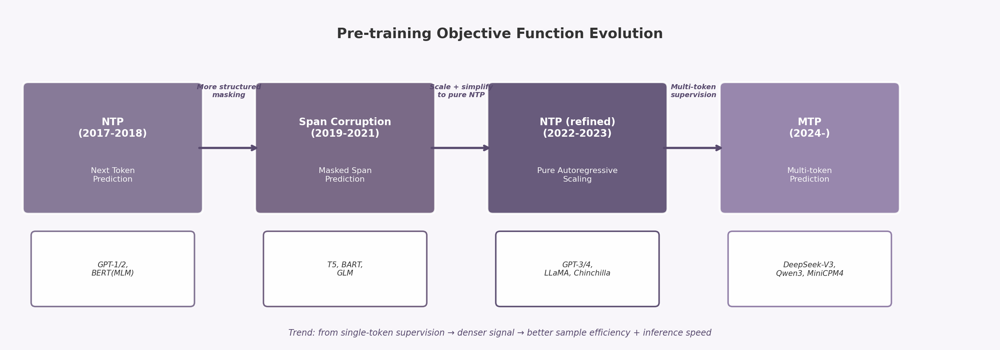

# 第23章 Multi-token Prediction：不只预测下一个 Token

自2017年Transformer诞生以来，next-token prediction（NTP，下一词预测）一直是预训练语言模型的核心目标函数。GPT系列、LLaMA、Chinchilla等主流模型均采用这一范式。NTP的简洁性和有效性不容否认，但其固有瓶颈也逐渐暴露。Multi-token Prediction（MTP，多词预测）正是针对这些瓶颈而提出的替代方案。2024年之后，MTP从学术研究快速转变为多个主流模型的标准配置。

## 23.1 Next Token Prediction 的优势与瓶颈

NTP的优势建立在三个基础之上。**第一，实现极简。** 模型只需一个输出头，每个位置预测序列中的下一个token。训练过程中所有位置并行计算损失，实现100%的token利用率。**第二，训练与推理形式统一。** 预训练和生成阶段使用完全相同的自回归分解，不存在任务形式上的错配。**第三，可扩展性已被验证。** GPT-4、Claude、Gemini等顶级模型均基于NTP训练，证明该范式足以支撑超大规模模型的能力涌现。

然而，NTP存在三个结构性瓶颈。

**样本效率低。** 每个训练位置只提供一个监督信号（下一个token的ID）。模型必须通过海量数据才能积累足够的梯度信号来学习长程依赖和全局结构。Chinchilla最优比例（约20 tokens/参数）的本质，部分源于这种稀疏的监督密度。假设一个序列有 $L$ 个token，NTP产生 $L$ 个监督信号。MTP若同时预测4个未来token，则产生约 $4L$ 个信号。监督密度提升4倍，不等价于数据量提升4倍（因为多步预测共享同一表示），但确实提供了更丰富的梯度信息。

**暴露偏差（Exposure Bias）。** 训练时模型始终看到真实前缀（teacher forcing），推理时却只能依赖自身生成的token。这种训练和推理的条件分布差异，导致错误会在生成过程中逐步累积 [^388^]。MTP对此有直接缓解作用：预测第 $t_{i+2}$ 或 $t_{i+3}$ 时，模型不能仅依赖真实前缀，而必须基于自身对中间token的预测进行推理。这种"自举式"训练更接近推理时的实际条件。

**局部模式偏好。** NTP的损失函数使模型高度关注短期共现统计（如"New York"后面接"City"的概率极高），而忽略需要多步推理才能到达的"困难"决策点 [^391^]。代码生成任务尤其受害：写出一个正确函数需要规划整个代码结构，而非逐个token的局部最优。

## 23.2 多 Token 预测为什么可能提升样本效率

MTP的核心思想很直接：给定位置 $i$ 的隐藏状态，不只预测 $t_{i+1}$，而是同时预测 $t_{i+1}, t_{i+2}, ..., t_{i+n}$ 这 $n$ 个未来token。

### Meta的并行预测架构

Gloeckle et al.（2024）在Meta发表了MTP的奠基性研究 [^390^]。他们在共享模型主干上附加 $n$ 个独立输出头，每个头负责预测一个未来位置的token。训练时并行计算所有预测头的交叉熵损失。关键在于：这些额外输出头只增加极少量的参数和计算量，因为共享了主干网络的全部表示能力。

**实验结果令人瞩目。** 在13B参数规模下，使用4-token预测的模型相比NTP基线：HumanEval代码生成通过率提升12%，MBPP提升17% [^390^]。提升最显著的领域是代码和结构化推理任务——恰好是NTP局部模式偏好最突出的短板。

代码任务为何受益最大？代码具有严格的语法结构和长距离依赖关系。一个正确的函数定义需要匹配括号、遵守缩进规则、保持变量名一致。这些约束跨越数十甚至数百个token，远超NTP的局部优化视野。MTP要求模型"提前看到"后续token的位置信息，这恰好训练了模型维护结构化状态的能力。

背后的通用机制是：MTP迫使模型在每个位置做出多个相互关联的未来预测。这要求隐藏状态编码更长程的上下文信息和全局结构，而非仅编码局部共现统计。研究表明，MTP尤其有利于归纳头（induction heads，即检测和重复序列模式的电路组件）的形成和算法推理能力的发展 [^391^]。归纳头是Transformer执行"复制-粘贴"式推理的核心机制，MTP通过增加预测目标的数量，为这类电路的形成提供了更丰富的训练信号。

### DeepSeek-V3的序列化实现

DeepSeek-V3采用了不同的MTP路径：序列化预测模块 [^360^]。它使用 $D$ 个串行的Transformer模块，每个模块预测一个额外的未来token。每个模块的输入包含前一深度的表示和目标位置token的嵌入，保持完整的因果链。MTP损失以加权平均形式并入总训练目标：

$$\mathcal{L}_{\text{MTP}} = \frac{\lambda}{D} \sum_{k=1}^{D} \mathcal{L}_{\text{MTP}}^{k}$$

DeepSeek-V3的配置为MTP深度 $D=1$，即每个位置除预测下一个token外，再预测一个额外token [^360^]。这种设计在训练成本和能力提升之间取得了平衡。与Meta方案的主要区别在于：DeepSeek-V3使用串行模块而非并行头，每个预测深度有独立的Transformer层，信息逐层传递。

## 23.3 多 Token 预测与推理速度的关系

MTP对推理加速的贡献来自其与推测解码（Speculative Decoding）的天然兼容性。

推测解码是一种无损推理加速技术 [^294^]。核心机制是：使用一个轻量"草稿模型"快速生成多个候选token，再由目标大模型并行验证这些候选。接受最长的正确前缀，拒绝的token重新生成。输出分布与直接运行目标模型完全一致。传统推测解码的瓶颈在于需要一个独立的草稿模型，增加了系统复杂性。

MTP训练的模型可以**直接使用自身的辅助预测头作为草稿模型**，实现"自推测解码"（Self-Speculative Decoding）[^391^]。额外预测头已经过联合训练，与主模型高度一致，无需任何外部草稿模型。Medusa框架进一步系统化了这一思路：为LLM附加多个解码头，并行预测多个后续token [^389^]。

MTP作为草稿模型的优势在于一致性。传统推测解码使用独立训练的小模型作为草稿，其分布与目标模型存在差异，导致候选token被拒绝率高。MTP的辅助头与主模型共享主干参数，分布高度对齐，因此候选接受率显著更高。DeepSeek-V3的第二个token预测接受率达85%-90%，意味着绝大多数情况下模型可以一次前进两步而非一步。

**实际加速效果显著。** Meta的实验表明，4-token预测训练的模型推理速度提升高达3倍，即使在大batch size下仍保持加速 [^390^]。DeepSeek-V3的MTP模块实现了1.8倍TPS（每秒token数）提升 [^360^]。聊天和摘要类工作负载通常加速2-3倍，长文本生成任务可达3-5倍 [^294^]。加速比与任务类型相关：结构化输出（代码、JSON）加速更明显，因为MTP的辅助头更容易预测这些场景中的确定性模式。

| 维度 | Next Token Prediction (NTP) | Multi-token Prediction (MTP) |
|:---|:---|:---|
| **训练监督密度** | 每个位置1个监督信号 | 每个位置 $n$ 个监督信号 |
| **样本效率** | 较低，需更多数据达到同等loss | 较高，HumanEval提升12%，MBPP提升17% [^390^] |
| **暴露偏差** | 严重（teacher forcing-only） | 缓解（多步预测强制规划）[^388^] |
| **推理方式** | 逐token串行生成 | 可结合推测解码批量验证 |
| **推理加速** | 基线速度 | 1.8-3x TPS提升 [^360^] [^390^] |
| **架构开销** | 单个输出头 | $n$ 个额外头/模块，参数量增加<1% |
| **代码任务表现** | 局部模式偏好强 [^391^] | 结构化推理能力提升最显著 |
| **主要代表** | GPT-4, LLaMA, Chinchilla | DeepSeek-V3, Qwen3, MiniCPM4 [^267^] |

上表对比了NTP与MTP在训练和推理两个阶段的本质差异。核心区别在于监督密度：MTP将每个位置的信号从1个扩展到 $n$ 个。这看似简单的改变，实则触达了预训练目标函数设计的一个深层命题——模型在每个位置应该学习什么。NTP让模型学会"下一个词最可能是什么"，MTP则要求模型学会"接下来的 $n$ 个词分别是什么"。后者迫使隐藏状态承载更长程的预测信息，等价于在不增加序列长度的情况下提升了有效上下文。推理加速是MTP的附带收益，但其根本价值在于训练阶段表示质量的提升。

## 23.4 它为什么成为 2024 之后值得关注的新目标函数

MTP的崛起不是孤立事件。它标志着预训练目标函数经历了一轮完整循环后的进化。

上图展示了2017年以来的目标函数演进路径。2017-2018年，NTP和MLM（Masked Language Modeling）并行发展，分别支撑GPT和BERT两大路线。2019-2021年，T5提出Span Corruption，将遮盖范围从单token扩展到连续片段，本质是增加每个预测位置的上下文信息。2022-2023年，随着GPT-3和Chinchilla的成功，纯自回归NTP重新成为主流——研究者发现简洁的NTP配合足够规模的数据和参数，足以驱动能力涌现。

2024年，MTP在纯NTP的基础上增加了关键一步：不修改底层架构，只增加预测头的数量，就将监督密度提升了数倍。这相当于在保持NTP简洁性的同时，吸收了Span Corruption"增加每个位置信息量"的思想精华。

**MTP的快速普及有明确的数据支撑。** 2024-2025年采用MTP的模型包括：DeepSeek-V3 [^267^]、MiniCPM4 [^255^]、Qwen3-Next [^370^]、Nemotron 3 Super [^370^]、MiMo（小米）[^264^]、GLM-4.5 [^290^]。这一名单覆盖了从中等规模到超大参数、从开源到闭源的不同模型系列。

MTP之所以值得关注的深层原因在于：**它让预训练目标更贴近推理时的真实需求。** 推理不是"预测下一个词"，而是"生成一段连贯的、多步的、结构化的输出"。NTP训练的模型在推理时必须逐token"在线规划"，MTP则在训练阶段就要求模型具备多步前瞻能力。

MTP还与数据效率危机形成呼应。高质量互联网文本预计在2026-2032年间耗尽，提升样本效率从"锦上添花"变为"生死攸关"。MTP以极低的架构开销（<1%额外参数）换取了12-17%的能力提升 [^390^]，是一种高性价比的训练策略。尤其对于那些无法负担无限数据采购和算力消耗的中小型团队，MTP提供了一条"用更聪明的目标函数替代更大量的数据"的可行路径。

MTP的研究仍在早期。关键开放问题包括：最优预测深度 $n$ 是否与模型规模正相关？MTP带来的提升主要来自更好的表示学习，还是纯粹的监督信号增多？在创意写作和多轮对话等开放式任务中，MTP的收益是否同样显著？

关于MTP的本质也存在学术争议。一派观点认为MTP确实培养了模型的"规划能力"，使其在隐藏状态中主动编码更长程的决策信息 [^388^]。另一派则认为提升主要来自监督信号的密度增加，而非模型获得了真正的多步推理能力——"更多监督信号"与"更好的表示"之间的因果关系尚未被完全厘清 [^391^]。这些问题的答案将决定MTP是目标函数演进的一个中间站，还是新范式的起点。

MTP的思想空间正在快速扩展。Token Order Prediction（TOP）提供了一种有趣的变体：不精确预测未来token的ID，而是对即将出现的token按接近程度排序 [^254^]。TOP仅需一个额外的unembedding层，参数量增加比MTP更少。在340M、1.8B和7B的多规模实验中，TOP整体优于精确MTP和NTP [^254^]。其核心洞察是：精确预测第 $k$ 个未来token极其困难（熵很高），但判断"哪些token即将出现"则相对容易。

ESP方法展示了另一条路径："训练无关"的多token预测 [^251^]。ESP在嵌入空间中直接合成mask token来引出多token分布，无需训练辅助头或修改模型权重。这种方法适用于计算受限环境——研究者可以在已训练好的NTP模型上即插即用，快速获得近似MTP的效果。

在特定领域，MTP的思想也被改造应用。语音建模中，LLM-Codec引入Future Token Prediction（FTP），预测多个未来语音token以改善压缩效率 [^250^]。视觉语言模型中，ViSpec将MTP应用于VLM的推测解码，加速多模态生成 [^286^]。这些跨领域迁移表明，"增加预测密度"是一种通用原则，不限于文本。

这些变体共同表明，MTP的思想空间远比"增加预测头"更广阔。从精确预测到排序预测，从训练时集成到训练后插件，从文本到语音和视觉，"多步前瞻"作为提升表示质量的原则正在多模态、多场景中扩散。
