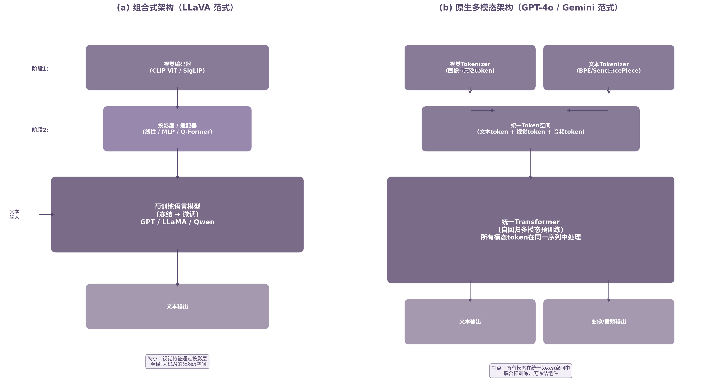

# 第25章 多模态预训练的并入

第24章讨论了长上下文预训练如何将文本处理窗口扩展到百万级token。当上下文足够长时，模型不仅需要处理纯文本，还要容纳图像、音频、视频等多种模态的序列化表示。多模态预训练由此成为大语言模型扩展的自然下一步。

## 25.1 文本模型如何扩展到图像、语音、视频

多模态预训练（Multimodal Pretraining）的核心问题可以概括为：如何将非文本模态转换为语言模型能够处理的表示形式，并在统一框架下实现跨模态理解与推理。当前存在两条泾渭分明的技术路线 [^347^]。

**图像标题对齐路线（Image-Caption Alignment）**将预训练的视觉编码器（如CLIP-ViT）与预训练的语言模型通过适配器连接。模型首先在大规模图文对数据上进行对齐训练，再在视觉问答（VQA）等任务数据上微调。这条路线以LLaVA-1.5、ShareGPT4V为代表 [^347^]，其本质是将视觉信息"翻译"成语言模型已经理解的token表示。

**交错图文多模态预训练路线（Interleaved Image-Text Pretraining）**则直接使用从网页抓取的交错图文文档进行端到端预训练。模型在标准的next-token prediction目标下，同时处理文本token和视觉token，代表性模型包括Kosmos-1、IDEFICS2和Flamingo [^347^]。这条路线更接近人类在图文混排环境中的学习方式。

| 技术路线 | 数据格式 | 训练策略 | 代表模型 | 核心优势 |
|:---:|:---:|:---:|:---:|:---:|
| 图像标题对齐 | 图像-标题对、VQA数据 | 视觉编码器冻结→投影层训练→端到端微调 | LLaVA-1.5, ShareGPT4V [^271^] | 利用强文本LLM，训练成本低 |
| 交错图文预训练 | 网页级交错图文文档 | 多模态数据联合预训练 | Flamingo, IDEFICS2 [^347^] | 视觉上下文与文本联合建模 |
| 统一Token预训练 | 量化后的离散视觉token+文本token | 统一自回归预训练 | Chameleon [^350^], GPT-4o [^358^] | 模态间深度融合，可扩展到新模态 |

上表中的三种路线代表了多模态预训练从"拼接"到"融合"的演进。图像标题对齐路线成本最低，LLaVA-1.5仅需学术级计算资源即可在公开数据集上达到最佳整体性能，甚至超越了80B参数的IDEFICS [^271^]。交错图文预训练路线需要更多数据和算力，但视觉token在训练期间流经模型的全部容量，信息损失更小 [^352^]。统一token预训练路线则将图像量化为离散视觉token（如Chameleon的8192条目码本），与文本token在同一序列中自回归处理 [^350^]，这是目前顶级闭源模型的共同选择。

将文本模型扩展到语音和视频模态时，核心思路相同但工程复杂度递增。**语音模态**通常先通过声学模型（如Whisper的编码器）转换为频谱图特征或离散音频token，再接入语言模型。音频采样率远高于文本token率，时间维度的压缩是关键挑战。**视频模态**需要同时处理空间和时间两个维度：空间上，每帧图像通过ViT编码为patch token；时间上，帧序列通过时序采样或3D卷积压缩。长视频（如Gemini 1.5 Pro处理的10.5小时视频 [^291^]）产生的token数量可达数十万，对第24章讨论的长上下文技术提出了直接需求。

多模态预训练的数据格式也经历了从简单到复杂的演进。最早的图文对（image-caption pairs）数据易于收集但信息单一；交错图文文档（interleaved image-text documents）保留了视觉上下文与文本的自然关联；视频-字幕对则增加了时间维度的对齐信号。GPT-4o和Gemini 1.5 Pro已经实现了文本、图像、音频和视频的统一处理 [^358^] [^289^]，其上下文窗口可支持10.5小时的视频或107小时的音频输入 [^291^]。这种跨模态统一处理的背后，是对所有模态进行统一token化表示的核心设计。

## 25.2 多模态Token与文本Token的对齐问题

不同模态的信息密度差异巨大。一个文本token可能对应一个词或子词，承载明确的语义；一个视觉patch token可能覆盖图像中的一小块区域，信息密度低得多。这种不对等导致了序列膨胀（Sequence Explosion）问题：高分辨率图像可能产生数千个视觉token，视频帧数增加更会使序列长度急剧增长 [^279^]。

对齐策略的演进可以分为两个层面。**预训练阶段对齐**的核心是缩小视觉特征与文本token空间的分布差距。早期方法使用简单的线性投影将CLIP视觉特征映射到LLM的嵌入空间 [^271^]。后续研究引入了更复杂的适配器：Q-Former通过可学习的查询token提取与文本最相关的视觉特征；Perceiver Resampler使用交叉注意力压缩视觉token数量；零初始化注意力层则保证训练初期视觉信号不会干扰已稳定的文本表示 [^269^]。

**Qwen2.5-VL**提出了动态视觉token化方案，引入多模态旋转位置编码（Multimodal RoPE），使图像和视频token在任意分辨率下保持空间和时间定位信息 [^279^]。高分辨率处理策略也持续进化：LLaVA-UHD、LLaVA-OneVision和InternVL 2.5采用AnyRes风格切片，将高分辨率图像切分为多个子图分别编码，再通过空间模式重组 [^279^]。

| 对齐方法 | 机制 | 压缩比 | 信息保留 | 计算开销 |
|:---:|:---:|:---:|:---:|:---:|
| 线性投影 | 矩阵乘法映射视觉→文本空间 | 无压缩 | 中等 | 最低 |
| Q-Former | 可学习查询向量提取关键特征 | 高 | 较高 | 中等 |
| Perceiver Resampler | 交叉注意力压缩token数 | 高 | 较高 | 中高 |
| 动态视觉token化 (Qwen2.5-VL) [^279^] | 自适应分辨率编码 | 中等 | 高 | 中等 |
| 离散视觉token (Chameleon) [^350^] | 码本量化图像为统一token | 内置压缩 | 依赖码本质量 | 需训练tokenizer |

上表揭示了对齐设计中的基本权衡：压缩比越高，序列越短、推理越快，但信息损失风险越大。线性投影最简单但无压缩能力；离散视觉token化将压缩问题前置到tokenizer训练阶段，一旦码本训练完成，后续处理与文本token完全一致。这种设计使视觉token对LLM不再是分布外的（out-of-distribution），从根本上消除了适配器路线中"翻译"带来的信息损失 [^352^]。

**SFT阶段的对齐**则关注如何提升模型在特定多模态任务上的执行能力。核心策略包括：构建高质量视觉指令跟随数据集，设计视觉接地对话（visual grounded dialogue）使模型能够精确定位图像区域，以及多语言多模态指令微调覆盖不同语言场景 [^269^]。SFT阶段的关键发现是：视觉指令微调在提升多模态能力方面的作用被低估了——LLaVA-1.5通过改进SFT数据的质量和多样性，而非增加对齐预训练的数据量，实现了性能的显著提升 [^271^]。

对齐问题还涉及推理效率的权衡。视觉token数量直接影响推理时的计算和内存开销。高分辨率图像可能产生2000-8000个视觉token，是文本提示的数倍。视觉token压缩技术（如基于不确定性的动态token丢弃）和动态分辨率方法（如Q-Zoom根据用户指令决定分辨率）成为重要的工程优化方向 [^279^]。

## 25.3 多模态Scaling Law的基本问题

文本模型的Scaling Law研究已经相当成熟：损失是参数量、数据量和计算量的幂律函数。多模态Scaling Law则是正在形成中的前沿方向，核心问题包括三个维度。

**模态间的数据效率差异。** 文本token的利用率远高于图像token。在自回归预训练中，每个文本位置都参与损失计算；而视觉token通常只作为输入条件，不提供预测目标。Qwen2-VL通过系统缩放模型规模（2B、8B、72B参数）和数据规模，验证了视觉语言模型的scaling规律仍然服从幂律分布 [^292^]，但最优的模态数据混合比例尚不清楚。

**数据混合比例的scaling。** 多模态预训练需要同时处理文本、图像-文本对、交错图文文档、OCR数据、视频-字幕对等。不同模态的数据量和质量差异巨大：文本数据规模最大，视频数据最稀缺。模态干扰（Modality Interference）现象表明，多模态联合训练可能导致某些模态性能下降，需要精心设计的数据混合策略 [^279^]。

**计算最优分配的开放问题。** 文本模型的Chinchilla最优给出每参数约20个token的配比。多模态场景下，视觉token与文本token的计算成本不同，统一计算最优比例尚未建立。DeepSeek-VL2将MoE架构引入多模态预训练，在交错图文、图像标题、OCR、VQA等混合数据上训练，27B模型通过专家偏置校正步骤改善负载均衡 [^288^]。这是MoE与多模态交叉的早期实践——利用稀疏激活平衡多模态计算成本。

**模态间能力迁移的规律**是另一个开放问题。文本预训练中观察到的涌现能力（emergent abilities）在多模态场景下是否仍然出现？视觉理解能力是否随模型规模线性增长，还是存在类似的相变阈值？Qwen2-VL的scaling实验（2B→8B→72B）提供了初步证据：视觉语言模型的性能随规模增长呈现近似幂律关系，但不同视觉任务（OCR、目标检测、图像描述）的scaling曲线斜率不同 [^292^]。这意味着不同视觉能力对模型规模的敏感度存在差异。

多模态Scaling Law的研究空白意味着当前的多模态模型训练仍大量依赖经验调参。数据混合比例、视觉token压缩率、模态间训练信号的平衡，这些关键超参数缺乏理论指导。这一现状与2020年前文本模型Scaling Law尚未建立时的情形相似——经验主义和系统实验是主要的推进方式。

## 25.4 原生多模态模型与组合式多模态模型的区别

组合式与原生多模态的划分是多模态预训练中最关键的架构抉择。

**组合式模型（LLaVA范式）**保留一个强大的预训练文本LLM作为核心，通过可训练的投影层或适配器将视觉特征注入。训练通常分两阶段：第一阶段冻结LLM和视觉编码器，只训练投影层进行视觉-语言对齐；第二阶段解冻LLM，在高质量指令数据上端到端微调 [^271^]。这种方法的优势是成本低、可复现性强——任何开源LLM都可以通过添加适配器快速获得视觉能力。LLaVA-1.5（7B参数）在学术计算条件下超越了80B参数的IDEFICS，直接挑战了"大规模多模态预训练必不可少"的假设 [^271^]。

**原生多模态模型（GPT-4o/Gemini范式）**从预训练阶段就在多模态数据上联合训练所有参数，不依赖任何冻结组件。Chameleon采用早期融合（early-fusion）架构：图像被量化为离散视觉token，与文本token混合成统一序列，由单一Transformer自回归处理 [^350^]。Gemini 1.5 Pro基于MoE架构，原生支持音频、视觉、文本和代码输入的交错处理 [^289^]。GPT-4o实现了自回归omni架构，所有模态由统一神经网络端到端处理 [^358^]。

上图对比了两种架构的数据流差异。组合式架构中，视觉信号必须通过投影层"翻译"后才能被LLM理解，这个翻译层是信息瓶颈。原生架构中，所有模态在统一token空间中表示，视觉token和文本token对模型而言没有本质区别。

| 维度 | 组合式（LLaVA范式） | 原生多模态（Gemini/GPT-4o范式） |
|:---:|:---:|:---:|
| 架构 | 视觉编码器 + 投影层 + LLM | 统一Transformer处理所有模态 |
| 训练方式 | 文本LLM预训练 → 多模态微调 | 多模态数据从头联合预训练 |
| 模态融合时机 | 晚期融合（通过投影层） | 早期融合（统一token空间） |
| 视觉表示 | 连续特征（CLIP/SigLIP） | 离散token或连续特征统一处理 |
| 核心优势 | 训练成本低，可快速复用新LLM | 模态间深度耦合，性能上限更高 |
| 核心劣势 | 视觉token对LLM是分布外的 | 训练成本极高，需要海量多模态数据 |
| 代表模型 | LLaVA, Qwen2.5-VL [^279^] | GPT-4o [^358^], Gemini [^289^], Chameleon [^350^] |

两种范式的选择本质上是对训练成本与性能上限的权衡。组合式模型适合资源受限的团队快速构建多模态能力；原生多模态模型则需要大规模数据和算力投入，但能够实现真正的跨模态推理——例如理解图像中的文字并将其与对话上下文关联，或者在视频序列中追踪物体运动并回答时序问题。

**推理效率维度**进一步放大了两种范式的差异。组合式模型在推理时需要同时加载视觉编码器、投影层和LLM三个组件，内存占用较大。原生多模态模型虽然只需一个统一架构，但视觉token的数量会线性增加注意力计算的复杂度。MoE架构为多模态推理提供了一种潜在的优化路径：DeepSeek-VL2将MoE应用于多模态场景，27B总参数的模型通过专家偏置校正步骤改善负载均衡，在保持推理效率的同时扩展模型容量 [^288^]。这种"MoE+多模态"的交叉方向可能在未来成为高效多模态模型的标准配置。

从技术演进趋势看，顶级闭源模型已全部转向原生多模态路线 [^352^]。开源社区则呈两极分化：学术研究以组合式为主（成本低、可解释性强），但Qwen2.5-VL等开源模型也在向更深的联合训练靠拢。LLaVA-OneVision通过三阶段训练（语言-图像对齐、高质量知识学习、视觉指令微调）和分辨率感知学习，在单图、多图和视频任务间实现了统一 [^279^]，这可以视为两种范式之间的中间路线。

多模态预训练正在成为大语言模型的标准配置而非可选扩展。从LLaVA的低门槛适配到GPT-4o的统一架构，多模态能力的发展轨迹与文本模型的演进规律一致：早期通过模块化拼接快速验证可行性，最终走向端到端的统一预训练。二者的根本差异在于，组合式模型将多模态视为文本模型的"插件"，而原生多模态模型将所有模态视为同一个自回归预测任务的输入——无论输入是文本token、视觉token还是音频token，模型只关心在一个统一的表示空间中预测下一个token。
