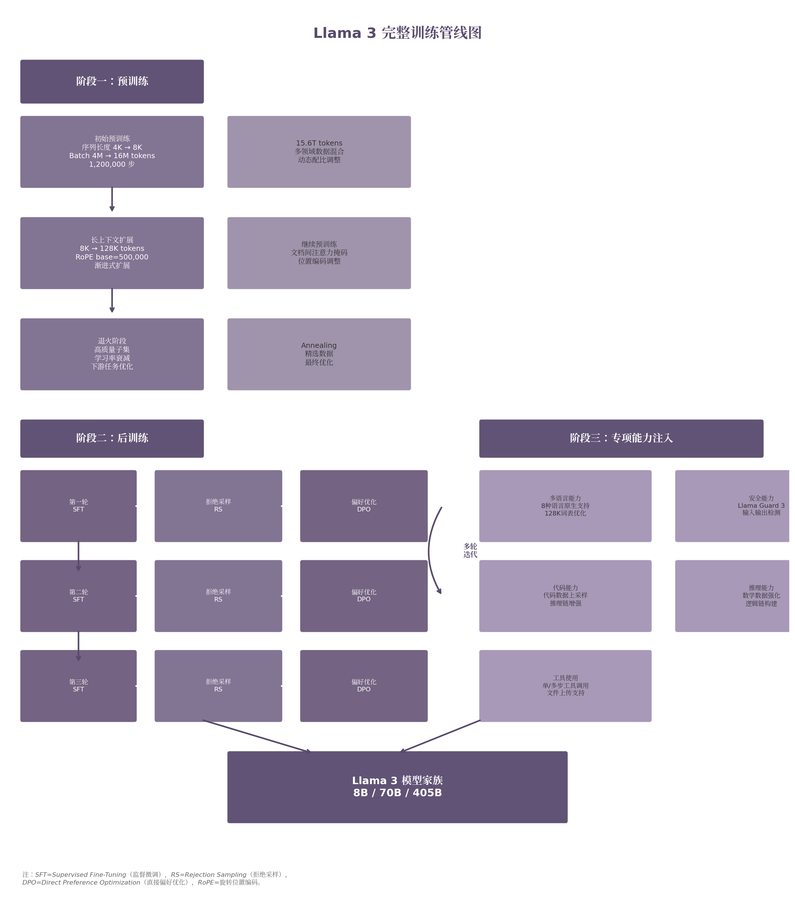

# 第26章 Llama 3 系列：开源大模型训练配方的系统化

2024年7月，Meta发布Llama 3系列模型。这是开源大模型发展史上的一个分水岭。Llama 3不是单点技术突破的产物，而是一套系统化训练配方的成熟表达。405B参数规模、15.6T tokens训练数据、128K上下文窗口——这些数字背后是一个核心信念：开源模型可以通过精细化的数据工程和训练流程设计，逼近甚至匹敌最顶尖的闭源模型 [^414^]。

Llama 3的发布标志着开源社区从"追赶者"向"并行者"转变。DeepSeek-V3、Qwen3等后续模型进一步巩固了这一趋势。理解Llama 3的训练配方，就是理解开源大模型如何在2024-2025年间实现能力跃迁的关键密码。

## 26.1 大规模高质量数据的重要性

Llama 3的训练数据总量达到15.6T tokens，是Llama 2（1.8T tokens）的约8.7倍 [^414^]。这种数量级的跃升并非简单的数据堆叠，而是建立在系统化的质量评估和动态配比调整之上。数据来源于公开可用的网页文本、代码仓库、书籍和学术论文，经过多层清洗和去重处理。

**数据质量的评估维度。** Llama 3的数据筛选采用多维度质量评分体系，涵盖语言正确性、信息密度、教育价值和领域多样性。每条数据在进入训练集前都经过质量打分，低质量子集被系统性降采样。质量评分的核心指标包括语法正确性（基于语言模型困惑度）、信息重复度（与已有数据的相似度）、主题多样性和结构完整性。

这种策略与FineWeb-Edu的发现一致：经过严格过滤的1.3T高质量tokens可以超越10倍规模的原始数据 [^396^]。Llama 3的实践经验进一步表明，数据质量的提升存在明显的边际递减效应——从"低质量"提升到"中等质量"的收益远大于从"中等质量"提升到"高质量"的收益。因此，数据pipeline的设计应优先剔除尾部低质量数据，再对头部数据进行精细化筛选。

**动态配比调整。** Llama 3在训练过程中实时调整数据混合比例，这种动态策略体现为五个关键维度 [^400^]：第一，非英语数据比例在训练期间逐步增加，让模型先建立稳定的英语基础再扩展多语言能力；第二，数学数据被上采样（upsampling），以提升数学推理能力；第三，代码数据比例专门增加，为程序理解和生成能力打基础；第四，预训练后期添加更多近期网络数据，推进知识截止时间；第五，持续识别并降低低质量子集的采样比例。

动态配比的背后是一个关键洞察：不同能力的学习效率在不同训练阶段存在差异。早期阶段应以通用语言数据为主，帮助模型建立稳定的语法和语义表示；中期阶段逐步增加代码和数学数据，注入结构化推理模式；后期阶段引入更多领域专业数据和近期信息，填充知识空白。

**知识截止时间的处理。** 传统预训练模型的知识被冻结在训练数据的时间点上。Llama 3通过在预训练后期引入更新的网络数据，部分缓解了这一限制。这一策略后来被Qwen3等模型继承并扩展——Qwen3使用自研模型进行大规模PDF文档识别和文本精炼，从多模态数据源中提取额外数万亿高质量tokens [^419^]。

Llama 3的数据配方揭示了一个深层趋势：数据工程从"后勤支持"升级为"核心竞争力"。在架构日趋标准化的背景下，数据筛选、配比和动态调整成为模型差异化的首要来源。同样使用Transformer架构，不同的数据pipeline可以产出能力迥异的模型。

## 26.2 长上下文继续预训练

Llama 3的上下文窗口最高可达128K tokens，这一能力并非一步到位，而是通过渐进式继续预训练实现的。整个预训练流程分为三个阶段 [^400^]：

**阶段一：初始预训练。** 使用序列长度4K启动，batch size为4M tokens。在252M tokens后翻倍到8K序列长度和8M batch size。在2.87T tokens后再次翻倍到16M batch size。这种渐进式增长让模型在稳定学习基础语言模式后再接触更长序列。

**阶段二：长上下文扩展。** 从8K逐步扩展到128K，采用继续预训练而非从头训练的方式。关键的技术调整包括：将RoPE（旋转位置编码，Rotary Position Embedding）的base frequency从默认值大幅提高到500,000，以更好支持长距离依赖建模 [^414^]；引入文档间注意力掩码，防止同一序列内不同文档之间的自注意力干扰。

**阶段三：退火。** 在高质量数据子集上进行最终优化，学习率从峰值8×10^-5经余弦衰减降至8×10^-7。这一阶段改善模型在特定下游任务上的表现，相当于对高质量数据进行"精修"。

渐进式上下文扩展策略的优势在于稳定性。直接从4K跳到128K会导致训练loss剧烈波动，而分阶段扩展让模型在每个长度区间充分适应位置编码的语义空间。RoPE的base frequency从默认值10,000提升到500,000是一个关键调整——更大的base值让位置编码的旋转角度随距离变化更加缓慢，从而使模型能更好地区分长距离token之间的相对位置关系。

这一方法后来被Qwen3继承，Qwen3在第三阶段将序列扩展到32,768 tokens，使用ABF（Attention-Base-Frequency调整）、YARN和Dual Chunk Attention的组合方案 [^399^]。ABF将RoPE base frequency进一步推高到1,000,000，YARN通过温度缩放扩展位置编码的有效范围，Dual Chunk Attention则解决超长序列中注意力分散的问题。

长上下文能力对Llama 3的实际价值体现在三个场景：整本书或长论文的端到端处理、代码仓库级别的跨文件理解、多轮对话历史中的长期记忆保持。这些场景中，模型不仅需要"看到"长序列中的每个token，还需要理解远距离token之间的语义关联。128K上下文配合渐进式训练，让Llama 3在" needle-in-a-haystack "测试中实现了接近100%的召回率——即在超长文档中准确定位特定信息的能力。

## 26.3 多语言、代码、推理与工具使用能力

Llama 3不是通用能力的简单放大，而是在特定能力维度上进行了针对性的数据配比和训练设计。

**多语言支持。** Llama 3原生支持8种语言：英语、德语、法语、意大利语、葡萄牙语、印地语、西班牙语和泰语 [^414^]。多语言能力通过128K大词表实现，其中包含100K tiktoken和28K非英语token。这一设计将字符压缩率从Llama 2的3.17字符/token提升到3.94字符/token [^414^]，意味着同样的序列长度可以编码更多内容。

Llama 3的多语言策略相对保守——仅覆盖8种语言，而非Qwen3的119种 [^419^]。这反映了一个设计权衡：Llama 3优先保证覆盖语言的质量和深度，而非广度。后续开源模型在这一维度上展开了激烈竞争。

**代码与推理能力。** 代码数据在Llama 3训练集中占有显著比例，且通过后训练阶段的专门优化进一步强化。Llama 3的后训练流程采用多轮迭代模式：SFT（监督微调，Supervised Fine-Tuning）→ RS（拒绝采样，Rejection Sampling）→ DPO（直接偏好优化，Direct Preference Optimization），重复多轮 [^414^]。

拒绝采样的工作原理是：对同一输入让模型生成多个候选回答，通过奖励模型或规则验证器对候选进行排序，仅保留最高质量的回答用于下一轮训练。这种方法有效提升了模型输出的平均质量，因为它直接增加了高质量样本在训练集中的比例。DPO阶段则直接用偏好对比替代复杂的RL（强化学习）算法——给定一个问题的"优选回答"和"劣选回答"，DPO通过简单的对比损失让模型学会偏向优选回答，无需维护额外的价值网络或策略网络。

**工具使用能力。** Llama 3在后训练阶段集成了工具调用能力，支持单步工具使用、多步工具使用和文件上传 [^414^]。单步工具使用指模型在一次调用中完成工具选择和参数填充；多步工具使用指模型可以串联多个工具调用，将前一步的输出作为后一步的输入。文件上传支持则让模型能够处理用户上传的文档内容，扩展了输入模态的边界。

这一设计让模型从"纯文本生成器"转变为"可执行动作的Agent"，为后续的Agent应用生态奠定基础。工具能力的注入并非在预训练阶段完成，而是通过后训练阶段的专门数据集实现。这些数据集包含大量的工具调用示例，覆盖API调用、数据库查询、代码执行等多种工具类型。

Llama 3系列包含三个参数版本，其规格对比如下：

| 配置项 | 8B | 70B | 405B |
|:---:|:---:|:---:|:---:|
| 层数 | 32 | 80 | 126 |
| 模型维度 | 4,096 | 8,192 | 16,384 |
| FFN维度 | 14,336 | 28,672 | 53,248 |
| 注意力头数 | 32 | 64 | 128 |
| KV头数 | 8 | 8 | 8 |
| 峰值学习率 | 3×10^-4 | 1.5×10^-4 | 8×10^-5 |
| 词表大小 | 128K | 128K | 128K |
| 上下文窗口 | 128K | 128K | 128K |
| 预训练数据量 | 15.6T | 15.6T | 15.6T |

*数据来源：Llama 3技术报告 [^414^]*

三个版本采用统一架构设计理念，仅在深度和宽度上按比例缩放。所有版本均使用分组查询注意力（GQA，Grouped-Query Attention），将KV头固定为8个，在保持性能的同时显著减少KV缓存、提升推理速度 [^414^]。学习率随规模增大而降低，这是大模型训练中的标准实践——更大模型需要更保守的更新步长以维持训练稳定性。

值得注意的是，Llama 3**刻意选择密集架构而非MoE**（混合专家，Mixture of Experts）。Meta的理由直接了当：密集架构的训练稳定性更高，后训练流程更简单可控 [^414^]。这一选择与同期的Mixtral（MoE架构）和后续的DeepSeek-V3（MoE架构）形成鲜明对比，也说明架构选择仍然取决于团队的工程优先级和稳定性偏好。

后训练方面，Llama 3选择了相对简单的SFT+RS+DPO流程，而非更复杂的RL算法。这一决策基于一个实用主义考量：在规模化的工业场景中，训练流程的可控性和可复现性比理论上的最优性更重要。

## 26.4 开源模型如何逼近闭源模型

Llama 3 405B在多项基准测试上达到GPT-4级别性能 [^414^]。这一事实本身即标志着开源与闭源竞争格局的根本性转变。

**能力差距的缩短速度正在加快。** GPT-3（2020年，闭源）到LLaMA-1（2023年，开源）的追赶用了约3年。OpenAI o1（2024年9月）到DeepSeek-R1（2025年1月）的追赶仅用了约3个月 [^298^]。开源社区通过模型蒸馏、社区微调和快速迭代，正在将"前沿能力独占期"压缩到以月为单位。

| 闭源模型 | 发布时间 | 开源对应模型 | 发布时间 | 差距时长 |
|:---:|:---:|:---:|:---:|:---:|
| GPT-3 | 2020.06 | LLaMA-1 | 2023.02 | ~2.5年 |
| GPT-4 | 2023.03 | Llama 3 405B | 2024.07 | ~1.3年 |
| Claude-3.5-Sonnet | 2024.06 | DeepSeek-V3 | 2024.12 | ~6个月 |
| OpenAI o1 | 2024.09 | DeepSeek-R1 | 2025.01 | ~3个月 |

*数据来源：各模型官方发布信息与技术报告 [^298^][^414^][^356^][^457^]*

这一缩短趋势的动力来源有三：第一，开源模型可以直接从闭源模型蒸馏知识——DeepSeek-V3就从DeepSeek-R1蒸馏了推理能力 [^356^]；第二，开源生态的社区微调产生了大量专用变体，覆盖闭源模型难以深耕的垂直领域；第三，训练配方和方法论一旦公开，就可以被快速复制和改进。

**Llama 3的三个核心设计原则**构成了开源模型逼近闭源的方法论基础 [^414^]：

**数据优先。** Llama 3将性能提升的首要驱动力放在数据质量和多样性上，而非架构创新。405B参数的密集架构本质上是一个"放大器"——它将高质量数据的模式学习得更充分、更稳定。这种策略降低了开源社区复现前沿模型的门槛：不需要发明新架构，只需要优化数据 pipeline。

**规模扩展。** Llama 3在可控范围内最大化了训练规模——405B参数 × 15.6T tokens，总计约3.8×10^25 FLOPs的预训练计算量 [^414^]。这一规模是最大Llama 2的约50倍。规模扩展的收益在Llama 3上得到了充分验证：更大规模的模型不仅在基准测试上得分更高，还展现出更好的工具使用能力和安全对齐表现。

**管理复杂性。** Llama 3选择简单、可扩展的训练流程，刻意避免引入不必要的复杂度。密集架构替代MoE，SFT+RS+DPO替代复杂的RL算法，这些选择都服务于同一个目标——降低实验失败的风险，提高训练成功率。在工业规模的模型训练中，一次失败的实验可能意味着数百万美元的损失和数周的时间浪费。

**训练管线图。** 下图展示了Llama 3的完整训练流程，包括预训练、长上下文扩展、退火和后训练的多阶段设计：

上图的核心信息是：Llama 3的训练是一个多阶段、多轮迭代的系统工程。预训练阶段建立基础语言和知识能力，后训练阶段通过SFT→RS→DPO的循环迭代逐步提升指令遵循、推理和对齐能力。多轮迭代是关键——每一轮都在前一轮的基础上使用新筛选的数据进行进一步 refinement。

这一管线的设计哲学深刻影响了后续开源模型。Qwen3继承了分阶段预训练的思想，将流程扩展为"通用阶段→推理阶段→长上下文阶段"的三阶段设计 [^419^]。DeepSeek-V3则在保持工程简洁性的同时，通过MoE架构和FP8训练实现了更高的计算效率 [^356^]。

**开源生态的力量不可忽视。** Llama 3开源后，社区迅速产生了数千个微调和量化版本，覆盖医疗、法律、编程、教育等垂直领域。这种"一次训练、千次适配"的模式是闭源模型无法复制的。Hugging Face平台上的Llama 3衍生模型数量在发布后三个月内突破1万个，形成了自GPT-2以来最大规模的开源模型生态。

闭源模型仍然保持一定优势：前沿能力的独占期（尽管越来越短）、更完整的API生态和商业化支持、以及在某些安全敏感场景下的可控性。但随着开源模型的能力差距持续缩小，这些优势的护城河正在变浅。

Llama 3的发布标志着开源大模型训练配方的系统化。它不是某一项技术的胜利，而是数据工程、训练流程设计和工程管理的综合能力体现。在Llama 3之后，"训练配方"成为开源模型竞争的核心维度——同样的Transformer架构，不同的数据配比和训练流程，可以产生截然不同的能力表现。这一理念将在后续章节中反复验证：DeepSeek-V3用MoE+FP8重新定义训练效率，Qwen3用实例级数据优化和混合思考模式开辟新方向。
