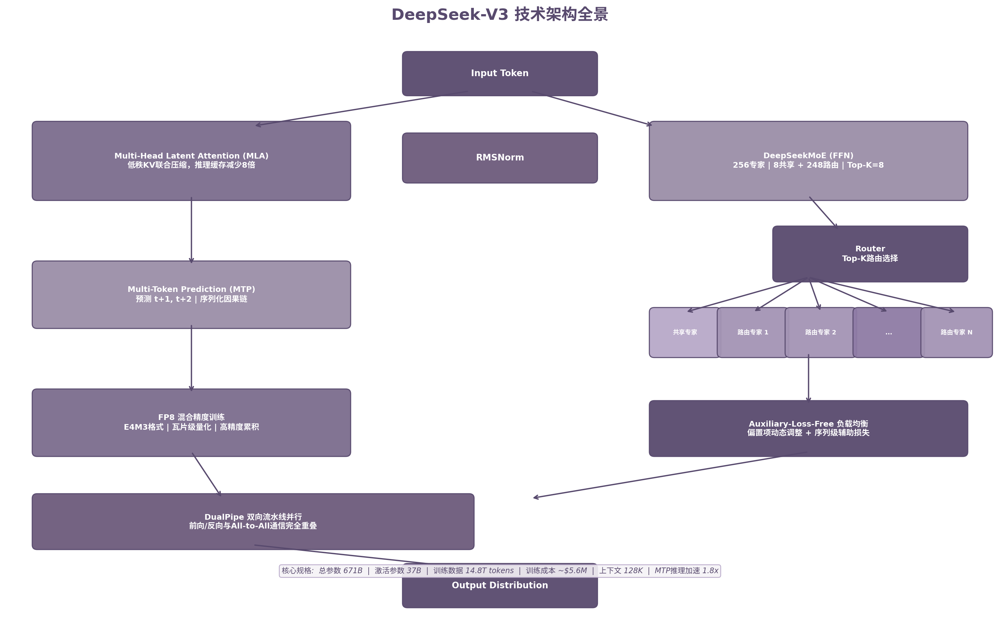

# 第27章 DeepSeek-V3：高效训练、MoE 与 FP8 的代表案例

2024年12月，DeepSeek-V3 发布。671B 总参数、37B 激活参数、14.8T 训练 token、仅需 2.788M H800 GPU 小时（约 557.6 万美元）[^356^]。这组数字打破了当时大模型训练的成本预期。作为对比，GPT-4 的训练成本估算在 6000 万至 1 亿美元之间 [^514^] [^515^]，差距接近两个数量级。

DeepSeek-V3 不是渐进式改良。它在架构（MLA + DeepSeekMoE）、训练精度（FP8）、目标函数（MTP）和工程系统（DualPipe）四个维度同时推进，证明超大规模 MoE 模型的高效训练是可行的。本章拆解其技术内核，评估各项创新对预训练范式的实际影响。

## 27.1 671B 总参数与稀疏激活思想

### 稀疏激活的核心逻辑

MoE（Mixture of Experts，混合专家）的本质是**条件计算**：每个输入 token 只激活模型参数的一个子集，而非全部。总参数量决定模型容量上限，激活参数量决定单次前向传播的计算成本 [^456^]。DeepSeek-V3 的总参数/激活参数比约为 18:1（671B / 37B），这意味着它以 37B 密集模型的推理成本，承载了 671B 参数的知识容量。

这一设计的经济性体现在训练成本上。DeepSeek-V3 的预训练阶段消耗 2.664M GPU 小时，后训练仅需 0.1M GPU 小时 [^356^]。即使加上数据清洗、实验迭代等间接成本，总训练费用仍控制在 600 万美元以内。这一数字向业界传递了一个信号：前沿模型的训练成本并非不可压缩。

MoE 的效率优势可以从 FLOPs 角度理解。671B 参数的密集模型处理一个 token 需要约 1342B FLOPs（假设每次前向传播每参数 2 FLOPs）。DeepSeek-V3 仅激活 37B 参数，单次前向传播约 74B FLOPs，计算量减少约 18 倍 [^298^]。训练总成本与激活参数量和训练数据量的乘积成正比，因此稀疏激活直接转化为成本降低。

### 与前沿模型的成本对比

| 模型 | 架构 | 总参数 | 激活参数 | 训练成本（估算） | 训练数据 |
|:---|:---|---:|---:|---:|---:|
| GPT-4 [^514^] | Dense | ~1.8T | ~1.8T | $60M–$100M | ~13T tokens |
| LLaMA 3 405B [^414^] | Dense | 405B | 405B | ~$40M（16K H100） | 15.6T tokens |
| DeepSeek-V3 [^356^] | MoE | 671B | 37B | ~$5.6M | 14.8T tokens |
| Qwen3 235B-A22B [^419^] | MoE | 235B | 22B | 未公开 | 36T tokens |

上表的关键不在绝对数字的精确性——各家 GPU 采购价格、数据中心折旧策略不同，成本口径存在差异——而在数量级关系。DeepSeek-V3 以 LLaMA 3 405B 约 1/7 的训练成本，达到了与之相当甚至在数学和代码任务上超越的性能。这一性价比突破主要来自三个因素：MoE 稀疏激活减少了单位 token 的计算量；FP8 低精度训练降低了显存和通信开销；DualPipe 流水线并行几乎消除了通信等待时间 [^360^]。

### 训练稳定性

超大规模 MoE 训练面临一个长期难题：专家路由的不稳定性可能导致训练过程崩溃。传统 MoE 模型常出现"专家崩溃"——少数专家接管绝大多数 token，其余专家闲置，模型容量实际利用率大幅下降 [^448^]。这种崩溃一旦发生，往往伴随损失尖峰（loss spike），需要回滚到之前的检查点重新训练，单次故障可能造成数十万美元的计算浪费。

DeepSeek-V3 的解决方案是辅助损失自由（Auxiliary-Loss-Free）的负载均衡策略，辅以序列级辅助损失防止极端不平衡 [^356^]。这一组合策略的效果是：整个训练过程未出现不可恢复的损失尖峰或回滚 [^358^]。在 14.8T tokens 的完整训练周期中保持稳定，证明 MoE 架构的工程可靠性已经达到生产级标准。

## 27.2 MLA、DeepSeekMoE 与负载均衡

### Multi-Head Latent Attention（MLA）

注意力机制是 Transformer 的计算和显存瓶颈。标准 Multi-Head Attention 中，每个注意力头独立维护 Query、Key、Value 三个投影矩阵。推理时，Key 和 Value 需要缓存（KV Cache），其大小随序列长度线性增长。

MLA（Multi-Head Latent Attention）通过**低秩联合压缩**解决这个问题。标准 MHA 中，每个注意力头的 Key 和 Value 分别经过独立的投影矩阵 $W_K$、$W_V$ 映射到高维空间。MLA 将这一步替换为：先将输入投影到低维潜在向量 $c$，推理时只缓存 $c$；需要计算注意力时再将 $c$ 投影回 Key 和 Value 的空间。这减少了 KV 缓存的维度，从 $d_{head} \times n_{heads}$ 降低到潜在空间的维度。推理时只需缓存压缩后的潜在向量，而非完整的 Key/Value 张量。DeepSeek-V2 首次验证了这一设计，DeepSeek-V3 继承并沿用 [^356^]。KV 缓存压缩倍数约为 8 倍，在长序列场景下（如 128K 上下文），缓存占用从数十 GB 降至数 GB，显著降低了推理硬件门槛。

### DeepSeekMoE 的专家设计

DeepSeek-V3 的 MoE 层包含 256 个专家：1 个始终激活的共享专家 + 1 个始终激活的隔离共享专家 + 254 个路由专家。每个 token 激活 8 个路由专家，加上 2 个共享专家，共 10 个专家参与计算。

**细粒度专家分割**是 DeepSeekMoE 区别于传统 MoE 的关键。它将大专家拆分为多个小专家，增加路由组合的空间表达能力。共享专家则负责捕获跨任务的通用知识，避免路由专家重复学习共性模式 [^360^]。

### Auxiliary-Loss-Free 负载均衡

传统 MoE 在损失函数中增加辅助损失项，鼓励各专家接收均衡数量的 token。但这引入了性能与负载均衡之间的 trade-off：辅助损失过强会扭曲路由决策，损害模型性能；过弱则无法防止专家崩溃 [^448^]。

DeepSeek-V3 的方案是：为每个专家引入一个**可学习的偏置项** $b_i$。路由时，偏置项加到原始亲和度分数上确定 Top-K 选择；门控值（决定专家输出权重）仍使用原始亲和度分数 [^356^]。训练过程中，过载专家的偏置减小 $\gamma$，欠载专家的偏置增加 $\gamma$，实现动态平衡。同时增加一个轻量的序列级辅助损失 $L_{Bal} = \alpha \sum f_i P_i$（$f_i$ 为专家负载频率，$P_i$ 为平均路由概率），作为防止极端情况的保险 [^356^]。

这一策略的核心优势在于：偏置项只影响"哪个专家处理哪个 token"的路由决策，不影响专家输出在最终结果的加权比例。因此负载均衡的优化目标与模型性能目标解耦，避免了传统辅助损失的性能损耗 [^360^]。

### Node-Limited 路由与通信优化

每个 token 最多发送到 M 个计算节点。节点选择基于该节点上所有专家亲和度分数之和。路由限制在少量节点内，使得跨节点的 All-to-All 通信量可控。DeepSeek-V3 的跨节点通信采用 IB（InfiniBand）传输 + NVLink 节点内转发的两级策略 [^356^]。

DualPipe 是工程优化的核心创新。传统流水线并行中，前向传播和反向传播交替执行，每个微批次之间产生"流水线气泡"（bubble time），GPU 处于空闲等待状态。DualPipe 采用**双向流水线**设计：前向和反向计算同时进行，前向计算需要的通信与反向计算需要的通信重叠调度。配合 MTP 模块产生的额外计算密度，DualPipe 仅使用 20 个 SM（流式多处理器）处理通信，实现近乎完全的计算-通信重叠 [^360^]。在 2048 张 H800 GPU 的集群上，DeepSeek-V3 的 MFU（Model FLOPs Utilization）达到 34.7%——对于超大规模 MoE 模型，这是极高的效率水平。

## 27.3 FP8 训练的意义：更低成本的大规模预训练

### 从 FP32 到 FP8 的精度演进

大模型训练的计算精度经历了 FP32 → BF16/TF32 → FP8 的演进。精度降低意味着同样算力下可以处理更大规模的模型或更多数据。FP8 使用 8 位浮点数（E4M3 格式：4 位指数 + 3 位尾数），相比 BF16（16 位）显存和通信带宽需求减半 [^356^]。

FP8 的挑战在于动态范围不足。激活值、权重和梯度中存在的异常值（outliers）会导致量化精度损失 [^507^]。此前 FP8 训练主要在中小规模模型上验证，超大规模模型上的可行性尚未证实。

### DeepSeek-V3 的 FP8 方案

DeepSeek-V3 首次在 671B 参数规模的 MoE 模型上成功验证了全流程 FP8 训练。其关键技术包括：

**细粒度瓦片级量化**。采用两种粒度的分组策略：1×128（per-token）用于激活值量化，128×128（per-block）用于权重矩阵量化。小分组尺寸有效扩展了 FP8 的动态范围，抑制异常值的影响 [^356^]。

**高精度 CUDA 核心累积**。FP8 GEMM 的核心操作使用高精度（FP32）累加器完成矩阵乘法累积。这一设计将 FP8 训练与 BF16 基线的相对损失误差控制在 0.25% 以内，处于训练随机性的可接受范围内 [^356^] [^507^]。

**混合精度策略**。并非所有操作都使用 FP8。关键操作——如 LayerNorm、Softmax、损失函数计算——回退到 BF16 或 FP32。优化器状态也保留在 BF16，避免低精度对参数更新的累积影响 [^360^]。

**低精度存储与通信**。MoE 训练中的激活值缓存和跨节点通信也使用 FP8 格式，进一步降低内存和带宽占用 [^356^]。

### FP8 对产业的意义

| 精度格式 | 每参数占用 | 相对 FP32 显存节省 | 适用场景 | 代表模型 |
|:---|---:|---:|:---|:---|
| FP32 | 4 bytes | 1× | 早期小模型训练 | GPT-1, BERT |
| BF16/TF32 | 2 bytes | 2× | 2020-2023 主流训练 | GPT-3, LLaMA 2 |
| FP8 (E4M3) | 1 byte | 4× | 2024+ 大规模训练 | DeepSeek-V3 [^356^] |
| INT8/INT4 (推理) | 0.5–1 byte | 4–8× | 推理量化部署 | GPTQ, AWQ |

FP8 训练的价值不仅在于单次训练成本的降低，更在于它改变了规模扩展的经济学。显存节省 4× 意味着同样数量的 GPU 可以训练 4× 大的模型，或者同样规模的模型可以放在 1/4 的 GPU 上训练。通信带宽减半意味着 All-to-All 和 All-Reduce 的等待时间相应缩短。对于 MoE 模型这种通信密集型架构，FP8 的收益尤为显著。DeepSeek-V3 之后，FP8 训练从前沿探索走向产业化标准，NVIDIA H100/H800 的 Transformer Engine 原生支持 FP8 计算单元，为大规模采用提供了硬件基础。可以预见，下一代 AI 芯片将进一步优化低精度计算单元，FP8 甚至可能成为 2025 年后训练系统的默认精度选择。

## 27.4 Multi-token Prediction 在现代预训练中的位置

### NTP 的样本效率瓶颈

Next Token Prediction（NTP）是大模型预训练的基础目标函数：给定前缀 $x_{<t}$，预测 $x_t$。每个位置的预测提供一次梯度信号。NTP 的优势在于简单统一，所有 token 都参与损失计算。但其样本效率存在上限：一次前向传播只从单个预测中学习，序列中蕴含的结构信息未被充分利用 [^298^]。

### MTP 的核心机制

Multi-Token Prediction（MTP）在训练时增加一个浅层分支，同时预测接下来的 2 个 token（$t+1$ 和 $t+2$），而非仅预测 $t+1$。DeepSeek-V3 的 MTP 模块是一个额外的 Transformer 层 + 输出头，接收与主模型相同的隐藏状态输入 [^356^]。

MTP 的关键设计是**保持完整的因果链**：预测 $t+2$ 时只能使用 $\leq t$ 的信息，不能使用 $t+1$ 的真实标签。这确保 MTP 不破坏自回归的因果约束 [^356^]。

消融实验表明，MTP 在 MMLU、PILE-test、HumanEval、MBPP 等基准上持续提升性能 [^298^]。MTP 的训练目标加权采用指数衰减策略：$t+1$ 的权重 $\lambda_1 = 1.0$，$t+2$ 的权重 $\lambda_2 = 0.5$。主预测头的损失仍占主导地位，辅助预测头提供额外正则化效果。更重要的是，训练完成后 MTP 模块可以丢弃，不增加推理成本 [^356^]。这种"训练时有用、推理时可弃"的模块化设计，使 MTP 的风险极低：即使 MTP 未能提升性能，也不会损害最终模型。

### MTP 与推理加速的结合

MTP 的额外预测头在推理时发挥另一个作用：**内置草稿模型（built-in drafter）**。标准投机解码（Speculative Decoding）需要维护两个模型：一个小型草稿模型快速生成候选 token，大型目标模型验证并接受/拒绝候选。MTP 的预测头本身就是目标模型的一部分，与主模型共享表示，因此无需单独的草稿模型 [^517^]。

DeepSeek-V3 报告 MTP 投机解码实现约 1.8 倍的推理速度提升 [^360^] [^517^]。这一设计的巧妙之处在于：训练时的额外计算（多预测一个 token）在推理时转化为速度收益，且无需修改模型主干架构。

### MTP 在预训练目标函数演进中的位置

从预训练目标函数的发展脉络看，MTP 代表了从"单点预测"向"多点预测"的延伸：

- NTP：每个位置预测 1 个 token，训练信号稀疏
- MLM/Span Corruption：遮盖多个位置，但被遮盖位置不连续
- MTP：连续预测未来多个 token，保持因果链

MTP 的目标更接近人类语言处理的本质：理解一段文本时，大脑同时预测多个后续词，而非逐个预测。这种"前瞻"机制可能帮助模型学习更长距离的依赖结构。从信息论角度，MTP 增加了每次前向传播的信号密度：模型不仅学习"下一个词是什么"，还学习"接下来几个词的组合关系"。DeepSeek-V3 的消融实验表明，MTP 在代码生成任务上提升最为显著（HumanEval 从 63.1 提升到 65.2），可能因为代码结构具有更强的局部模式可预测性 [^356^]。

## 27.5 为什么它成为 2024–2025 技术讨论焦点

### 性价比冲击

DeepSeek-V3 的 557.6 万美元训练成本与同期前沿模型形成鲜明对比 [^356^]。按照公开估算，GPT-4 训练成本约 6000 万至 1 亿美元 [^514^] [^515^]，LLaMA 3 405B 在 16K H100 集群上训练的成本也在数千万美元量级 [^414^]。DeepSeek-V3 以约 1/10 的成本达到了可比性能。这一差距的本质不是硬件价格差异（H800 与 H100 的价差有限），而是架构和工程效率的系统性提升。

更关键的是性能数据。DeepSeek-V3 在多个基准上超越或匹敌 GPT-4o 和 Claude-3.5-Sonnet：MMLU 88.5（GPT-4o 87.2），MATH-500 90.2（GPT-4o 74.6），AIME 2024 39.2（GPT-4o 9.3），LiveCodeBench 40.5（GPT-4o 33.4），GPQA-Diamond 59.1（Claude-3.5-Sonnet 65.0，差距显著缩小）[^356^]。在数学和代码任务上，它甚至超过了 o1-preview（非长 CoT 模式下）[^356^]。

这一性价比突破引发了两个层面的讨论。技术层面：MoE + FP8 + 精细化工程优化的组合是否代表了比"堆参数"更高效的扩展路径？Scaling Law 告诉我们增加参数和数据可以提升性能，但没有说必须一次性激活所有参数。商业层面：当训练成本从 1 亿美元降至 500 万美元，前沿模型的竞争壁垒是否正在从"谁有更多 GPU"转向"谁有更好的训练配方"？

### 开源透明的技术报告

DeepSeek-V3 的技术报告（Liu et al., 2024）[^356^] 以异常详尽的细节公开了架构设计、训练配方和工程优化方案。报告涵盖：MLA 的数学公式和实现细节、DeepSeekMoE 的专家配置和路由算法、FP8 量化的分组策略和精度验证、DualPipe 的调度策略、 MTP 的消融实验结果。

这种透明度在当时的业界并不常见。主流闭源模型（GPT-4、Claude）几乎不公开架构细节，开源模型的技术报告通常聚焦于高层设计和评估结果。DeepSeek-V3 的详尽技术报告为社区提供了可复现的方法论，降低了 MoE 和 FP8 的技术门槛。此后数月内，多个模型（包括 Qwen3 [^419^] 等）在架构设计中明确借鉴了 DeepSeek-V3 的方案，形成了一种"技术公开→社区验证→广泛采用"的良性传导。

### 对后续技术路线的影响

DeepSeek-V3 的成功在三个方向上产生了持续影响。

**MoE 从替代走向主流**。在 DeepSeek-V3 之前，MoE 仍是实验性架构。LLaMA 3 明确选择了密集架构，理由是最大化训练稳定性 [^414^]。DeepSeek-V3 证明了 MoE 的训练稳定性可以通过工程手段解决。此后，Qwen3-235B-A22B [^419^]、Mixtral 系列等前沿模型纷纷采用 MoE。

**FP8 成为新标准**。DeepSeek-V3 之前，FP8 训练处于验证阶段。DeepSeek-V3 以 0.25% 以内的精度损失 [^356^] [^507^] 证明了其在超大规模模型上的可行性，打消了业界对低精度训练可靠性的疑虑。

**MTP 从边缘走向标配**。DeepSeek-V3 的 MTP 模块在推理时提供 1.8 倍加速 [^360^]，且训练时性能持续提升。这一"训练+推理"的双重收益使 MTP 成为后续模型的关注重点。2025 年，llama.cpp 等推理框架正式支持 MTP 投机解码 [^518^]，标志着 MTP 从研究概念进入工程实践。

### 局限与未解问题

DeepSeek-V3 并非没有局限。首先，MoE 模型的部署复杂度显著高于密集模型。推荐预填充单元为 4 节点 32 GPU，解码单元为 8 节点 64 GPU [^356^]，小型团队难以承担。其次，671B 总参数对存储和带宽的压力巨大，边缘部署几乎不可能。第三，MoE 后训练阶段的路由器激活波动可能导致 RL 训练不稳定 [^452^]，这是后续研究需要解决的问题。

这些局限说明 DeepSeek-V3 代表了一个特定优化方向——云侧大规模训练的效率最大化——而非所有场景的最优解。密集架构在边缘部署和训练稳定性优先的场景中仍有价值 [^451^]。选择密集还是 MoE，已成为一个架构层面的"部署场景优先"问题。

但从预训练技术演进的角度看，DeepSeek-V3 的历史意义在于：它系统性地证明了"效率"可以成为与"规模"并列的扩展维度。此前社区默认 Scaling Law 主要靠增加参数和数据量来提升性能。DeepSeek-V3 表明，通过架构创新（MoE）、精度优化（FP8）、目标函数改进（MTP）和工程精细化（DualPipe）的组合，可以在不牺牲性能的前提下大幅压缩成本。这一思路直接影响了 2025 年及之后的模型开发策略——Qwen3 的实例级数据优化 [^419^]、更激进的低精度训练探索、以及对训练系统工程的普遍重视，都可以追溯到 DeepSeek-V3 开创的先例。

值得注意的是，DeepSeek-V3 的后训练阶段还引入了从 DeepSeek-R1 蒸馏推理能力的设计 [^356^]。它将长链式思维（CoT）模型的验证和反思模式融入标准 LLM，在保持输出风格可控的同时显著提升了数学和代码推理能力。这一"反向蒸馏"——从推理模型回流到基础模型——打破了传统的单向训练流程，为预训练与后训练的边界融合提供了新的可能性。这一设计在第29章讨论推理模型对预训练的反向影响时将进一步展开分析。
