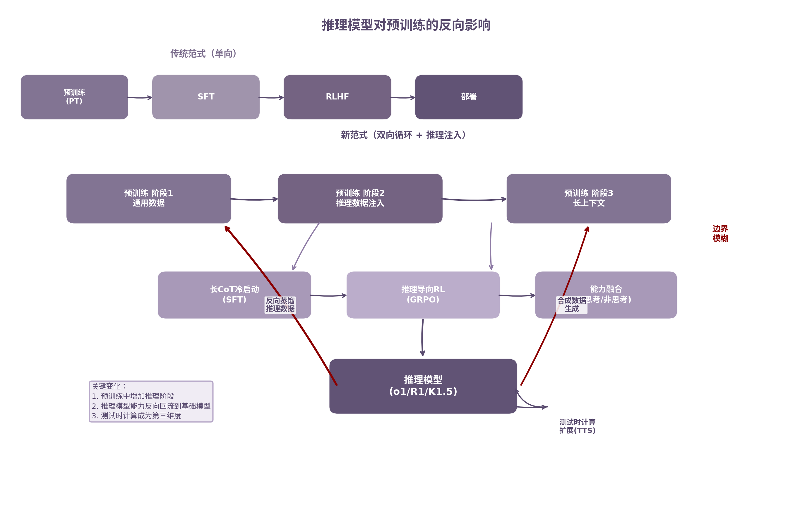

# 第29章 推理模型对预训练的反向影响

2024年9月，OpenAI o1 的发布标志着大模型领域出现一条新主线：推理模型（Reasoning Model）。o1 在数学竞赛 AIME 上达到 83.3% 准确率，而同期 GPT-4o 仅 13.4% [^298^]。这一差距表明，推理模型并非传统 LLM 的简单放大，而是遵循不同技术路径的新范式。更深远的影响在于，推理模型的崛起正在反向重塑预训练本身——从数据配比到训练阶段划分，从目标函数到算力分配，预训练的"配方"因推理而变。

## 29.1 Reasoning Model 与传统 LLM 的差异

传统 LLM 的核心模式是"单次前向传播、直接生成答案"。用户提问后，模型在推理图上走一遍，立即输出最终回答。这种模式的优势是速度快、延迟低。缺陷同样明显：面对复杂问题时，模型没有显式的思考过程，容易在逻辑链条的中间环节出错。

Reasoning Model 则引入**长链式思维**（Chain-of-Thought, CoT）：模型在生成最终答案前，先输出一段内部思考过程，包含问题分解、假设检验、中间计算、验证回溯等步骤 [^413^]。这相当于把人的草稿纸搬到模型内部。OpenAI o1/o3、DeepSeek-R1、Kimi K1.5 均采用这一模式 [^298^]。

两类模型的差异可从四个维度对比：

| 维度 | 传统 LLM（GPT-4o 等） | Reasoning Model（o1/R1 等） |
|------|----------------------|---------------------------|
| 推理方式 | 单次前向传播，直接输出答案 | 多步 CoT，显式思考后回答 [^413^] |
| 推理时计算 | 固定，与问题复杂度无关 | 动态扩展，难题分配更多 token [^413^] |
| 典型延迟 | 数百毫秒 | 数秒至数十秒 |
| 训练核心 | 预训练 + SFT + RLHF | 增加推理导向 RL 阶段 [^457^] |
| 数据依赖 | 高质量指令数据 | 可验证奖励的长 CoT 数据 [^457^] |
| 能力涌现条件 | 规模驱动 | 规模 + 可验证奖励共同驱动 [^458^] |
| 代表模型 | GPT-4o、Claude 3.5、Llama 3 | o1/o3、DeepSeek-R1、Kimi K1.5 [^298^] |

上表揭示了一个关键转变：传统 LLM 的能力提升主要依赖预训练阶段的规模扩展（更多参数、更多数据），而 Reasoning Model 引入了**第二个杠杆**——推理时计算扩展（Test-Time Scaling, TTS）。同一模型，在推理时生成更多思考 token，准确率显著上升。TTS 在简单和中等难度任务上可匹敌 14 倍参数规模的模型 [^412^]。这意味着"更大的模型"不再是唯一的答案。

DeepSeek-R1-Zero 的实验进一步证明，推理能力的核心驱动力并非预训练数据的简单堆砌，而是**可验证奖励**（verifiable rewards）。仅用 RL、无需 SFT，基础模型就能自主发展出长 CoT 推理能力。AIME 2024 pass@1 从 15.6% 提升到 71.0%，多数投票后达到 86.7%，匹配 o1-0912 水平 [^457^]。训练过程中甚至自发出现自我反思——DeepSeek 团队称之为 "Aha Moment" [^458^]。

## 29.2 预训练、SFT、RL 之间的边界正在变化

传统训练流程的边界清晰：预训练学语言，SFT 学指令格式，RLHF 学人类偏好。三个阶段各司其职，互不渗透。

推理模型的出现打破了这个格局。

**预训练开始"抢"后训练的活。** Qwen3 在三阶段预训练中的第二阶段——"推理阶段"——专门增加 STEM、编码、推理和合成数据比例，约 5T tokens，并加速学习率衰减 [^419^]。这意味着推理能力的基础建设从后训练前移到预训练。预训练的目标不再是单纯的"语言建模"，而是有倾向性地为后续推理铺设知识底座。

**RL 开始"抢"预训练的活。** DeepSeek-R1-Zero 证明，纯 RL 训练无需任何 SFT 就能让基础模型涌现出复杂的推理行为 [^457^]。RL 不再只是"对齐工具"，而是能力生成器。GRPO（Group Relative Policy Optimization）算法通过组内归一化计算优势函数，无需额外 Value 网络，内存节省约 50%，训练更稳定 [^426^]。

**蒸馏让能力双向流动。** DeepSeek-V3 从 DeepSeek-R1 蒸馏推理能力，将长 CoT 模型的验证和反思模式整合到标准 LLM 中 [^356^]。传统流程是单向的：预训练 → SFT → RL。蒸馏引入了反向通道：推理模型 → 基础模型。这让训练流程从线性管道变为循环网络。

这种边界模糊化不是简单的职责重新划分，而是训练哲学层面的转变。传统范式假设能力可以在不同阶段**独立构建**——先学好语言，再学指令遵循，最后学偏好对齐。新范式则认为某些能力（尤其是推理）必须在**多个阶段反复强化**才能充分获得。预训练阶段注入的推理数据为后训练的 RL 提供"燃料"；后训练阶段发现的推理模式又通过蒸馏反馈给预训练的数据合成流程。

新的训练范式大致如下：

预训练（通用阶段 → 推理阶段 → 长上下文阶段）→ SFT（长 CoT 冷启动）→ RL（推理导向）→ SFT（能力融合）→ RL（通用对齐）

相比传统四阶段流程，新范式有三处关键变化。其一，预训练中嵌入专门的推理阶段，数据配方发生本质变化。其二，后训练从单一的"指令对齐"扩展为多阶段能力构建：冷启动建立推理基础，RL 激发探索能力，融合阶段统一思考与非思考模式 [^433^]。其三，推理模型与基础模型之间通过蒸馏双向交互，不再是单向输出。

上图对比了传统单向范式与新双向循环范式。红色箭头标示推理模型的反向回流路径：推理模型通过蒸馏将能力传回基础模型，通过合成数据生成反哺预训练数据池。预训练与后训练之间的传统边界因此模糊 [^412^]。

## 29.3 高质量推理数据如何影响继续预训练

继续预训练（Continual Pre-Training, CPT）指在已训练好的基础模型上，用新数据继续执行 next-token prediction。传统 CPT 的数据以通用文本为主——书籍、网页、论文。推理时代的 CPT 则引入了新数据类型。

**Reasoning CPT**（推理继续预训练）将合成推理数据（含隐藏思维过程）融入 CPT 流程 [^421^]。核心发现包括：

推理 CPT 在所有测试域上持续提升性能。在 STEM 域训练后，跨域迁移效果显著——法律域的 STEM 子任务提升 4.3 分 [^421^]。困难问题上的优势更明显：最难题目准确率提升约 8 分。模型还能自动根据问题难度调整推理长度，难题生成更长 CoT，简单题直接回答 [^421^]。

这些发现说明推理技能具有**跨域可迁移性**。在一个领域学习的通用思考技能（分解、验证、回溯）可迁移到其他领域。这与传统预训练的"数据分布决定能力分布"逻辑有所不同——推理能力更像是通用认知工具，而非领域特定知识。

跨域迁移的机制尚不完全清楚，但一个合理的解释是：推理数据中的"元认知模式"（如何分解问题、如何检验中间步骤、何时应该回溯）是领域无关的。当模型在法律文档中看到结构化的论证分析时，它学到的不仅是法律知识，更是"如何分析复杂论证"的程序性技能。这种元认知的迁移是 Reasoning CPT 效果的核心来源 [^421^]。

Qwen3 的实践进一步验证了这一方向。Qwen3 在 36T tokens 中安排了明确的推理强化阶段，使用 Qwen2.5-Math 和 Qwen2.5-Coder 分别生成数学和代码合成数据 [^419^]。合成数据覆盖教科书、问答、指令和代码片段等多种格式。这种"专用模型生成专用数据、再喂给更强大模型"的闭环，正在成为高质量推理数据的主要生产模式。

推理数据对 CPT 的价值还体现在**质量标准的可验证性**上。传统文本数据的质量评估依赖启发式规则（语言正确性、信息密度、教育价值），主观性强。推理数据的质量可以通过答案正确性直接验证——数学题算对了就是对的，代码跑通了就是好的。这种可验证性使推理数据的筛选和去噪远比通用文本高效。

从 DeepSeek-R1 的训练经验看，推理数据的质量比数量更重要。R1 的冷启动阶段仅使用数千个高质量长 CoT 样本，而非数百万条泛泛数据 [^457^]。这数千条数据覆盖数学、编码、逻辑推理和 STEM 问题，每一条都经过精心构造。小规模高质量数据激发 RL 阶段的自主探索，远比大规模低质量数据有效。

## 29.4 "会思考"的能力到底来自预训练还是后训练

这是推理时代最具争议的问题之一。两方观点都有硬证据支撑。

**后训练派**的证据来自 DeepSeek-R1-Zero [^457^]。纯 RL、无 SFT，基础模型就能涌现复杂推理。这说明推理能力可能是预训练阶段就已"潜在具备"的，RL 只是解锁机制。支持这一观点的还有蒸馏实验：小型模型通过从推理模型蒸馏也能获得强推理能力，说明架构本身足够承载推理，关键是训练信号 [^457^]。可验证奖励是核心催化剂——没有它，RL 无法区分好的推理过程和坏的过程。

**预训练派**的证据来自 Qwen3 的设计 [^419^] 和 Llemma 实验 [^420^]。Qwen3 在预训练中增加推理阶段直接提升推理基础能力。Llemma 在代码加数学数据上继续预训练，相比 Code-Llama 推理能力显著提升 [^420^]。这表明代码和数学预训练对增强推理至关重要——预训练数据的质量和类型决定了推理能力的上限。此外，DeepSeek-R1 的成功前提是 DeepSeek-V3-Base 已具备强基础能力，弱基础模型无法通过 RL "凭空"获得推理能力。

当前的趋势指向**协同论**：预训练构建基础能力和知识储备，后训练（特别是 RL）解锁和激发推理潜能，两者缺一不可 [^412^]。

这个协同框架可以用一个三层结构理解。第一层是**知识底座**，由预训练构建。数学定理、编程语法、科学原理——这些事实性知识必须在预训练阶段内化。第二层是**推理模式**，主要由 RL 解锁。分解问题、检验假设、回溯修正——这些程序性技能通过可验证奖励的 RL 信号激发。第三层是**测试时计算**（TTS），作为新的扩展维度。同一模型，推理时生成更多思考 token，性能持续提升 [^412^]。

三层之间不是简单的先后依赖，而是相互作用。预训练的质量决定 RL 能解锁多少潜能；RL 的反馈又可以帮助识别预训练数据中的缺口。TTS 则提供了一种灵活的能力调节机制——不需要重新训练模型，仅调整推理时计算量就能匹配任务难度。

值得注意的是，TTS 与预训练扩展之间存在经济性权衡。Train-to-Test（T2T）Scaling 研究表明，当考虑推理成本时，最优策略向"过训练"偏移——训练更小但更长时间的模型，配合 TTS 扩展 [^115^]。在 8 个下游任务上验证，小过训练模型加重复采样优于大 Chinchilla 模型 [^115^]。这意味着预训练的目标正在从"训练最大模型"转向"训练最适合配合 TTS 的模型"。

## 29.5 推理时代对数据、目标函数和算力分配的新要求

推理模型对训练全流程提出了新的资源需求。以下表格对比推理时代各阶段的核心变化。

| 维度 | 传统 LLM 时代 | 推理模型时代 | 变化驱动力 |
|------|-------------|-----------|----------|
| 预训练数据核心 | 通用文本（网页、书籍、论文） | 通用文本 + STEM/代码/推理数据 [^419^] | 推理能力需预训练阶段预埋 |
| 数据可验证性 | 低（依赖启发式质量评分） | 高（答案可验证、代码可执行）[^457^] | RL 需要明确奖励信号 |
| 合成数据占比 | <10% | 30-50%+ [^419^] | 人工标注推理数据成本过高 |
| 预训练目标函数 | Next-token prediction | NTP + MTP（多 token 预测）[^356^] | 更密集的训练信号 |
| 后训练阶段数 | 2-3（SFT + RLHF） | 4-5（冷启动 + 推理 RL + 融合 + 对齐）[^433^] | 推理能力需多阶段构建 |
| RL 算法 | PPO/DPO | GRPO [^426^] | 节省内存、兼容推理 |
| 算力分配（预训练:后训练） | ~95:5 | ~85:15 [^356^] | 后训练复杂度大幅上升 |
| RL 算力需求 | 低（critic 网络小） | 高（大规模 online rollout）[^457^] | 需采样多组推理轨迹 |
| 蒸馏方向 | 大模型→小模型（单向） | 双向：推理模型↔基础模型 [^356^] | 能力循环流动 |
| 推理时计算 | 固定 | 动态扩展 [^413^] | TTS 成为第三维度 |

上表反映出三个深层变化趋势。

**数据方面，可验证性成为核心标准。** 传统预训练追求"高信息密度"的通用文本，推理时代则优先选择答案可验证的数据类型——数学题、编程题、逻辑谜题。这类数据可以直接产生正确/错误的二元奖励，与 RL 训练天然适配。合成数据因此崛起：Qwen3 使用多个专用模型（Qwen2.5-Math、Qwen2.5-Coder）生成数万亿 tokens 的合成推理数据 [^419^]。合成数据的规模化应用使推理训练摆脱了对昂贵人工标注的依赖。

**目标函数方面，从单一到混合。** DeepSeek-V3 的 Multi-token Prediction（MTP）在训练时预测未来 2 个 token 而非 1 个，提供更密集的训练信号 [^356^]。推理导向的 RL 引入了第二条优化轴——不仅预测下一个 token 要准，推理过程要有效。两条轴线的协同使模型同时学好"语言"和"思考"。Qwen3 的四阶段后训练流水线进一步增加了优化的复杂度：每阶段有不同的奖励函数和数据分布，模型需在多阶段之间保持能力不遗忘 [^433^]。

**算力分配方面，后训练占比显著上升。** DeepSeek-V3 的预训练消耗 2.664M GPU 小时，后训练仅 0.1M GPU 小时 [^356^]——传统比例约为 96:4。但进入推理时代，后训练阶段数从 2-3 个增加到 4-5 个，每个阶段的数据量和计算量都在增长。RL 训练需要大规模 online rollout：GRPO 每次更新需采样多组推理轨迹，组内比较计算优势函数 [^426^]。推理越长，rollout 成本越高。后训练的总算力占比正在向 15-20% 迈进。

更深层的结构性变化是**算力分配维度的扩展**。传统框架只有两维：预训练算力、后训练算力。推理时代增加了第三维——**测试时计算算力**。用户每次请求时，模型可能生成数千甚至数万 tokens 的 CoT，推理成本大幅上升。这改变了训练决策的经济学：训练阶段多花算力提升模型效率，可能比推理阶段省更多 [^115^]。T2T 缩放法则因此推荐更小、更过训练的模型——训练时"多烧"一些，推理时"少烧"一些。这一发现的经济意义重大：对高频调用的生产系统，推理成本占总拥有成本（TCO）的主要部分。过训练策略 upfront 的训练成本增量，可在数月内通过降低的推理开销收回。

推理模型对预训练的反向影响，本质上是能力发现的回流机制。预训练原本只负责"学语言"，后训练负责"学任务"。推理模型证明，有些能力（如长链式推理）既不能在纯预训练中充分获得，也不能仅靠后训练凭空创造。它需要预训练阶段预埋知识底座，后训练阶段用可验证奖励解锁，测试时阶段用额外计算扩展。三个阶段的边界因此模糊，训练流程从线性管道演进为循环网络。数据、目标函数和算力的分配逻辑，也随之重构。
