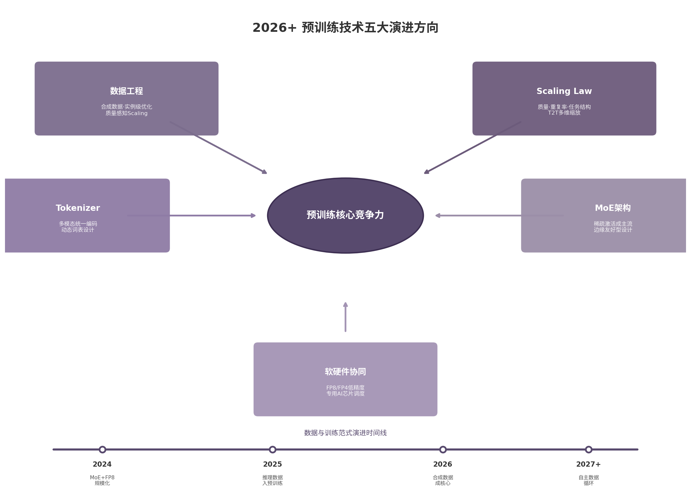

# 第30章 2026 之后的关键问题

全书以历史演进为主线，从词向量一路追踪到推理模型对预训练的反向影响。本章将镜头推向前方，审视六个决定预训练技术走向的关键问题。这些问题没有标准答案，但每一个都将深刻影响2026年后的技术格局。

## 30.1 数据是否会成为新的瓶颈

高质量公开文本数据的供给增长远不及需求。公开人类生成文本年增长率约10%，而实际使用的数据集规模年增长率约2.4倍 [^410^]。两者之间的剪刀差持续扩大。研究预测高质量数据可能在2026-2032年间耗尽 [^397^]。

数据枯竭的预测建立在"文本"的狭义定义之上。如果仅统计高质量的网页文本、书籍和论文，总量确实有限。但这个框架遗漏了三个正在打开的数据源。

第一，合成数据。Qwen3已经使用多个专用模型（Qwen2.5、Qwen2.5-Math、Qwen2.5-Coder）生成数万亿tokens的合成数据 [^419^]。合成数据的核心风险是模型崩溃（model collapse）：迭代训练合成数据会导致性能退化 [^432^]。但2026年的研究表明，通过外部验证器过滤低质量合成数据可以避免崩溃 [^432^]。关键策略是累积而非替换——合成数据与真实数据混合使用，而非完全替代。

第二，多语言私有数据。Qwen3将语言覆盖从29种扩展到119种，获得了显著能力增益 [^419^]。非英语地区的私有数据（企业文档、本地语料）在合规框架下可能成为重要资源。GDPR等法规对数据使用构成限制 [^397^]，但也催生了隐私计算和联邦学习的成熟方案。

第三，推理数据。第29章已经讨论过推理继续预训练（Reasoning CPT）的效果：合成推理数据融入继续预训练后，跨域迁移效果显著，最难题目准确率提升约8分 [^421^]。这类数据的规模几乎没有上限——任何有明确答案的问题都可以生成对应的推理链。

数据不会成为绝对瓶颈。它会成为筛选器：只有掌握高质量数据合成、验证和配比能力的团队才能继续推进模型能力。数据工程能力的差距将在2026年后加速放大——头部团队的数据合成-验证-配比闭环日趋成熟，而依赖传统公开语料的团队将面临能力天花板。

## 30.2 Scaling Law 是否需要加入数据质量、重复率和任务结构

现有Scaling Law的核心形式是 L(N,D) ∝ N^(-α) · D^(-β)。它只考虑参数规模 N 和数据规模 D，不考虑数据质量、重复率或任务结构 [^396^]。这个简化模型在2020-2024年间指导了数百亿美元的投资，但正在接近解释力的边界。

三条证据表明Scaling Law需要扩展。

**数据质量维度。** FineWeb-Edu的发现具有里程碑意义：1.3T高质量tokens可超越15T原始数据 [^396^]。Qwen3通过实例级数据混合优化（在30T+tokens上进行多维度标注和消融实验）获得了显著增益 [^399^]。这表明"高质量数据"的效果无法用简单的D倍增来模拟。新的Scaling Law需要将数据质量作为一个独立变量纳入——或者定义一个"有效tokens"的概念来替代原始token计数。

**重复率维度。** 研究表明10个epoch的严格过滤数据集可胜过10倍大未过滤数据集，但重复训练在4个epoch后收益递减 [^396^]。LLaMA-3的15.6T tokens训练405B参数模型 [^414^]，Qwen3的36T tokens训练235B-A22B模型 [^419^]，两者都远超Chinchilla最优（D≈20N）。这意味着现代训练已经进入"过训练"区域。过训练的最优程度取决于数据重复结构——不同内容的重复价值差异巨大。

**任务结构维度。** T2T（Train-to-Test）Scaling Law提出了一个关键洞见：当考虑推理成本时，最优决策向过训练偏移 [^115^]。更小、更过训练的模型配合重复采样，在8个下游任务上优于大Chinchilla模型 [^115^]。这意味着Scaling Law必须将"测试时计算预算"作为输入变量——不同的任务结构（简单问答 vs 复杂推理）对应不同的最优训练策略。

Scaling Law的演进方向清晰：从二元幂律（N,D）走向多元优化框架（N, D_quality, D_repeat, C_test）。一个可能的中间方案是定义"有效tokens"（effective tokens）的概念——将质量、多样性和重复率折算为一个等效数据量，保持Scaling Law的形式简洁同时增加解释力。

但新框架的复杂性也带来了挑战。变量增多使得小规模实验预测大规模最优的可靠性下降。2026年的训练决策者需要在"理论精确性"和"工程可操作性"之间寻找平衡。实践中，最可能的路径是保留Chinchilla作为基准参考，再通过经验系数调整不同数据维度的权重。

## 30.3 Tokenizer 是否会被重新设计

Tokenizer的本质是文本压缩。它将可变长度的字符序列映射到固定集合的整数ID。Llama 3使用128K词表（100K tiktoken + 28K非英语token），压缩率从3.17提升到3.94字符/token [^414^]。Qwen3和其他前沿模型也在类似量级。

Tokenizer面临三重压力。

第一，多语言的Token预算不公平。同样一句话，中文需要的Token数是英文的1.5-2倍。低资源语言在词表中被进一步边缘化。Qwen3覆盖119种语言 [^419^]，但词表空间分配仍是一个未解的优化问题。

第二，多模态统一的需求。文本、图像、音频、视频需要一个统一的Token空间。Chameleon等模型尝试了早期融合方案，将图像块直接编码为离散的视觉Token。但文本Token（承载语义）和视觉Token（承载像素模式）的信息密度差异巨大，统一编码的效率损失明显。

第三，Tokenizer-free方案的诱惑。直接对字节流建模可以彻底消除OOV（Out-of-Vocabulary）问题和语言不对等。但字节序列过长，计算成本过高。在可预见的未来，Tokenizer-free方案仍停留在研究阶段，难以替代工程成熟的子词Tokenizer。

更现实的演进路径是"动态词表"：模型根据输入语言和任务类型动态调整词表子集。这需要嵌入层和输出层的结构创新，但比完全抛弃Tokenizer更可行。例如，代码任务激活代码优化的子词表，中文对话激活汉字密集的词表子集，图像理解任务切换到视觉Token编码器。这种动态切换要求嵌入层支持条件路由，增加了架构复杂度，但避免了统一词表的效率损失。

短期内Tokenizer不会被革命性重设计。未来两到三年，它将渐进式地朝向两个方向演化：一是多模态统一（文本+视觉+音频的离散化编码），二是按任务和语言动态适配的词表结构。

## 30.4 MoE 是否会成为默认架构

MoE（Mixture of Experts，混合专家模型）正在从替代架构走向主流。DeepSeek-V3（671B总参数、37B激活参数）以约557.6万美元的训练成本达到了GPT-4o级别的性能 [^356^]。Qwen3-235B-A22B（235B总参数、22B激活参数）同样采用MoE [^419^]。研究显示MoE在10-100倍参数下可保持类似训练成本的更高精度 [^456^]。

MoE的核心优势是解耦：总参数容量（模型能存储多少知识）与激活参数（每次前向传播的计算成本）脱钩。这个特性在云端训练和大规模部署中极具价值。

但MoE不是万能解。它在三个场景下面临结构性挑战。

| 维度 | MoE（以DeepSeek-V3为例） | 密集架构（以Llama 3 405B为例） |
|------|------------------------|---------------------------|
| 训练成本 | 671B总参数，2.788M H800 GPU小时 [^356^] | 405B参数，3.8×10^25 FLOPs [^414^] |
| 推理部署 | 预填充需32 GPU，解码推荐320 GPU [^356^] | 更灵活的部署粒度，边缘适配成熟 |
| 训练稳定性 | 需处理路由波动，RL阶段不稳定性 [^452^] | 高稳定性，Llama 3刻意选择密集架构 [^414^] |
| 后训练复杂度 | 四阶段流水线+GRPO，专家负载需均衡 [^433^] | SFT+DPO相对简单 [^414^] |
| 边缘部署 | 总参数量远超设备内存，需专家卸载 [^449^] | 量化压缩后直接部署 |
| 适用场景 | 云端大规模推理、追求SOTA性能 | 边缘部署、稳定性优先、快速迭代 |

上表揭示了一个核心事实：MoE和密集架构各有最优适用域。短期内两者将并存。

MoE的优势场景是云端大规模训练和推理。DeepSeek-V3的训练成本证明，MoE在集群规模下可以实现极高的参数效率。新型路由机制（如Auxiliary-Loss-Free负载均衡 [^360^]）正在解决训练稳定性的历史短板。

密集架构的优势场景是边缘部署和快速迭代。Llama 3选择密集架构的决策逻辑清晰：最大化训练稳定性，简化后训练流程 [^414^]。小型团队更容易在密集架构上做实验和微调。

趋势判断：2026-2028年间，MoE将成为100B+参数模型的默认选择，但中小模型（<30B参数）仍以密集架构为主。新型架构（如ReLU路由、NormSiLU激活）正在解决MoE的固有问题 [^451^]，这个领域的创新空间仍然广阔。

## 30.5 分布式训练是否会进入软硬件协同设计时代

分布式训练已经从"软件适配硬件"走向"软硬件共同设计"。DeepSeek-V3的案例最具说服力：2048张H800 GPU上实现近乎完全的计算-通信重叠 [^356^]，靠的不是软件框架的通用优化，而是针对特定硬件拓扑的定制化调度。

三个技术方向定义了软硬件协同设计的演进路径。

**低精度训练的硬件依赖。** FP8训练从概念验证走向大规模应用。DeepSeek-V3首次在超大规模模型上验证了FP8训练的可行性 [^356^]，精度损失相对BF16控制在0.25%以内 [^360^]。FP8的实现高度依赖硬件支持——H100/H800的Tensor Core原生支持FP8，但不同硬件的FP8实现差异巨大（E4M3 vs E5M2格式选择、动态缩放机制）。下一步是FP6甚至FP4，但这需要更激进的硬件-算法协同设计。

**通信拓扑的定制化。** DeepSeek-V3的DualPipe双向流水线将50%的流水线气泡压缩到近乎为零 [^360^]。MoE all-to-all通信通过"IB跨节点 + NVLink节点内"的两层拓扑优化 [^356^]。这些优化不是通用框架可以自动实现的——它们需要深入理解硬件的网络拓扑、带宽分布和延迟特征。

**专用AI芯片的差异化。** TPU、昇腾、Groq等专用芯片采用与GPU截然不同的架构假设。训练框架需要自动适配这些硬件的计算特性、内存层次和通信原语。这要求软件层（PyTorch、JAX、MindSpore）与硬件层之间的接口更加灵活和透明。

软硬件协同设计时代的标志是：训练框架不再是"写一次，到处跑"，而是"为每个集群拓扑生成最优调度"。这需要编译器级别的优化能力，将模型计算图、集群拓扑和硬件特性统一纳入搜索空间。

这一转变对开源训练框架提出了新要求。DeepSpeed和Megatron-LM的通用并行策略在2021-2023年间定义了行业标准，但面对MoE+FP8+DualPipe的组合，开发者需要更细粒度的控制接口。PyTorch 2.0的编译器路线（torch.compile）和Triton等DSL（Domain Specific Language）的兴起，正是对这一需求的回应。DeepSeek-V3已经展示了软硬件协同的可行性 [^356^]，2026年后将成为大规模训练的标准实践。

一个值得关注的方向是"训练即编译"：将模型定义和集群配置作为输入，自动搜索最优的并行策略、通信调度和内存分配方案。这类似于深度学习编译器（如XLA、TVM）在推理优化中的角色，但扩展到训练全流程的自动化优化。

## 30.6 未来大模型预训练的核心竞争力

全书追踪了从Transformer到推理模型的完整技术演进。站在2026年的时间节点，预训练的核心竞争力已经发生了根本性转移。

| 竞争维度 | 2020-2023年的关键资源 | 2026+年的关键资源 | 转变原因 |
|---------|-------------------|----------------|---------|
| 数据 | 大规模公开语料（Common Crawl） | 合成数据+验证体系+实例级配比 [^419^] [^432^] | 公开文本枯竭，合成质量可控 |
| 算力 | GPU数量（A100/H100规模） | 集群利用效率（MFU+通信重叠）[^356^] | 硬件差距缩小，调度优化差距扩大 |
| 架构 | Transformer变体创新 | MoE设计+低精度训练+负载均衡 [^360^] | 基础架构成熟，工程优化决定上限 |
| Scaling | 遵循Kaplan/Chinchilla比例 | 多维Scaling（质量·重复·T2T）[^115^] [^396^] | 二元幂律失效，需精细化调参 |
| 组织能力 | 研究人员数量 | 端到端训练配方（数据·系统·目标函数协同）[^419^] | 单点创新饱和，系统工程决定成败 |

上表揭示了一个核心趋势：预训练的竞争从"资源堆砌"转向"配方精度"。2020年，拥有更多GPU的团队几乎必然训练出更强的模型。2026年，GPU规模的边际收益递减，数据质量、系统效率、Scaling策略的精细化调参成为差异化来源。

这个转变对产业格局的影响深远。小型团队通过架构创新（如DeepSeek-V3以约557.6万美元训练671B参数模型 [^360^]）可以挑战资源远多于自己的对手。开源社区的技术透明度（DeepSeek-R1 [^457^]、Qwen3 [^419^]的技术报告公开了完整训练配方）进一步降低了进入门槛。

但真正的壁垒正在向"数据-系统-目标函数"的协同设计能力迁移。这不是单一技术可以复制的——它需要数据工程（合成+验证+配比）、分布式系统（低精度+通信优化+稳定性）、算法设计（MoE路由+负载均衡+后训练流水线）三个团队的高频协作。

上图将本章讨论的五大关键问题整合为一个统一框架。数据工程、Scaling Law、Tokenizer、MoE架构和软硬件协同五个方向共同指向2026年后预训练的核心竞争力：不是单一技术的突破，而是端到端训练配方的系统优化能力。

回顾全书脉络，预训练技术经历了六个阶段的演进：从结构探索（Transformer）、目标函数定义（NTP/MLM）、规模爆发（GPT-3/Scaling Law）、数据觉醒（Chinchilla/数据配比）、系统优化（3D并行/MoE/FP8），到推理回流（第29章讨论的内容）。2026年后的竞争，将在所有这些维度上同时展开。谁能将数据合成、实例级配比、MoE架构设计、低精度训练和软硬件协同编织为一个自洽的整体，谁就能定义下一代预训练模型的能力边界。
