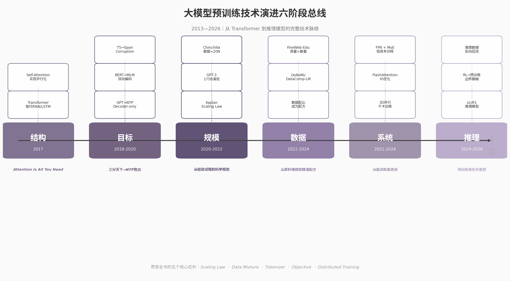

# 结语：如何用一张图记住大模型预训练演进

全书30章追踪了一条主线：预训练如何从一种小众的NLP技术，演变为驱动通用人工智能的核心工程。这条主线可以压缩为六个阶段、五个关键词、三个问题。

## 技术演进总线：六阶段一览

上图将2013年至2026年的技术演进归纳为六段连续的主线。每一段都解决了一个核心矛盾，每一段都为下一段埋下伏笔。

**结构（2017）。** Transformer取代RNN/LSTM，用Self-Attention实现全序列并行计算 [^1^]。这一阶段的遗产是"可扩展的骨架"——层堆叠和注意力头扩展带来近乎线性的能力增长，为后续规模爆发提供了物理基础。

**目标（2018-2020）。** GPT的NTP（Next Token Prediction）、BERT的MLM（Masked Language Modeling）、T5的Span Corruption三足鼎立 [^2^][^3^][^4^]。最终NTP胜出，原因是简洁性（单一损失函数）、可扩展性（100% Token利用率）和涌现能力（上下文学习）。Decoder-only架构由此成为主流范式。

**规模（2020-2022）。** Kaplan Scaling Law将训练从"试错"变成"预算规划"——给定算力可预测损失，给定目标可估算预算 [^5^]。GPT-3以175B参数验证了涌现假说 [^6^]。Chinchilla修正了Kaplan的误导，证明数据量应与参数量同步增长（D ≈ 20N）[^7^]。

**数据（2022-2024）。** 预训练社区从"堆料"转向"配方"。DoReMi用小模型搜索大模型的最优数据配比 [^8^]，DataComp-LM将数据筛选策略基准化 [^9^]，FineWeb-Edu证明1.3T高质量tokens可超越15T原始数据 [^10^]。数据工程从后勤部门升级为核心竞争力。

**系统（2021-2024）。** 分布式训练从数据并行演进为3D并行（数据×张量×流水线），FlashAttention将Attention复杂度从O(n²)的算法视角转向IO效率视角 [^11^]，FP8和低精度训练降低显存与通信成本 [^12^]。DeepSeek-V3以约557.6万美元训练出671B参数的GPT-4级别模型 [^13^]，标志着系统优化进入新阶段。

**推理（2024-2026）。** o1和DeepSeek-R1的出现反向重塑预训练 [^14^][^15^]。推理数据注入继续预训练、RL阶段前移、预训练与后训练的边界模糊——预训练不再是独立的"第一阶段"，而是与推理能力构建深度耦合的系统工程。

六阶段的演进逻辑清晰可辨：先找到正确的结构（Transformer），再确定正确的目标（NTP），然后用Scaling Law量化扩展规律，再精准控制数据输入，继而优化训练系统，最后被下游任务（推理）反向重塑。前四阶段回答"模型怎么变强"，后两阶段回答"怎么高效地训练它"和"训练出的模型如何被使用"。

## 五个关键词

| 关键词 | 一句话定义 | 一句话意义 |
|:---|:---|:---|
| Scaling Law | 模型损失是参数量、数据量、计算量的可预测幂律函数 [^5^] | 将大模型训练从经验主义变为可预算规划的科学 |
| Data Mixture | 不同来源和类型数据的最优配比策略 [^8^] | 数据质量与配比对最终能力的影响不亚于模型规模 |
| Tokenizer | 将文本压缩为模型可处理的整数序列的编码器 [^16^] | 切分方式直接决定模型感知文本的粒度和效率 |
| Objective | 预训练阶段优化的目标函数（NTP/MLM/Span Corruption）[^2^][^3^][^4^] | 目标函数的选择决定了模型能学到什么、不能学到什么 |
| Distributed Training | 在多GPU/多节点上协同训练大规模模型的系统工程 [^17^] | 没有分布式训练工程，Scaling Law只是纸上公式 |

这五个关键词构成预训练技术的"最小知识集"。理解它们，就能理解全书80%的技术决策背后的动机。Scaling Law回答"需要多少"，Data Mixture回答"用什么训练"，Tokenizer回答"怎么切分"，Objective回答"学什么"，Distributed Training回答"怎么高效地算"。

## 快速判断一项新技术价值的三个问题

面对层出不穷的预训练新技术，用三个问题可以快速评估其真实价值。

**问题一：它解决的是哪个主线的痛点？** 六阶段演进总线中的每一个阶段都有尚未解决的痛点。结构阶段的痛点是长上下文效率，目标阶段的痛点是样本效率（MTP试图解决），规模阶段的痛点是Scaling Law的维度不足，数据阶段的痛点是合成数据的可控性，系统阶段的痛点是训练稳定性与通信开销，推理阶段的痛点是预训练与后训练的边界管理。一项新技术如果找不到对应的主线痛点，大概率是增量优化而非范式突破。

**问题二：它能否被纳入现有的Scaling Law框架？** 能被纳入意味着可以用小规模实验预测大规模效果，降低试错成本。ChinchillaScaling Law [^7^]、数据配比Scaling Law [^8^]、多模态Scaling Law都遵循这一逻辑。如果一项技术破坏了Scaling的可预测性（例如需要超大规模才能验证、小规模实验无法反映真实效果），它的工程落地风险会大幅上升。

**问题三：它对训练成本或推理成本的影响方向？** 预训练技术的终极评价指标是成本效率。DeepSeek-V3的价值不仅在于性能，更在于它以约557.6万美元实现了GPT-4级别效果 [^13^]。MoE降低推理成本 [^18^]，FP8降低训练成本 [^12^]，MTP提升样本效率 [^19^]——它们的价值都直接体现在成本曲线上。如果一项新技术既不降低训练成本，也不降低推理成本，还不提升样本效率，就需要审慎评估。

## 下一代预训练技术可能走向哪里

六阶段演进总线指向三条清晰的未来路径。

**从单一模态到原生多模态。** 当前的多模态模型（如GPT-4o、Gemini）本质上是文本LLM的视觉扩展——文本是"第一语言"，图像和音频通过适配器接入 [^20^]。原生多模态预训练将在预训练阶段就联合处理文本、图像、音频、视频的Token序列，所有模态处于对等地位。这要求统一的Token空间、跨模态的Scaling Law和新的数据配比框架。Chameleon等模型已在此方向探索 [^21^]。

**从静态模型到持续演化模型。** 当前范式是"一次性预训练→部署→冻结"。未来的预训练将更接近生物学习——模型在部署后持续接收新数据、更新知识、调整能力。持续预训练（Continual Pre-training）和模型编辑技术正在为此铺路 [^22^]。核心挑战是避免灾难性遗忘和保持训练稳定性。

**从通用能力到专业推理能力。** 通用语言建模（NTP）的上限正在显现。下一代预训练将更明确地针对推理能力设计目标函数和数据结构——在预训练阶段注入更多可验证的推理数据（数学证明、代码逻辑、科学推理），而非依赖后训练阶段的RL激活。预训练与后训练的边界将进一步模糊，最终融合为一个连续的能力构建流程 [^15^]。

三条路径的交汇点是一个新型预训练范式：原生多模态输入、持续演化更新、以推理能力为核心目标。这不是2026年就能实现的目标，但方向已经清晰。技术演进从不遵循直线，但六阶段总线提供的框架，足以帮助你在每一次技术震荡中，找到新位置相对于整条脉络的坐标。
