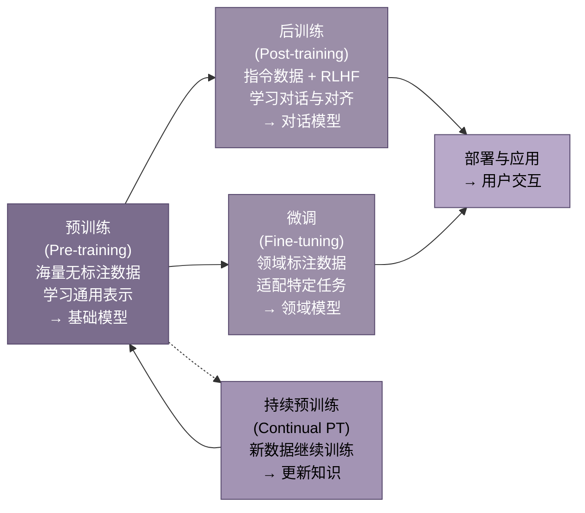
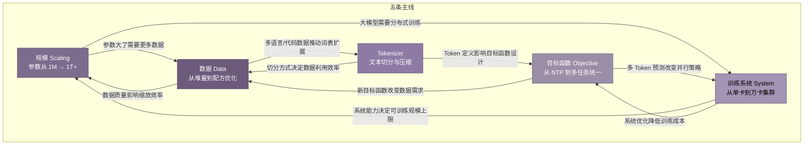

# 大语言模型预训练技术演进：从 Scaling Law 到数据配方与分布式训练

# 导读：先看懂大模型预训练的全景图

## 0.1 什么是预训练

### 0.1.1 预训练的本质

预训练（Pre-training）的核心机制是**自监督学习**（Self-supervised Learning）。模型在无标注文本上训练，用文本自身构造监督信号。具体做法是让模型预测被遮蔽或即将出现的词。这个预测任务迫使模型内化语法规则、语义关联和世界知识。整个过程中没有人工标注，文本本身就是老师。

这一机制的经济意义巨大。传统监督学习需要为每个任务专门标注数据，成本高昂且难以扩展。预训练打破了这一瓶颈。互联网上的文本取之不尽。模型可以从中自动提取学习信号。GPT-3 的训练数据来自数千亿字的网页、书籍和代码。若以人工标注同等规模数据，成本将高到不可能承受。

### 0.1.2 从"语言建模"到"通用智能底座"

预训练的角色经历了根本性转变。2018 年之前，NLP 系统为每个任务单独训练。情感分析用一个模型，机器翻译用另一个模型，问答系统再用一个模型。每个任务都是一座孤岛。

2018 年 BERT 和 GPT 的出现改变了这一切。预训练模型不再是一个专用工具。它变成了**通用底座**——一个可被适配到无数下游任务的起点。先在大规模无标注数据上学习通用能力。再在少量标注数据上微调特定任务。这个"预训练+微调"的两阶段范式成为行业标准。

2020 年 GPT-3 将这一范式推向极致。1750 亿参数的模型无需微调，仅靠输入中的几个示例就能完成新任务。预训练模型从"特征提取器"变成了"任务接口"——输入任务描述，直接得到结果。

### 0.1.3 预训练与微调、后训练的关系

理解预训练的位置，需要看清它与后续阶段的边界。



**预训练**是根基阶段。它决定了模型的知识储备、语言能力和推理上限。一个预训练不足的模型，后续无论如何微调都无法弥补基础缺陷。预训练通常消耗整个训练流程 80% 以上的算力。

**后训练**（Post-training）是 2022 年后兴起的概念，包含指令微调（SFT）和基于人类反馈的强化学习（RLHF）。它的目标不是教模型新知识。而是让模型学会按照人类期望的方式表达：听话、有用、无害。

**微调**面向特定应用场景。医疗问答模型在法律领域微调，就能变成合同审查助手。微调数据量小（数千到数万条），成本低，是产业落地的主要手段。

**持续预训练**则是在已有模型基础上用新数据继续训练。知识需要更新时——新产品、新法规——持续预训练比重新训练更经济。

四者的关系可以概括为：预训练决定"能做什么"。后训练决定"愿意怎么做"。微调决定"具体做哪件事"。

## 0.2 五条主线概览

大模型预训练的技术演进可以归纳为五条相互交织的主线。它们不是独立发展的，而是彼此制约、相互推动。



### 0.2.1 规模：从百万参数到万亿参数

2013 年的 Word2Vec 只有数百万参数。2018 年 BERT-base 有 1.1 亿参数。2020 年 GPT-3 跃升至 1750 亿。2024 年 Mixtral 8×22B 总参数量超过 1400 亿，而 GPT-4 据估计超过 1 万亿。

规模增长不是盲目的军备竞赛。2020 年 OpenAI 提出的 Scaling Law 揭示了参数数量、数据量和计算量之间的数学关系。模型性能可以用这三者的幂律函数预测。这意味着，给定预算，可以算出最优的参数-数据配比。

但规模也带来代价。每增加 10 倍参数，训练成本上升约 100 倍，推理成本上升约 10 倍。这推动了另一条主线——用更少参数获得同等能力的技术探索。

### 0.2.2 数据：从"越多越好"到"配方比原料更重要"

GPT-3 用 3000 亿 Token 训练，主要来自互联网爬取。当时的思路简单粗暴：数据越多越好。

2022 年的 Chinchilla 实验颠覆了这一认知。DeepMind 发现，GPT-3 等早期大模型实际上**训练不足**——它们看到了太多参数、太少数据。最优比例应该是每个参数配约 20 个 Token，而非 GPT-3 的 1.7 个。Chinchilla（700 亿参数、1.4 万亿 Token）击败了参数量 4 倍于它的 Gopher（2800 亿参数、3000 亿 Token）。

这开启了"数据配方"时代。2024 年的 LLaMA 3 用 15.6 万亿 Token 训练 80 亿参数模型。这个数量远超 Chinchilla 最优比例。动机很明确：让小模型在推理时更便宜。数据配比从经验走向科学。代码该占多少、多语言该占多少、高质量文本该占多少。这些比例成为模型差异的核心来源。

### 0.2.3 Tokenizer：文本如何被切割成模型可学习的单位

模型不直接读文本。Tokenizer 将文本切分成离散的 Token（词片段），再转为数字 ID 供模型处理。英文中 1 个 Token 约等于 0.75 个单词，中文中 1 个 Token 约等于 0.5 个汉字。

Tokenizer 的选择直接影响模型能力。词表太小，常见词被切得支离破碎，模型难以学习完整语义。词表太大，嵌入层参数膨胀，训练效率下降。不同语言的 Token 切分效率差异巨大。同样的服务，中文用户的处理成本比英文用户高 30-50%。

从 BPE 到 WordPiece，再到字节级 BPE，Tokenizer 的演进主线很明确。它在压缩率、信息保留和多语言覆盖之间寻找最优平衡。

### 0.2.4 目标函数：从简单语言建模到多任务统一预测

目标函数定义了模型在预训练阶段的"学习任务"。GPT 系列采用**下一个 Token 预测**（Next Token Prediction, NTP）：给定已出现的词，预测下一个词。BERT 采用**遮蔽语言建模**（Masked Language Modeling, MLM）：随机遮蔽部分词，让模型根据上下文还原。T5 采用**片段破坏**（Span Corruption）：遮蔽连续片段再生成。

三条路线在 2024 年走向融合。多 Token 预测（Multi-token Prediction, MTP）成为新方向——模型不再只预测下一个词，而是同时预测未来多个词。这提升了训练效率，也为推理加速提供了新可能。

### 0.2.5 训练系统：从单卡到万卡集群的分布式工程

GPT-3 的训练动用了数千张 V100 GPU，耗资约 1200 万美元。2024 年 DeepSeek-V3 用 2048 张 H800 GPU 在约 280 万 GPU 小时内完成训练，成本降至约 600 万美元——性能却达到 GPT-4 级别。

训练系统的演进贯穿三个并行维度。**数据并行**：不同 GPU 处理不同数据。**张量并行**：同一层计算切分到多卡。**流水线并行**：不同层分配到不同 GPU。三者的组合称为 3D 并行。再加上显存优化技术（ZeRO、激活重计算）和低精度训练（FP16 → BF16 → FP8），效果惊人。万亿参数模型的训练在有限硬件上成为可能。

FlashAttention 系列通过减少 GPU 显存访问次数，将 Attention 计算提速数倍。序列并行（Sequence Parallelism）和环形 Attention（Ring Attention）进一步将上下文长度从 2K 扩展到 128K 乃至百万级。

## 0.3 时间线与技术代际

| 代际 | 时期 | 标志性事件 | 核心突破 | 解决的核心问题 | 代表模型 |
|:---:|:---:|:---|:---|:---|:---|
| 第一代 | 2013–2017 | Word2Vec → GloVe → Seq2Seq + Attention | 分布式词表示；Attention 机制诞生 | 如何让计算机"理解"词的含义；突破 RNN 顺序计算瓶颈 | Word2Vec, GloVe, ELMo |
| 第二代 | 2018–2020 | BERT / GPT-1 / T5 三分天下 | "预训练+微调"范式确立；Transformer 成为标准骨架 | NLP 任务是否需要各自独立的模型架构 | BERT, GPT-2, T5, RoBERTa |
| 第三代 | 2020–2022 | Scaling Law 提出；GPT-3 发布 | 性能可预测；大模型涌现新能力；上下文学习 | 如何科学地规划训练，而非盲目试错 | GPT-3, Gopher, Chinchilla, PaLM |
| 第四代 | 2022–2024 | Chinchilla 最优比；LLaMA 开源；数据配比科学化 | 数据量应约为参数量的 20 倍；数据配方成核心竞争力 | 早期大模型训练不足；如何科学配比多源数据 | Chinchilla, LLaMA 1-3, Mistral, Qwen |
| 第五代 | 2024–2026 | MoE 普及；推理模型兴起；多模态融合 | 稀疏激活降低推理成本；RL 进入预训练阶段 | 稠密模型推理成本过高；模型需要"思考能力" | DeepSeek-V3, GPT-4o, Gemini 1.5, Qwen3 |

第一代的意义常被低估。Word2Vec 证明了一个关键命题。语言模型在无标注文本上训练后，其内部表示捕获了丰富的语义信息。这个词向量时代为后来的 Transformer 预训练奠定了思想基础。2014 年 Seq2Seq 和 Attention 的同年出现，则为 2017 年 Transformer 的诞生铺平了道路。

第二代是范式的确立期。BERT 用双向编码统治了理解任务。GPT 用自回归生成开创了生成任务的预训练路径。T5 则提出"一切文本到文本"的统一框架。三条路线并行探索，最终 GPT 的 Decoder-only 架构因其简洁性和可扩展性成为主流。

第三代是规模方法的确立期。OpenAI 在 2020 年的 Scaling Law 论文证明了一件事。模型损失可以用参数数量、数据量和计算量的幂律函数精确预测。这意味着大模型训练从"碰运气"变成了"可规划工程"。GPT-3 以 1750 亿参数展示了规模化的威力。上下文学习、少样本推理等能力在达到一定规模后自然涌现。

第四代的核心转折是数据意识的觉醒。Chinchilla（2022）证明多数早期大模型严重训练不足。数据量应该与参数量同步增长。最优比例约为 20:1。开源社区迅速跟进。LLaMA-1（650 亿参数、1.4 万亿 Token）证明了一件事：小模型+大数据的路线可以逼近大模型性能。数据配比从经验走向科学。代码、多语言、推理数据各该占多少比例，成为决定模型能力的关键因素。

第五代正在展开。三条主线同时推进。MoE（混合专家）架构用稀疏激活降低了推理成本——DeepSeek-V3 总参数 6710 亿，但每次只激活 370 亿。推理模型（o1/o3、DeepSeek-R1）将强化学习引入训练核心，让模型学会"先思考再回答"。多模态预训练让文本模型扩展到图像、语音、视频。统一的感知-理解-生成能力成为新目标。

## 0.4 本书阅读指南

### 0.4.1 本书不讲代码

本书聚焦三件事。**技术思想的历史脉络**：为什么这条路线赢了那条路线。**关键转折的决策逻辑**：当时面临什么选择，为什么选了 A 而非 B。**当前技术的边界与方向**：什么东西已经确定，什么还在争论。

书中不会出现 Python 代码片段、PyTorch API 调用或训练脚本细节。需要这些内容读者可以查阅官方文档和开源仓库。本书的价值在于帮助你在工程实践中做出正确决策。包括选型、配比、资源分配等。而非帮你写出一行能跑的代码。

### 0.4.2 建议阅读路径

**速读路线**（约 4-6 小时）：阅读本导读 → 第 2 章（Transformer）→ 第 3 章（GPT 路线）→ 第 9-10 章（Scaling Law 与 GPT-3）→ 第 11 章（Chinchilla）→ 第 26-27 章（LLaMA 3 与 DeepSeek-V3）。这条路线覆盖最核心的技术转折。读完它，足以让你理解大模型预训练的主要脉络。

**精读路线**：按顺序阅读全书 30 章。章节编排遵循技术发展的时间线和逻辑依赖关系。前五部分（第 1-21 章）覆盖从 Transformer 到分布式训练的核心技术，是精读的重点。后三部分（第 22-30 章）聚焦 2024-2026 年的最新进展，可根据兴趣选择阅读顺序。每条主线的完整论证都分布在多个章节中，精读需要跨章节追踪。例如，Tokenizer 主线贯穿第 6-8 章，Scaling Law 主线贯穿第 9-12 章，分布式训练主线贯穿第 17-21 章。如果你想深入某条主线，按对应章节连续阅读即可。

---

## 1. 2013-2017：预训练的前史

大语言模型的预训练并非凭空出现。2013年到2017年这五年间，词向量、循环神经网络、编码器-解码器架构和注意力机制相继问世，逐步搭建起预训练的思想脚手架。这段前史回答了三个根本问题：如何让机器理解词的含义？无标注文本怎样变成有效的训练信号？以及，是什么瓶颈迫使研究者放弃循环架构、转向全新的计算范式？

### 1.1 从词向量到上下文表示

#### 1.1.1 Word2Vec（2013）和 GloVe（2014）：静态词嵌入的诞生

2013年之前，NLP系统主要依赖稀疏的one-hot向量或基于计数的高维统计特征来表示词语。这些表示无法捕捉词与词之间的语义关系，维度灾难也让后续模型难以扩展。

Tomas Mikolov等人在Google提出的Word2Vec [^31^]，标志着从稀疏统计表示向密集分布式词向量的重大转折。Word2Vec包含两种架构：CBOW（Continuous Bag-of-Words，连续词袋模型）从上下文词预测中心词；Skip-gram则反向操作，从中心词预测周围词。两种架构的核心目标一致——最大化目标词与上下文词的共现概率。

Word2Vec的成功不仅在于概念简洁，更在于工程效率。Mikolov团队引入了层级softmax和负采样（negative sampling）等优化策略，使模型能在十亿级语料上快速训练 [^31^]。训练完成后，向量空间中涌现出惊人的规律性：语义相近的词彼此靠近，"king - man + woman ≈ queen"这类类比推理成为展示词向量能力的经典案例 [^31^]。这一结果表明，几何关系可以编码语义关系——词的向量位置本身就携带了语言学意义。

GloVe（Global Vectors for Word Representation）由Pennington等人于2014年提出，走了另一条路 [^21^]。它不再从局部上下文窗口学习，而是直接操作全局词-词共现矩阵，通过矩阵分解得到低维嵌入。GloVe和Word2Vec"殊途同归"：一个从全局统计出发做压缩，一个从局部预测出发学表示，最终产出的向量质量相当 [^21^]。

这两种方法共同奠定了"预训练"的第一步：先在大量无标注文本上学习词向量，再将这些向量作为下游任务的初始化。相比随机初始化，预训练词嵌入在情感分析、命名实体识别等任务上一致提升了性能 [^54^]。

#### 1.1.2 词向量的核心洞察：语义相近的词在向量空间中距离更近

Word2Vec和GloVe之所以有效，其底层机制可以追溯到语言学中一个古老假设。下表对比了两者的技术路线差异。

| 维度 | Word2Vec CBOW | Word2Vec Skip-gram | GloVe |
|:---|:---|:---|:---|
| 训练目标 | 从上下文预测中心词 | 从中心词预测上下文词 | 拟合全局共现矩阵的对数线性关系 |
| 信息来源 | 局部滑动窗口（通常5-10词） | 局部滑动窗口 | 全局语料共现统计 |
| 核心操作 | 负采样或层级softmax优化 | 负采样（适合罕见词） | 加权最小二乘矩阵分解 |
| 对罕见词的处理 | 较弱（CBOW取平均会稀释） | 较强（每个上下文单独预测） | 依赖共现次数，低频词受限 |
| 计算复杂度 | O(n × d × w)，n为词数，d为维度，w为窗口 | 同上，但训练更慢 | O(N² × d)，N为词表大小 |
| 代表性维度 | 50-300维 | 50-300维 | 50-300维 |
| 训练语料规模 | 数十亿词 | 数十亿词 | 数十亿词 |

Word2Vec的CBOW模式通过上下文词向量的平均来预测目标词，高频词在平均过程中占据主导，罕见词的信号被稀释。Skip-gram模式反向操作，每个上下文词独立参与预测，因此罕见词也能获得充分更新 [^31^]。GloVe则通过引入加权函数，对低频共现项给予适当惩罚，在全局统计和局部细节之间取得平衡 [^21^]。实际应用中，Skip-gram在语义类比任务上略胜一筹，GloVe则在词相似度评判上更稳定。两者的互补性说明：词嵌入的质量同时取决于局部上下文结构和全局共现模式。

#### 1.1.3 静态嵌入的根本缺陷：一词一义

Word2Vec和GloVe有一个共同的根本局限：每个词类型只对应一个固定向量，与上下文无关 [^31^]。"bank"在金融语境（银行）和河流语境（河岸）中被赋予完全相同的表示，模型无法区分一词多义（polysemy）。这不仅是理论缺陷，更限制了下游任务的上限——机器翻译、问答系统中，歧义词的错误表示会级联传播，导致最终输出偏离原意。

这一缺陷成为后续所有技术演进的核心驱动力。解决"一词一义"问题，需要将词表示从静态查表升级为上下文相关的动态计算。这条路走了五年，最终引出了ELMo和Transformer。

### 1.2 语言模型为什么能学到知识

#### 1.2.1 分布假设（Firth, 1957）的深层含义

词向量能工作的理论基础，最早可追溯至1950年代的语言学研究。Zellig Harris在1954年提出："语言项具有相似分布则具有相似意义。"J.R. Firth于1957年将其精炼为名言——"You shall know a word by the company it keeps"（观其伴，知其义）[^56^][^41^]。这句话被称为分布假设（Distributional Hypothesis），是大语言模型整个技术栈的哲学根基。

分布假设的深层含义在于：语义不是词的内在属性，而是词与其他词之间关系的网络结构。词嵌入方法正是将这一关系性语义观（relational notion of meaning）操作化——词不是由固定定义表征，而是由其在向量空间中的位置定义 [^56^]。这意味着，只要观察一个词在大量文本中的"同伴"，就能推断出它的含义。不需要人工编写词典，不需要语法规则，纯粹从统计共现中涌现语义。

这一原则贯穿了从Word2Vec到GPT-4的全部技术演进。不同之处在于：Word2Vec用数十亿词的共现统计来学习静态关系；大语言模型则在数千亿词上通过深度神经网络学习动态、多层、上下文敏感的关系表示 [^41^]。

#### 1.2.2 预测任务作为训练信号：压缩即理解

分布假设解释了"为什么上下文能定义词义"，但没有解释"什么样的训练任务能迫使模型学到这些表示"。答案是：预测。

语言模型的核心训练任务是预测——给定前文，预测下一个词（Next Token Prediction, NTP）。为了做好这个看似简单的任务，模型必须学会语法（主谓一致、时态变化）、语义（词与词的搭配关系）、推理（上下文逻辑）乃至世界知识（"巴黎是法国的首都"）。Yoshua Bengio等人在2003年的神经概率语言模型（Neural Probabilistic Language Model）中首次证明：为语言建模而学习的词表示可以重用于其他任务 [^92^]。

预测即压缩，压缩即理解。这是信息论视角的核心洞见：预测下一个词需要压缩输入序列的全部相关信息。模型越能准确预测，说明它对语言的统计规律压缩得越好，"理解"也就越深。后来的研究表明，预训练表示捕获了层次化的语言知识——低层编码通用语言模式（句法、形态），高层编码更抽象的语义和任务相关信息 [^88^]。

#### 1.2.3 无标注文本如何变成监督信号：自监督学习的核心机制

传统机器学习依赖人工标注数据。标注成本高、规模有限，且每种任务都需要独立的标注集。预训练语言模型绕过这一瓶颈的方法是自监督学习（Self-Supervised Learning）：从数据本身的结构中构造监督信号，无需人工标注。

具体机制极其简洁。对于一段文本"猫坐在垫子上"，模型遮盖"垫子"一词，要求模型根据上下文"猫坐在___上"来预测被遮盖的词。这种"填空"任务的正确答案就藏在原文中，因此无需人工标注 [^54^]。每一个词、每一句话都自带标签，整个互联网文本瞬间变成了无限规模的训练集。

自监督学习解决了NLP长期面临的"标注瓶颈"。文本没有ImageNet那样直接的大规模监督数据集——你不能像给图片分类一样方便地给句子打标签 [^54^]。自监督机制把整个互联网变成了训练场，为后续千亿级token的训练规模奠定了基础。

### 1.3 RNN/LSTM 时代的瓶颈

#### 1.3.1 梯度消失与长依赖问题

词向量解决了"表示什么"的问题，但没有解决"如何序列处理"的问题。循环神经网络（Recurrent Neural Network, RNN）是早期NLP处理序列的标准架构，它按时间步依次处理输入，用隐藏状态传递历史信息。然而RNN有一个致命缺陷：梯度消失。

Sepp Hochreiter在1991年的硕士论文中首次形式化分析了这一问题，证明在深度或循环网络中，反向传播的误差信号要么快速衰减、要么无限增长——无论哪种情况，学习都会失败 [^119^][^130^]。Hochreiter称之为"深度学习的基本问题"（Fundamental Deep Learning Problem）。

1997年，Hochreiter和Schmidhuber提出LSTM（Long Short-Term Memory，长短期记忆网络），通过引入记忆单元、输入门、遗忘门和输出门以及"恒定误差传送带"（Constant Error Carousel）来绕开梯度消失 [^87^][^94^]。LSTM在2010年代成为NLP序列建模的事实标准，统治了该领域近二十年。

但LSTM只是缓解了梯度消失，并未根除长距离依赖困难。在实践中，信息穿过多个时间步后仍会衰减或压缩。对于长文本中相隔数百词的两个相关词，LSTM难以建立有效关联 [^29^]。

#### 1.3.2 顺序计算的并行效率瓶颈

LSTM的根本性局限不仅在于梯度，更在于其计算结构。RNN/LSTM按时间步顺序处理序列——每个时间步的计算依赖于前一时间步的隐藏状态 [^22^][^28^]。这意味着第t个词必须等第t-1个词处理完毕后才能开始，整个序列的计算形成一条无法并行的依赖链。

这一顺序特性与现代硬件（GPU/TPU）的设计理念背道而驰。GPU擅长大规模并行矩阵运算，LSTM却将这种并行能力锁死在顺序的时间步依赖中，导致训练吞吐量极低 [^51^]。当序列很长时，训练时间线性增长，而GPU资源大量闲置。这一工程层面的瓶颈，最终成为推动架构变革的决定性力量。

#### 1.3.3 规模受限

顺序计算的限制不仅体现在速度上，更体现在可扩展性上。LSTM的参数量增长受限于其循环结构，层数增加会带来训练不稳定性。上下文窗口也被序列长度束缚——更长的序列意味着更深的梯度传播路径，梯度问题进一步恶化。Encoder-Decoder架构中的固定长度上下文向量成为信息瓶颈，难以充分表示复杂长句的全部信息 [^26^]。

这些限制意味着：基于LSTM的架构无法扩展到现代大模型所需的尺度——数百层、数千亿参数、百万级上下文窗口。要突破规模天花板，必须放弃循环计算。

#### 1.3.4 RNN/LSTM/GRU 的核心限制

GRU（Gated Recurrent Unit，门控循环单元）是LSTM的简化变体，将三个门控压缩为两个（更新门和重置门），参数更少、计算更快，但保留了门控机制的核心思想。下表对比了三类循环架构的核心限制。

| 限制维度 | RNN | LSTM | GRU |
|:---|:---|:---|:---|
| 梯度消失 | 严重，误差信号指数衰减 [^119^] | 通过门控和记忆单元缓解 [^87^] | 通过门控缓解，略弱于LSTM |
| 长距离依赖 | 极差，超过10-20步信息丢失 | 改善但仍衰减，超100词困难 [^29^] | 与LSTM相近 |
| 并行化能力 | 完全顺序，无法并行 | 完全顺序，无法并行 [^22^] | 完全顺序，无法并行 [^28^] |
| 训练吞吐量 | 极低 | 低（GPU利用率<30%） [^51^] | 较低，略优于LSTM |
| 参数量扩展 | 有限，层数增加不稳定 | 可扩展到数亿参数，难以突破十亿 | 同LSTM |
| 上下文窗口 | 受限于梯度传播深度 | 实践上限约200-500词 | 同LSTM |
| 信息瓶颈 | 隐藏状态维度固定 | 上下文向量压缩长序列为定长向量 [^26^] | 同LSTM |
| 计算复杂度 | 每步O(d)，总O(n×d) | 每步O(d)，总O(n×d) | 每步O(d)，总O(n×d) |

GRU试图在LSTM的复杂性和RNN的简洁性之间取得平衡，但三类架构共享同一个根本约束：顺序依赖。只要计算沿时间步串联，就无法利用现代硬件的并行能力，也无法突破长距离依赖和规模的瓶颈。这一约束直到2017年Transformer出现才被彻底打破 [^51^]。

### 1.4 早期预训练的核心问题

#### 1.4.1 ELMo（2018）的双向LSTM上下文化突破

ELMo（Embeddings from Language Models）由Peters等人于2018年初提出，是静态嵌入向上下文化表示的关键过渡 [^19^][^37^]。ELMo的核心突破很简单：同一个词在不同句子中获得不同的向量表示。"bank"在金融语境和河流语境中不再共享同一个向量——模型根据整句上下文动态生成词的表示 [^88^]。

ELMo通过在大型语料库上预训练双向LSTM语言模型来实现这一点。前向LSTM从左到右读取句子，后向LSTM从右到左读取，两者的表示拼接后形成最终嵌入。不同网络层捕获了不同层次的语言特征——低层偏向词法和句法，高层偏向语义 [^37^]。

然而ELMo采用特征提取方法：预训练表示被冻结，作为固定特征输入到下游任务模型中。这限制了表示与任务目标的联合优化 [^88^]。更重要的是，ELMo仍然依赖LSTM架构，缺乏可扩展性和计算效率——正是1.3节中讨论的所有瓶颈，ELMo一个都没逃掉 [^85^]。双向LSTM虽然缓解了部分长依赖问题，但顺序计算的本质约束仍然完整存在。ELMo证明了上下文化的方向正确，但选择的技术路径已走到尽头。

#### 1.4.2 预训练思想的萌芽：从 ImageNet 到 NLP

预训练-微调范式并非NLP首创。2012年，AlexNet在ImageNet竞赛中获胜后，研究者发现其学到的视觉特征（边缘检测、纹理识别、形状理解）可以迁移到医学影像、卫星分析、人脸识别等其他视觉任务 [^54^]。先在大型通用数据集上预训练，再在特定任务上微调，成为计算机视觉的标准方法论。

NLP研究者效仿这一思路，但面临根本挑战：文本没有ImageNet这样方便的大规模监督数据集 [^54^]。Word2Vec/GloVe可以视为"预训练的第一步"——它们在无标注文本上学习词表示，再初始化下游任务模型 [^54^]。但这远远不够：词级表示无法覆盖短语、句子和篇章层面的复杂语言现象。

真正的转折点在2018年到来。ELMo和ULMFiT同年证明：大规模语言模型预训练可以捕获通用的语言学知识并迁移到各种下游任务 [^90^][^97^]。ULMFiT引入了判别式微调、渐进解冻、倾斜三角学习率等微调方法，展示了如何有效地将预训练模型适配到特定任务 [^90^]。BERT随后将上下文化表示与端到端微调结合，在GLUE基准上刷新11项NLP任务记录，正式确立了预训练-微调范式在NLP中的主导地位 [^88^]。

#### 1.4.3 2014年的关键转折：Seq2Seq 和 Attention 机制

2014年是预训练前史中最关键的一年。两件大事同年发生，为三年后Transformer的诞生铺平了道路。

第一件是Seq2Seq（Sequence to Sequence，序列到序列）框架的问世。Ilya Sutskever、Oriol Vinyals和Quoc Le提出用多层LSTM编码器将输入序列映射为固定维向量，再用解码器从该向量生成目标序列 [^68^]。同年Kyunghyun Cho等人独立提出了类似的RNN Encoder-Decoder架构 [^61^]。Seq2Seq成为机器翻译、文本摘要等生成任务的标准框架。Sutskever等人发现一个关键技巧：将源句词序反转输入，可以显著提升性能——因为这引入了大量短距离依赖，使优化问题更简单 [^68^][^55^]。这个技巧本身说明了一个深层问题：LSTM处理长距离依赖如此困难，以至于研究者宁愿通过数据预处理来"制造"短距离依赖。

第二件是注意力机制（Attention Mechanism）的诞生。Dzmitry Bahdanau、Kyunghyun Cho和Yoshua Bengio在机器翻译中引入注意力，允许解码器在每个输出步骤直接访问编码器的所有隐藏状态，而非依赖单一固定长度上下文向量 [^23^][^26^]。注意力机制一举解决了编码器-解码器的信息瓶颈问题。更重要的是，它提供了一种可解释性：对齐矩阵直观展示了生成每个输出词时，模型"关注"了输入序列中的哪些词 [^26^]。

2015年，Thang Luong等人进一步简化注意力机制，提出了scaled dot-product方法 [^23^][^24^]。这个计算方式——Q、K、V的点积注意力——后来成为Transformer的核心运算。从Bahdanau的加法注意力（additive attention）到Luong的乘法注意力（multiplicative/dot-product attention），计算效率逐步提升，为完全基于注意力的架构扫清了道路 [^26^]。

下图为2013-2017年关键技术演进路径：

```
2013 ──→ 2014 ──→ 2015 ──→ 2017 ──→ 2018
 │        │        │        │        │
 ▼        ▼        ▼        ▼        ▼
Word2Vec  Seq2Seq  Google   Trans-   ELMo
│         │        Translateformer  │
│         │        NMT      │       │
│         │        │        │       │
│         ▼        │        │       ▼
│      Bahdanau    │        │    BERT/GPT
│      Attention   │        │       │
│         │        │        │       │
│         ▼        ▼        │       ▼
GloVe  Luong      Self-    │    预训练-微调
│      scaled     Attention│    范式确立
│      dot-       (Vaswani  │
│      product    et al.)   │
│         │        │        │
▼         ▼        ▼        ▼
静态词嵌入  注意力萌芽   并行化革命   上下文化+规模化
（Word2Vec/  (encoder-   (全序列并行, (Transformer
 GloVe）   decoder对齐)  O(1)长依赖)  架构统一)
 │         │        │        │
 └─────────┴────────┴────────┘
            │
            ▼
      核心演进线索：
      1. 表示：静态 → 上下文相关
      2. 计算：顺序 → 全并行
      3. 依赖传递：逐步传递 → 直接交互
      4. 规模：百万参数 → 十亿参数
```

注意力机制从2014年的辅助组件，逐步升维为2017年的核心运算。这条演进路径揭示了一个更广泛的范式转变：从顺序、记忆受限的模型，转向能够动态聚焦相关信息的架构 [^26^]。Transformer将注意力从encoder-decoder跨序列对齐推广到序列内部的自注意力（self-attention），使每个位置都能直接关注所有其他位置，彻底消除了对循环计算的依赖 [^23^][^26^]。

2013年到2017年的五年，是预训练思想的孕育期。词向量证明了无标注文本可以学到有用的表示；分布假设和自监督学习提供了理论根基；Seq2Seq和注意力机制开辟了序列建模的新方向；而LSTM的瓶颈则明确指出了旧架构的极限。这些碎片在2017年汇集成Transformer，随后引爆了大语言模型的全部潜能。

---

## 2. 2017：Transformer 改变预训练的底层结构

2017年6月，Vaswani等人发表"Attention Is All You Need"，提出了完全基于注意力机制的Transformer架构，不依赖任何循环或卷积计算 [^53^][^96^]。这篇论文扭转了NLP的研究方向，使Transformer成为此后所有大规模语言模型的骨架。本章从注意力的演化逻辑讲起，分析Transformer为何能取代RNN/LSTM，以及Encoder和Decoder两种结构如何塑造了后续BERT、GPT和T5三条技术路线。

### 2.1 Attention 为什么适合大规模预训练

#### 2.1.1 从 Bahdanau Attention（2014）到 Self-Attention（2017）

注意力机制的雏形出现在2014年。Bahdanau、Cho和Bengio在神经机器翻译中引入了一种机制：解码器在生成每个输出词时，动态地"回看"编码器所有隐藏状态，而非依赖单一的固定长度上下文向量 [^23^][^26^]。这一设计的直接动机是解决Encoder-Decoder中的信息瓶颈——长句被压缩成一个向量后丢失了细节。

Bahdanau Attention的核心操作是一个对齐分数（alignment score）：解码器的当前状态与编码器的每个隐藏状态进行比较，计算出一个权重分布。权重高的位置意味着"这里的信息对当前输出最重要"。这个对齐矩阵还提供了可解释性——研究者可以直观看到生成某个词时模型"看"了输入的哪些部分 [^26^]。

2015年，Luong等人提出了更简洁的变体，用点积代替Bahdanau的加法对齐方式，即Scaled Dot-Product Attention [^23^][^24^]。这一简化不仅计算更快，也为后来的Transformer奠定了数学形式。

但Bahdanau和Luong的注意力都服务于一个辅助角色：增强RNN的编码器-解码器框架。注意力本身并没有取代顺序计算。真正的飞跃发生在2017年——Transformer将注意力从"跨序列对齐"推广到"序列内部自对齐"，即Self-Attention（自注意力）：序列中的每个位置都可以直接关注序列中的所有其他位置 [^23^][^26^]。这一改动彻底消除了对循环状态传递的依赖。

#### 2.1.2 Self-Attention 的数学本质：序列中任意两个位置直接交互，路径长度 O(1)

Self-Attention的操作可以用一个公式概括：

**Attention(Q, K, V) = softmax(QK^T / √d_k) V**

其中Q（Query）、K（Key）、V（Value）是输入序列经过线性投影后的三个矩阵表示 [^45^][^47^]。计算过程分为三步：

**第一步**，Q与K的转置相乘得到一个n×n的分数矩阵，n为序列长度。矩阵中每个元素(i, j)表示第i个位置与第j个位置的关联强度。**第二步**，除以√d_k进行缩放（d_k为Key的维度），防止内积过大导致softmax进入梯度饱和区 [^45^]。**第三步**，softmax归一化后与V相乘，得到最终的加权表示。

这一步操作的关键意义在于路径长度。在RNN/LSTM中，第i个词要影响第j个词，信息必须沿时间步逐步传递，路径长度为O(|i-j|)。在Self-Attention中，任意两个位置之间直接建立连接，路径长度恒为O(1) [^29^]。这意味着第1个词和第5000个词之间的依赖关系，与相邻两个词之间的依赖关系获得同等的表达机会。

这个特性从根本上解决了RNN的长距离依赖问题。LSTM通过门控机制缓解了梯度消失，但信息在远距离传递中仍会衰减或扭曲 [^29^]。Self-Attention不传递信息——它让每个词直接"看到"所有其他词。

#### 2.1.3 Multi-Head Attention：多个注意力子空间并行学习不同层面的依赖关系

单个注意力机制有一个局限：它只能捕捉一种类型的依赖关系。一个词与序列中其他词的关系是多层面的——句法关系、语义关系、指代关系、主题关系等。Multi-Head Attention通过并行运行多个独立的注意力"头"来解决这个问题 [^45^]。

具体实现上，模型将Q、K、V分别投影到h个不同的低维子空间（原始Transformer使用h=8），每个子空间独立执行Scaled Dot-Product Attention，最后将h个头的输出拼接并再次线性投影。不同头可以专门学习不同层面的关联：一个头聚焦局部句法（如主谓一致），另一个头捕捉长距离指代（如"他"指向"张三"），还有一个头关注语义相似性。

原始Transformer还包含另外三个关键设计。位置编码（Positional Encoding）通过正弦/余弦函数将序列顺序信息注入模型——因为Self-Attention本身是置换不变的，不感知位置 [^45^]。残差连接（Residual Connection）和层归一化（LayerNorm）在每个子层后应用，使深层网络（原始模型使用6层编码器和6层解码器）能够稳定训练 [^47^]。前馈网络（FFN）在每个注意力层后提供非线性变换，增强模型的表达能力。

### 2.2 Transformer 带来的三个变化

#### 2.2.1 并行化：彻底摆脱顺序依赖

RNN/LSTM的最大工程瓶颈是顺序计算。每个时间步的处理依赖于前一步的隐藏状态，这意味着序列中的第t个词必须等到第t-1个词计算完成后才能开始处理 [^22^][^28^]。这种串行依赖使GPU/TPU等并行硬件的利用率极低——大量计算单元处于等待状态 [^51^]。

Transformer消除了这一限制。Self-Attention可以表示为矩阵乘法（QK^T），整个序列的所有位置同时参与计算。前馈网络层同样对每个位置独立并行处理。这种密集矩阵运算恰好是GPU最擅长的工作负载。在实际训练中，Transformer的吞吐量远高于同等参数规模的LSTM [^51^]。

并行化带来的不仅是速度提升，更是可行性转变。大规模预训练需要处理数十亿甚至数万亿token的数据。如果训练一个模型需要数年，这个成本是不可承受的。Transformer将训练时间缩短到可接受的范围，使大规模预训练从理论可能变成工程现实。

#### 2.2.2 上下文建模：任意距离的词可直接交互

RNN通过隐藏状态传递历史信息，相当于将整个前缀压缩成一个固定大小的向量。序列越长，压缩损失越大。LSTM的门控机制缓解但不能根除这一问题——在实践中，超过50-100个词的远距离依赖仍然不可靠 [^29^]。

Transformer的自注意力机制让任意两个token直接建立连接，距离不再是信息传递的障碍。在长文本上，Transformer实现了更低的困惑度和更好的连贯性 [^29^]。这一能力对预训练至关重要：语言模型需要从长距离依赖中学习语法结构（如跨句子的主谓一致）、篇章连贯性（如代词指代）和事实关联（如"爱因斯坦出生于德国"和"他提出了相对论"之间的连接）。

#### 2.2.3 可扩展性：层堆叠 + 注意力头扩展带来近乎线性的能力增长

Transformer的架构天然支持扩展。增加层数（更深）和增加注意力头/维度（更宽）都能持续提升模型能力，且训练过程相对稳定。这种"堆叠即可扩展"的特性为后续的规模竞赛奠定了基础：BERT-base（12层，110M参数）→ BERT-large（24层，340M参数）→ GPT-3（96层，175B参数）→ GPT-4（数千亿参数）[^48^]。

相比之下，RNN的深层堆叠会导致梯度传播困难和训练不稳定。LSTM虽然通过门控机制比 vanilla RNN 更深，但在超过4-6层后收益明显递减。Transformer则展示了近乎线性的能力增长——更多层、更多头、更多参数，持续带来更好性能。

#### 2.2.4 Transformer vs RNN/LSTM/CNN 对比

| 维度 | RNN | LSTM | CNN | Transformer |
|------|-----|------|-----|-------------|
| 并行性 | 严格顺序，无时步并行 | 严格顺序，无时步并行 | 卷积核内并行 | 全序列并行 |
| 长距离依赖 | O(n)逐步传递，梯度消失 | O(n)门控缓解，仍衰减 | 受限于卷积核感受野 | O(1)直接交互 |
| 每步计算复杂度 | O(1) | O(1) | O(k·n)，k为核大小 | O(n²)，但高度并行 |
| 训练吞吐量（GPU） | 极低，利用率<10% | 低，利用率<20% | 中等 | 高，矩阵乘法友好 |
| 可扩展层数 | 2-4层后收益递减 | 4-6层后收益递减 | 可深层，但需 dilated | 数百层仍可稳定训练 |
| 典型最大上下文 | 50-100词 | 100-200词 | 依赖dilation设计 | 512→2K→128K+ |
| 位置信息处理 | 隐式通过时间步 | 隐式通过时间步 | 局部位置编码 | 显式位置编码 |

上表的核心结论：Transformer在三个维度上同时优于前代架构。**并行性**让它能利用现代硬件；**长距离依赖**解决了信息传递瓶颈；**可扩展性**使模型规模可以持续增长。三者叠加，使Transformer成为大规模预训练的唯一合理选择。Self-Attention的O(n²)复杂度在理论上高于RNN的O(n)，但由于矩阵乘法的硬件友好性，实际训练时间通常远低于顺序LSTM [^51^]。

### 2.3 Encoder、Decoder、Encoder-Decoder 的分工

原始Transformer论文采用Encoder-Decoder结构，编码器和解码器各由6个相同的层堆叠而成 [^47^][^42^]。这一设计并非偶然——它继承了Seq2Seq的框架，但将内部机制从循环换成了注意力。然而，后续研究很快发现，Encoder和Decoder可以独立拆分成两条路线。

**文本表达的架构对比图：**

```
┌─────────────────────────────────────────────────────────────────┐
│                    Transformer 三种架构路线                       │
├─────────────────────────────────────────────────────────────────┤
│                                                                 │
│  ┌──────────────┐      ┌──────────────┐     ┌──────────────┐   │
│  │   Encoder    │      │   Decoder    │     │  Encoder +   │   │
│  │   (双向)      │      │  (自回归)     │     │   Decoder    │   │
│  │              │      │              │     │  (序列转换)   │   │
│  │  Self-Attn   │      │ Masked Self  │     │   Encoder    │   │
│  │   (全可见)   │      │   -Attn      │     │  ────────>   │   │
│  │      ↓       │      │   (因果)      │     │   Decoder    │   │
│  │   FFN        │      │      ↓       │     │  Cross-Attn  │   │
│  │              │      │   FFN        │     │      ↓       │   │
│  │  代表: BERT  │      │  代表: GPT   │     │   FFN        │   │
│  │  RoBERTa     │      │  LLaMA       │     │              │   │
│  │  ALBERT      │      │  PaLM        │     │ 代表: T5     │   │
│  │              │      │  Claude      │     │      BART    │   │
│  └──────┬───────┘      └──────┬───────┘     └──────┬───────┘   │
│         │                     │                    │            │
│         ↓                     ↓                    ↓            │
│    理解类任务            生成类任务           转换类任务         │
│  (分类/抽取/匹配)    (续写/对话/翻译)   (摘要/翻译/改写)       │
│                                                                 │
│  核心特征: 每个位置    核心特征: 每个位置    核心特征: 编码器     │
│  可看到全部上下文      只能看到左侧已          完整理解输入，    │
│                        生成的内容             解码器逐字生成    │
│                                                                 │
└─────────────────────────────────────────────────────────────────┘
```

#### 2.3.1 Encoder 的双向编码

Encoder中的Self-Attention是"全可见"的：每个位置在计算表示时可以看到序列中的所有其他位置，包括左右两侧的上下文。这种双向编码方式使Encoder特别适合理解类任务——文本分类、命名实体识别（NER）、情感分析、问答等 [^55^]。

BERT是Encoder路线的代表。它在2018年底发布，用掩码语言模型（MLM）任务预训练双向Transformer Encoder，在GLUE基准上刷新了11项NLP任务的记录 [^88^]。BERT的成功证明了双向上下文编码对语言理解的巨大价值。

#### 2.3.2 Decoder 的自回归生成

Decoder中的Self-Attention经过"掩码"处理（Masked Self-Attention）：在计算第i个位置的表示时，只能看到位置i及之前的token，不能"偷看"后续位置。这种设计保证了生成过程的因果性——模型不能利用未来信息预测当前词。

掩码的实现方式是在注意力分数矩阵的上三角部分填充负无穷（或极大的负数），使softmax后这些位置的权重为零 [^47^]。Decoder的自回归特性使其天然适合文本生成任务：给定前缀，逐token预测下一个词，再将预测结果作为输入继续生成。

GPT系列是Decoder路线的代表。GPT-1（2018）首次证明生成式预训练+判别式微调的有效性 [^40^]。此后GPT-2、GPT-3沿着这条路线持续扩展，最终使Decoder-only架构成为现代大语言模型的主流选择。

#### 2.3.3 Encoder-Decoder 的完整框架

Encoder-Decoder结构保留了两者的完整功能：Encoder通过双向自注意力充分理解输入，Decoder通过掩码自注意力+交叉注意力（Cross-Attention）逐字生成输出。交叉注意力让Decoder在生成每个输出token时"查询"Encoder的最终表示，实现输入到输出的信息流动 [^47^]。

T5（2019）和BART（2019）是这条路线的代表。T5将所有NLP任务统一为"文本到文本"的生成框架——输入一段文本，输出另一段文本，无论任务是翻译、摘要还是分类 [^55^]。这种统一性在概念上很优雅，但Encoder-Decoder架构的参数量更大、训练成本更高，限制了它在超大规模模型中的竞争力。

#### 2.3.4 架构选择表

| 维度 | Encoder-only (BERT) | Decoder-only (GPT) | Encoder-Decoder (T5) |
|------|:---:|:---:|:---:|
| 注意力方向 | 双向，全上下文可见 | 单向（因果掩码） | Encoder双向 + Decoder因果 |
| 预训练任务 | Masked Language Model | Next Token Prediction | Span Corruption |
| 核心优势 | 上下文理解充分 | 生成一致性好、架构简洁 | 理解+生成兼顾 |
| 适用任务 | 分类、抽取、匹配 | 续写、对话、翻译 | 摘要、翻译、问答 |
| 参数量效率 | 中等 | 高（统一架构） | 低（两套参数） |
| 训练吞吐量 | 高 | 最高 | 中等 |
| 扩展到千亿参数 | 较少 | 主流（GPT/LLaMA等） | 有限 |
| 代表模型 | BERT, RoBERTa, ALBERT | GPT, LLaMA, PaLM, Claude | T5, BART, UL2 |

Decoder-only架构最终胜出的原因有三。其一，架构简洁性：单一均匀层堆叠，没有交叉注意力的额外复杂度。其二，训练和推理的统一：预训练和下游应用使用完全相同的架构和计算图。其三，可扩展性：因果注意力的满秩特性使模型更容易随规模增长而涌现新能力。这三点使GPT路线从2018年开始逐渐占据主导地位，到今天几乎所有主流大语言模型（GPT-4、LLaMA、Claude、Gemini）都采用Decoder-only结构。

### 2.4 从模型结构创新转向"规模化工程"

#### 2.4.1 Transformer 是硬件友好型计算模式

Transformer取代RNN的核心驱动力不仅是准确率提升，更在于工程适配性。注意力机制的核心操作是矩阵乘法——这是GPU/TPU等加速器最擅长的工作负载。循环网络中的顺序计算和复杂门控逻辑则难以充分利用并行硬件 [^51^]。

Transformer的计算模式有两个硬件友好的特征。第一，计算密集：自注意力和前馈网络都表现为大规模矩阵运算，计算与通信的比值高。第二，规则的数据访问模式：矩阵乘法的内存访问模式高度可预测，便于缓存优化和内存带宽利用。这两个特征使Transformer在GPU上的训练效率远超RNN。

#### 2.4.2 2017年之后的范式转变

Transformer发布后，NLP研究社区经历了从"架构创新"到"规模化工程"的范式转移。2013-2017年间，研究者主要探索不同的网络结构——CNN for NLP、门控循环单元、注意力增强RNN等。2017年之后，Transformer的架构基本固定，研究重心转向三个维度：模型规模（参数量从百万到千亿）、数据规模（训练token从亿到万亿）、工程系统（分布式训练、混合精度、3D并行）[^48^]。

这一转变的标志性事件是GPT-3（2020）的发布。GPT-3没有提出新的架构——它使用与GPT-2相同的Decoder-only Transformer，只是规模放大了100倍以上（175B参数）。但GPT-3展示了规模化带来的质变：few-shot和zero-shot能力的涌现，使模型从"特征提取器"变成了"通用任务接口"。

#### 2.4.3 预训练的"ImageNet时刻"正式到来

2012年，AlexNet在ImageNet竞赛中大胜，研究者发现其学到的视觉特征可以迁移到医学影像、卫星分析、人脸识别等其他任务 [^54^]。这是计算机视觉的"ImageNet时刻"——预训练+微调成为标准范式。

NLP在多年后才迎来自己的时刻。Word2Vec/GloVe实现了词级别的预训练迁移，但粒度太粗 [^54^]。ELMo（2018年初）通过双向LSTM实现了上下文表示的预训练迁移，但受限于LSTM的架构可扩展性 [^85^]。Transformer的出现提供了缺失的一环：一个既能学习上下文表示，又能无限扩展的架构。

2018年中，BERT和GPT-1相继发布，分别代表双向Encoder和自回归Decoder两条路线。两者都基于Transformer架构，都在大规模无标注文本上预训练，都在下游任务上大幅超越之前的最优结果 [^40^][^88^]。至此，NLP的"预训练+微调"范式正式确立：先在大量无标注文本上预训练通用语言知识，再针对具体任务微调。Transformer是这一范式的技术基石——没有这个架构，后续的BERT、GPT、T5以及今天所有大语言模型都不可能存在。

---

# 3. 2018：GPT 路线——自回归语言模型成为主线

2017 年 Transformer 提出三种架构变体时，没人能确定哪条路线会主导 NLP 的下一个十年。仅仅一年后，OpenAI 的 GPT-1 给出了第一个强有力的信号：decoder-only 架构配合 next token prediction（NTP，下一词预测），足以撑起一个通用预训练范式。本章分析 NTP 的理论根基、decoder-only 架构的技术优势，以及 GPT 系列从有监督微调到少样本学习的早期演进。

## 3.1 Next Token Prediction：预测下一个词为什么足够强

### 3.1.1 语言建模的数学形式

自回归语言建模的核心任务很简单：给定前文序列，预测下一个 token 的概率分布。其目标函数写作：

$$L_1(U) = \sum_i \log P(u_i \mid u_{i-k}, \ldots, u_{i-1}; \Theta)$$

其中 $U = (u_1, u_2, \ldots, u_n)$ 是 token 序列，$\Theta$ 是模型参数。模型通过最大化整个序列的联合对数似然来学习参数。这个形式看似朴素，实则暗含一个关键设计：预测下一个词的过程中，模型必须同时习得语法规则、语义关联和世界知识。要正确预测 "巴黎是___" 后面的词，模型必须知道巴黎是法国的首都——这种知识不是显式存储的，而是从海量文本的统计规律中压缩出来的 [^36^]。

### 3.1.2 NTP 的表达能力：可近似任意图灵可计算函数

NTP 的强大不仅是经验观察，更有理论支撑。研究表明，即使是简单的线性 next-token 预测器，只要在 Chain-of-Thought 数据上训练，也能近似任何图灵机可高效计算的函数 [^86^]。这个结论的直觉是：序列生成可以编码任意计算过程。每一步预测相当于一次状态转移，整个生成过程等价于一台图灵机的运行。

更直接的证据来自 GPT-2 的核心洞察：任何监督任务都可以表达为条件语言模型。翻译任务 $P(\text{法语} \mid \text{英语})$ 只是 $P(\text{续写} \mid \text{上下文})$ 的特例。问答、摘要、分类同理——只要将任务格式化为"前文→后续"的序列结构，同一个 NTP 模型就能处理 [^141^]。这种"任务即生成"的统一视角，是 GPT 路线后续所有发展的理论基石。

### 3.1.3 100% Token 利用率

NTP 的另一个工程优势是训练信号的密度。BERT 的 MLM 每轮仅对 15% 的 mask 位置计算损失，剩余 85% 的 token 不贡献梯度 [^26^]。Decoder-only 模型则对每个位置都产生训练信号——预测第 2 个词时学习第 1 个词的含义，预测第 3 个词时学习前两个词的组合规律，以此类推。100% 的 token 利用率意味着同样的数据量下，NTP 模型接收到的监督信号是 MLM 的约 6.7 倍 [^26^][^59^]。在训练成本动辄百万美元级别的大模型时代，这个倍数差直接转化为等效的数据效率和训练成本优势。

预训练和推理的一致性也值得关注。NTP 的自回归分解在预训练和下游生成阶段完全相同，不存在 BERT 那样的 [MASK] 仅在预训练时出现、推理时消失的目标不一致问题 [^98^]。BERT 在微调阶段需要特殊处理 [MASK] 的缺失，常用做法是用随机 token 替代或引入额外的适配层，这增加了工程复杂度。NTP 模型学到的就是模型使用的，没有"训练-推理鸿沟"，部署流程更直接。

## 3.2 Decoder-only 架构的优势

### 3.2.1 简单性：单一均匀层堆叠

Decoder-only 架构的第一个优势是结构简洁。它由同构的 decoder 块均匀堆叠而成，没有 encoder-decoder 架构中复杂的交叉注意力层（cross-attention）。这种均匀性带来三个好处：易于实现和调试、便于并行化和分布式训练、超参数搜索空间更小 [^26^][^59^]。在工程实践中，"简单"往往不是美学选择，而是可靠性选择——更简单的结构意味着更稳定的训练动态和更可预测的规模扩展行为。

### 3.2.2 统一性：一个架构覆盖预训练和推理

Decoder-only 的第二个优势是预训练和下游推理使用完全相同的计算路径。BERT 在预训练时做双向编码，微调时却通常只取 [CLS] 向量接分类头，预训练和实际使用的计算模式并不一致。Decoder-only 模型则始终沿同一自回归路径生成 token，无论预训练还是对话推理，计算图不变 [^59^]。

这种统一性还支持 KV-Cache 复用。生成第 $n$ 个 token 时，前 $n-1$ 个 token 的键值向量可以直接复用，无需重新计算。这对多轮对话场景至关重要——每轮对话历史不需要重复编码 [^59^]。

### 3.2.3 可扩展性：Causal Attention 的满秩特性

Decoder-only 的第三个优势涉及一个精妙的线性代数性质。Causal attention 矩阵（下三角掩码 + softmax）必然是满秩的：softmax 保证对角元为正，下三角结构使行列式为正，因此矩阵满秩 [^59^][^133^]。满秩意味着 attention 层不会丢失信息，每个位置的表示都能保留完整的上下文依赖。

相比之下，双向 attention 的注意力矩阵来自低秩分解矩阵与 softmax 的乘积，存在低秩退化风险 [^59^]。当模型规模扩大时，满秩特性使 decoder-only 架构更容易涌现新能力——GPT-3 在 175B 参数级别出现 in-context learning、chain-of-thought reasoning 等涌现行为，而同等规模的 encoder-only 模型未观察到类似现象 [^26^][^90^]。

此外，causal attention 具有隐式位置编码功能。由于模型只能看到过去 token，不同位置的输入模式天然不同，这打破了 Transformer 的位置不变性。双向 attention 模型如果不带位置编码，token 顺序可以任意调换而不改变表示，对语序的区分能力较弱 [^59^]。

### 3.2.4 表格对比三种架构

| 维度 | Decoder-only（GPT 路线） | Encoder-only（BERT 路线） | Encoder-Decoder（T5/BART） |
|:---|:---|:---|:---|
| 代表模型 | GPT-1/2/3, LLaMA, Claude | BERT, RoBERTa, ALBERT | T5, BART, mT5 |
| 注意力模式 | Causal（单向） | Bidirectional（双向） | Encoder 双向 + Decoder 单向 |
| 预训练目标 | Next token prediction | Masked language modeling | Span corruption / Denoising |
| 训练信号密度 | 100%（每个 token） | ~15%（仅 mask 位置） | 中等（仅损坏 spans） |
| 核心能力 | 文本生成、上下文学习 | 深度文本理解 | 序列转换（翻译/摘要/QA） |
| 零样本能力 | 强（GPT-3 后） | 弱（需微调） | 中等 |
| 生成能力 | 强（原生） | 弱（无法直接生成） | 中-强（decoder 生成） |
| 架构复杂度 | 低（单层堆叠） | 低 | 高（两套参数+交叉注意力） |
| Scaling 涌现 | 显著（ICL、CoT 等） | 不显著 | 中等 |

上表的核心结论是：decoder-only 在训练效率、架构简洁性和规模化涌现三个维度上同时占优。Encoder-only 在理解类任务上有精度优势，但其架构限制了生成能力和规模化上限。Encoder-decoder 试图兼顾两者，但复杂度代价使其难以扩展到超大规模 [^26^][^59^][^62^]。到 2025 年，所有前沿模型（GPT-4/5、Claude、Gemini、LLaMA）均采用 decoder-only 架构，这一趋势本身就是对架构选择的最强验证 [^26^]。

## 3.3 从语言生成到少样本学习的早期线索

### 3.3.1 GPT-1：12 层 Decoder，117M 参数，BooksCorpus

2018 年 6 月，OpenAI 发布 GPT-1（论文《Improving Language Understanding by Generative Pre-Training》），正式确立"预训练-微调"范式 [^22^][^27^][^36^]。模型架构为 12 层 decoder-only Transformer：768 维隐层，12 个注意力头，3072 维前馈层，总计约 117M 参数 [^27^][^31^]。预训练数据为 BooksCorpus（约 8 亿词），包含数千本未出版小说的连续文本 [^22^][^36^]。

GPT-1 的历史意义不在于参数量（117M 在当时并不突出），而在于证明了单一预训练模型可以通过微调适应多种下游任务——自然语言推理、问答、语义相似度、文本分类——无需为每个任务重新设计架构 [^36^][^138^]。这一"预训练然后微调"范式彻底改变了 NLP 模型的开发方式：先在大规模无标注文本上学习通用语言表示，再在少量标注数据上微调适配具体任务。

GPT-1 的微调策略也值得关注。针对不同下游任务，模型采用 traversal-style 输入转换：将任务结构（如句子对、问答对）序列化为统一的 token 序列格式。微调时以辅助语言建模目标（权重 $\lambda=0.5$）配合任务特定损失联合优化 [^22^][^36^]。这种设计保持了预训练所学知识的稳定性，同时让模型快速适应新任务。

### 3.3.2 GPT-2：15 亿参数，Zero-shot 能力

2019 年 2 月，GPT-2 将参数量提升到 1.5B，预训练数据改为 WebText（数百万网页的清洗文本）[^88^][^101^][^141^]。更大的规模和更多样化的数据带来了一个意外发现：模型能够在没有任何微调的情况下执行某些任务——零样本（zero-shot）能力开始萌芽。

GPT-2 论文的标题直接声明了核心发现：Language Models are Unsupervised Multitask Learners [^101^]。这一表述的深层含义是：语言模型在无监督预训练中已经"顺便"学会了多种任务。给定提示"翻译成法语：Hello world"，模型生成的续写可能就是"Bonjour le monde"——任务指令和任务执行被统一在同一个生成框架中 [^141^]。这个发现暗示，预训练的目标函数足够通用时，下游任务可能不需要显式的监督信号。

### 3.3.3 上下文学习（In-Context Learning）的萌芽

GPT-2 的 zero-shot 能力为 GPT-3 的上下文学习（In-Context Learning，ICL）埋下了伏笔。ICL 的核心机制是：在 prompt 中放入几个任务示例（demonstrations），模型就能从这些示例中推断任务模式，并在后续生成中复现该模式，无需任何参数更新。

从 GPT-1 到 GPT-2 的演进揭示了一条清晰的线索：模型规模增长 → 零样本能力提升 → 上下文学习能力涌现。这条线索在 GPT-3 上得到完整验证。GPT-3（2020 年 5 月）以 175B 参数首次系统展示了 ICL 能力，催生了提示工程（prompt engineering）这一全新领域 [^88^][^91^][^99^]。从"微调适配"到"提示驱动"的范式转换，其种子在 GPT-2 的 zero-shot 实验中就已播下 [^89^][^137^]。

## 3.4 GPT 路线的长期影响

### 3.4.1 今天大多数 LLM 的基本范式

GPT 路线定义了当代大语言模型的基本配方：decoder-only 架构 + next token prediction 目标 + 大规模预训练。GPT-4、Claude、Gemini、LLaMA、Qwen 等模型共享这一骨架，差异主要体现在规模、数据配比和后训练方法上 [^26^][^33^]。T5 提出的 text-to-text 统一思想也被继承——所有任务都视为文本生成，只是现在由 decoder-only 模型而非 encoder-decoder 来实现 [^137^]。

这一范式的威力在于其通用性。同一个模型 backbone 可以处理对话、代码生成、数学推理、文本摘要等截然不同的任务，无需修改架构。任务差异仅体现在输入提示（prompt）的格式和风格上。这种"一个模型做所有事"的可行性，使 LLM 从一个研究领域工具转变为可以产品化部署的通用智能接口 [^33^]。

### 3.4.2 GPT 路线成为主流的三大原因

GPT 路线最终胜出，是三个因素叠加的结果。

**简洁性（Simplicity）**：单一均匀层堆叠，比 encoder-decoder 的两套参数更易缩放和并行化。统一的目标函数（NTP）无需设计复杂的 denoising 方案 [^26^][^59^]。OpenAI 以 decoder-only 为基础摸索出有效的训练方法和 scaling law，后来者因时间和计算成本不愿做架构大改动，形成路径依赖 [^59^]。

**训练效率（Training Efficiency）**：每个训练 token 都贡献损失（对比 MLM 的 15%），KV-Cache 支持高效推理复用，Flash Attention、Megatron 等工程工具对 causal attention 的支持更成熟 [^26^][^59^]。工程生态的先发优势具有自我强化效应。

**涌现能力（Emergent Abilities）**：GPT-3（175B）首次系统展示了 ICL、few-shot learning 等涌现行为。随规模增长还出现了 chain-of-thought reasoning、code generation、多步算术等能力 [^88^][^90^][^91^]。这些涌现能力在 encoder-decoder 和 encoder-only 架构的同等计算规模下未观察到 [^26^]。涌现能力使 decoder-only 模型从"好用的生成器"转变为"通用的任务接口"，商业价值发生质变。

### 3.4.3 管线图：GPT 路线技术谱系

```
GPT 路线技术谱系
═══════════════════════════════════════════════════════════════════════

[2017] Transformer Decoder（自回归解码器，Causal Attention）
           │
           ▼
[2018.06] GPT-1 ──→ 117M 参数 ──→ BooksCorpus ──→ "预训练+微调"范式确立
           │                                                [^27^][^36^]
           │
           ▼
[2019.02] GPT-2 ──→ 1.5B 参数 ──→ WebText ──→ Zero-shot 能力萌芽
           │         规模↑10×                                [^88^][^141^]
           │         关键发现：语言模型是无监督多任务学习者
           │
           ▼
[2020.01] Scaling Law（Kaplan et al.）──→ Loss 可预测，训练可规划
           │                                                [^85^][^101^]
           │
           ▼
[2020.05] GPT-3 ──→ 175B 参数 ──→ 300B tokens ──→ ICL/Few-shot 确立
           │         规模↑100×                                [^88^][^91^]
           │         关键突破：无需梯度更新的上下文学习
           │         范式转换：微调 → 提示工程
           │
           ├──→ 工程生态：Megatron-LM / DeepSpeed / FlashAttention
           │
           ├──→ 能力涌现：ICL ──→ CoT Reasoning ──→ Code Generation
           │
           ▼
[2022-2023] LLaMA / Claude / GPT-4 ──→ 千亿-万亿参数 ──→ 对话/推理/代码
           │         路线成熟：Decoder-only + NTP + Scaling 成为标准配方
           │                                                [^26^][^33^]
           ▼
[2025] GPT-4o / Claude 4 / Gemini 2 / DeepSeek-V3 / Qwen3
           │
           └──→ 共识形成：Decoder-only 架构覆盖理解+生成全部任务
                目标函数：NTP（+ MTP 扩展）
                核心能力：ICL + CoT + Tool Use + Reasoning
═══════════════════════════════════════════════════════════════════════
```

这条谱系线揭示了一个清晰的演进逻辑：每一代 GPT 模型都在验证同一个假设——decoder-only + NTP 的规模扩展能否解锁新能力。GPT-1 证明预训练有用，GPT-2 证明零样本可行，GPT-3 证明上下文学习是真实涌现的能力。三代模型的累积证据使 industry 和 academia 形成共识：简单架构的规模扩展比复杂架构的精细设计更有回报。这一共识至今仍是 LLM 开发的基本假设。

---

# 第4章 2018：BERT 路线——Masked Language Modeling 的崛起

2018年10月，Google发布BERT（Bidirectional Encoder Representations from Transformers），比GPT-1晚4个月 [^36^]。BERT没有选择延续自回归路线，而是用Masked Language Modeling（MLM，遮盖语言建模）打开了一条全新的双向理解路径。这条路线在2018-2020年间统治了自然语言理解（NLU）任务，催生了数十个变体模型，却也因架构本身的限制未能进入生成领域的主流。

## 4.1 MLM：从左到右预测到双向理解

### 4.1.1 BERT 核心创新：Masked Language Modeling

GPT的自回归建模只允许模型看到目标词左侧的上下文。BERT的突破性想法是：随机遮盖输入序列中15%的token，让模型基于**左右双向上下文**同时预测这些被遮盖的词 [^19^][^21^]。

具体流程如下。输入一句"The cat sat on the mat"，模型随机选中15%的token进行遮盖，例如将"mat"替换为特殊符号[MASK]，得到"The cat sat on the [MASK]"。模型需要输出"mat"。这强迫编码器在处理每个位置时，都去融合整句的语义信息，而非仅仅依赖左侧累积的表示。

与GPT的next token prediction（NTP）相比，MLM的核心差异在于信息流向。NTP中位置i的预测只能使用位置0到i-1的信息；MLM中每个被遮盖位置都可以使用整句所有位置的表示。这种双向性使BERT学到的词表示包含更完整的语境信息。

BERT使用Encoder-only架构：堆叠Transformer编码器层，分为BERT-Base（12层，110M参数）和BERT-Large（24层，340M参数）两个版本 [^28^]。预训练数据为BooksCorpus加英文Wikipedia，合计约16GB文本 [^132^]。

### 4.1.2 双向上下文编码

双向注意力的价值可以用一个经典歧义例句说明："The bank account was near the river"。单看"bank"左侧的"The"，无法判断它指金融机构还是河岸。BERT的双向注意力允许"bank"同时与右侧的"account"和"river"交互，从而消除歧义 [^55^][^56^]。

这种能力在需要深层语义理解的任务上形成显著优势。命名实体识别（NER）中，模型需要判断"Apple"指公司还是水果，必须同时参考左右上下文。文本蕴含任务中，判断两个句子的逻辑关系，需要双向交互来捕捉语义对应。这些正是BERT发力的领域 [^25^]。

### 4.1.3 MLM 训练细节：15% 遮盖率的设计逻辑

BERT的遮盖策略比简单的"全部替换成[MASK]"更精细。被选中的15% token按三种方式处理 [^19^][^21^]：

- **80%替换为[MASK]**：标准遮盖，模型纯靠上下文推断原词。
- **10%替换为随机token**：例如将"mat"随机替换成"cake"。这迫使模型不完全依赖[MASK]位置本身的信息，而是更依赖上下文来纠错。
- **10%保留原词**：标记被"选中"但不改变。这缓解了预训练与微调的差异——微调时输入中没有[MASK]，保留原词的10%让模型学习在正常文本上也能提取高质量表示。

15%的遮盖率是一个精妙的平衡点。遮盖比例过低，训练信号稀疏，模型学得太慢；遮盖比例过高，每轮需要预测的token太多，剩余上下文不足以支撑准确推断。后续RoBERTa的实验验证了15%接近最优 [^132^]。

## 4.2 BERT 为什么更适合理解类任务

### 4.2.1 GLUE 基准的统治

BERT-Large在GLUE（General Language Understanding Evaluation）基准上取得80.5分，超越当时所有模型 [^25^]。GLUE包含11项NLU子任务：情感分析、语言学可接受性判断、语义相似度、文本蕴含、问答匹配等。BERT在一个预训练模型上统一刷新这些任务的记录，证明了双向编码的通用理解能力。

这一成绩的冲击力在于：此前不同的NLU任务需要不同的架构设计。BERT用同一个Encoder加简单的任务适配头（classification head），就在所有任务上取得领先。这验证了"深度双向预训练 + 轻量微调"范式的强大 [^25^]。

### 4.2.2 理解任务的天然优势：[CLS] 输出直接分类

BERT在架构上为理解任务做了直接优化。输入序列开头插入一个特殊的[CLS] token，它的最终隐层表示被用作整句的语义摘要向量（sentence embedding）。对于分类任务，只需在[CLS]向量上加一个线性层即可输出类别概率 [^28^]。

这种设计使微调极为轻量。相比GPT需要为每个任务重新设计输出结构（如GPT-1的traversal-style输入转换），BERT的[CLS] + 分类头几乎零成本适配。对于语义相似度任务，BERT将两句拼接后送入Encoder，用[CLS]判断逻辑关系。对于抽取式问答（SQuAD），模型输出两个位置指针（start/end），从原文中截取答案片段。所有适配都基于同一个预训练Encoder，无需改动底层参数结构。

### 4.2.3 BERT 在理解任务上的表现对比

| 任务类型 | 代表基准 | BERT-Large 表现 | 同期最优（前BERT） | BERT优势幅度 |
|---------|---------|----------------|-------------------|------------|
| 情感分析 | SST-2 | 94.9% | 93.5% | +1.4pp [^25^] |
| 语义相似度 | MNLI-m | 86.7% | 80.6% | +6.1pp [^25^] |
| 文本蕴含 | QNLI | 92.3% | 82.3% | +10.0pp [^25^] |
| 句子可接受性 | CoLA (Matthews corr) | 60.5 | 36.0 | +24.5 [^25^] |
| 抽取式QA | SQuAD v1.1 F1 | 93.2 | 91.6% | +1.6pp [^28^] |
| 命名实体识别 | CoNLL-2003 F1 | 92.8% | 92.2% | +0.6pp [^25^] |
| 语义等价 | STS-B (Spearman) | 90.0 | 82.0 | +8.0 [^25^] |

上表数据揭示两个规律。第一，BERT在需要**跨句推理**的任务上优势最大：QNLI（问答蕴含）提升10个百分点，CoLA（语法可接受性）提升24.5个百分点。双向编码对复杂语义关系的建模能力在这里充分释放。第二，即使在相对简单的单句分类任务（如SST-2情感分析）上，BERT也能小幅领先，说明双向理解在所有NLU场景中都有正收益。

值得注意的是，BERT的这些成绩来自**微调**范式——模型先在大量无标注文本上预训练，再用各任务的标注数据进行有监督微调。这与后来GPT-3的few-shot/zero-shot范式有本质区别：BERT需要任务特定的标注数据和梯度更新，GPT-3则不需要。

## 4.3 NSP、MLM 与预训练目标设计的早期探索

### 4.3.1 NSP 设计初衷和效果

BERT的第二个预训练目标是Next Sentence Prediction（NSP，下一句预测）。输入两个句子A和B，模型判断B是否是A的实际后续句。50%的正样本取自语料中的真实连续句对，50%的负样本从语料中随机抽取跨文档句子对 [^28^][^54^]。

NSP的设计动机很明确：许多NLU任务（如文本蕴含、问答、摘要）需要理解句子间关系。仅通过MLM学习词级语义不够，还需要显式建模句间连贯性 [^28^]。

但实际效果很快受到质疑。批评集中在三点：第一，MLM和NSP的优化目标存在冲突——MLM关注词级语义推断，NSP关注句级主题匹配，两者学习的表示空间不完全一致 [^57^]。第二，负样本构造过于粗糙——随机跨文档采样产生的负例与真实不连贯句子差异很大，模型容易学到"主题是否一致"而非真正的句子连贯性 [^57^]。第三，有研究表明仅靠MLM学到的表示已隐含足够的句间关系信息，NSP的信息冗余 [^57^]。

### 4.3.2 RoBERTa 的发现：去掉 NSP 反提升性能

2019年7月，Facebook AI发布RoBERTa（Robustly optimized BERT approach），对BERT的训练方案做了系统性优化 [^132^][^146^]。最关键的发现是：**去除NSP后，模型在多项任务上反而表现更好**。

RoBERTa的其他改进包括：使用动态遮盖（每轮训练重新随机选择遮盖位置，而非BERT的静态遮盖一次）；大幅提升batch size（从256增至8K）；延长训练时间（更多数据、更多步数）；去除NSP，改用完整连续文档片段（最多512 tokens）训练 [^132^]。

RoBERTa-Large在GLUE上达到88.5分，超越BERT-Large约8个百分点 [^132^]。这一结果从根本上动摇了NSP的必要性。它揭示了一个后来被反复验证的原则：**预训练目标的设计需要精密的实验验证，直觉上的"合理设计"不一定带来实际收益**。

### 4.3.3 ALBERT、ELECTRA 等优化探索

NSP的争议催生了多种替代方案，形成了一场关于"最优预训练目标"的快速迭代实验。

ALBERT（2019）将NSP改进为SOP（Sentence Order Prediction）。SOP不再随机抽取负样本，而是将同一文档中的两个连续句交换顺序作为负样本。任务从"判断两句话是否相关"变成"判断两句话的顺序是否被调换"，难度更高，也更能学到真正的连贯性 [^51^][^61^]。

ELECTRA（2020）彻底放弃了MLM+NSP框架，改用Replaced Token Detection（RTD，替换token检测）。模型生成器先将部分token替换为合理但错误的替代词，判别器需要判断每个token是原始的还是被替换的。RTD的优势在于**计算效率**：判别器对所有token位置都产生监督信号，而非MLM仅对15%遮盖位置计算损失 [^21^][^61^]。

DeBERTa（2020）则从另一个角度切入，将注意力矩阵解耦为内容和位置两个独立组件，使模型更精确地捕捉词序和结构信息 [^54^]。

这些变体在特定任务上各有胜负，但共同趋势清晰可见：**简化预训练目标、增加训练信号密度、消除目标与下游任务的差异**，是提升双向编码模型性能的三条主线。

## 4.4 BERT 路线为什么没有成为主流生成模型路线

### 4.4.1 MLM 的生成困境

BERT未能成为主流生成架构，根因在于MLM与文本生成之间存在结构性不兼容。

MLM的核心问题是**预训练-推理不匹配**。预训练时模型看到[MASK]并预测被遮盖的词；但推理时（如生成文章、对话回复）输入中没有任何[MASK]，模型从未被训练过"给定前缀，续写后续"的能力 [^164^]。Encoder-only架构输出的是固定长度向量，无法像自回归模型那样逐token生成长序列 [^59^][^62^]。

更深层的限制是**独立预测假设**。BERT对每个遮盖位置独立进行预测，不考虑预测出的token之间的依赖关系。例如输入"The [MASK] [MASK] jumps"，BERT可能分别预测出"brown"和"cat"，组合成"brown cat jumps"——语法正确但语义不太自然。自回归模型则通过链式分解P(brown) × P(cat|brown) × P(jumps|brown,cat)确保生成序列内部一致 [^98^]。

### 4.4.2 与自回归解码不兼容

文本生成的标准解码方式是自回归：每次生成一个token，将其追加到已生成序列的末尾，作为下一步的输入。这种方式天然要求模型具备"从左到右"的因果注意力结构 [^59^]。

BERT的双向注意力没有因果约束，每个位置可以看到所有其他位置。这导致两个后果。其一，无法直接用于生成——模型不知道在位置i应该输出什么，因为它在训练时从未被要求基于前缀进行续写。其二，即使通过某种改造（如在BERT之上叠加解码器）实现生成，双向编码器的表示也不适合驱动自回归解码——编码器看到的是"完整"输入，而解码器在每一步只能看到部分生成的输出，两者之间的语义映射并不直接 [^62^]。

BART和T5（Encoder-Decoder架构）部分解决了这个问题：编码器做双向理解，解码器做自回归生成。但这增加了架构复杂性和参数量，在大规模scaling时不如decoder-only简洁高效 [^26^][^59^]。

### 4.4.3 BERT 路线 vs GPT 路线的根本差异

```
┌─────────────────────────────────────────────────────────────────────┐
│                    BERT 路线          vs        GPT 路线              │
├─────────────────────────────────────────────────────────────────────┤
│                                                                     │
│   预训练目标          MLM（遮盖预测）              NTP（续写下个词）    │
│                       ↓                             ↓               │
│   信息流向           双向：整句→被遮词          单向：前缀→下一个词   │
│                       ↓                             ↓               │
│   核心能力           深度理解                      流畅生成           │
│                       ↓                             ↓               │
│   代表任务   分类/NER/蕴含/抽取QA      对话/写作/翻译/代码生成        │
│                       ↓                             ↓               │
│   下游使用           必须微调                    可零样本/少样本      │
│                       ↓                             ↓               │
│   训练信号密度       低（仅15% mask）           高（100% token）      │
│                       ↓                             ↓               │
│   Scaling行为        线性提升              超大规模后涌现新能力       │
│                       ↓                             ↓               │
│   2018-2020地位      NLU统治者               生成领域主流            │
│                       ↓                             ↓               │
│   2023年后地位       特定理解场景仍有价值       绝对主流架构          │
│                                                                     │
└─────────────────────────────────────────────────────────────────────┘
```

两种路线的差异可归纳为"理解"与"生成"的权衡 [^52^][^55^][^62^]。BERT的双向编码提供了更深度的上下文理解，在NLU任务上长期领先 [^25^]。GPT的单向自回归限制了即时理解能力，但预训练与推理的一致性、100% token的训练信号密度、以及decoder-only架构的简单可扩展性，使其在超大规模下展现出BERT不具备的涌现能力（in-context learning、chain-of-thought reasoning等）[^26^][^59^]。

到2023年，所有前沿大模型（GPT-4、Claude、Gemini、LLaMA）均基于decoder-only架构 [^26^]。BERT路线虽未成为通用大模型的主流，但并未消失：语义搜索、细粒度文本分类、实体抽取等理解密集型场景中，基于BERT的模型仍然高效且经济 [^26^][^139^]。 Encoder-only架构的价值从"通用底座"收缩为"专用工具"，这是技术路线竞争中一种典型的生态位分化。

---

# 第5章 2019-2020：T5、BART 与"统一文本到文本"思想

2018年的GPT和BERT各自划定了两条清晰的路线：自回归生成与双向理解。一年后，第三条路线出现了。T5和BART没有加入两条路线的对立，而是尝试把二者融合进一个统一框架。它们的核心洞见是：预训练目标的分歧可以被一种更抽象的表达消解——把所有任务都变成文本到文本的转换。

## 5.1 Span Corruption：从遮盖词到遮盖片段

### 5.1.1 T5 的 Span Corruption 机制

BERT的MLM每次只遮盖单个词。模型学到的是"从上下文推断一个词"的能力，这种训练的局部性过强。T5提出了一种更激进的方案：随机选择文本中的**连续片段**（span），将它们从输入中移除，让模型生成被移除的内容 [^24^][^98^]。

具体实现上，T5以15%的概率对输入文本进行"损坏"，每次损坏的平均长度为3个token [^24^]。这些连续片段不是像BERT那样保留在原位、用[MASK]占位，而是**整体从输入中删除**，并用一个唯一的哨兵标记（sentinel token）替代。Decoder的任务则是依次生成所有被删除的片段。

举例说明：原始句子为"The brown fox jumps over the lazy dog"。假设"brown fox"和"lazy"被选为损坏片段。输入encoder的序列变为"The <X> jumps over the <Y> dog"。Decoder的输出目标为"<X> brown fox <Y> lazy" [^98^]。

这种机制带来了两个直接好处。第一，模型必须学习**生成一段连贯的文本**，而非仅仅预测孤立词。生成多个token时，自回归机制保证了预测结果之间的内部一致性。BERT在"The [MASK1] [MASK2] jumps"的场景中可能分别预测出"brown"和"cat"，因为每个位置独立计算；T5则通过自回归解码避免了这类矛盾 [^98^]。第二，输入序列被压缩——原始512个token的输入经span替换后缩短至约461个token，encoder的注意力计算成本相应降低 [^98^][^100^]。

### 5.1.2 Sentinel Token 策略

Sentinel token（哨兵标记）是T5区分于BART的关键设计之一。T5为每个被损坏的span分配一个唯一的sentinel token（如<X>、<Y>、<Z>），这些标记**显式标识了span的边界** [^174^]。

Sentinel策略的功能不仅是占位。它让decoder能够确定"需要生成多少内容"以及"每段内容从哪里开始、到哪里结束"。Decoder看到<X>就知道接下来要生成第一个span，遇到<Y>则切换到第二个。这种显式的边界标记使长序列中的多段生成更加可控。

### 5.1.3 从词级到片段级

Span corruption的本质升级是从**词级预测**跃迁到**片段级生成**。BERT的训练信号粒度是单个token，模型学到的是词汇层面的共现关系。Span corruption迫使模型学习更高层的语言结构：短语搭配、语义连贯、语法边界 [^100^]。

这种跃迁对下游任务有直接影响。摘要、翻译、QA等任务的输出都不是单个词，而是一段连贯文本。Span corruption让预训练目标与下游生成任务的结构更匹配，减少了预训练和微调之间的"任务形态鸿沟" [^100^]。

## 5.2 Text-to-Text：把所有 NLP 任务统一成生成任务

### 5.2.1 T5 的核心思想

T5（Text-to-Text Transfer Transformer）由Google于2019年提出，2020年正式发表 [^24^][^35^]。其核心理念可以用一句话概括：**所有NLP任务都是文本到文本的映射**。

无论任务类型是分类、翻译、摘要还是问答，T5的输入和输出始终是自然语言文本。情感分类任务的输入是"sentiment: This movie is great!"，输出是"positive" [^64^]。翻译任务的输入是"translate English to French: Hello world"，输出是"Bonjour le monde" [^64^]。问答任务则将问题和上下文拼接为输入，模型直接生成答案文本 [^64^]。

这种统一不是简单的格式包装。它消除了传统NLP中为不同任务设计不同输出层的需求。BERT做分类需要在[CLS] token后接一个分类头，做序列标注需要对每个token输出标签。T5则完全抛弃这些任务特定的头部结构，**用同一个decoder生成所有任务的输出**。

### 5.2.2 统一框架的优势

Text-to-text框架的优势体现在三个层面。

**模型层面**：单一架构覆盖所有任务，无需为每个下游任务修改模型结构。同一个encoder-decoder网络可以同时做翻译、摘要和分类，只需改变输入文本中的任务前缀 [^35^]。

**训练层面**：多任务联合训练变得自然。模型可以在翻译数据、摘要数据、分类数据上同时训练，所有数据都服从同一输入-输出格式。这种多任务混合训练提升了模型在不同任务间的知识迁移能力 [^96^]。

**评估层面**：不同任务之间的比较变得直接。因为所有任务都使用同一评估框架（生成的文本与参考答案的匹配度），研究者可以横向对比模型在翻译和摘要上的表现差异，而无需处理不同输出格式的归一化问题。

### 5.2.3 任务前缀设计

T5的任务前缀（task prefix）是一种**人工设计的元指令**，用于告诉模型当前需要执行什么任务。常见前缀包括"translate English to German:","summarize:","question:","sentiment:"等 [^64^]。

这些前缀的设计看似简单，却蕴含了深远的思想。它实际上是在输入层引入了**任务条件的显式表达**：模型不是通过任务特定的输出头来区分任务，而是通过输入文本本身来推断任务类型。这一思想后来在prompt engineering和instruction tuning中被发扬光大 [^89^][^137^]。T5的任务前缀可以视为prompt的雏形——用自然语言指令引导模型行为，而非修改模型结构。

T5提供了多个规模版本：Small（60M）、Base（220M）、Large（770M）、3B和11B参数 [^24^]。11B版本在某些任务上可与同期175B参数的GPT-3竞争，证明encoder-decoder架构在特定场景下可以用更少参数达到相近效果 [^24^]。

## 5.3 Encoder-Decoder 架构的优势与局限

### 5.3.1 优势

Encoder-decoder架构的设计让"理解"和"生成"各得其所。Encoder使用双向注意力，完整读取输入文本的上下文，类似于BERT的深度理解能力。Decoder使用自回归生成，逐个token输出结果，继承了GPT的文本生成能力 [^53^][^174^]。

两条路径通过交叉注意力（cross-attention）连接：decoder在生成每个token时，可以 attend 到encoder编码后的完整输入表示。这种分离使模型在翻译、摘要、QA等需要"先理解再产出"的任务上表现出色 [^174^]。

### 5.3.2 BART 的 Denoising Autoencoder

BART（Bidirectional and Auto-Regressive Transformers）由Facebook AI于2019年提出 [^53^]。它与T5同为encoder-decoder架构，但在预训练策略上选择了更灵活的方向。

BART的核心设计是**降噪自编码器**（Denoising Autoencoder, DAE）：通过任意噪声函数损坏输入文本，让模型重建原始文本 [^53^][^174^]。BART探索了多种噪声策略：

- **Token masking**：BERT风格的单token遮盖。
- **Token deletion**：直接删除token，模型需要推断缺失位置和内容。
- **Text infilling**：将连续span替换为单个[MASK]，类似T5的span corruption但使用统一掩码而非sentinel token [^53^]。
- **Sentence permutation**：打乱文档中句子的顺序。
- **Document rotation**：随机选择一个token作为文档起点，模型需要恢复原始开头 [^53^][^174^]。

实验表明，**Text infilling + Sentence permutation**的组合在摘要、对话、QA等任务上效果最佳 [^53^]。BART的这种"噪声即训练信号"的设计比T5更灵活，因为它允许研究者探索不同的损坏方式，而不限于固定的span corruption。

### 5.3.3 局限

Encoder-decoder架构的局限同样显著。

**复杂性**：两套参数（encoder + decoder）使模型规模翻倍。T5-11B的encoder和decoder各有约5.5B参数，参数量管理比单一decoder更复杂 [^24^]。

**训练成本**：Encoder和decoder都需要完整的注意力计算。交叉注意力引入了额外的计算开销，导致训练效率低于同等总参数的decoder-only模型 [^59^]。

**Scaling劣势**：Decoder-only架构在超大规模（100B+参数）下展现出encoder-decoder未观察到的涌现能力 [^26^]。Causal attention矩阵的满秩特性使decoder-only更容易随规模增长而解锁新能力 [^59^][^133^]。

**零样本泛化**：GPT-3的in-context learning让decoder-only模型在各种下游任务的zero-shot泛化上领先 [^88^][^91^]。Encoder-decoder模型在零样本场景中的表现相对较弱。

### 5.3.4 T5、BART、BERT、GPT 对比

| 维度 | T5 | BART | BERT | GPT |
|:---|:---|:---|:---|:---|
| **架构** | Encoder-Decoder | Encoder-Decoder | Encoder-only | Decoder-only |
| **注意力模式** | Encoder双向 + Decoder单向 | Encoder双向 + Decoder单向 | 全双向 | Causal（单向）|
| **预训练目标** | Span Corruption | Text Infilling + Sentence Permutation | MLM + NSP | Next Token Prediction |
| **输出方式** | 仅生成被损坏的spans | 重建完整原始序列 | 预测[MASK]位置的词 | 逐token生成续写 |
| **损坏标记** | Sentinel token（唯一标识）| 统一[MASK] | [MASK] / 随机词 / 保留 | 不适用 |
| **训练信号密度** | 中（仅损坏spans）| 高（所有token位置）| 低（仅15% mask）| 高（每个token）|
| **核心能力** | 序列转换、多任务统一 | 摘要、纠错、风格转换 | 深度文本理解 | 文本生成、上下文学习 |
| **生成能力** | 强（decoder自回归）| 强（decoder自回归）| 无 | 强（原生）|
| **零样本能力** | 中 | 中 | 弱（需微调）| 强（GPT-3后）|
| **代表规模** | 11B | 400M (base) / 406M (large) | 340M (Large) | 175B (GPT-3) |

T5和BART虽然同为encoder-decoder架构，但在关键细节上存在分歧。T5的sentinel token为每个span提供了唯一标识，BART则用统一掩码覆盖所有损坏位置。T5的decoder只生成被损坏的片段，BART的decoder需要重建完整输入序列，因此BART的训练信号密度更高 [^174^][^181^]。这些差异导致T5更适合翻译和统一任务框架，BART在摘要和文本纠错上更占优势 [^174^][^178^]。

BERT和GPT则代表了两极。BERT专注于双向理解，但无法直接生成文本。GPT专注于自回归生成，但缺乏完整的双向上下文。T5和BART试图兼取二者之长，却也为这种全面性付出了架构复杂性的代价。

## 5.4 预训练目标的第一次大合流

### 5.4.1 理解与生成开始靠近

T5的text-to-text框架完成了一件具有历史意义的事：它证明了**生成框架可以覆盖理解任务** [^96^]。在此之前，理解任务（如分类、NER）和生成任务（如翻译、摘要）使用不同的模型架构和输出格式。T5把它们全部纳入自回归生成的框架，用一个decoder同时处理"输出标签"和"输出文本"。

这一证明打破了2018年以来GPT和BERT路线之间的壁垒。虽然encoder-decoder架构最终未成为LLM的主流选择，但"统一生成框架覆盖理解任务"这一思想被完整地继承了下来。今天的decoder-only LLM（GPT-4、Claude、Llama）本质上都在做同一件事：接收一段文本（可能包含任务指令、上下文、示例），生成一段文本作为输出。这正是T5在2019年就已经验证的路线 [^137^]。

BART则从另一方向推进了融合。它的降噪自编码器设计把BERT的双向理解（encoder）和GPT的自回归生成（decoder）拼接在一起 [^53^]。这种"BERT编码 + GPT解码"的组合虽然未成为最终范式，但它证明了两种预训练目标的信号可以在同一个模型中共存。

### 5.4.2 对 Prompt Engineering 和 Instruction Tuning 的启发

T5的任务前缀是prompt engineering的直系祖先。当T5在输入中加入"translate English to German:"来引导翻译行为时，它已经展示了**用自然语言指令控制模型输出**的可能性 [^89^]。

这一思想的演进链条清晰可辨。T5（2019）使用固定格式的任务前缀。FLAN（2021）和T0（2021）将前缀扩展为更自然的指令表述，发展为instruction tuning [^89^]。InstructGPT（2022）进一步将人类反馈（RLHF）引入指令对齐阶段。GPT-3/GPT-4虽然未采用encoder-decoder架构，但其zero-shot和few-shot prompting机制直接继承了T5"所有任务统一为文本生成"的思想遗产 [^137^]。

换言之，T5的text-to-text框架证明了**任务格式的统一比架构的专门化更重要** [^96^]。这一洞见比T5的encoder-decoder架构本身更具持久价值。

### 5.4.3 预训练目标演进管线图

2018年至2022年间，预训练目标经历了一次从分化到融合的演变。以下管线图展示了这一演进路径：

```
┌─────────────────────────────────────────────────────────────────────┐
│              预训练目标演进管线（2018-2022）                          │
├─────────────────────────────────────────────────────────────────────┤
│                                                                      │
│   2018.06          2018.10           2019              2020          │
│      │                │               │                 │            │
│      ▼                ▼               ▼                 ▼            │
│   ┌──────┐        ┌──────┐        ┌────────┐       ┌────────┐       │
│   │ GPT-1 │        │ BERT │        │  T5    │       │ BART   │       │
│   └──────┘        └──────┘        └────────┘       └────────┘       │
│      │                │               │                 │            │
│      │                │               │                 │            │
│   Next Token       Masked         Span            Denoising          │
│   Prediction       Language      Corruption       Autoencoder       │
│                    Modeling                                       │
│      │                │               │                 │            │
│      │                │               │                 │            │
│      └────────┬───────┘               └───────┬─────────┘            │
│               │                               │                     │
│               ▼                               ▼                     │
│         ┌──────────────────────────────────────────┐               │
│         │   2019-2020：第一次合流                   │               │
│         │   T5/BART 统一理解与生成                  │               │
│         │   Text-to-Text 覆盖所有 NLP 任务         │               │
│         └──────────────────────────────────────────┘               │
│                        │                                           │
│                        ▼                                           │
│              ┌──────────────────┐                                 │
│              │   2020-2022：    │                                 │
│              │   GPT-3 证明     │                                 │
│              │   Decoder-only   │                                 │
│              │   也能统一任务   │                                 │
│              │   （通过 ICL）   │                                 │
│              └──────────────────┘                                 │
│                        │                                           │
│                        ▼                                           │
│              ┌──────────────────┐                                 │
│              │   2022+：        │                                 │\n│              │   Instruction    │                                 │
│              │   Tuning 成为    │                                 │
│              │   统一手段       │                                 │
│              └──────────────────┘                                 │
│                                                                    │
│   关键转变：                                                        │
│   架构之争（Encoder vs Decoder）→ 目标函数融合                      │
│   → 任务格式统一（Text-to-Text）→ 指令驱动（Instruction Tuning）  │
└─────────────────────────────────────────────────────────────────────┘
```

这张管线图揭示了预训练目标演进的三个阶段。第一阶段（2018-2019）是分化期：GPT的自回归预测、BERT的双向MLM、T5/BART的span corruption三条路线并行发展，各自优化不同的能力维度。第二阶段（2019-2020）是融合期：T5和BART证明统一的生成框架可以覆盖理解与生成两类任务，预训练目标的"意识形态壁垒"开始瓦解。第三阶段（2020-2022）是范式转移期：GPT-3以decoder-only架构展示了另一种统一路径——不需要encoder-decoder的复杂性，仅凭规模足够大的decoder也能通过in-context learning完成多样化任务 [^88^][^91^]。最终，instruction tuning接过统一任务的接力棒，成为2022年后LLM标准化的对齐手段 [^89^]。

T5和BART的历史角色因此清晰：它们不是最终答案，而是重要的过渡。它们证明了"统一"的可能性，启发后续研究者去探索更简洁、更强大的统一方式。Span corruption的思想本身也未被抛弃——今天的decoder-only模型在代码训练中广泛使用的Fill-in-the-Middle（FIM）目标，本质上是span corruption在单一decoder架构上的变体 [^100^]。

---

# 第6章 Tokenizer 的核心问题

## 6.1 Tokenizer 解决的不是分词，而是压缩与泛化

### 6.1.1 Tokenizer 本质任务

Tokenizer 常被误解为"分词工具"——将句子拆成单词的预处理步骤。这个理解偏离了实质。Tokenizer 的核心任务是将可变长度的文本序列压缩为固定集合中的整数索引序列[^1^]。它决定了模型以何种"粒度"感知文本，直接影响信息密度、序列长度和泛化行为。

从信息论视角看，Tokenizer 是一种有损压缩器。原始文本（UTF-8 字节流）被映射到词汇表中的离散符号。压缩率由 fertility 指标衡量：每个词对应的平均 token 数。英文的 fertility 约为 1.3（即平均每词拆成 1.3 个 token），中文约为 1.8-2.0，泰米尔语可达 4-6[^25^]。 fertility 越高，压缩率越低，模型处理相同语义内容需要更长的序列。

BPE（Byte Pair Encoding）最初由 Gage 于 1994 年提出，是一种数据压缩算法[^5^]。Sennrich 等人 2016 年将其引入 NLP 领域时，本质思想并未改变：用频繁的字符对替换单一符号，逐步降低序列长度[^1^]。这一压缩导向的设计哲学贯穿了此后所有子词 Tokenizer 的演进。

### 6.1.2 压缩率与信息密度平衡

压缩率与信息密度之间存在张力。词表过小（如字符级 256 个符号），序列过长，自注意力的二次复杂度使计算成本剧增。词表过大（如 500K+），嵌入层和输出层膨胀为显存瓶颈，且低频词训练不充分[^43^]。

Tao 等人（NeurIPS 2024）发现词表大小与训练损失之间存在对数线性关系[^41^]。Hayou 和 Liu（2025）进一步指出：当词表大小 m 远大于嵌入维度 d 时，最优嵌入学习率应按 $\sqrt{d}$ 缩放，而非传统的线性缩放[^44^]。这些结果表明词表大小不是可随意调整的超参数，而是与模型训练动态深度耦合的结构性选择。

信息密度还体现在词表构造的统计特性上。Token 分布服从类 Zipf 定律：少数高频 token 覆盖大部分文本，大量低频 token 仅出现数次[^42^]。分布越偏离幂律（熵越高），模型学习效率越低。

### 6.1.3 泛化能力

Tokenizer 影响泛化的机制常被忽视。合理的子词拆分使模型能够从已知词素组合推断未见过的新词。例如，模型若在学习"unhappy"和"comfortable"时分别接触到"un-"和"-able"这两个子词单元，便能推断"uncomfortable"的含义——即使训练语料中从未出现过该词[^1^]。

这种组合泛化是子词级 Tokenizer 取代词级方案的核心原因。字符级和字节级虽然也能实现组合泛化，但粒度过细，模型必须在更长的序列上学习跨度更大的依赖关系。子词级在压缩效率和组合灵活性之间取得了平衡。

## 6.2 字符、词、子词、字节：四种粒度的取舍

### 6.2.1 字符级

字符级 Tokenizer 将文本拆分为 Unicode 字符。词汇表极小（通常 <10K），无未知字符（OOV, Out-Of-Vocabulary）问题。代价是序列长度剧增：一篇英文文档的字符数约为词数的 5-6 倍。自注意力的 O(n²) 复杂度使长序列训练成本高昂。Clark 等人 2022 年的 CANINE 模型在字符级编码器上做了探索，但需要特殊架构优化才能保持效率[^52^]。

### 6.2.2 词级

词级 Tokenizer 以空格和标点为界切分。词汇表随语料规模线性膨胀，轻松达到数百万。GPT-3 的词级基线版本需 1.4M+ 词汇才能覆盖其训练数据中的大部分词[^17^]。词级方案无法处理拼写变体（如 "color" vs "colour"）、新造词和错别字——每一个未在词表中出现的形式都会变成 OOV。现代 LLM 已不采用纯词级方案，但理解其缺陷有助于理解子词方案的设计动机。

### 6.2.3 子词级

子词级是当前 LLM 的主流方案。BPE 从字符开始，迭代合并训练语料中最频繁的相邻字符对，直到达到目标词表大小[^1^][^2^]。高频词保留为完整单元（如 "the"），低频词拆为子词片段（如 "tokenization" → "token" + "ization"）。

WordPiece 采用不同的合并标准：逐点互信息（PMI, Pointwise Mutual Information），优先选择共现频率高于各自独立频率预期值的字符对[^7^]。Schuster 和 Nakajima 2012 年为 Google's 日/韩语音搜索开发该算法[^6^]，后被 BERT 采用。BPE 和 WordPiece 在实践中差异有限，但 PMI 标准理论上对语义边界更敏感[^8^]。

### 6.2.4 字节级

字节级 BPE（BBPE, Byte-level BPE）由 GPT-2 引入[^17^]。它直接在 UTF-8 字节上运行 BPE，而非 Unicode 字符。任何文本都可表示为 256 个字节的序列，彻底消除 OOV[^18^]。GPT-2 的词表大小为 50,257（50,000 合并 token + 256 字节 token + 1 特殊 token）[^19^]。

代价是序列膨胀。UTF-8 编码中，英文字母占 1 字节，中文占 3 字节，泰米尔文占 3 字节。非拉丁文字的 token 序列比子词级长 1.5-3 倍[^20^]。这构成了"字节溢价"（Byte Premium）问题——非拉丁语言用户为相同语义内容支付更多计算成本[^28^]。

### 6.2.5 四种粒度对比表

| 维度 | 字符级 | 词级 | 子词级（BPE/WordPiece） | 字节级（BBPE） |
|:---|:---|:---|:---|:---|
| 典型词表大小 | 100-10K | 100K-1M+ | 32K-200K | 50K-260K |
| 序列长度（相对词级） | 5-6x | 1x | 1.2-1.5x | 2-4x（非拉丁文） |
| OOV 处理 | 无 OOV | 严重 OOV | 罕见 OOV | 无 OOV |
| 组合泛化 | 强（需长距离） | 无 | 强 | 强（需长距离） |
| 嵌入层显存占用 | 极小 | 极大 | 中等 | 中等 |
| 多语言友好度 | 高 | 低 | 中（依赖词表分配） | 高但序列长 |
| 代表模型/系统 | CANINE[^52^] | 早期 NMT | GPT, LLaMA, BERT | GPT-2, GPT-4[^17^] |

子词级占据主流地位的原因清晰：它在序列长度（效率）和 OOV 控制（覆盖）之间取得了最优平衡。字节级方案虽然理论上最优雅（无 OOV、语言无关），但序列长度惩罚使其在 Transformer 架构下面临注意力计算的瓶颈。字符级和词级分别困于序列过长和 OOV 过多，已被现代 LLM 弃用。

## 6.3 词表大小如何影响训练效率、上下文长度和多语言能力

### 6.3.1 嵌入层参数量

词表大小 V 直接决定嵌入矩阵和输出头矩阵的参数量：$2 \times V \times d$（输入嵌入 + 输出投影，d 为嵌入维度）。以 Llama 3（V=128K, d=4096）为例，嵌入层约占 1B 参数，占总参数的 12%（8B 模型）。若词表扩至 262K（Gemma 3），嵌入层占比进一步上升[^41^]。

嵌入层的显存占用在推理阶段尤为突出。大词表意味着更大的内存 footprint 和更慢的 softmax 计算。Tao 等人（2024）发现：Llama 2 的 32K 词表对 7B 模型是最优的，但对 70B 变体，计算最优的词表应至少为 216K——实际使用的词表小了约 7 倍[^41^]。词表大小应该是模型大小的函数，而非固定常量。

### 6.3.2 词表与序列长度权衡

扩大词表有两个互斥效应。正面：更大的词表产生更短的序列，降低自注意力计算量。负面：嵌入层膨胀，增加每步推理的前向/后向计算开销。存在一个计算最优的词表大小，取决于模型规模、序列长度分布和硬件特性。

2023-2026 年间，主流词表大小增长了约 8 倍：Llama 2（32K）→ Llama 3（128K）→ GPT-4o（~200K）→ Gemma 3（262K）[^41^]。这一扩张由两个因素驱动：多语言覆盖需求和非英语 token 效率改善。

GPT-4o 的 o200k_base 是词表扩张的典型案例。词表从 cl100k_base 的 100K 翻倍至 200K 后，中文 tokenization 效率提升约 1.4 倍，日文 1.4 倍，韩文 1.7 倍。印地语 token 数量减少 79%，泰卢固语 77%，泰米尔语 74%。同一句泰米尔文从 68 tokens 降至 21 tokens（3.2 倍压缩）[^23^][^24^]。

| 模型 | 年份 | 词表大小 | 嵌入维度 | 嵌入层占比 | 主要设计动机 |
|:---|:---|:---|:---|:---|:---|
| Llama 2 | 2023 | 32K | 4096 | ~8%（7B） | 英语为主，效率优先 |
| Llama 3 | 2024 | 128K | 4096 | ~12%（8B） | 多语言扩展 |
| GPT-4 | 2024 | ~100K | 未知 | 未知 | 代码+多语言 |
| GPT-4o | 2024 | ~200K | 未知 | 未知 | 非拉丁语言优化[^23^] |
| Gemma 3 | 2025 | 262K | 未知 | 更高 | 119 语言覆盖 |

词表扩张的趋势有明确上限。过大的词表导致低频词训练不充分——一个词表中的 token 若在训练数据中出现次数不足，其嵌入向量无法被充分学习。BLT（Byte Latent Transformer）团队的研究表明，固定推理成本下，字节级模型展现出比大词表 token 模型更好的 scaling 特性[^38^]。

### 6.3.3 多语言词表挑战

多语言词表面临一个结构性矛盾：为容纳不同语言的字符集和构词模式，词表必须扩大；但词表扩大带来的嵌入层开销对所有语言一视同仁地"征税"。

Petrov 等人（2023）的开创性研究量化了这一问题。他们提出"Tokenization Premium"指标：$\text{premium} = n_{\text{tokens}}(\text{language}) / n_{\text{tokens}}(\text{English})$。Premium 为 1.0 表示与英语平等；2.0 表示处理相同语义内容需要 2 倍 token[^25^]。

在 cl100k_base 中，相同句子的泰米尔语需要 6 倍于英语的 token，印地语 4.6 倍，中文约 2 倍[^27^]。即使专为特定语言设计的模型（如 CamemBERT 法语模型），英语仍获得最低的 premium——这反映了训练数据中英语的主导地位和 Tokenizer 的内在偏差[^25^]。使用英语 Tokenizer 处理非英语文本可导致高达 68% 的额外计算成本和 10-15 个百分点的零样本准确率下降[^29^]。

缓解方向包括按语言使用频率动态分配词表空间、SuperBPE 等跨越空白合并技术（200K 固定词表下比标准 BPE 减少 33% token）[^45^]，以及为低资源语言专门扩展词表[^50^]。

## 6.4 Tokenizer 为什么会影响模型的"世界观"

### 6.4.1 Token 是模型感知文本的基本单位

模型不直接"看到"字符、词或句子。它看到的是整数序列——每个整数对应词表中的一个嵌入向量。Token 是模型与文本世界交互的最小原子。Tokenizer 的切分方式决定了哪些语义单元被编码为不可分割的原子，哪些被拆分为需要模型重新组合的碎片。

这一选择并非中性。当 "artificial intelligence" 被切分为 ["artificial", " intelligence"] 两个 token 时，模型可以学习二者之间的修饰关系；但若切分为 ["art", "ificial", "intel", "ligence"] 四个无意义片段，模型必须首先在嵌入层恢复语义边界，才能学习概念间的关系。


上图展示了三类文本经过 Tokenizer 后的命运分野。英文作为 Tokenizer 优化的主要目标语言，token 边界与语义边界高度对齐。中文被拆为更细的粒度，信息密度降低。代码的语法结构遭遇碎片化，语义完整性受损。

### 6.4.2 英文 vs 中文 Token 不对等

英文中 1 个 token 平均对应 0.75 个词（约 4 个字符），中文 1 个 token 平均对应 0.5-0.7 个汉字。这一不对等有深远影响。

**有效上下文容量差异**：一个 4096 token 的上下文窗口，英文可装约 3000 词（约 6 页 A4 纸），中文仅能装约 2000-2800 字（约 3-4 页 A4 纸）。中文用户在相同付费额度下获得的有效信息容量更少。

**模型能力偏差**：模型在 token 边界处学习依赖关系。英文的 token 边界通常落在词边界，模型学习的是词与词之间的语法和语义关系。中文的 token 边界常落在字与字之间，模型需要额外学习跨 token 的组词逻辑。中文模型需要"先组词、再理解"，英文模型可直接"理解词"。

**训练信号密度差异**：Nie 等人（2025）的 TokDrift 研究表明，即使是微小的格式变化（如空格编辑）也可能导致模型输出发生重大变化——Qwen2.5-Coder-32B-Instruct 在 tokenization 改变时预测变化率为 6.09%[^30^]。中文的 token 边界不确定性更高，模型从相同训练数据中提取的稳定信号更少。

### 6.4.3 代码、数学公式的 Token 碎片化

代码和数学公式对 Tokenizer 提出了不同于自然语言的挑战。

**代码的语法不对齐**：TokDrift 研究揭示了一个根本问题——BPE 基于频率统计而非语法进行分词，导致 token 边界与编程语言的语法 token 边界严重不对齐[^30^]。变量名、函数名常被无意义地拆分为子词片段。PLBART 等代码预训练模型被迫引入特殊预处理：将 `\n` 和缩进替换为 `NEW_LINE`、`INDENT`、`DEDENT` 等特殊 token[^32^]。这些符号在 Python 语法中具有结构性意义，不应被 BPE 的统计合并随意破坏。

**数学公式的符号密集性**：LaTeX 表达式包含大量特殊字符（`\`, `_`, `^`, `{`, `}`），标准 BPE 将其分割为无意义的子词单元。长数字序列也被拆分为多个子 token，影响算术能力。数字 "123456789" 可能被切分为 ["123", "456", "789"] 或 ["12", "34", "56", "78", "9"]——模型必须学习这些数字片段的数值关系，而非直接操作完整数字。

**glitch token 问题**：词表中存在训练时未被完整学习的 token——它们来自语料预处理中的噪声片段或边界情况。这些"故障 token"（glitch tokens）在推理时可能触发异常输出，甚至构成安全漏洞[^53^]。Tokenizer 的词表构造不是纯粹的工程优化问题，它直接影响模型的行为稳定性和安全性。

Tokenizer 的设计选择——词表大小、合并策略、预分词模式——共同塑造了模型感知文本的"视网膜"。同样的模型架构，配备不同的 Tokenizer，会在多语言公平性、代码理解、长文本处理上表现出系统性差异。理解这一点，是理解 LLM 能力边界和局限性的必要前提。

---

# 第7章 BPE、WordPiece、SentencePiece 到 Byte-level Tokenizer

第6章讨论了Tokenizer在压缩与泛化之间的根本张力，以及字符、词、子词、字节四种粒度的取舍。本章沿着技术演进的时间线，拆解从BPE到Byte-level BPE的完整链条。每一步演进都不是理论上的自然延伸，而是工程实践中暴露的具体问题所驱动的迭代：未知字符如何处理？多语言如何统一覆盖？词表多大才算合理？理解这条演进线，是理解当代大模型文本处理底层逻辑的关键。

---

## 7.1 BPE：高频片段合并的压缩思想

### 7.1.1 BPE算法原理

BPE（Byte Pair Encoding，字节对编码）由Gage于1994年提出，最初是一种数据压缩算法[^5^]。2016年，Sennrich等人将其引入神经机器翻译领域，用于处理罕见词和未登录词问题[^1^]。

BPE的工作流程是一个自底向上的迭代合并过程。它以字符级别的初始词汇表为起点，在训练语料中反复寻找频率最高的相邻字符对，将其合并为一个新token，直到词汇表达到预设大小[^2^]。例如，语料中"th"出现频率最高，就将"t"和"h"合并为"th"这个新token；下一轮"th"和"e"组成的"the"如果频率最高，就继续合并。

这个过程本质上是贪心算法——每一步只做局部最优选择，不保证全局最优。Bostrom和Durrett在2020年的研究中指出，这种贪心策略在理论上存在次优性[^51^]。但实践中BPE表现稳定，原因是语料中的高频n-gram组合确实存在强统计规律，贪心合并已能捕获大部分有效模式。

### 7.1.2 GPT-2的BPE实现

GPT-2（2019）是首个将BPE推向大规模语言模型核心的模型[^17^]。其词汇表大小设定为50,257，包含50,000个通过合并生成的子词token、256个基础字节token以及1个特殊token[^19^]。

GPT-2的BPE实现有两个关键设计。第一，它使用基础正则表达式作为预分词（pretokenization）模式，按空格和标点将文本切分为初始块，再在每块内部应用BPE合并。第二，它将字节作为BPE的初始原子单位而非Unicode字符。这个设计为后续的Byte-level BPE奠定了基础，将在7.4节展开。

### 7.1.3 BPE工程优势

BPE成为多数SOTA LLM首选方法的原因有三[^3^]。

**确定性编码**。给定固定的合并列表，编码过程完全确定，相同的输入永远产生相同的token序列。这种可预测性对大规模训练和推理至关重要。

**实现简洁**。BPE不需要语言特定的规则或词典，核心逻辑只有"统计频率→合并最高频对"这一个循环。这种简洁性意味着维护成本低，跨团队复用难度小。

**内存友好**。BPE的训练内存需求远低于Unigram等替代方法[^3^]。Unigram需要维护一个大型候选词汇表并运行EM迭代，BPE只需维护频率计数表和合并列表。

---

## 7.2 WordPiece：从概率角度选择子词

### 7.2.1 WordPiece与BPE核心差异

WordPiece由Schuster和Nakajima于2012年在Google开发，最初用于日语和韩语的语音搜索[^6^]。后被Google的神经机器翻译系统（GNMT）和BERT广泛采用[^10^]。

WordPiece与BPE的核心差异在于合并标准。BPE选择频率最高的相邻对进行合并。WordPiece使用逐点互信息（Pointwise Mutual Information，PMI）作为合并标准——优先选择那些共现频率高于各自独立出现频率预期值的token对[^7^]。

PMI的数学含义是衡量两个token的共现是否超出随机预期。若"th"在语料中相邻出现的频率远高于"t"和"h"各自独立出现的频率所预测的值，PMI就给"th"一个高分。这使得WordPiece倾向于捕获真正有语言学关联的片段，而非单纯统计上高频但可能无意义的组合。

从目标函数角度看，BPE追求最大化token合并频率，WordPiece追求最大化训练数据的语言模型似然[^8^]。后者对语义结构更敏感，在BERT的初步实验中展现出微小的性能优势[^9^]。

### 7.2.2 BERT的WordPiece实现

BERT采用了约30,000词表的WordPiece分词器。其设计服务于双向理解任务：BERT不需要像自回归模型那样严格保证编码的因果性，WordPiece生成的子词单元更适合双向上下文的语义组合。

BERT的WordPiece实现也引入了特殊标记：`[CLS]`用于句子分类，`[SEP]`用于句子分隔，`[MASK]`用于掩码语言建模。这些标记的语义角色与WordPiece生成的子词单元在同一空间中协同运作。

### 7.2.3 表格对比BPE vs WordPiece

| 维度 | BPE | WordPiece |
|:---|:---|:---|
| **合并标准** | 频率最高相邻对 | PMI（逐点互信息）最大[^7^] |
| **目标函数** | 最大化合并频率 | 最大化训练数据似然[^8^] |
| **词表构建方向** | 自底向上：从字符开始合并 | 自底向上：从字符开始合并 |
| **代表性模型** | GPT-2/3/4、LLaMA、DeepSeek | BERT、DistilBERT、RoBERTa |
| **典型词表大小** | 50K–200K | 30K–50K |
| **编码确定性** | 完全确定 | 完全确定 |
| **对罕见语言支持** | 依赖字节回退机制 | 需额外处理未登录字符 |
| **语义敏感性** | 较低（纯频率驱动） | 较高（PMI捕获共现关联）[^9^] |
| **训练内存需求** | 较低[^3^] | 中等 |

上表清晰展示了两条路线的根本分歧：BPE以压缩效率为导向，WordPiece以语言模型似然为导向。这一分歧直接影响了后续模型的选择——自回归生成模型（GPT系列）普遍采用BPE，因为压缩效率对长序列生成更重要；双向理解模型（BERT家族）采用WordPiece，因为语义敏感的子词单元对理解任务更有利。但在实际工程效果上，Ali等人2023年的研究表明，对于英语任务，tokenizer选择的影响可以忽略；差异主要体现在多语言和翻译任务上[^54^]。

---

## 7.3 SentencePiece：摆脱传统分词器的语言无关路线

### 7.3.1 SentencePiece核心设计

SentencePiece由Kudo和Richardson于2018年在Google开发[^11^]。它的核心设计突破了此前所有分词器的一个隐含假设：文本必须先按空格切分成"词"，再在词内部做子词拆分。

传统BPE和WordPiece都有一个预分词步骤——先用正则表达式按空格和标点将文本分割为"词"，再对每个词独立应用子词合并。这种做法对英语等使用空格分词的语言有效，但对中文、日文、泰文等不使用空格分隔词的语言完全不适用。

SentencePiece消除了预分词步骤。它将训练语料直接视为原始Unicode字符序列，把空格也编码为一个普通符号（通常用"▁"表示）[^12^]。这意味着SentencePiece不需要任何语言特定的切分规则，同一套算法流程可以应用于任何字符序列——无论是英文文本、中文文本还是代码源码。

SentencePiece实现了两种核心算法：BPE（自底向上合并）和Unigram Language Model（自顶向下剪枝）[^13^]。Unigram方法从一个大型候选词汇表出发，迭代地剪除对语料对数似然贡献最小的token，使用Viterbi算法和EM算法优化token概率[^14^]。这种剪枝策略生成的词表在概率上更紧凑，但训练计算成本更高。

另一个关键特性是可逆分词（reversibility）——从token序列可以精确还原原始文本，不丢失空格和格式信息[^15^]。这对语言模型至关重要，因为训练和推理之间需要保证文本- token-文本的双向转换一致。

### 7.3.2 LLaMA、PaLM采用原因

SentencePiece被LLaMA（32K词表）、PaLM、T5、ALBERT等众多模型采用，原因来自三个工程考量。

**多语言统一处理**。LLaMA和PaLM的训练数据包含数十种语言，使用传统的空格预分词意味着需要为每种语言维护一套切分规则。SentencePiece消除了这种复杂性，用单一流程处理所有语言。

**可复现性保障**。SentencePiece将分词规则完全封装在一个模型文件中，不依赖外部词典或语言规则。这确保了不同团队、不同环境下使用同一模型文件就能得到完全一致的切分结果。

**灵活选择算法**。SentencePiece允许在同一个框架内切换BPE和Unigram两种算法，模型设计者可以根据任务需求选择更合适的策略，而不需要更换工具链。

### 7.3.3 语言无关设计意义

SentencePiece的语言无关设计不仅是工程上的便利，更是一种理念的转变：Tokenizer应当是一个通用的序列处理工具，而非绑定到特定语言规则的系统。这一理念支撑了后续大规模多语言模型（如mBERT、XLM-R、BLOOM）的发展，使"用同一套基础设施训练100+种语言的模型"成为可能。

---

## 7.4 Byte-level BPE：解决未知字符和多语言覆盖问题

### 7.4.1 字节级回退机制

传统BPE和WordPiece面临一个共同问题：如何处理词汇表未覆盖的字符？Unicode字符集包含超过140,000个字符，任何固定大小的词汇表都无法覆盖全部。早期方案使用`<unk>`标记替代未知字符，但这意味着信息丢失。

GPT-2引入了Byte-level BPE（BBPE）方案[^17^]。其核心洞察是：任何文本都可以表示为UTF-8字节序列，而UTF-8最多使用256个不同字节。BBPE将BPE的原子单位从Unicode字符改为字节，使256个字节成为"终极回退层"——无论遇到什么字符，总能分解为字节序列表示[^18^]。

这一设计彻底消除了未知字符（OOV，Out-of-Vocabulary）问题。BBPE的代价是序列长度显著增加。非拉丁文字的UTF-8编码需要2-4个字节/字符：中文通常3字节，日文3字节，印地文3字节。这意味着同一句话，用BBPE处理后非拉丁语言的token序列远长于英语[^20^]。

### 7.4.2 GPT-2/3/4的Tokenizer演进

GPT-2的Tokenizer（r50k_base）标志着BBPE的首次大规模应用[^21^]。其词表50,257，使用基础正则表达式模式，主要优化目标是英语文本和代码的压缩效率。

GPT-3升级到p50k_base，保持约50K词表，但改进了预分词的正则表达式模式，更好地处理代码中的特殊字符和格式符号[^21^]。

GPT-4的cl100k_base是重大升级[^22^]：词表扩展至约100,277，正则表达式模式大幅改进，包括大小写不敏感匹配`(?i:...)`、数字仅匹配2位以上`\p{N}{2,}`（防止超长数字合并为单一token）、连续空格合并处理，以及引入FIM（Fill-in-the-Middle）特殊token`<|fim_prefix|>`、`<|fim_middle|>`、`<|fim_suffix|>`支持代码补全任务。

GPT-4o的o200k_base在2024年5月发布[^23^]，词表翻倍至约200,000。非英语token效率显著提升：中文约1.4x，日文1.4x，韩文1.7x；印地语token数量减少高达79%，泰卢固语77%，泰米尔语74%[^24^]。以泰米尔文为例，同一句子从68 tokens压缩至21 tokens，压缩比达3.2x[^24^]。

### 7.4.3 表格对比各代GPT Tokenizer

| 特性 | GPT-2 (r50k_base) | GPT-3/3.5 (p50k_base) | GPT-4 (cl100k_base) | GPT-4o (o200k_base) |
|:---|:---|:---|:---|:---|
| **发布时间** | 2019 | 2020 | 2023 | 2024.05 |
| **词表大小** | ~50,257[^19^] | ~50,257 | ~100,277[^22^] | ~200,000[^23^] |
| **底层算法** | Byte-level BPE | Byte-level BPE | Byte-level BPE | Byte-level BPE |
| **预分词模式** | 基础正则 | 改进正则 | 大幅改进正则[^22^] | 优化多语言正则 |
| **英语1词≈** | 1.3 tokens | 1.3 tokens | 1.2 tokens | ~1.1 tokens |
| **中文压缩比** | ~3.0x vs 英文 | ~3.0x vs 英文 | ~2.0x vs 英文 | ~1.4x vs 英文[^24^] |
| **泰米尔文示例** | >60 tokens | >60 tokens | 68 tokens | 21 tokens[^24^] |
| **FIM支持** | 否 | 否 | 是 | 是 |
| **主要优化目标** | 英语+代码 | 英语+代码 | 多语言+代码 | 全球语言平等化 |

上表展示了OpenAI在五年间的Tokenizer迭代轨迹。核心趋势是从"英语为中心"转向"多语言平等化"。词表从50K扩展到200K并非简单的数量增长，而是设计哲学的根本转变：cl100k_base和o200k_base明确以改善非英语token效率为设计目标[^23^]。泰米尔文从68 tokens降至21 tokens的例子说明，为低资源语言分配更多词表slot能直接降低其token premium。这一方向在Petrov等人2023年量化"tokenizer引入语言间不公平"后成为行业标准实践[^25^]。

---

## 7.5 GPT系列Tokenizer的工程化演进

### 7.5.1 GPT-2（50K）到GPT-4（100K+）

GPT系列Tokenizer的演进可以用一条清晰的管线描述：

```
Gage 1994 (压缩算法)
    ↓
Sennrich 2016 (引入NLP)[^1^]
    ↓
GPT-2 2019 r50k_base ~50K vocab [^17^] —— Byte-level BPE首次规模化
    ↓
GPT-3 2020 p50k_base ~50K vocab [^21^] —— 预分词模式改进
    ↓
GPT-4 2023 cl100k_base ~100K vocab [^22^] —— 词表翻倍+FIM+多语言优化
    ↓
GPT-4o 2024 o200k_base ~200K vocab [^23^] —— 非拉丁语言效率革命
```

这条管线的每个节点都对应一个具体问题的暴露和解决。GPT-2证明了BBPE在消除OOV方面的有效性；GPT-3优化了代码处理；GPT-4响应了多语言模型对非英语语言支持的需求；GPT-4o则直接回应了tokenization premium的公平性问题[^25^]。

### 7.5.2 词表扩展动机

词表从50K扩展到200K的动机来自三个层面的压力。

**多语言覆盖需求**。多语言模型的训练数据包含数十种语言，50K词表中的绝大多数slot被英语和代码token占据，非拉丁文字被迫拆分为更长的字节序列。扩大词表可以为中文、日文、印地文等分配独立token，直接缩短其序列长度。

**代码和特殊符号**。现代模型的训练数据中代码占比达20%以上。代码包含大量特殊符号（缩进、换行、括号、运算符），这些符号在50K词表中往往被碎片化。更大的词表可以保留完整的代码结构和常见代码模式作为独立token。

**推理成本驱动**。序列长度直接决定自注意力计算的FLOP量。更大的词表产生更短的序列，意味着更低的推理成本。GPT-4o的o200k_base在印地语上减少79%的token数[^24^]，等价于处理印地语文本时减少了约79%的推理计算量。

### 7.5.3 Tokenizer演进图

```
1994        2012        2016        2018        2019        2020        2023        2024        2025
 |           |           |           |           |           |           |           |           |
[Gage:BPE] [Schuster:  [Sennrich:  [Kudo:      [Radford:  [Brown:     [OpenAI:   [OpenAI:   [Gemma3:
 压缩算法]  WordPiece]  BPE→NLP]   Sentence-   GPT-2      GPT-3      GPT-4      GPT-4o     262K
                                     Piece]      r50k_base  p50k_base  cl100k_base o200k_base  vocab]
                                      |                      |           |           |
                                    [T5/LLaMA            [词表扩展     [词表翻倍    [词表继续
                                     采用]                动机显现]     +多语言优化]  扩张]

算法演进主线:   BPE ──────→ WordPiece ────→ SentencePiece ────→ Byte-level BPE ───→ 超大词表BBPE
               (频率合并)   (PMI似然)       (无预分词+Unigram)   (字节回退)          (200K+多语言)

关键转折点:
① Sennrich 2016: BPE从压缩算法变为NLP工具
② Kudo 2018: 消除预分词，实现语言无关
③ Radford 2019: 字节级回退，消除OOV
④ OpenAI 2023-2024: 词表扩张应对多语言公平性
```

上图展示了Tokenizer技术二十年的演进全景。演进不是线性的替代关系，而是并行路线的竞争与融合。BPE的频率合并逻辑至今仍是GPT系列和LLaMA的核心。WordPiece的PMI思想在BERT家族中延续。SentencePiece的语言无关框架成为多语言模型的基础设施。Byte-level BPE的回退机制解决了OOV这一根本问题，但其字节premium效应也催生了200K超大词表的反制策略[^23^][^28^]。

这一演进链条揭示了一个深层规律：Tokenizer的每次重大迭代，都源于前一代方案在处理新的数据类型（多语言、代码、特殊符号）时暴露的结构性缺陷。2016年BPE解决罕见词问题，2018年SentencePiece解决语言无关性问题，2019年BBPE解决OOV问题，2023-2024年超大词表解决多语言公平性问题。Tokenizer设计正从"单一算法优化"走向"多语言、多模态、公平性的系统工程"。

---

# 第8章 2023-2026：Tokenizer 的新问题

第7章梳理了 BPE、WordPiece、SentencePiece 的算法原理与演进脉络。2023 年后，大模型的应用场景急剧扩张——多语言对话、代码生成、数学推理、长文档处理成为标配。这些新场景对 Tokenizer 提出了前所未有的挑战：多语言之间的处理成本鸿沟、代码的语法碎片化、长上下文下的有效容量缩水，以及一个根本性问题——Tokenizer 是否终将退场？

## 8.1 多语言模型中的 Token 预算不公平问题

### 8.1.1 中英文 Token 数不对等

Tokenizer 的首要任务是压缩文本。但压缩率对不同语言差异极大。以 cl100k_base（GPT-4 使用）为例，同样一句语义等价的话，英语仅需 10 个 token，中文需要 20 个，泰米尔语高达 60 个[^27^]。

Petrov 等人（2023）定义了 **Tokenization Premium** 指标：`premium = n_tokens(language) / n_tokens(English)`[^25^]。Premium 为 1.0 表示与英语等价；2.0 意味着处理成本翻倍。这一指标将"不公平"从定性抱怨变成了可量化的数字。

cl100k_base 中，泰米尔语的 premium 高达 6.0，印地语 4.6，中文约 2.0[^27^]。这种差异的直接后果是：非英语用户支付更高的 API 费用，模型在处理非英语文本时能"看到"的上下文更短，训练数据中低资源语言的信号被稀释。

### 8.1.2 "多语言诅咒"

将这一现象称为"诅咒"并不为过。即使 tokenizer 声称支持多语言，词表分配仍严重偏向英语及高资源语言[^25^]。Petrov 等人的研究发现，低资源语言用户需要支付 2-15 倍的费用才能获得同等信息量的处理[^25^]。

更深层的问题是：即使为特定语言专门训练的模型（如 CamemBERT 法语模型、GottBERT 德语模型），英语仍然获得最低的 premium[^25^]。这反映了一个结构性偏见——训练数据中英语的主导地位与 tokenizer 的内在偏差相互强化。

使用英语 tokenizer 处理非英语文本可导致高达 68% 的额外计算成本，以及 10-15 个百分点的零样本准确率下降[^29^]。API 计费按 token 数收费，premium 直接从技术问题转化为经济问题。这种经济压力对东南亚、非洲和南亚的低资源语言用户尤为突出——他们既是数字服务增长最快的群体，又是 LLM 处理成本最高的群体。

### 8.1.3 词表分配优化

缓解这一问题的最直接手段是扩大词表并重新分配。OpenAI 的 o200k_base（2024 年 5 月发布）将词汇表从 100K 翻倍至约 200K，非英语 token 效率显著改善：中文压缩率提升约 1.4 倍，日文 1.4 倍，韩文 1.7 倍；印地语 token 数量减少 79%，泰卢固语 77%，泰米尔语 74%[^23^][^24^]。泰米尔文的典型案例：同一句子从 68 tokens 骤降至 21 tokens（3.2 倍压缩）[^24^]。

Llama 3（2024）从 Llama 2 的 32K 跃升至 128K，采用 tiktoken 风格词表；Gemma 3（2025）进一步扩展至 262K[^41^]。词汇表扩张成为 2023-2025 年间最主流的缓解策略。

2025 年后，社区开始发展标准化的公平性度量和缓解方法：为每种语言确定最优词汇表大小、添加缺失的 Unicode 字符 token、使用 SuperBPE 跨越空白合并等[^50^]。

**表 8-1 主要 Tokenizer 的多语言 Tokenization Premium 对比（相对英语倍数，数值越低越好）**

| Tokenizer | 词汇表大小 | 英语 | 中文 | 印地语 | 泰米尔语 | 发布时间 |
|:---|:---|:---|:---|:---|:---|:---|
| GPT-2 (p50k_base) | ~50K | 1.0 | ~2.5 | ~5.5 | ~7.0 | 2019 |
| GPT-4 (cl100k_base) | ~100K | 1.0 | ~2.0 | ~4.6 | ~6.0 | 2023 |
| Llama 2 (SentencePiece) | 32K | 1.0 | ~1.8 | ~4.2 | ~5.5 | 2023 |
| Llama 3 (tiktoken-style) | 128K | 1.0 | ~1.5 | ~3.0 | ~3.5 | 2024 |
| GPT-4o (o200k_base) | ~200K | 1.0 | ~1.4 | ~1.8 | ~2.5 | 2024 |
| Gemma 3 (SentencePiece) | 262K | 1.0 | ~1.3 | ~1.6 | ~2.0 | 2025 |

上表呈现出一个清晰的收敛趋势：2023 至 2025 年间，主流 tokenizer 的非英语 premium 整体下降约 50-70%。词汇表从 32K 扩展到 262K 是主要驱动力。但扩展并非无上限——过大的词汇表会增加嵌入矩阵内存占用和模型开销[^43^]。Tao 等人（NeurIPS 2024）发现词汇表大小与训练损失之间存在对数线性关系，存在计算最优的词汇表大小[^41^]。Hayou 和 Liu（2025）进一步指出，当词汇表大小远大于嵌入维度时，嵌入学习率的最优缩放应调整为 `sqrt(d)` 而非线性缩放[^44^]。

## 8.2 代码、数学、表格、公式对 Tokenizer 的挑战

### 8.2.1 代码 Token 碎片化

BPE 基于频率统计进行分词，对自然语言的词边界有一定把握。但代码不是自然语言——它有严格的语法结构：关键字、标识符、运算符、缩进。Nie 等人（2025）的 TokDrift 研究揭示了一个严重问题：BPE 的 token 边界与编程语言的语法 token 边界严重不对齐[^30^]。

TokDrift 的实验令人警醒：即使是微小的格式变化（如空格编辑或标识符重命名），也可能导致模型输出发生重大变化。Qwen2.5-Coder-32B-Instruct 在 tokenization 改变时预测变化率为 6.09%，在某些单条重写规则下高达 60%[^30^]。层分析表明，问题起源于早期嵌入层——子词分割未能捕获语法 token 边界[^30^]。

代码预处理策略（如 PLBART）尝试将 `\n`、缩进替换为 `NEW_LINE`、`INDENT`、`DEDENT` 等特殊 token[^32^]。但这类启发式规则无法覆盖所有编程语言的语法特征，且增加了 tokenizer 的复杂度。Ahmad 等人（2023）的 CodeBPE 研究系统比较了代码预训练中的多种子词分词策略，发现标准 BPE 在代码上的 fertility（每词 token 比率）显著高于自然语言[^32^]。这意味着代码在模型"眼中"比自然语言更加碎片化，模型需要更多步骤来理解同等信息量的代码。

### 8.2.2 数学公式处理

数学表达式包含大量特殊字符（`\`, `_`, `^`, `{`, `}`）和深层嵌套结构。标准 BPE 将 LaTeX 符号往往分割为无意义的子词单元。例如，`\frac{1}{2}` 可能被拆成 5-6 个互不关联的 token，模型需要额外学习这些碎片的组合关系。

数字作为 token 的处理同样棘手。长数字序列（如 `123456789012345`）可能被拆分为多个子 token，影响算术能力[^31^]。这对需要精确数值推理的任务是实质性障碍。

### 8.2.3 表格数据结构

表格数据具有明确的二维行列结构，但 tokenizer 只能将其线性化为一维 token 序列。CSV、Markdown 表格、HTML 表格的线性化方式各不相同，模型需要额外学习从线性序列中重建二维关系。目前的 tokenizer 设计并未针对结构化数据的保真度进行优化，表格的列对齐信息和单元格边界在线性化过程中容易丢失。

## 8.3 长上下文时代：Tokenizer 如何影响有效上下文容量

### 8.3.1 Token 数量决定有效上下文

模型的上下文窗口以 token 为单位计量。GPT-4 的 128K 上下文窗口听起来充裕，但如果处理中文文档，有效容量缩水至约 64K 字的等效文本；处理泰米尔语文档则进一步缩水至约 21K 字[^27^]。

这种缩水不是抽象问题。长文档摘要、代码仓库理解、多轮对话历史——这些任务的有效深度直接受限于 tokenizer 的压缩效率。对于需要处理整本书、整份法律文书或整个代码仓库的应用，20-30% 的容量损失意味着模型可能"看不到"关键段落。更具讽刺意味的是：越长的文档越可能是多语言的（如国际合同、跨国代码库），而 tokenizer 恰恰在多语言场景下压缩效率最差，形成了"长文本+多语言"的双重惩罚。

### 8.3.2 长文档 Token 效率优化

长上下文的需求推动了 tokenizer 向更高压缩率的方向演进。SuperBPE（2025）引入了两阶段训练策略：第一阶段学习标准 subword，第二阶段学习跨越空白的 superword。在 200K 固定词汇表下，比标准 BPE 减少 33% 的 token[^45^]。BoundlessBPE（2025）独立提出放松预分词约束，token 频率分布更均匀（Rényi 效率 +21%），压缩提升约 20%[^46^]。

SuperBPE 在 30 个下游任务上平均提升 4.0% 准确率，MMLU 提升 8.2%[^45^]。压缩率的提升不仅降低成本，还释放了模型的有效上下文容量。

## 8.4 是否可能走向 Tokenizer-free 或更原生的字节建模

### 8.4.1 ByteTransformer 等研究

Tokenizer-free 架构旨在完全消除固定的词汇表分词步骤，直接在原始字节或字符上操作[^33^]。这一方向在 2023-2026 年间取得了实质性突破。

**ByT5**（Xue et al., 2022）是早期标杆：处理 UTF-8 字节序列，无需显式分词，在多语言和噪声鲁棒性上表现优异[^34^]。但受限于序列长度问题，规模难以扩展。

**MEGABYTE**（Yu et al., 2023）提出层次化方案：将字节序列分为固定大小的 patch，全局模型处理 patch 间关系，局部模型处理 patch 内字节，实现百万字节序列的次二次方自注意力[^36^]。

**MambaByte**（Wang et al., 2024）基于选择性状态空间架构（Selective State Space Model），在语言建模任务上优于 subword 和字节级 Transformer[^35^]。

**Byte Latent Transformer（BLT）**（Pagnoni et al., 2024, Meta）是这一方向的关键里程碑。BLT 基于**熵的动态 patching**（dynamic entropy-based patching）：小字节级语言模型计算下一个字节的熵，patch 边界出现在最难预测的位置。简单可预测区域（常见词）获得大 patch，复杂区域（罕见词、代码、数字）获得小 patch[^38^]。

BLT 在 8B 参数规模上**匹配 Llama 3 性能**，同时使用**多达 50% 更少的推理 FLOP**[^38^]。这一结果首次证明：字节级模型可以在大规模上匹敌 BPE 基线。BLT 的另一优势在于消除了 tokenizer 带来的多语言不公平、glitch token 和对输入噪声的敏感性问题。

### 8.4.2 挑战：序列过长

字节级建模的核心瓶颈是序列长度。一个英语单词平均 5 个字母，在 BPE 中约为 1.3 个 token，但在字节级中仍为 5 个字节（加上空格）。序列长度增加 3-5 倍直接影响注意力计算的复杂度（二次方增长）。

层次化架构（如 BLT 的 patch 机制）是主要缓解手段。BLT 通过动态 patch 将平均 patch 大小提升至 4.5-8 字节，接近 BPE 的 token 大小[^38^]。状态空间模型（如 MambaByte）通过线性复杂度的序列建模，绕过了注意力的二次方瓶颈[^35^]。

但实用化仍面临挑战：BLT 在推理 FLOP 上有优势，但实际 wall-clock 时间优势尚不明确；字节级模型的训练基础设施（数据加载、序列并行、检查点）与现有 token-based 生态不完全兼容。Fast BLT（BLT-D，2026）尝试用扩散目标实现字节级并行生成来加速推理[^40^]，但尚未在大规模部署中验证。H-Net（2025）则提出了另一种端到端学习的分块方法，使用相邻表示的余弦相似度决定分块边界，为动态 patching 提供了新思路[^39^]。

### 8.4.3 表格对比：Tokenizer-based vs Tokenizer-free

**表 8-2 Tokenizer-based 与 Tokenizer-free 架构对比**

| 维度 | Tokenizer-based（BPE 等） | Tokenizer-free（BLT 等） |
|:---|:---|:---|
| 词汇表 | 固定（32K-262K） | 无 |
| 序列长度 | 短（每词 1-2 token） | 长（每字符 1-2 字节），但 patch 后可比拟 |
| 未知字符处理 | 依赖 byte fallback | 原生支持所有 UTF-8 |
| 多语言公平性 | Premium 1.0-6.0x | 本质公平（UTF-8 统一编码） |
| 压缩效率 | 静态，由词表决定 | 动态，熵高处分块更细 |
| 推理 FLOP | 固定每 token | 可节省 30-50%（BLT）[^38^] |
| 训练成本 | 成熟生态，工具链完善 | 需额外基础设施投入 |
| 噪声鲁棒性 | 差（glitch token 敏感） | 强（字节级输入） |
| 代码/数字处理 | 碎片化（TokDrift 问题）[^30^] | 粒度可控 |
| 与现有模型兼容性 | 高 | 需迁移（ZeTT 等方法）[^47^] |

上表的核心结论是：Tokenizer-free 架构在 2024 年跨越了从"概念研究"到"可实用"的分水岭。BLT 证明字节级模型可以在 8B 规模上匹配 BPE 基线，同时打开了一条新的 scaling 维度——patch 大小与模型大小可以同时增长[^38^]。然而，工程生态的成熟度和更大规模（70B+）的验证仍需时间。短期内，tokenizer-free 更可能在特定场景（多语言优先、噪声环境、多模态字节流处理）中率先取代 BPE。

## 8.5 新模型时代的 Tokenizer 设计趋势

### 8.5.1 更大词表

词汇表大小呈指数增长。2023 年 Llama 2 使用 32K，2024 年 Llama 3 跃至 128K，GPT-4o 达约 200K，2025 年 Gemma 3 扩展至 262K[^41^]。两年间增长了约 8 倍。

驱动这一趋势的两个因素相互强化：多语言覆盖需要为更多文字系统分配词表 slot；更大词表产生更短序列，降低自注意力计算量。但 Tao 等人的研究警告：词汇表大小与训练损失之间存在对数线性关系，超过最优点后收益递减[^41^]。Llama 2 的 32K 词汇表对于 7B 模型是最优的，但对于 70B 变体，计算最优的词汇表应至少为 216K——实际使用的 7 倍大[^41^]。这说明词汇表大小应该是模型大小的函数，而非固定常量。

### 8.5.2 多语言和代码优化

2023 年后，所有主要模型发布都将多语言 token 效率作为关键指标。o200k_base、Llama 3 128K 等明确以改善非英语 tokenization 为设计目标[^23^]。代码 token 效率同样受到关注——特殊 token 如 FIM（Fill-in-the-Middle）被引入以支持代码补全[^22^]。

领域自适应词汇扩展成为常见做法：Youtu-LLM 从 o200k 词汇表出发，保留前 100K ASCII token，然后训练中文特定 token 和代码/数学专用 token[^48^]。

### 8.5.3 更注重压缩率

评估 tokenizer 的指标正在从"能支持多少语言"转向"每字节的压缩效率"。Rényi 效率、power-law deviation、fertility 等内在指标被用于衡量 token 分布的质量[^42^]。压缩率的提升直接转化为：更短的序列、更低的推理成本、更大的有效上下文窗口。

SuperBPE 和 BoundlessBPE 的出现标志着 tokenizer 设计从"静态词表"向"智能分块"的范式转变。传统 BPE 的预分词约束（不在空白处合并）被人为放松，允许跨越完整单词的合并，显著提升了压缩率[^45^][^46^]。

### 8.5.4 趋势图

图 8-1 展示了 2023-2026 年间 Tokenizer 设计的六大并行趋势：词表持续扩张、多语言优化、Tokenizer-free 架构从概念走向实用、动态/自适应方法兴起、Superword 方向突破、公平性研究制度化。


六大趋势中，词表扩张和多语言优化是当前最成熟的工程实践，已在主流模型中标准化。Tokenizer-free（以 BLT 为代表）最具颠覆性潜力，但工程生态尚需成熟。动态/自适应方法（ZeTT、zip2zip、H-Net）代表了灵活性方向——ZeTT 使用超网络将训练好的 LLM 迁移到新 tokenizer，大幅降低多语言工作负载的重新 tokenize 成本[^47^]；zip2zip 是首个实现推理时动态词汇扩展的方法，无需重新训练即可根据输入上下文构建新 token[^49^]。Superword（SuperBPE、BoundlessBPE）则是对传统 BPE 的增量但实质性改进，短期内最易落地。公平性研究则将持续影响所有 tokenizer 的设计原则，推动从"英语优先"到"全球公平"的范式转换。

从产业视角看，2026 年主流 LLM 的 tokenizer 已趋于收敛：128K-200K 词汇表、tiktoken 风格或 SentencePiece Unigram、强多语言覆盖成为事实标准。但根本性问题尚未解决：Tokenizer 作为文本与模型之间的"翻译层"，其设计选择仍在每个环节 shaping 模型的认知方式。无论是走向更大的词表、更智能的分块，还是彻底的字节原生建模，核心目标始终一致——让模型以最高效、最公平的方式"阅读"人类世界的全部信息。

---

# 9. 2020：Scaling Law 的提出

2020年之前，训练语言模型是一门手艺。工程师们凭经验选择模型大小、数据量和训练轮数，然后在验证集上观察损失曲线是否下降。没有人知道一个10亿参数的模型需要多少Token才能收敛，也没有人能在训练开始之前预测最终的损失值。这种试错模式在百万美元级别的实验成本面前显得愈发脆弱。

Kaplan等人2020年1月发表的《Scaling Laws for Neural Language Models》从根本上改变了这一局面[^51^]。这篇论文证明：语言模型的交叉熵损失随模型规模、数据规模和训练计算量呈可预测的幂律下降，且这一规律跨越超过七个数量级[^51^]。换言之，只要知道三个变量中的任意一个，就能在训练开始之前预测模型的最终表现。

## 9.1 模型规模、数据规模、计算量三者的关系

### 9.1.1 Kaplan et al.（2020）核心发现

Kaplan团队使用参数范围从约77K到约14亿（1.4B）的Transformer模型，在不同数据量和训练计算量配置下进行系统实验[^51^]。他们发现了一个统一的规律：当其他因素不受限时，损失L分别与模型参数量N、训练Token数D、训练计算量C（FLOPs）服从幂律关系。

幂律（Power Law）指两个变量之间的关系可表示为y = a·x^(-k)，即在双对数坐标下呈现直线。这与指数衰减不同——幂律的下降速度更慢，意味着继续扩大规模始终能带来收益，只是收益递减。

核心发现可归纳为三点[^51^][^76^]：

**第一，三大维度各自独立服从幂律。** 无论增加参数、增加数据还是增加计算量，损失的下降轨迹在双对数坐标下都是直线。这意味着每个维度都有独立且可量化的贡献。

**第二，更大的模型样本效率更高。** 在相同的数据量下，大模型收敛到更低的损失值。这暗示了参数规模在三个维度中的特殊地位——它不仅直接影响容量，还间接影响数据利用效率。

**第三，计算最优策略偏向大模型、少数据。** Kaplan发现，在给定固定计算预算时，最优策略是将大部分预算分配给模型参数，而非数据。这一结论直接催生了GPT-3（175B参数）的设计决策[^76^]。

### 9.1.2 三大Scaling维度的量化关系

Kaplan论文给出了具体的标度公式和指数。下表汇总了三大维度的幂律关系及其关键参数：

| 标度维度 | 幂律公式 | 标度指数 | 实验范围 | 说明 |
|:------:|:------:|:------:|:------:|:------|
| 模型规模 | L(N) ∝ N^(-α) | α ≈ 0.076 | 10^5 ~ 10^9 参数 | 增加参数→提升函数逼近能力 |
| 数据规模 | L(D) ∝ D^(-β) | β ≈ 0.095 | 10^7 ~ 10^12 tokens | 增加数据→覆盖更多语言模式 |
| 计算量 | L(C) ∝ C^(-γ) | γ ≈ 0.050 | 10^14 ~ 10^21 FLOPs | C ≈ 6ND，反映总训练开销 |
| 计算最优N | N_opt ∝ C^0.73 | — | 从小规模外推 | 预算分配偏向参数 |
| 计算最优D | D_opt ∝ C^0.27 | — | 从小规模外推 | 预算分配偏向数据 |

[^40^][^51^][^77^][^111^][^109^]

这张表是Kaplan Scaling Law的全部精华。三个标度指数α、β、γ均为正数且远小于1，这意味着损失随规模增大而下降，但下降速度逐渐减缓——每增加一个数量级的投入，损失的降低幅度越来越小。

指数之间的大小关系值得注意。β（数据，0.095）> α（参数，0.076），说明单纯增加数据对降低损失的边际效应略高于增加参数。但由于Kaplan发现的大模型样本效率优势，在计算预算受限时，最优分配仍然偏向参数。

计算最优分配公式 N_opt ∝ C^0.73 和 D_opt ∝ C^0.27 揭示了一个直观结论：如果把训练计算预算增加10倍，应该将约5.4倍（10^0.73）用于扩大模型，约1.9倍（10^0.27）用于增加数据[^111^]。参数增长速度约为数据的2.8倍。这一"大参数优先"的结论后来被称为**Kaplan配方**。

下图直观展示了三个维度的幂律下降趋势。在双对数坐标下，损失随每个维度的增长呈直线下降——这是Scaling Law最标志性的视觉特征。


### 9.1.3 Kaplan方法的局限

Kaplan的实验设计存在几个方法论局限，这些局限在两年后被Chinchilla研究逐一修正[^111^]：

**只计数非嵌入参数。** Kaplan的N只包含Transformer层中的参数，不包括词嵌入和输出层嵌入。对于小模型，嵌入参数占比显著，这一省略导致了系统偏差[^111^]。

**超参数未充分调优。** Kaplan使用固定的学习率warmup步数，对小模型而言这个warmup期过长。学习率调度也未针对不同规模进行精细调优[^111^]。

**最大模型仅约14亿参数。** 这意味着所有关于千亿参数模型的结论都是从小规模外推得来的。虽然外推结果后来大体得到验证，但外推本身引入了不确定性[^109^]。

Pearce等人2024年的调和研究确认，Kaplan与Chinchilla之间的差异**主要归因于参数计数方式的不同**，次要原因是超参数调优问题[^111^]。当我们在相同条件下使用总参数（而非非嵌入参数）重新拟合时，Kaplan的系数会向Chinchilla方向移动。

## 9.2 Loss 为什么可以被幂律规律预测

### 9.2.1 神经网络损失的幂律本质

Scaling Law不是偶然的统计拟合。它背后有深层的学习理论支撑。

从函数逼近的角度看，神经网络本质是一个高维函数逼近器。参数N增加时，模型能够表示的函数空间扩大，对真实数据分布的逼近误差随之下降。Bahri等人2024年的研究将标度机制分为四类：方差受限（variance-limited，数据不足时主导）和分辨率受限（resolution-limited，参数不足时主导），分别对应数据和参数两个维度[^117^]。

标度指数（α、β、γ）的大小与数据流形的**内在维度**相关。如果数据分布位于一个低维流形上，模型学习它的难度由流形的曲率和维度决定。标度指数正是对这些几何属性的宏观度量[^117^]。

2025年的一项理论研究将Transformer的学习动态形式化为常微分方程（ODE）系统，证明存在明显的相变：初始优化阶段超额风险随计算量指数衰减；一旦跨越特定资源分配阈值，进入统计相，泛化误差遵循幂律衰减Θ(C^(-1/6))[^108^]。这从理论上解释了为什么幂律在足够大的规模下才会显现。

### 9.2.2 数据量和计算量如何协同影响损失

Kaplan论文的一个核心洞察是：模型规模、数据量和计算量三者并非独立，而是通过一个约束方程相互关联。对于标准Transformer训练，计算量C与N和D的关系近似为：

**C ≈ 6ND**

这里的系数6来自前向传播（约2ND）和反向传播（约4ND）的浮点运算量之和[^109^]。这个等式意味着三个变量中只有两个是独立的——给定计算预算C，选择N就等价于选择了D。

当模型规模和数据量同时增加时，损失的下降并非两个独立效应的简单叠加。Kaplan发现了**联合标度律**[^51^]：

**L(N, D) = E + A/N^α + B/D^β**

其中E是不可约误差（irreducible error），代表语言本身固有的预测难度。这个公式表明，最终损失是三个独立项之和：固有难度、模型容量不足带来的误差、数据不足带来的误差。当其中任一项远大于其他项时，继续增加该项的资源收益递减——应该把预算投向瓶颈更大的维度。

### 9.2.3 Scaling Law的物理直觉

 Scaling Law有一个直观的物理解释：语言数据服从复杂的统计分布，建模这个分布需要足够的"分辨率"（参数）和足够的"观测"（数据）。

参数提供分辨率。就像用更多的像素可以呈现更精细的图像，更多的参数可以捕捉数据分布中更细微的模式。数据提供观测样本。即使分辨率再高，如果观测不足，模型也会过拟合——它记住了有限的训练样本，而非学到了真实的分布。

计算量是连接两者的催化剂。每处理一个Token，模型的参数都会微调以更好地拟合数据。计算量决定了参数和数据之间进行了多少轮交互。当计算量充足时，模型能够充分吸收数据中的信息；当计算量不足时，即使参数和数据都很大，模型也来不及收敛。

这个直觉解释了为什么三个维度各自服从幂律，也解释了为什么Kaplan推荐"大参数、少数据"——因为在计算量受限时，更大的参数空间使每一次数据观测的利用效率更高[^51^]。

## 9.3 规模化训练从"经验主义"走向"预算规划"

### 9.3.1 之前：试错式训练

在Scaling Law出现之前，训练大模型是一个高度经验化的过程。团队通常的做法是：先选一个模型大小（比如"比上一个版本大4倍"），然后用尽可能多的数据训练，观察验证损失何时停止下降。如果损失还在下降但预算已用完，就申请更多预算；如果损失早已平坦，就感叹"浪费了不少算力"。

这种模式有几个根本问题。**不可逆的沉没成本**——一次训练运行可能需要数百万美元，失败后很难获得再次尝试的资源。**无法横向比较方案**——"A方案用10B参数训练100B tokens"与"B方案用5B参数训练200B tokens"哪个更好？没有理论工具可以回答。**缺乏向上管理能力**——CTO问"训练这个模型需要多少钱？能到什么水平？"工程师只能回答"我们先试试"。

### 9.3.2 之后：给定预算可预测损失

Scaling Law将上述所有问题转化为可计算的优化问题。给定计算预算C，可以通过N_opt ∝ C^0.73和D_opt ∝ C^0.27直接算出最优配置，然后用L(C) ∝ C^(-γ)预测最终损失[^77^][^111^]。

这个转化带来了三个实际改变：

**训练前可做AB测试。** 不需要真的训练两个完整模型，只需在小规模上拟合标度指数，就能外推不同方案的性价比。

**风险可量化。** 投资委员会可以收到这样的报告："投入2000万美元训练一个50B参数模型，预测最终损失为2.1 nats，下游任务准确率约为X%。"

**迭代节奏加快。** 团队可以用小模型快速探索超参数空间，利用Scaling Law外推到大模型，而非每次都在大模型上试错。

### 9.3.3 Scaling Law成为立项依据

2020年之后，Scaling Law迅速成为AI研究机构和科技公司内部立项的核心依据。OpenAI、DeepMind、Google、Meta等实验室的模型训练规划中，Scaling Law分析是标准流程[^109^]。

一个典型的立项流程变为：(1)确定目标性能水平→(2)用Scaling Law反推所需计算量→(3)根据计算最优配比确定N和D→(4)估算成本→(5)申请预算。这个流程将大模型训练从艺术变成了工程。

Scaling Law还催生了"标度预测"这一新工种——专门负责在小规模实验上拟合标度指数，为大规模训练提供预测支持。这些团队的工作直接影响着数十亿美元的算力分配决策。

## 9.4 Scaling Law 对大模型产业化的影响

### 9.4.1 训练成本可预测

大模型产业化面临的最大障碍之一是成本的不确定性。传统软件开发中，项目超支20%已经令人头痛；而大模型训练中，成本偏差可能达到数倍。Scaling Law将训练损失和成本纳入同一套预测框架，使CFO和CTO可以用同一套语言对话。

更重要的是，Scaling Law使得**不同规模的投资可以被统一比较**。一个1亿美元的训练项目和一个1000万美元的项目，可以通过Scaling Law放在同一曲线上评估其预期回报，而不受规模差异的干扰[^109^]。

### 9.4.2 推动千亿美元级AI基础设施投资

Scaling Law的一个直接后果是：它证明了"花钱买规模"是一条有回报的投资路径。既然损失随计算量可预测地下降，且下降轨迹在七个数量级内保持一致[^51^]，那么投入更多算力就意味着更好的模型——这在逻辑上是成立的。

这一论证为微软、谷歌、Meta、亚马逊等公司的AI基础设施投资提供了理论背书。2020年至2025年间，全球四大云厂商的AI相关资本支出累计超过3000亿美元。这些投资决策的内部论证材料中，Scaling Law曲线几乎必定出现——它是将"更多算力=更好模型"这一直觉转化为可量化商业预期的关键工具。

当然，这个逻辑链条有一个隐含假设：Scaling Law会持续成立。2024-2025年间，前沿实验室开始报告纯参数标度的递减回报[^109^]，同时高质量训练数据的稀缺问题日益突出[^71^]。但Scaling Law框架本身并未失效——它只是需要被扩展到包含数据质量、推理成本等新维度。

### 9.4.3 核心竞争壁垒

Scaling Law看似简单——几个幂律公式，几个标度指数。但在实践中，准确拟合和应用Scaling Law是一门需要大量经验的技艺。

**标度指数的测量精度**本身就是壁垒。不同团队在小规模实验上的方法论差异（超参数调优、数据质量、评估指标）会导致拟合出的标度指数出现偏差。Kaplan与Chinchilla之争已经证明，即使是顶级研究机构的结论也可能存在显著分歧[^111^]。

**外推的可靠性**取决于实验设计。在小规模实验中模拟大规模行为，需要精心控制超参数、数据分布和评估条件。一个小错误在小规模上可能看不出来，但在大规模外推时会被放大数个数量级。

**专有数据的标度特性**是更深层的壁垒。公开论文中的标度指数基于公开数据集（如WebText、C4），但各家公司内部的训练数据分布不同，其标度行为也可能不同。掌握自己数据的标度特性，意味着能在相同预算下做出更优的分配决策。

因此，Scaling Law能力成为了大模型公司的核心竞争壁垒之一。它不仅决定了"能不能高效花钱"，还决定了"能不能准确预测投资回报"。在这个意义上，Scaling Law团队成为了大模型公司的"战略参谋部"——他们的预测直接影响着技术路线选择和资源分配优先级。

---

2020年Kaplan论文发表时，很少有人预料到这几个幂律公式会在五年内重塑整个AI产业的资源配置逻辑。Scaling Law的价值远不止于几个预测公式——它提供了一套**将规模变量纳入统一框架**的思维方式，使得模型训练从反复试错转变为可规划的工程实践。这套思维方式，连同它带来的预算可预测性和投资风险量化能力，构成了大模型时代技术决策的底层操作系统。

---

# 第10章 2020：GPT-3 与"大模型涌现"的转折

2020年5月，OpenAI发表论文 *Language Models are Few-Shot Learners*，推出了GPT-3——一个拥有1750亿参数的稠密Transformer模型[^116^]。GPT-3的规模是其前代GPT-2（15亿参数）的**117倍**，训练数据从40GB膨胀到3000亿tokens。这个数字跨越不仅是量变。GPT-3展示了一种此前从未被观察到的新能力：**上下文学习**（In-Context Learning，ICL）。给模型几个示例，它就能推断任务模式并生成正确答案，无需任何参数更新[^116^]。

这一发现改写了预训练模型的使用方式。此前，模型是"特征提取器"——预训练后还需在特定任务的标注数据上微调才能使用。GPT-3之后，模型变成了"任务接口"——预训练结束即可直接面向终端用户。任务设计从"准备数据集和训练脚本"变成了"写一段好提示"。整个行业的开发范式发生了根本迁移。

---

## 10.1 175B 参数模型带来的范式变化

### 10.1.1 GPT-3规模突破：175B参数、300B tokens、数千张V100

GPT-3的训练规模在2020年空前。1750亿参数，3000亿训练tokens，批次大小达320万tokens，学习率在前3.75亿tokens内线性上升至峰值，再按余弦衰减至10%[^116^]。训练在Microsoft Azure的V100集群上运行了数周。

支撑这个规模的是Kaplan等人刚刚提出的Scaling Law（第9章）。Kaplan定律给出了明确的扩展指引：更大的模型在固定计算量下样本效率更高，应该优先扩大参数规模[^51^]。GPT-3正是这一理论的第一个大规模验证——它验证了Scaling Law在小规模实验上拟合的外推预测，并发现外推后的结果甚至超出了预期。

GPT-3采用了与GPT-2相同的Transformer Decoder架构，但在深度、宽度和上下文长度三个维度上同步扩展。96层、12288维的隐藏表示、96个注意力头、2048的上下文窗口——这些数字共同构成了当时最大的稠密神经网络。架构不变而规模剧增，这一选择本身传递了重要信号：Transformer架构具有足够的扩展性，瓶颈不在结构本身，而在计算和数据。

### 10.1.2 训练成本跃升到百万美元级别

GPT-3的训练总计算量约为3.14×10²³ FLOPs[^116^]。按2020年云计算价格折算，单次训练成本在460万至1200万美元之间。加上实验迭代、调试和超参数搜索，总研发成本更高。

这个成本量级标志着一个转折点：大模型预训练从"研究实验室的小成本实验"变成了"需要大额资本投入的战略项目"。从此，训练基础设施的规模和资金实力成为进入前沿模型竞争的第一道门槛。

### 10.1.3 GPT-3与前代模型规模对比表

| 维度 | GPT (2018) | GPT-2 (2019) | GPT-3 (2020) | GPT-3相对GPT-2增幅 |
|------|-----------|-------------|-------------|------------------|
| 参数量 | 117M | 1.5B | 175B | **117×** |
| 训练数据 | BooksCorpus (4.5GB) | WebText (40GB) | CommonCrawl+WebText+Books+Wikipedia (570GB) | **14×** |
| 训练Tokens | ~0.8B | ~10B | ~300B | **30×** |
| 层数 | 12 | 48 | 96 | 2× |
| 注意力头维度 | 768 | 1,600 | 12,288 | **7.7×** |
| 批次大小(tokens) | 32 | 512 | 3.2M | **6,250×** |
| 论文标题 | *Improving Language Understanding* | *Unsupervised Multitask Learners* | *Few-Shot Learners* | — |

上表揭示了三个深层趋势。**第一**，参数、数据和批次大小同步暴涨，GPT-3不是简单的"堆层"，而是在所有可扩展维度上同时推进。**第二**，数据来源从精心筛选的书籍转向大规模网络爬取——这标志着"规模优先于质量"路线的确立。**第三**，论文标题的演变本身讲述了一个故事：从"改善语言理解"到"无监督多任务学习"再到"少量示例学习"，研究重心从模型能"理解"什么转向模型能"做"什么[^116^]。

---

## 10.2 Few-shot / Zero-shot 为什么改变了任务设计

### 10.2.1 传统范式：预训练→微调→部署

在GPT-3之前，预训练模型的使用遵循固定流水线。首先在一个大规模无标注语料上预训练模型，学习通用语言表示；然后针对每个下游任务收集标注数据，在任务数据上微调模型参数；最后部署微调后的专用模型[^116^]。

这个范式有几个固有成本。**每个新任务都需要标注数据**，标注成本与任务数量成正比。**每个部署任务都需要一个独立的模型副本**，存储和推理开销与任务数量成正比。**微调过程需要工程基础设施支持**，包括训练框架、GPU资源、超参数调优等。

### 10.2.2 GPT-3范式：预训练→Prompt→直接推理

GPT-3提出了根本不同的使用方式。模型预训练完成后不做任何参数更新，直接在推理阶段通过**提示**（Prompt）指定任务。提示可以包含任务说明（zero-shot）、一个示例（one-shot）或几个示例（few-shot）。模型读取提示后即时生成答案[^116^]。

这种范式的关键优势：**零标注成本**——新任务不需要任何标注数据；**零训练成本**——不需要GPU训练，只需要文本提示；**统一接口**——所有任务共享同一个模型，无需维护多个模型副本。

GPT-3论文在42个基准任务上系统测试了zero-shot、one-shot和few-shot三种设置[^116^]。结果是：几乎所有任务都表现出性能随模型规模单调提升的规律；few-shot一致优于one-shot，one-shot优于zero-shot。这表明上下文学习是一种可随规模扩展的真实能力，而非偶然现象。

### 10.2.3 上下文学习（In-Context Learning）

上下文学习的本质是什么？给模型一段由几个输入-输出对组成的提示，模型能够识别其中隐含的模式，并将其应用到新的输入上。这种能力之所以令人惊讶，是因为**它发生在推理阶段，不涉及任何梯度计算或参数更新**[^116^]。

GPT-3论文注意到一个关键模式：最大的few-shot性能提升出现在"难以用语言精确描述但通过示例容易演示"的任务上[^116^]。例如，告诉模型"请把以下英语句子翻译成法语"需要精确描述翻译规则；而给三个英-法翻译示例，模型就能自动推断任务并执行。这意味着上下文学习扩展了模型可执行任务的边界，覆盖了大量难以形式化描述的能力。

上下文学习的机制至今未有完全定论。一种解释认为，大规模预训练使模型的参数空间中编码了海量任务模式的前兆结构（task-relevant priors），示例提示的作用不是"教会"模型新技能，而是**激活**预训练中已经形成的潜在表征路径。这种解释与后续研究中"能力是涌现的"观点一脉相承——不是模型在示例中"学习"，而是示例帮助模型将已有的知识组织成正确的输出形式[^116^]。

### 10.2.4 表格对比微调 vs Few-shot

| 对比维度 | 传统微调 (Fine-tuning) | Few-shot Prompting |
|---------|----------------------|-------------------|
| 是否需要标注数据 | 是，每个任务需要数千至数万条 | 否，仅需2-10个示例即可 |
| 是否需要参数更新 | 是，需要反向传播和梯度更新 | 否，纯推理阶段，参数冻结 |
| 是否需要GPU训练 | 是，每个任务需要训练资源 | 否，仅推理即可 |
| 多任务部署成本 | 每任务一个模型副本 | 所有任务共享同一模型 |
| 新任务上线时间 | 小时至天（训练+部署） | 秒至分钟（写提示即可） |
| 对长尾任务的覆盖 | 受限于标注预算 | 仅受限于提示工程想象力 |
| 性能上限 | 接近人类标注质量 | 随模型规模持续提升 |
| 知识遗忘风险 | 微调过程可能遗忘预训练知识 | 无此风险 |
| 数据隐私 | 训练数据需上传至服务器 | 示例可留在本地 |

上表对比了两种范式的全维度差异。GPT-3的价值不仅在于它让few-shot成为可行的替代方案，更在于它证明了**足够大的模型可以内化海量任务模式，以至于外部微调不再是必要的**。值得注意的是，few-shot并非在所有场景下都优于微调——在数据充足、任务明确的场景下，微调仍是性能上限更高的选择。GPT-3的意义在于**大幅扩展了"不需要微调就能用"的任务空间**，将大模型从研究工具转化为可直接面向用户的通用接口。

---

## 10.3 预训练模型从"特征提取器"变成"任务接口"

### 10.3.1 BERT时代：特征提取器

BERT及其后续模型（RoBERTa、ALBERT等）本质上是被设计为"特征提取器"。预训练后的BERT需要接入任务特定的上层结构：文本分类接全连接层，序列标注接CRF层，问答任务接span预测头。模型本身不直接产生任务输出，而是提供表示（representation），由外部组件完成最终决策[^116^]。

这个架构的隐含假设是：**预训练和任务解决之间存在一条鸿沟**。预训练学习的是通用语言表示，需要用任务特定的数据和架构来"桥接"到具体目标。微调就是这个桥梁。

### 10.3.2 GPT-3时代：任务接口

GPT-3消除了这座桥梁。它本身就是一个完整的输入-输出系统：你输入一段包含任务描述的文本，它直接输出结果。分类、翻译、摘要、问答、算术——所有任务被统一为"文本到文本"的映射[^116^]。

这个转变的技术前提是**规模**。小模型无法从几个示例中可靠推断任务模式；足够大的模型则可以将海量预训练知识组织成可即调即用的形式。GPT-3证明了当规模突破某个临界点后，模型本身就能承担"任务解析器"的角色。

### 10.3.3 范式转变意义

从"特征提取器"到"任务接口"的转变，意味着AI应用开发成本的根本性重构。此前，每新增一个AI功能，需要数据标注、模型训练、服务部署的全链路投入。GPT-3之后，新增功能只需要写好提示词。这个变化使NLP应用的开发门槛从"需要ML团队"降到了"会写自然语言描述"[^116^]。

更重要的是，它为后续的**指令微调**（Instruction Tuning）和**对齐**（Alignment）奠定了基础。GPT-3展示了通用模型直接响应用户意图的可能性。接下来只需要让模型学会更好地"理解"指令意图，而不是仅模仿示例——这就是ChatGPT诞生的技术前奏。

---

## 10.4 大模型能力与规模之间的复杂关系

### 10.4.1 涌现能力

GPT-3发布后，研究者开始系统性地观察到一个现象：某些能力只在模型达到一定规模后才突然出现，在此之前模型表现与随机猜测无异。Wei等人（2022）将这种现象命名为**涌现能力**（Emergent Abilities），定义为"在较小规模模型中不存在、在较大规模模型中出现的能力"[^42^]。

典型涌现能力包括：

- **算术能力**：GPT-3在约130亿参数规模时突然展现3位数加减法能力，此前完全不具备[^42^]。
- **多任务语言理解（MMLU）**：约100亿参数以下模型在57个学科问答上的平均表现不超过随机猜测，70B-280B参数模型大幅超越随机水平[^42^]。
- **TruthfulQA**（诚实回答）：小模型倾向于编造答案，表现不超过随机水平；超过一定规模后答案真实性跳跃式提升[^42^]。

这些能力的共同特征是**非线性跃迁**——不是在所有规模上缓慢改善，而是在某个阈值附近突然"开启"。上下文学习本身也可以被视为一种涌现的元能力：它是"学习如何学习"的底层机制，使其他具体任务能力的涌现成为可能。没有上下文学习，few-shot范式的可行性本身就无从谈起。

### 10.4.2 涌现能力的争议：Schaeffer"度量选择假象"

2023年，Schaeffer等人发表了 *Are Emergent Abilities of Large Language Models a Mirage?*，对涌现现象提出了根本性挑战[^159^]。

核心论点：**涌现能力可能是评估指标选择的产物**。当使用非线性或不连续指标（如多选题准确率、精确匹配）时，模型能力的连续改善被"放大"为突发性涌现。当改用线性连续指标（如对数似然、Brier分数、编辑距离）时，同样的能力提升呈现平滑、连续、可预测的趋势[^159^]。

这一发现的技术含义深刻。涌现反映的**不是模型能力本身的相变**，而是评估指标的**非线性映射**特性[^157^]。当你用一个阶梯函数去度量一个连续提升的能力时，必然会在阶梯的拐点处看到"突变"。

后续研究进一步将涌现解释为**两个竞争标度趋势的交汇**[^117^]。复杂任务呈现U型标度（先变差后变好），简单任务呈现倒U型标度，所谓"涌现"阈值正是这两种趋势交互的区域。这个解释比"神秘的质变"更具分析力——它暗示涌现现象可以通过标度分析来预测和理解。

**实践启示**：尖锐的基准测试跳跃不应被视为模型获得某种"超自然能力"的证据，而应被拆解为标度趋势和指标映射的综合结果[^107^]。这一争议对研究者提出了方法论要求：在宣称发现"涌现"之前，应先确认所观察到的突变是否能在连续指标下复现。

### 10.4.3 主要涌现能力和规模阈值


图10-1汇总了已知主要涌现能力及其出现的参数规模阈值。各能力的门槛差异显著：上下文学习和基础算术在约60-130亿参数时开始显现，而MMLU、多步推理和TruthfulQA需要接近700亿参数才开始涌现，代码生成能力的可靠涌现则需要超过1000亿参数[^42^]。

需要强调两点。**第一**，这些阈值是近似估计，具体数值因架构、训练数据和评估指标而异。**第二**，涌现阈值的存在并不意味着小模型完全不具备相关能力——只是这些能力在当前评估体系下低于可检测阈值。Schaeffer的度度假说暗示：换一个更敏感的评估指标，"涌现"可能会提前出现[^159^]。

GPT-3的175B参数恰好跨越了图中大部分涌现门槛的上限。这解释了为什么GPT-3在当时被认为"突然"获得了如此多新能力——不是因为这些能力真的同时凭空出现，而是因为175B参数恰好一次性跨过了多个评估指标的可检测阈值[^116^]。

---

GPT-3之后的两年，整个行业沿着"更大模型"的路线狂奔。但一个根本性问题逐渐浮现：GPT-3的训练配方正确吗？175B参数配300B tokens，每个参数仅约1.7个训练token——这个比例是否合理？Kaplan定律推荐的"优先扩大参数"路线是否最优？对这些问题的重新审视，引出了2022年Chinchilla Scaling Law的发现——下一章将详细展开。

---

# 第11章 2022：Chinchilla Scaling Law 与"数据比参数更重要"

GPT-3证明了"大参数"路线的威力。但在2022年，DeepMind的一支研究团队提出了一个反直觉的结论：GPT-3以及同时代的所有大模型，实际上都训练错了——它们的参数规模相对数据量而言过大，每个参数摄入的token数量严重不足。Jordan Hoffmann等人通过更严格的实验，推翻了两年前的Kaplan Scaling Law，重新定义了"计算最优训练"的含义。

## 11.1 为什么很多早期大模型其实是"训练不充分"的

### 11.1.1 Kaplan的误导：N ∝ C^0.73，过度强调参数、低估数据

Kaplan et al.（2020）的核心结论可以用一句话概括：给定更多算力，应该主要用来扩大模型参数，而非增加数据。具体来说，Kaplan推荐的计算最优分配为 N_optimal ∝ C^0.73 和 D_optimal ∝ C^0.27 [^111^][^109^]。这意味着计算预算每增加10倍，参数应扩大约10^0.73 ≈ 5.4倍，数据量仅需增加约10^0.27 ≈ 1.9倍。参数增长比数据快近3倍。

这个结论源于三个方法论缺陷 [^111^]：

第一，Kaplan只计数非嵌入参数（non-embedding parameters），忽略了词嵌入和位置嵌入层。在小规模模型中，嵌入层占总参数的很大一部分，忽略它们会系统性偏倚标度系数。Pearce et al.（2024）的调和研究确认，这是Kaplan与Chinchilla结论差异的主要来源 [^111^]。

第二，Kaplan的实验规模有限。拟合标度曲线时使用的最大模型仅约1B参数。从1B外推到100B+参数区间，外推误差被放大 [^109^]。

第三，超参数调优不充分。Kaplan使用了固定长度的warmup期，对小模型而言过长；学习率调度也未针对每个模型规模单独优化 [^111^]。

这三个缺陷叠加在一起，导致Kaplan系统性高估了参数的重要性、低估了数据的重要性。

### 11.1.2 GPT-3（175B参数、300B tokens）的严重undertrained

按Kaplan的框架，GPT-3（175B参数、300B tokens）是一次合理的计算最优训练。但Chinchilla的透镜揭示了完全不同的事实。

GPT-3的D/N比率（每个参数对应的训练token数）为 300B / 175B ≈ **1.7** [^109^]。Chinchilla框架下，175B参数的计算最优数据量应为 175B × 20 = **3.5T tokens**——这是GPT-3实际训练数据量的11.7倍。换言之，GPT-3实际摄入的数据仅达到其"应有"水平的约8.5%。

另一种等价的视角：给定300B tokens的预算，Chinchilla框架推荐的计算最优参数规模约为300B / 20 = **15B** [^109^]。GPT-3的参数规模是其最优值的11.7倍。两种解读指向同一个结论：GPT-3的训练严重不足。

这不是一个理论上的吹毛求疵。Chinchilla实验表明，一个"正确训练"的小模型可以系统性地击败一个"训练不足"的大模型。

### 11.1.3 Gopher（280B参数、300B tokens）等类似问题

Gopher的情况更为极端。DeepMind自己训练的Gopher拥有280B参数，却只在300B tokens上训练 [^72^]，D/N比率约为**1.07**——每个参数只看了一个token略多。

同期其他大模型同样陷入这个陷阱：

- Jurassic-1：178B参数 / 300B tokens，D/N ≈ 1.7
- Megatron-Turing NLG：530B参数 / 270B tokens，D/N ≈ 0.51

这些模型遵循的是同一套逻辑：Kaplan说参数更重要，所以把参数做大。它们共享同一个假设：数据量不需要与参数规模同步增长。Chinchilla证明这个假设是错误的。

## 11.2 Compute-optimal：给定算力下如何分配参数和Token

### 11.2.1 Hoffmann et al.（2022）的重新实验

Hoffmann等人来自DeepMind的团队系统性地重做了Kaplan的实验，做了三处关键改进 [^65^]。

第一，计数**总参数**（包括嵌入层），而非仅非嵌入参数 [^111^]。这让标度系数回归物理直觉。

第二，使用最大16B参数的模型进行拟合，比Kaplan的1B上限提高了16倍。更大的拟合范围降低了外推的不确定性。

第三，采用正确的余弦学习率调度（cosine decay with warmup），并对每个模型规模单独调优训练步数。这消除了Kaplan实验中固定warmup期带来的系统性偏差。

Hoffmann等人还引入了**IsoFLOP分析**方法：在固定总计算量（FLOPs）的条件下，系统性地变化模型规模N和数据量D，观察哪种组合达到最低损失 [^68^]。这种方法直接从实验数据中确定最优分配，无需依赖外推。IsoFLOP分析的核心洞察是：对于每一个固定的计算量C，总存在一个(N, D)组合使得损失最小；将这些最优组合连起来，就能确定N和D随C增长的最佳轨迹。三种独立方法——固定模型规模变化数据量、IsoFLOP分析、以及直接求解约束优化方程——得出了高度一致的结论，增强了结果的可信度 [^68^]。

### 11.2.2 Chinchilla最优比例：D* ≈ 20 × N

三种独立的分析方法——固定模型规模变化数据量、固定FLOPs变化N和D、以及直接求解约束优化方程——得出了高度一致的结论 [^68^]：

给定计算预算C，最优分配满足 N_optimal ∝ C^0.50 和 D_optimal ∝ C^0.50 [^111^]。参数和数据应**等比例**增长，而非Kaplan建议的3:1偏向参数。

这导出了一个简洁的实用规则：**最优训练token数约为参数量的20倍**，即 D* ≈ 20N。这个比率被称为"Chinchilla最优比率"，成为后续模型设计的重要参考基准 [^72^]。

Pearce et al.（2024）的后续研究确认，当使用与Kaplan相同的非嵌入参数计数方法时，在Chinchilla的实验条件下也会产生接近Kaplan的偏倚系数 [^111^]。这反向验证了Chinchilla结论的稳健性：偏差主要来自参数计数方式，而非其他实验差异。

### 11.2.3 Chinchilla（70B、1.4T）击败Gopher（280B、300B）

Chinchilla自身的实验设计就是对这一结论的最有力证明。

Chinchilla模型：70B参数，1.4T tokens，D/N = 20，严格遵循Chinchilla最优比率 [^72^]。

Gopher模型：280B参数，300B tokens，D/N ≈ 1.07，是Chinchilla时代的4倍参数规模。

两者的训练计算量大致相当。但Chinchilla在几乎所有下游基准测试上都**优于**Gopher [^72^][^76^]。Chinchilla也超越了GPT-3（175B）、Jurassic-1（178B）和Megatron-Turing NLG（530B）[^109^]——后者参数规模分别是Chinchilla的2.5倍、2.5倍和7.6倍。

这个结果改变了Scaling Law的语言。"更大总是更好"的直觉被替换为"更平衡才是更好"。在固定的计算预算下，盲目堆参数是低效的；把一部分参数"预算"转化为数据"预算"，可以获得更好的性能回报。

### 11.2.4 表格对比：Kaplan vs Chinchilla

| 维度 | Kaplan et al. (2020) | Hoffmann et al. (2022, Chinchilla) |
|:---|:---|:---|
| 最优参数标度 | N ∝ C^0.73 | N ∝ C^0.50 |
| 最优数据标度 | D ∝ C^0.27 | D ∝ C^0.50 |
| 参数/数据增长比率 | 参数增长快3倍 | 等比例增长 |
| D/N 最优比率 | ~3 tokens/参数 | **~20 tokens/参数** |
| 参数计数方式 | 非嵌入参数 | 总参数 |
| 最大拟合模型 | ~1B | ~16B |
| 学习率调度 | 固定warmup | 调优余弦衰减 |
| 核心结论 | 大参数优先 | 参数与数据并重 |

表注：C为总训练计算量（FLOPs），N为参数量，D为训练token数。数据来源：Kaplan et al. [^51^]，Hoffmann et al. [^65^]，Pearce et al. [^111^]。

上表的关键差异在第三行和第四行。Kaplan框架下，计算预算每翻一倍，大部分增量应投入参数；Chinchilla框架下，参数和数据应平分增量。D/N比率从~3跃升到~20，这个变化对后续模型设计的影响是结构性的——它解释了为什么2020-2021年的大模型集体"训练不足"。

## 11.3 从"更大参数"转向"更多高质量Token"

### 11.3.1 LLaMA-1的转变

Chinchilla论文发表后，行业训练策略迅速转向。最具标志性的转变是Meta的LLaMA-1系列（2023年2月发布）。

LLaMA-1 7B在约1T tokens上训练，D/N ≈ 143:1，远超Chinchilla最优的20:1。LLaMA-1 65B在约1.4T tokens上训练，D/N ≈ 22:1，接近Chinchilla最优 [^109^]。这种"小参数+大数据"的策略产生了令人惊讶的结果：一个7B参数的模型在多个基准上超越了参数大25倍的GPT-3（175B）。

LLaMA-1向整个开源社区传递了一个信号：参数规模不再是唯一的护城河。一个精心训练的小模型可以匹敌甚至超越一个仓促训练的大模型。这一发现直接催生了后续"小模型竞赛"——社区不再将注意力集中在谁拥有最大的GPU集群，而是转向谁拥有最高质量的数据和最高效的训练配方。

### 11.3.2 推理成本的权衡

"小参数+大数据"策略的经济逻辑不仅在于训练效率，更在于推理成本。

大模型的一次性训练成本虽高，但分摊到模型生命周期中，推理成本往往占主导 [^71^]。一个175B参数的模型每生成一个token需要175B次浮点运算；一个7B参数的模型仅需7B次。如果后者通过更多数据训练达到了相近的能力水平，推理阶段每次查询的成本将降低约25倍。

Sardana et al.（2023）将推理成本纳入计算最优配方，发现当考虑全生命周期成本时，最优模型应比标准Chinchilla推荐更小、训练更久 [^115^]。后续研究进一步统一了预训练和测试时计算，提出T2T（Train-to-Test）标度律，结论一致：应在预训练中考虑推理成本，用更多数据训练更小的模型 [^112^]。

以GPT-4级别模型的实际部署为例。假设一个175B参数的稠密模型每天服务10亿次查询，每次查询平均生成500个token，一年的推理计算量约为 175B × 10^9 × 500 × 365 ≈ 3.2 × 10^22 FLOPs。相比之下，训练该模型的一次性计算量约为 6 × 175B × 1T ≈ 1.05 × 10^21 FLOPs。在模型服役一年内，推理计算量是训练计算量的约30倍。将模型缩小到7B参数（推理量减少25倍），同时用更多数据补偿性能损失，在经济上是划算的——即使训练成本增加数倍，推理阶段的节省也足以覆盖。

### 11.3.3 "小而多数据"成为共识

到2023年底，"小而多数据"已成为高效模型训练的共识策略。这不仅是学术发现，更是商业决策：在推理成本占主导的商业模式中，过训练（over-training）——即D/N比率显著高于Chinchilla最优值——是全生命周期成本最优的选择。

这一共识推动了数据工程的升级。数据收集、清洗、筛选和配比从"后勤工作"上升为模型训练的核心竞争力。模型的差异化不再仅仅来自参数规模，更来自数据质量和数据量的竞争。

## 11.4 Chinchilla对后续开源模型训练配方的影响

### 11.4.1 LLaMA系列数据量增长

Chinchilla之后的LLaMA系列演进展示了数据规模持续扩张的趋势：

- LLaMA-1（2023年2月）：7B-65B参数，1T-1.4T tokens
- LLaMA-2（2023年7月）：7B-70B参数，2T tokens [^109^]
- LLaMA-3（2024年4月）：8B-70B参数，最高达15T tokens [^109^]

LLaMA-3 8B在15T tokens上训练的D/N比率约为**1875:1**，是Chinchilla最优比率的近94倍。这标志着一个范式转变：Chinchilla定义的"最优"不再是目标，而是一个起点。实际训练已系统性地走向"超训练"（over-training）——用远超Chinchilla推荐的token数量训练相对较小的模型。

Google的Gemma系列同样遵循这一趋势。Gemma-7B在6T tokens上训练，D/N ≈ 857:1 [^112^]；Gemma 2-9B在8T tokens上训练，D/N ≈ 889:1 [^112^]。这些数字都远超Chinchilla推荐的20:1。

### 11.4.2 过训练趋势

过训练模型指D/N比率显著高于Chinchilla最优值（20:1）的模型 [^79^]。过训练的主要动机是**推理效率** [^71^]：更小的模型每次查询的推理成本更低，如果模型在生命周期中主要被用于推理而非重复训练，过训练在环境和经济上都有益。

2026年的最新研究进一步扩展了这一分析。当考虑测试时计算（test-time compute）——如o1/o3类推理模型使用的重复采样和链式思考——时，最优模型应比标准Chinchilla推荐的"更小且更过训练" [^112^]。T2T标度律联合优化模型规模N、训练tokens D和推理采样次数k，两种独立建模方法一致得出相同结论 [^112^]。

过训练并非没有代价。当数据总量有限时，重复训练同一数据多次会导致边际收益递减。Muennighoff et al.（2023）发现，在数据约束条件下，重复训练最多4个epoch对损失的影响可忽略不计，有意义的收益延伸到约16个epoch，约40个epoch后收益基本消失 [^158^][^65^]。

这一发现构成了"过训练上限"的实证边界。LLaMA-3使用15T tokens训练8B参数模型（约1875:1的D/N比率），意味着数据被重复使用了约94次（假设数据总量约160T tokens中精选出15T）。但高质量数据经过去重和筛选后，实际唯一数据量可能远低于这个数字。理解重复训练的边际收益曲线，对于规划数据收集策略和设定合理的训练epoch数至关重要。

### 11.4.3 表格对比：主要模型参数/数据比例与Chinchilla偏离度

| 模型 | 参数 (B) | 训练Tokens (B) | D/N 比率 | Chinchilla偏离度 | 备注 |
|:---|---:|---:|---:|---:|:---|
| GPT-3 | 175 | 300 | 1.7 | -91.5% | 严重欠训练 [^109^] |
| Gopher | 280 | 300 | 1.07 | -94.7% | 欠训练最为极端 [^72^] |
| MT-NLG | 530 | 270 | 0.51 | -97.5% | 最大参数、最少数据 |
| Jurassic-1 | 178 | 300 | 1.7 | -91.5% | 与GPT-3同期同策略 |
| **Chinchilla** | **70** | **1400** | **20** | **0%** | **最优基准** [^72^] |
| LLaMA-1 7B | 7 | 1000 | 143 | +615% | 早期过训练探索 |
| LLaMA-1 65B | 65 | 1400 | 22 | +10% | 接近最优 |
| LLaMA-2 70B | 70 | 2000 | 28.6 | +43% | 适度过训练 [^109^] |
| LLaMA-3 8B | 8 | 15000 | 1875 | +9275% | 极端过训练 [^109^] |
| Gemma-7B | 7 | 6000 | 857 | +4185% | 推理成本驱动 [^112^] |
| Gemma 2-9B | 9 | 8000 | 889 | +4345% | 持续过训练趋势 [^112^] |

表注：偏离度 = (D/N - 20) / 20 × 100%。正值为过训练，负值为欠训练。

这张表格清晰呈现了2020-2024年间大模型训练策略的两次范式跃迁。第一阶段（2020-2021）是"欠训练时代"：GPT-3、Gopher、MT-NLG等模型D/N比率在0.5-1.7之间，远低于Chinchilla最优值。第二阶段（2022-2023）是"Chinchilla校准时代"：LLaMA-1 65B接近20:1的最优比率。第三阶段（2023-2024）是"过训练时代"：LLaMA-3、Gemma等模型的D/N比率飙升到数百乃至数千。

下图以可视化方式呈现了这种转变：


**图11-1**：Chinchilla时代主要LLM的参数-数据分配。横轴为参数量（对数刻度），纵轴为训练token数（对数刻度）。虚线代表Chinchilla最优比率（D/N = 20）。2020-2021年的模型集中在图的右下区域（参数大、数据少），2022年后模型向左上方移动（参数小、数据多），反映了从"堆参数"到"堆数据"的战略转移。

这两次跃迁的根本原因不同。第一次从欠训练到Chinchilla最优，是对Scaling Law理解的纠偏——Hoffmann等人证明了Kaplan框架的缺陷。第二次从Chinchilla最优到过训练，则是经济计算的结果——当推理成本成为模型全生命周期成本的主要构成时，用训练阶段的额外计算换取推理阶段的持续节省，是理性的商业选择 [^112^][^71^]。

Chinchilla Scaling Law的真正遗产不在于D/N ≈ 20这个具体数字，而在于它彻底改变了模型训练的决策框架。训练不再是"先定参数规模，再凑数据"的单向流程；参数和数据成为两个可以独立调优的维度，其最优组合取决于计算预算、推理负载、数据可用性和商业模型。这个框架至今仍是所有大模型项目的出发点。

---

# 12. 2023-2026：Scaling Law 的新阶段

Chinchilla 将 D/N 比率锚定在 20:1，但这个数字很快就被现实超越。LLaMA 3 8B 用 15T tokens 训练——D/N 达到 1875:1，是 Chinchilla 建议值的 90 倍 [^109^]。行业并未忽视 Chinchilla 的教训，而是发现了它的局限：20:1 是在特定假设下推导出的静态最优，当数据质量、推理成本、测试时计算被纳入考量后，最优解会发生根本性偏移。2023 至 2026 年间，Scaling Law 从一个简洁的双变量公式，扩展为一个涉及数据质量、领域组成、重复策略和推理开销的多维优化框架。

## 12.1 从单一 Scaling Law 到数据感知 Scaling Law

Chinchilla 之后的第一波研究聚焦于一个核心问题：如果 Kaplan 低估了数据的重要性，那么 "数据" 本身是否还有内部结构值得建模？

**Farseer 动态比率**（Li et al., 2025）直接挑战了固定的 D/N ≈ 20:1 [^126^]。该研究引入了一个更具表达力的标度公式，其中标度指数本身成为模型规模 N 的函数。核心发现是：最优 D/N 比率应当随计算预算 C 的增加而增加，而非保持恒定。这意味着小模型和大模型的最优训练配方并不相同——在更大的计算规模下，投入更多数据（相对参数而言）的收益递增。Farseer 允许从业者在任意给定计算预算下精确求解最优 D/N 比率，将 Chinchilla 的静态建议升级为动态规划工具 [^126^]。

**数据质量对标度指数的影响**由 Bi et al.（2024）系统验证 [^118^]。他们的实验表明，更干净、逻辑更清晰的数据会提升模型标度指数 α 的数值。标度指数 α 衡量的是"每增加一倍参数，损失下降多少"——α 越大，扩大模型规模的回报越高。高质量数据使得增加参数成为更具成本效益的选择，因为它降低了每个参数需要学习的噪声和矛盾信息量 [^118^]。

**数据混合标度律**（Goyal et al., 2024; Ye et al., 2024）将这一思路延伸到多领域场景 [^151^]。这类方法的核心目标是：预测预训练损失如何随数据领域混合比例变化。从业者可以在小规模实验（如 100M 参数模型）上拟合混合律，然后将最优配比外推到大模型训练中。这避免了在大模型上做昂贵的网格搜索，让数据配比的优化从经验试错转向可预测工程 [^104^]。

三个方向共同指向一个结论：Scaling Law 中的 "D"（数据量）正在分解为"数据量 × 数据质量 × 领域组成"三个子维度，每个子维度都有独立的标度行为和优化策略。

## 12.2 过训练、重复数据与数据枯竭问题

Chinchilla 时代之后的行业实践呈现出一个清晰趋势：模型被有意"过训练"——即使用远超计算最优值的 token 量进行训练。

过训练（Over-training）指 D/N 比率显著高于 Chinchilla 最优值（20:1）的训练策略 [^79^]。其首要动机不是追求训练损失最低，而是推理效率。过训练后的较小模型在推理阶段每次查询的 FLOPs 更低。当模型在其生命周期中处理数十亿次查询时，推理阶段节省的计算可能远超训练阶段的额外开销 [^71^]。LLaMA 3 8B（D/N ≈ 1875:1）、Gemma-7B（D/N ≈ 857:1）、Gemma 2-9B（D/N ≈ 889:1）都是这一逻辑的产物 [^109^][^112^]。

但过训练加剧了一个更深层的问题：**数据枯竭**。Villalobos et al.（Epoch AI, 2023）估计人类历史产生的公开高质量文本总量约 300T tokens [^114^]。按当前训练数据的扩张速度，公开文本可能在 2026 至 2032 年间耗尽 [^114^]。LLaMA 3-70B 已被过训练约 10 倍；若行业普遍采用 100 倍过训练策略，数据耗尽可能提前至 2025 年 [^114^]。

**重复训练的标度行为**成为研究焦点。Muennighoff et al.（2023）的实验显示，在数据约束条件下重复训练最多 4 个 epoch，对损失的影响与使用唯一数据几乎无差别；有意义的收益延伸到约 16 个 epoch，在约 40 个 epoch 时衰减至零 [^158^][^65^]。他们据此提出了数据约束标度律，建模重复 token 的递减价值。

然而，后续研究发现了这一公式的关键缺陷：原始公式强制验证损失单调不增，与实践中重复 epoch 最终导致过拟合、验证损失上升的现象矛盾。2025-2026 年的改进研究引入了 additive overfitting law，通过超线性重复惩罚修正了这一问题。新模型发现，给定固定数据预算，存在一个**计算水平阈值**——超过该阈值后，训练更大的模型（更少的 epoch）反而优于训练更小的模型（更多的 epoch）[^148^]。这意味着重复训练并非万能解药，其有效性取决于可用的计算预算和数据量之间的平衡。

| 数据来源 | 规模估计 | 耗尽预测 | 关键变量 |
|---------|---------|---------|---------|
| 公开高质量文本 | ~300T tokens [^114^] | 2026-2032 年 [^114^] | 过训练倍数、数据增速 |
| 重复训练收益 | 0-4 epoch 无显著损失 [^158^] | 40 epoch 后收益归零 [^65^] | 数据质量、学习率调度 |
| 合成数据潜力 | 理论上无上限 [^71^] | 受质量与多样性约束 [^150^] | 生成模型能力、验证成本 |
| 多模态数据 | 图像-文本对数十亿量级 [^113^] | 远晚于文本枯竭 [^71^] | 标注成本、版权限制 |

上表梳理了数据枯竭问题的四维景观。公开文本的耗尽时间并非固定常数，而是受过训练策略和行业数据需求增速的共同影响。重复训练在短周期内有效，但存在明确的上限。合成数据是唯一理论上无限扩展的来源，但其质量和多样性仍依赖于基础模型能力，形成递归依赖。多模态数据提供了缓冲，但标注成本和版权约束限制了其作为文本替代品的可行性。这四条路径共同决定了行业在 2026 年后的数据战略空间。

## 12.3 高质量数据的边际收益如何变化

如果数据总量存在上限，那么从每单位数据中提取更多价值就成为 Scaling Law 的新核心问题。

Sorscher et al.（2022）的关键发现是：通过剪枝数据集中的冗余示例，可以在数据集规模上达到**指数级（而非幂律）标度** [^84^]。这意味着数据筛选不只是"去掉坏数据"——它改变了损失随数据量下降的根本速率。从幂律到指数级的跃迁意味着，在理想筛选条件下，数据量的边际价值远高于传统 Scaling Law 的预测。

Bi et al.（2024）的实验进一步量化了"质量 = 规模"的等价关系 [^118^]。他们的结果表明，高质量数据在标度行为上等价于数倍规模的低质量数据。这种等价关系并非线性：在某些质量阈值以下，数据对模型性能的贡献几乎为零；超过阈值后，每单位高质量数据的贡献远超低质量数据。

数据质量的定义本身也在细化。实践中常用的维度包括：语言正确性（语法和拼写质量）、信息密度（每 token 承载的知识量）、教育价值（对推理能力的促进程度）和多样性（主题和风格的覆盖范围）。不同维度对不同能力的贡献并不均匀——教育价值高的数据对数学和推理能力的提升最大，而多样性对通用语言能力的贡献更为关键。

**FineWeb-Edu** 的发现是这一逻辑的典型验证。该数据集仅使用 1.3T 经教育价值筛选的高质量 tokens，就在多项基准测试上超越了使用 15T 原始未筛选 tokens 训练的模型。筛选标准基于一个简单直觉：像教科书和学术文章一样具有"教学性质"的文本，比随意网络对话更能教会模型系统性的知识和推理模式。这个结果表明，在极端过训练场景下，数据质量的筛选ROI（投资回报率）可能远超简单堆叠更多原始数据。

## 12.4 多模态、代码、数学、长上下文中的 Scaling Law

文本领域的 Scaling Law 不能直接套用到其他数据类型。2023-2026 年的研究逐步揭示了不同领域的差异化标度行为。

**代码的 Scaling Law** 展现出显著的偏离。Li et al.（2025）发现，代码数据具有根本不同的统计属性：严格语法约束和复杂长程依赖使得代码 LLM 的 D/N 比率显著偏离自然语言标度律的预测 [^126^]。代码模型处于一个更"数据饥渴"（data-hungry）的标度状态——即给定相同参数规模，代码模型需要比自然语言模型更多的训练 tokens 才能达到计算最优 [^126^]。这一发现解释了为什么现代代码模型（如 Codex、CodeLlama、StarCoder）普遍采用极端过训练策略。

**多模态标度律**（视觉-语言模型）遵循修改后的幂律形式，但标度指数显著低于纯文本模型 [^113^]。数据显示：数据标度 L_data = 406.4 × D^(-0.34)，模型标度 L_model = 410.7 × N^(-0.28) [^113^]。将指数与 Kaplan 的原始值（α ≈ 0.076, β ≈ 0.095）对比可见，视觉-语言模型的标度指数绝对值更大——这意味着多模态模型对数据和参数规模的增长更为敏感，但也暗示了每单位扩展的边际收益递减更快。多模态模型还需要处理视觉编码器的参数开销（约增加 20% 参数量）和最优视觉:语言参数比（约 1:3）的额外约束 [^113^]。

**下游任务性能的可预测性**是 Scaling Law 面对的最大挑战。传统标度律只预测预训练 loss，不直接预测下游任务准确率。Lourie et al.（2025）的系统性评估发现，仅约 **39%** 的下游任务展现出可预测的线性标度 [^100^]。剩余 61% 的任务中，相似 loss 的模型可能展现截然不同的能力——Liu et al.（2023）的实验直接验证了这一现象 [^100^]。

这一问题的根源在于：下游标度律依赖于三个因素的交互——预训练数据分布、验证数据分布和下游任务本身的结构。改变其中任何一个因素，都可能逆转哪种预训练设置对特定下游任务更优 [^108^]。当前主流的解决方案是**两阶段方法**：先用小规模模型拟合 "计算 → loss" 的标度关系，再通过校准函数（通常线性或 sigmoid）将 loss 映射到特定任务的准确率 [^104^][^109^]。

| 领域 | 标度行为特征 | D/N 偏离度 | 关键约束 | 代表研究 |
|------|------------|-----------|---------|---------|
| 自然语言 | 标准幂律，α≈0.076 [^40^] | Chinchilla 建议 20:1 [^65^] | 数据枯竭、重复训练上限 | Kaplan 2020, Chinchilla 2022 |
| 代码 | 更数据饥渴，标度指数偏离 [^126^] | 显著高于 20:1 | 语法约束、长程依赖 | Li et al. 2025 |
| 视觉-语言 | 修改幂律，β≈-0.34 [^113^] | 需额外视觉编码器参数 | 模态对齐、数据效率低 | 多模态 Scaling Law 2024 |
| 数学/推理 | 涌现性强，可预测性低 [^100^] | 高价值数据稀缺 | 仅~39%任务线性可预测 [^100^] | Lourie et al. 2025 |
| 长上下文 | 与上下文长度联合标度 | 训练数据构造复杂 | 二次复杂度、位置编码 | 渐进式扩展策略 |

上表对比了五个领域的差异化标度行为。自然语言仍然是标度律研究最成熟的领域，但代码和视觉-语言领域已展现出需要专门标度模型的明确信号。数学和推理任务的可预测性最低，这意味着在这些领域依赖小规模实验外推大规模性能的风险更高。长上下文的标度行为仍处于早期研究阶段，其计算复杂度（ Attention 的二次增长）和位置编码的外推能力是两个核心约束。

## 12.5 新问题：规模是否仍然是唯一答案

2024-2026 年间，一个根本性的质疑浮现：如果模型在推理时可以"思考更久"——生成更多中间推理 token——预训练阶段的规模扩张是否仍然是最优的资源配置？

**推理时 Scaling（Test-time Compute）** 的兴起改变了游戏规则。OpenAI 的 o1/o3 系列和 DeepSeek-R1 证明，让模型在回答前先生成数千个 tokens 的推理链（Chain-of-Thought），可以显著提升复杂任务的准确率。这与传统 LLM 的单次前向传播模式形成鲜明对比：传统模型"想到哪说到哪"，推理模型"想透了再说"。

**T2T Scaling Law**（Train-to-Test, 2026）首次将预训练和推理时计算纳入统一优化框架 [^112^]。该研究联合优化三个变量：模型规模 N、训练 token 数 D 和推理采样次数 k。两种互补的建模方法（建模 NLL 和建模 pass@k）一致得出结论：当考虑测试时计算时，最优策略是训练**更小的模型、更长时间**（大量过训练），然后在推理时通过重复采样或链式思考来放大能力 [^112^]。

Sardana et al.（2023）的前期工作已沿着这一方向展开：他们将推理成本纳入计算最优配方，发现考虑单次查询成本时，模型应当比 Chinchilla 建议的更小 [^115^]。T2T 将这一分析扩展到多次采样的场景，发现结论更加倾向于过训练和测试时计算 [^112^]。

这一理论框架与行业实践高度一致。DeepSeek-R1 使用的基座模型（DeepSeek-V3, 671B 总参数 / 37B 激活参数）远小于 GPT-4 级别的闭源模型，但通过测试时推理计算达到了可比的推理能力。这表明 Scaling Law 的"扩展维度"正在从预训练阶段向推理阶段转移。

**涌现能力理解的深化**也为这一讨论提供了新视角。Schaeffer et al.（2023）的研究表明，许多被认为"涌现"的能力实际上可能是评估指标选择的产物——当使用连续指标（如 Brier 分数）而非离散指标（如多选题准确率）时，性能改善呈现平滑趋势 [^159^]。最新研究进一步将涌现解释为两个竞争标度趋势的交汇——难题呈现 U 型标度（先变差后变好），简单题呈现倒 U 型标度，"涌现"阈值出现在两种趋势的交互点 [^117^]。这意味着涌现并非神秘的相变，而是可预测的标度现象。如果涌现可以被预测，那么测试时计算就可以在特定任务的"涌现阈值"附近被精确配置。


上图概括了 Scaling Law 从 2020 到 2026 的三阶段演进。Kaplan 时代（2020）将参数规模视为唯一扩展维度，"越大越好"成为行业信条。Chinchilla 时代（2022）引入了参数与数据的双维度平衡，D/N ≈ 20:1 成为训练配方的新基准。数据感知时代（2024-2026）进一步将数据质量、领域组成、测试时计算和推理能力纳入框架，Scaling Law 从一个双变量公式扩展为多维优化问题。每个阶段的扩展并非否定前一阶段，而是引入新的约束条件和优化维度。Kaplan 的幂律框架仍然是底层数学结构，但实际应用中的最优解需要在更多变量上求解。

从 Chinchilla 到 T2T 的演进揭示了一个深层趋势：Scaling Law 的研究对象从"训练阶段的固定模型"转向"训练-推理全生命周期的动态系统"。模型的价值不再由预训练结束时的 loss 定义，而是由其在实际部署中每单位计算所能完成的任务量定义。这一视角转换意味着数据、架构、训练策略和推理算法的优化必须被统一考虑——任何单一维度的孤立优化都可能偏离全局最优。

---

# 第13章 预训练数据的基本构成

Scaling Law 确立了数据量与模型性能的定量关系，但它隐含一个危险的前提——所有数据对模型能力的贡献是等价的。事实并非如此。本章拆解预训练语料的基本构成，分析不同数据类型的来源、特征与能力映射关系，并回答一个核心问题：为什么 FineWeb-Edu 仅用 1.3T 高质量 tokens 就能在固定计算量下超越完整的 15T 原始数据集 [^8^]。

## 13.1 Web 文本、书籍、论文、代码、问答、数学、多语言数据

预训练语料不是单一同质的数据池，而是由多个来源、多种质量层级、多种信息密度的数据类型按特定比例混合而成。下图展示了现代 LLM 预训练数据的完整分类体系。

```
                    预训练数据分类
                         │
      ┌─────────┬────────┼────────┬─────────┐
      │         │        │        │         │
   Web文本    专业知识   结构化   交互式     多语言
      │         │       数据     数据       │
      │         │        │        │         │
  ┌───┴───┐  ┌─┴────┐ ┌─┴──┐  ┌─┴──┐   ┌──┴────┐
  │       │  │      │ │    │  │    │   │       │
Common 新闻  学术论文 代码  数学  问答   社交   低资源
Crawl  媒体  书籍   GitHub 推理 Stack  论坛   语言
  │       │  ArXiv 法律  The  证明 Exchange  Reddit  ┌──┐
Refined │  医学  Stack│       百科  对话   │       │1000+│
Web     │  专利  v2   │       知识  记录   │       │语言 │
  │       │  教材      │       图谱         │       └──┘
  │       │           │                    │
  ▼       ▼           ▼                    ▼           ▼
  规模大    质量高       结构严谨              语义丰富      覆盖广泛
  噪声高    知识密集     逻辑精确              格式多样      质量参差
  需清洗    获取受限     推理关键              对齐信号      采样复杂
```

Web 文本是预训练数据的绝对主体。GPT-3 的训练数据中 Common Crawl 占比 60%，LLaMA-2 中 Web 数据超过 80% [^17^][^21^]。Common Crawl 是互联网网页的定期快照，体量巨大但噪声极高，包含广告模板、导航栏重复文本、垃圾 SEO 内容等。经过清洗的 Web 数据（如 C4、RefinedWeb、FineWeb）通过启发式规则和机器学习过滤提取可用部分 [^3^][^5^][^8^]。

书籍和学术论文是高质量长文本的核心来源。Books3（The Pile 的子集）提供连贯的叙事文本和多章节的深度论述。ArXiv 论文为模型注入形式化表达和学术写作规范。两类数据的共同特点是语言规范、结构完整、知识密度远高于 Web 文本，但总量有限且受版权约束。

代码数据对模型能力的贡献远超其体积占比。PaLM 的训练混合中已包含 GitHub 代码 [^20^]。LLaMA-3 将代码比例提升至 17%，是 LLaMA-2 的 4 倍 [^22^]。代码的结构性特征——精确语法、分步逻辑、可执行性——使其成为推理能力的关键催化剂。研究表明，预训练阶段混合代码和文本几乎不会对其他任务产生负面迁移 [^27^]。

问答数据（Stack Exchange、Quora、对话记录）提供了一种独特的训练信号：问题-回答对天然构成思维链条，帮助模型学习从问题陈述到答案推导的映射关系。数学和推理数据（MATH 数据集、形式化证明、STEM 教材）则在预训练阶段直接注入逻辑推理模式。LLaMA-3 将数学与推理数据占比提升至 25% [^22^]。

多语言数据的引入改变了预训练的全局格局。BLOOM 在 ROOTS（366B tokens，46 种自然语言 + 13 种编程语言）上训练，明确提出反对英语中心主义 [^7^]。FineWeb-2 将高质量 Web 数据扩展到 1000 种以上语言 [^9^]。多语言数据的配比采用温度采样（temperature sampling）策略：对低资源语言进行过采样，以换取跨语言迁移能力 [^19^]。

| 数据类型 | 主要来源 | 代表数据集 | 规模量级 | 核心特征 | 典型占比 |
|---|---|---|---|---|---|
| Web 文本 | Common Crawl 快照 | C4, RefinedWeb, FineWeb | 10T+ tokens | 规模最大、噪声最高、覆盖最广 | 50%–80% |
| 书籍 | 数字化图书库 | Books3, Gutenberg | ~100B tokens | 长连贯文本、叙事性强、质量高 | 4%–8% |
| 学术论文 | ArXiv, PubMed | ArXiv, PubMed Abstracts | ~100B tokens | 形式化表达、专业知识密集 | 2%–5% |
| 代码 | GitHub, Stack Overflow | The Stack, GitHub | 1T+ tokens | 结构精确、逻辑严格、可执行验证 | 4%–17% |
| 问答/百科 | StackExchange, Wikipedia | Wikipedia, StackExchange | ~50B tokens | 知识密度高、问答格式、权威性强 | 3%–6% |
| 数学/推理 | 数学教材、竞赛题 | MATH, GSM8K 合成数据 | ~100B tokens | 逻辑推理、逐步推导、可验证 | 0%–25% |
| 多语言 | 非英语 Web/书籍 | ROOTS, FineWeb-2 | 1T+ tokens | 跨语言迁移、低资源语言挑战 | 5%–30% |

上表汇总了七类数据的来源、规模和特征。比例列的跨度反映了 2020 到 2025 年间数据配比的显著演变：Web 文本占比从 GPT-3 的 60% 降至 LLaMA-3 的 50%（通用知识部分），而数学/推理数据从接近零跃升至 25%，代码从 4.5% 提升至 17%。这种结构性重配比不是偶然的资源替换，而是对"什么数据训练出什么能力"这一映射规律的自觉运用 [^22^]。

## 13.2 数据清洗：去重、过滤、质量评分、污染检测

原始数据无法直接用于训练。现代预训练数据清洗采用三层架构 [^12^][^13^]：文档级启发式过滤、去重、基于模型的质量评分。每层处理的目标不同，但层之间存在依赖关系——去重必须在质量评分之前完成，因为重复文档会污染质量模型的训练分布。

**文档级启发式过滤**是第一道防线。操作包括 URL 黑名单过滤（移除 NSFW 域名和已知垃圾网站）、长度过滤（移除过短或过长的文档）、符号比例过滤（字符重复率、行尾标点比例）、语言检测（使用 FastText 过滤非目标语言）和规则匹配（移除法律模板条款）[^3^][^7^]。这些规则计算成本极低，可处理 TB 级数据。

**去重**是解决数据冗余的核心步骤。MinHash + LSH（局部敏感哈希）是行业标准：将文档切分为 5-gram shingles，计算 112 个哈希函数的签名，按 14 个 band 分组，Jaccard 相似度阈值通常设为 0.8 [^5^][^6^]。SlimPajama 对 RedPajama 应用 MinHash 去重后移除了 49% 的内容 [^6^]。FineWeb 进一步采用精确子串去重，基于后缀数组移除 50+ tokens 的重复片段 [^8^]。

**基于模型的质量评分**是区分"好数据"与"坏数据"的关键。早期方法使用在 Wikipedia 上训练的 KenLM 语言模型计算文档困惑度，过滤高困惑度文档 [^7^]。2024 年后，质量分类器成为主流：FineWeb-Edu 使用 Llama-3-70B 标注的教育价值数据训练轻量级评分器；DCLM-Baseline 使用 fastText 分类器，训练数据来自 OpenHermes 和高质量子论坛 [^8^][^10^]。SIEVE 更进一步，使用 GPT-4o 作为金标准训练质量过滤器，在 DataComp-LM 上超越了 DCLM 基线 [^15^]。

**污染检测**防止评测数据混入训练集。LLaMA、PaLM、GPT-4 均采用 n-gram 重叠检测 [^38^]。但随着模型能力增强，污染检测面临根本性困难：精确匹配无法捕获释义、翻译或轻度改写的内容；语义过滤在召回率和精确率之间存在权衡；持续预训练和合成数据生成还会带来间接泄漏 [^38^]。

| 语料库 | 年份 | 原始规模 | 过滤/去重率 | 核心清洗方法 | 最终规模 |
|---|---|---|---|---|---|
| C4 | 2020 | Common Crawl 子集 | ~90% 移除 | 启发式规则（去 JS、法律模板） | 750GB |
| The Pile | 2020 | 22 个子集组合 | — | 来源筛选 + 人工策展 | 825GB (~300B tokens) |
| MassiveText | 2021 | 2.35 亿文档 (10.5TB) | 87.2% 未使用 | 质量过滤 + 去重 + 训练-测试重叠移除 | 300B tokens |
| RefinedWeb | 2023 | Common Crawl | ~75% 移除 | 激进 MinHash 去重 + URL 过滤 | 5T tokens |
| SlimPajama | 2023 | RedPajama | 49% 移除 | MinHash 去重 + 质量过滤 | 627B tokens |
| FineWeb | 2024 | 96 个月度 CC 快照 | ~85% 移除 | 精确子串去重 + MinHash + 质量分类器 | 15T tokens |
| FineWeb-Edu | 2024 | FineWeb 子集 | ~91% 移除 | Llama-3-70B 教育价值分类器 | 1.3T tokens |
| DCLM-Pool | 2024 | Common Crawl | — | fastText 质量分类器 + 标准化流程 | 240T tokens 池 |

上表对比了主流语料库的清洗流程和过滤率。一个趋势清晰可见：2020 到 2024 年间，清洗方法从简单的启发式规则演变为机器学习驱动的质量分类器，过滤率从 50% 左右提升至 85% 以上。FineWeb-Edu 的 91% 过滤率意味着原始 Common Crawl 中只有不到 10% 的内容被认为具有足够的教育价值。这种激进的筛选不是过度保守，而是被下游性能验证的最优策略。

去重对模型质量的影响是系统性的。Tirumala 等人（2023）证明去重结合多样性选择可提升 20% 训练效率 [^16^]。Lee 等人（2022）证明去重减少模型对重复内容的记忆化，改善泛化 [^16^]。Falcon 团队的核心发现更具颠覆性：经过激进 MinHash 去重的纯 Web 数据，性能可以超越混合了书籍和 Wikipedia 的 The Pile [^5^]。这意味着传统"多样性来源混合"的直觉需要修正——单一来源的极端清洗可能优于多来源的简单混合。

## 13.3 数据质量为什么比数据总量更关键

FineWeb-Edu 提供了最有力的证据：仅 1.3T tokens 的过滤子集，在固定计算量下表现优于完整的 15T 原始数据集 [^8^]。质量提升了一个数量级，数量下降了一个数量级，净效果是正向的。这一结果直接挑战了"数据越多越好"的直觉。

DataComp-LM 的实验进一步确认了质量的重要性。在标准化的 240T tokens 语料池中，最佳数据筛选策略相比随机选择，在 MMLU 上提升了 6.6 个百分点 [^10^]。模型基础的质量分类器（如 FineWeb-Edu 的教育价值评分器）显著优于规则基线 [^10^]。这意味着数据筛选的核心竞争力在于"如何判断好坏"，而非"如何收集更多"。

数据质量可以分解为三个维度。**语言正确性**要求文本语法规范、拼写正确、表达清晰。Web 文本中大量存在机器生成的 SEO 内容、翻译垃圾和非母语写作者的低质量文本。**信息价值**衡量文本所包含的知识密度和教育意义。一篇深入的技术教程优于数百条重复的产品描述。**多样性**关注数据覆盖的主题范围和表达风格的广度。同一主题的千篇雷同文章不如十个不同角度的论述。

高质量数据对训练效率的影响可以用 Scaling Law 的语言来描述：高质量数据的有效 token 价值是低质量数据的数倍。LLaMA-3 在 15.6T tokens 上训练 8B 参数模型，远超 Chinchilla 最优建议（约 160B tokens），这种"过训练"策略的前提是使用经过严格筛选的数据——否则低质量数据的边际收益会迅速趋零 [^22^][^18^]。

质量的定义本身因任务而异。对代码生成任务，Stack Overflow 的问答对话是高质量数据；对创意写作任务，文学小说才是标杆。这种任务依赖性意味着不存在统一的质量标准，质量评估必须与目标能力对齐。SIEVE 使用 GPT-4o 作为金标准的方法之所以有效，正是因为它允许灵活定义"质量"——通过改变金标准模型的偏好，可以针对不同的目标能力筛选数据 [^15^]。

## 13.4 训练数据如何影响模型能力边界

模型的能力边界不是由架构决定的抽象上限，而是由训练数据的分布所塑造的具体轮廓。代码占比高的模型编程能力强，学术论文占比高的模型擅长学术写作，问答数据丰富的模型更善于对话。LLaMA-3 的数据配方——50% 通用知识、25% 数学与推理、17% 代码、8% 多语言——直接对应了其设计的能力画像 [^22^]。

数据分布与能力分布的映射关系可以通过 RegMix 实验量化。RegMix 发现数据配比对性能的影响可高达 14.6% 的单任务性能差异 [^25^]。更关键的是，领域间的交互常常违反直觉——通用 Web 语料（而非 Wikipedia 等传统"高质量"来源）与下游性能的正相关性最强 [^25^]。这提示我们：数据-能力的映射不是简单的"什么多就强什么"，而是涉及复杂的交互效应。

代码数据对通用推理能力的提升是最典型的例子。CodeLlama-34B（在代码上继续预训练的 LLaMA）在博弈论推理上达到了 GPT-3.5-turbo 的水平，显著超越了更大的 LLaMA-2-70B [^28^]。StarCoder2-15B 在数学和代码推理基准上超越了比它大两倍多的 CodeLlama-34B [^29^]。这些结果表明，代码的结构化特征（精确语法、分步逻辑、可执行验证）会迁移到通用推理任务。

数据中的偏见和毒性会被模型直接放大。如果训练数据中某一人群的表达被过度代表或欠代表，模型会继承并放大这种不平衡。互联网文本天然包含社会偏见、刻板印象和有毒内容，清洗不仅是技术问题，更是价值选择问题。

数据时效性构成了模型知识的硬边界。LLM 的知识截止到训练数据的时间点。GPT-4 的知识截止于 2024 年初，无法回答此后发生的事件。持续预训练（continual pre-training）可以缓解这一问题，但会引入灾难性遗忘的新挑战——模型在学习新知识的同时，可能丢失已掌握的旧能力。数据时效性管理正在成为预训练工程的标准组成部分。

数据分布还决定了模型的"未知"——模型对训练数据中代表性不足或完全缺失的领域，不仅表现差，而且往往意识不到自己的无知。这种"自信的错误"比"谦逊的无知"更危险，因为它难以通过简单的置信度阈值检测。

---

# 第14章 2020-2022：大规模语料堆叠阶段

2020至2022年，大语言模型的预训练数据经历了从"精心策展"到"大规模堆叠"的范式转移。GPT-3证明互联网文本可以直接喂给模型，The Pile证明开放社区能构建工业级语料库，代码和多语言数据的加入则让模型的能力边界急剧扩展。这一阶段的核心信条是"数据越多越好"——质量固然重要，但规模是首要驱动力。

**时间线：2020-2022语料堆叠阶段关键事件**

```
┌─────────────┐    ┌─────────────┐    ┌─────────────┐    ┌─────────────┐    ┌─────────────┐    ┌─────────────┐
│  The Pile   │    │    GPT-3    │    │   Gopher    │    │   PaLM      │    │  Chinchilla │    │   BLOOM     │
│  825GB开放  │───▶│  300B tokens│───▶│  MassiveText│───▶│  780B tokens│───▶│  1.4T tokens│───▶│  ROOTS 366B │
│  多领域语料 │    │  CC占60%    │    │  10.5TB     │    │  引入代码   │    │  数据=参数  │    │  46种语言   │
│  EleutherAI │    │  OpenAI     │    │  DeepMind   │    │  Google     │    │  DeepMind   │    │  BigScience │
│  2020.12    │    │  2020.05    │    │  2021.12    │    │  2022.04    │    │  2022.03    │    │  2022.07    │
└─────────────┘    └─────────────┘    └─────────────┘    └─────────────┘    └─────────────┘    └─────────────┘
       │
       ▼
┌─────────────┐    ┌─────────────┐    ┌─────────────┐    ┌─────────────┐
│  C4 ~750GB  │    │   Codex     │    │ The Stack   │    │  GPT-Neo/X  │
│  CC启发式清洗│    │  代码 Fine- │    │ 3.1TB源代码 │    │ 基于Pile的  │
│  Google T5  │    │  tuning     │    │ 30种编程语言│    │ 开源复现    │
│  2020       │    │ OpenAI 2021 │    │ BigCode 2022│    │ EleutherAI  │
└─────────────┘    └─────────────┘    └─────────────┘    └─────────────┘
```

## 14.1 Common Crawl与互联网文本成为主力来源

GPT-3（OpenAI, 2020年5月）是这一范式的起点。它在约300B tokens上训练，数据构成如下：过滤后的Common Crawl占60%，WebText2占22%，Books1和Books2各占8%，Wikipedia仅占3% [^17^]。Common Crawl首次成为绝对主力来源——这是一个自2008年起持续抓取的互联网网页归档项目，数据量巨大但质量参差不齐。

GPT-3的验证了三件事。第一，大规模web数据可以直接用于预训练，不需要全部替换为人工筛选的高质量文本。第二，高质量来源需要**上采样**（up-weighting）——Wikipedia在自然网页中的占比远低于3%，通过人为提高其采样比例来增强模型的事实知识。第三，混合不同来源比单一来源效果更好。

C4（Colossal Clean Crawled Corpus, Google, 2020）验证了清洗的价值。C4从Common Crawl中提取约750GB英语文本，通过一系列启发式规则移除JavaScript代码片段、法律模板条款（"Terms of Conditions"等重复文本）和低质量内容 [^3^]。C4的核心贡献是证明了一条关键路径：**经过严格清洗的web数据可以达到高质量预训练语料的标准**。T5模型在C4上训练后在多项NLP基准上刷新了记录。

MassiveText（DeepMind, 2021）将规模推向新高度。它为Gopher（280B参数）收集了2.35亿文档、约10.5TB文本，但实际只采样了300B tokens（占总量的12.8%）用于训练 [^4^]。其子集MassiveWeb通过质量过滤、去重、训练-测试重叠移除等步骤从Common Crawl中提取高质量web文本。12.8%的采样率意味着绝大多数收集到的数据被排除在训练之外——数据选择的重要性已初露端倪，但系统性的配比方法论尚未形成。

Gopher团队还进行了一项重要实验：系统性地调整各子集的采样比例以最大化下游性能 [^4^]。他们发现，高质量的web文本（MassiveWeb）对下游任务的帮助超过了C4。这是最早的数据配比实验之一，但方法仍是手动调参，缺乏自动化优化框架。

这一阶段存在一个普遍假设：web文本是"免费"的无限资源。各机构竞相收集更大的Common Crawl子集，清洗主要被视为必要的预处理步骤，而非训练策略的核心组成。

## 14.2 The Pile等开放语料的意义

The Pile（EleutherAI, 2020年12月）是预训练数据工程的里程碑 [^1^]。它是一个825GB的英语文本语料库，由22个高质量子数据集精心组合而成，涵盖Pile-CC（Common Crawl子集，227GB）、PubMed Central（生物医学论文）、Books3（书籍）、OpenWebText2（Reddit链接的网页文本）、ArXiv（学术论文）、GitHub（源代码）、StackExchange（问答社区）、FreeLaw（法律文书）等 [^1^][^2^]。

The Pile的设计理念强调**领域多样性**——让模型同时接触学术写作、法律文书、编程代码、创意写作、科学论文等不同风格的文本。这与GPT-3主要依赖web数据的策略形成对照。GPT-Neo、GPT-NeoX、Pythia等早期开源模型都基于The Pile训练 [^2^]。

The Pile的深远意义在于**民主化**。在The Pile之前，训练大规模语言模型的主要障碍不仅是算力，还包括数据——收集、清洗、整理千亿级tokens的语料需要大量工程资源和领域知识。The Pile让学术界和小型研究团队也能获得工业级预训练数据，从而训练出有竞争力的开源模型。这一开放传统延续至今：从The Pile到RedPajama、再到SlimPajama，开放社区不断迭代优化预训练语料 [^6^]。

可复现性是另一重要贡献。使用相同语料训练不同架构的模型，可以公平比较架构设计的效果。Pythia系列（EleutherAI, 2023）公开了从70M到12B参数共8个模型的完整训练日志，让研究者能够深入分析训练动态——这种透明度在闭源模型的工业化训练中几乎不可能实现。

开放语料也推动了清洗技术的进步。SlimPajama（Cerebras, 2023）对RedPajama应用MinHash去重，移除了49%的内容 [^6^]。这一数字揭示了一个被低估的事实：大规模语料内部的重复程度远超直觉预期。近一半的内容是冗余的，意味着"越多越好"的信条需要被重新审视。

The Pile的设计还揭示了一个关于数据"质量"的深刻问题。The Pile中22个子集的规模差异巨大：Pile-CC（Common Crawl子集）占227GB，而FreeLaw、StackExchange等仅占数GB。小体量但高质量的子集（如ArXiv的学术论文）对模型在特定领域的表现贡献不成比例地高。这种"小数据大影响"的现象暗示了数据配比的关键性——但此时社区尚未掌握系统性的配比优化方法。

## 14.3 代码数据进入预训练：模型开始获得程序能力

代码数据进入预训练是这一阶段最具能力扩展性的事件。它改变了模型的能力边界——从纯自然语言理解与生成，扩展到结构化逻辑推理和程序合成。

PaLM（Google, 2022年，540B参数）的训练数据混合首次显著纳入GitHub代码 [^20^]。PaLM在780B tokens上训练，代码数据的加入使模型在推理任务上表现突出。这一发现为后续"代码数据提升推理能力"的研究奠定了基础——代码的结构化特性（精确语法、分步执行、低歧义性）似乎对通用逻辑推理有迁移效应。

Codex（OpenAI, 2021）是将代码能力推向产品化的关键节点。Codex在公开GitHub代码上微调GPT模型，能够根据自然语言描述生成可执行代码。它催生了GitHub Copilot，标志着代码辅助从研究走向工程实践。Codex的成功反过来证明：代码预训练不仅能提升编程能力，还能增强模型对结构化问题的分解能力。

The Stack v1（BigCode/Hugging Face, 2022）是首个大规模开放代码语料库，包含3.1TB许可源代码，覆盖30种编程语言 [^29^]。它引入了基于软件许可证的过滤机制——只保留允许商业使用的代码，解决了代码数据使用的法律合规问题。这一设计影响深远：后续所有使用代码数据训练的商业模型都需要面对许可证合规挑战。

代码数据占比在这一阶段经历了快速膨胀。GPT-3几乎没有代码数据，PaLM的代码占比约为5-10%，到后来的CodeLlama和StarCoder系列，代码占比上升到25%以上 [^27^][^29^]。代码数据对通用推理能力的提升效果后来被多项研究确认：预训练阶段混合代码和文本可以显著增强通用推理能力，且几乎不会产生负面迁移 [^27^]。

代码数据对推理能力的提升后来获得了更多实证支持。CodeLlama-34B（在代码上继续预训练的LLaMA）在博弈论推理上达到了GPT-3.5-turbo的水平，显著超越了更大的LLaMA-2-70B [^28^]。这说明代码训练带来的推理增益不能简单用模型规模解释——特定类型数据的结构性影响可能超过纯粹参数量的作用。

代码数据的价值不仅在于编程能力。研究者提出了多个假设来解释其对推理的迁移效应：代码要求精确的、分步骤的逻辑推理；相比自然语言，代码的逻辑一致性更高；代码可以通过执行验证正确性，形成"ground truth"；代码注释和文档字符串本质上就是思维链（Chain-of-Thought）的一种形式。

但2020-2022年间，代码数据的加入仍属于"试验性"探索。各团队凭经验决定代码占比，没有统一的配比原则。代码数据的质量标准（如许可证合规、语法正确性、文档完整性）也尚未系统化。

## 14.4 多语言数据的加入与全球化模型需求

BLOOM（BigScience, 2022年7月）是多语言预训练的标志性实验。这是一个176B参数的开源模型，在ROOTS语料（366B tokens）上训练 [^7^]。ROOTS包含46种自然语言和13种编程语言，明确反对英语中心主义——英语不再是唯一或绝对主导的语言。

ROOTS采用了**温度采样**（temperature sampling）来平衡不同语言的数据量。温度采样的核心公式是：对语言l的采样概率重新加权为p_l ∝ (n_l)^(1/T)，其中n_l是语言l的自然数据量，T是温度参数。T=1对应自然分布，T>1使低资源语言获得更多采样机会。通过调整T值，ROOTS让低资源语言获得了比自然比例更高的训练份额 [^19^]。

ROOTS的温度采样参数选择体现了BigScience团队在语言覆盖与单语能力之间的审慎权衡。最终模型在多项英语基准上的表现略低于同等规模单语模型，但低资源语言（如斯瓦希里语、印尼语）的表现远超此前任何模型。这证明了一种可能性：通过合理的数据采样策略，可以在不严重牺牲主导语言性能的前提下，显著改善低资源语言的表现。

BLOOM引入了**"多语言诅咒"**（Curse of Multilinguality）的概念 [^19^]。在固定模型容量下，增加语言数量最初有利于低资源语言的跨语言迁移，但超过某个阈值后，单语和跨语言性能都开始下降。这一发现揭示了多语言模型的核心张力：模型容量是有限的，语言数量与每种语言的表达能力之间存在此消彼长的关系。

XLM-R（Facebook, 2020）的早期实验已经观察到这一现象：当训练语言从7种增加到100种时，低资源语言的性能先升后降 [^19^]。BLOOM在更大规模上验证了这一规律，并提供了更系统的分析框架。诅咒的根源在于参数竞争：每种语言的表示都需要占据模型的部分容量，语言越多，每种语言可分配的容量就越少。

多语言预训练的探索并非从BLOOM才开始。mBERT（Google, 2018）和XLM-R（Facebook, 2020）已经在多语言掩码语言建模上积累了经验。但BLOOM的不同之处在于规模和开放性——176B参数、46种语言、完全开源释放，使它成为研究多语言Scaling特性的理想平台。

下表汇总了2020-2022年间主要模型的数据构成和规模，展示了语料从"小而精"到"大而全"的演变轨迹。

| 模型 | 机构 | 年份 | 参数量 | 训练Token量 | 主要数据来源 | 代码占比 | 语言数 |
|---|---|---|---|---|---|---|---|
| GPT-3 | OpenAI | 2020 | 175B | ~300B | CC 60%, WebText 22%, Books 16%, Wiki 3% | ~0% | 1 |
| Gopher | DeepMind | 2021 | 280B | ~300B | MassiveWeb, C4, Books, News, GitHub, Wiki | ~5% | 1 |
| GPT-NeoX | EleutherAI | 2022 | 20B | ~400B | The Pile (22子集) | ~8% | 1 |
| PaLM | Google | 2022 | 540B | ~780B | Web, Books, Wiki, Conversations, GitHub | ~5-10% | 1 |
| Chinchilla | DeepMind | 2022 | 70B | ~1.4T | MassiveText (同Gopher) | ~5% | 1 |
| BLOOM | BigScience | 2022 | 176B | ~366B | ROOTS (46自然+13编程语言) | ~5% | 46+13 |

表中数据揭示了几个关键趋势。训练token总量从GPT-3的300B增长到Chinchilla的1.4T，两年间扩大了4.7倍——数据规模竞赛已经开始。Chinchilla（70B参数）用1.4T tokens训练，远超Gopher（280B参数、300B tokens），在远小的参数量下取得了更优性能，验证了Hoffmann等人提出的缩放法则：数据量与参数量应等比例增长 [^18^]。

代码占比从GPT-3的接近零逐步上升到PaLM的5-10%。这一比例在后续模型中还将继续攀升，最终成为模型推理能力的核心支柱。

BLOOM是唯一的多语言模型，但其366B tokens的训练量（分散在46+13种语言中）意味着每种语言实际获得的tokens远低于英语单语模型。这直接导致了多语言诅咒：模型被迫在广泛的语言覆盖和每种语言的深度表达能力之间做权衡。

2020-2022年的语料堆叠阶段奠定了一个基本格局：Common Crawl成为数据基础设施的底座，开放语料库让学术界能够参与竞争，代码和多语言数据扩展了模型的能力边界。

但这一阶段存在根本性的局限：数据配比完全是经验主义的。Gopher团队"调整采样比例以最大化下游性能"，BLOOM团队凭直觉选择温度参数，PaLM团队手动决定代码占比 [^4^][^7^][^20^]。没有系统性的搜索框架，没有从小模型到大模型的配比迁移理论，也没有公开的数据配比基准可供比较。每个团队都在各自的实验室里摸索，方法和结论都不对外公开。

这种暗知识状态将在2023-2024年被打破。DoReMi将提出用小模型优化大模型配比的代理方法，DataComp-LM将建立数据筛选的公开基准，LLaMA-3将展示工业化数据配方的威力。但在2022年之前，数据配比仍是一门手艺，而非科学。

---

# 第15章 2023-2024：数据配比成为核心技术

## 15.1 数据不再只是原料，而是训练配方

2020-2022年间，业界的主流思路是扩大语料规模。数据被视为原料——越多越好，清洗被视为后勤工作。Chinchilla（2022）首次将数据量提升到与参数量同等重要的地位[^18^]，但并未回答一个更精细的问题：**不同类型数据各占多少比例**？

LLaMA-1（Meta, 2023年2月）标志着数据配比的商业化成熟。其在1.4T tokens上的构成包括：Common Crawl（67%）、C4（15%）、GitHub（4.5%）、Wikipedia（4.5%）、Books（4.5%）、ArXiv（2.5%）、StackExchange（2%）[^21^]。这套比例并非来自系统性优化，而是基于经验直觉的"最佳猜测"。即便如此，它证明了一个关键事实：**明确的数据构成披露本身就是竞争力**——开源社区可以据此复现、对比和改进。

LLaMA-3（Meta, 2024年4月）将数据配比推向系统化巅峰。在15T+ tokens上，其构成经过scaling law实验优化，采用四域框架[^22^][^23^]：50%通用知识（web数据）、25%数学与推理、17%代码、8%多语言数据。与LLaMA-1相比，代码数据增加了约4倍，新增了专门的数学/推理类别。这一变化的驱动力来自上游研究的明确信号：代码和数学数据对推理能力的提升具有不可替代的作用[^27^]。LLaMA-3还引入了**退火阶段**（Annealing）——在预训练末期用40M最高质量tokens进行精细化处理，使GSM8k基准提升24.0%，MATH基准提升6.4%[^22^]。

Falcon-180B（TII, 2023年）提出了另一种极端路径：几乎完全在RefinedWeb（5T tokens的去重Common Crawl）上训练，不依赖传统书籍或Wikipedia[^5^]。这一结果表明，经过激进清洗和去重的纯web数据可与传统混合语料匹敌，但也揭示了数据配比的复杂——通用知识可能仅靠web数据覆盖，而编程、数学等专项能力仍需专门数据源。

数据配比从"暗知识"走向核心技术的转折点有三个标志：第一，头部模型开始系统性地披露数据构成并据此进行差异化竞争；第二，学术机构提出可自动优化配比的方法论（DoReMi、RegMix等）；第三，标准化基准（DataComp-LM）使不同筛选策略可被公开比较[^10^]。

## 15.2 不同领域数据比例如何影响最终能力

数据配比的本质问题是：**模型能力并非均匀分布在所有训练数据上，而是与数据领域强相关**。增加代码数据不会同等提升所有能力，它可能大幅提升编程和推理能力，却对创意写作帮助有限。

代码数据对推理能力的提升在2023-2024年得到多项研究的确认。CodeLlama-34B（在代码上继续预训练的LLaMA变体）在博弈论推理上达到了GPT-3.5-turbo水平，显著超越了更大的LLaMA-2-70B[^28^]。预训练阶段混合代码和文本几乎不会对其他任务产生负面迁移[^27^]。StarCoder2-15B在数学和代码推理基准上超越了比它大两倍多的CodeLlama-34B[^29^]。这些结果表明，研究者对代码数据提升推理能力提出了四种互补解释。第一，**结构化思维**：代码要求精确的、分步骤的逻辑推理，这种思维模式会迁移到数学和逻辑任务。第二，**低歧义性**：自然语言充满歧义和隐含假设，而代码的逻辑一致性更高，模型从中学习的推理规则更加严谨。第三，**执行反馈**：代码可以通过执行验证正确性，形成ground truth，这使模型学会区分正确与错误的推理链。第四，**思维链原型**：代码注释和文档字符串本质上就是思维链（Chain-of-Thought）的一种形式，模型在阅读代码时自然学习了逐步推理的模式。这四种机制共同解释了为何增加代码数据能够同时提升编程和通用推理能力。

数学/推理数据的效应更为直接。LLaMA-3将数学与推理数据从隐含类别提升为独立领域（25%），这是配比策略的重要演进。合成数据在这一领域的价值尤为突出——Phi-4（Microsoft, 2024）在预训练中使用了40%合成数据[^36^]，其中大部分为高质量数学推理内容。

多语言数据的比例则呈现更复杂的权衡。BLOOM时代的研究者认为增加语言数量会损害所有语言的性能，称为"多语言诅咒"（Curse of Multilinguality）[^19^]。但FineWeb-2（2025）的重新审视表明，在高质量过滤的前提下，从25种语言扩展到400种，英语验证损失几乎不变；诅咒的根源是数据质量和数量不足，而非语言数量本身[^31^]。

下表汇总了代表性模型的数据配比及其能力取向：

| 模型 | 年份 | 通用Web | 代码 | 数学/推理 | 多语言 | 其他 | 能力取向 |
|---|---|---|---|---|---|---|---|
| GPT-3 175B | 2020 | 82% | ~0% | ~0% | ~0% | 16%书籍+百科 | 通用语言生成 |
| Gopher 280B | 2021 | 68% | 5% | <5% | <5% | ~25%书籍/新闻 | 知识问答 |
| PaLM 540B | 2022 | ~78% | 5% | <5% | <5% | ~12%对话/书籍 | 推理+代码初步 |
| LLaMA-1 65B | 2023 | 82% | 4.5% | ~3% | ~0% | 10.5%学术/百科 | 开源通用基座 |
| Falcon-180B | 2023 | ~95% | <3% | <2% | ~0% | <5% | 纯Web验证 |
| LLaMA-3 8B | 2024 | 50% | 17% | 25% | 8% | <1% | 推理+代码+多语言 |
| StarCoder2-15B | 2024 | ~25% | ~60% | ~10% | ~5% | <5% | 编程 specialist |

这张表格揭示了三条主线。第一，代码比例从GPT-3时代的接近零攀升至LLaMA-3的17%， specialist编程模型（StarCoder2）更是达到60%。代码数据从"附加项"变为"核心配方成分"。第二，LLaMA-3首次将数学/推理提升为独立大类（25%），反映了推理能力从副产品到核心训练目标的转变。第三，通用Web数据占比从80%+下降到50%，说明经过数年验证，纯粹扩大web数据不再是最佳策略——专项能力需要专门数据源。

## 15.3 DoReMi：用小模型搜索大模型的数据配比

DoReMi（Domain Reweighting with Minimax Optimization, Xie et al., 2023, Google）是数据配比从经验走向科学的关键突破[^24^]。其核心洞见是：**一个小型代理模型的训练动态可以用来预测并优化比它大30倍的目标模型的数据配比**。

DoReMi的两阶段流程如下。阶段一：训练一个280M参数的代理模型，使用Group DRO（Distributionally Robust Optimization, 分布鲁棒优化）。Group DRO的目标是最小化最坏情况下的领域超额损失（excess loss relative to a reference model）。超额损失衡量的是代理模型在每个数据领域上相对于参考模型的表现差距。通过最小化最大差距，优化过程自动产生了一组领域权重——对模型学习困难的领域给予更高权重，对学习充分的领域降低权重。阶段二：将这些领域权重应用于数据重采样，训练8B参数的目标模型。

DoReMi的关键成果极具说服力。在The Pile上，它将所有领域的困惑度同步提升——即使某些领域的采样权重被降低，模型在这些领域的表现依然改善。下游few-shot任务准确率平均提升6.5个百分点，达到基线准确率所需的训练步数减少2.6倍[^24^]。在GLaM数据集上，DoReMi（不了解下游任务）的配比效果匹配了基于下游任务手动调优的领域权重。

DoReMi的革命性在于将数据配比的实验成本降低了两个数量级。传统方法需要训练多个大模型来尝试不同配比，而DoReMi仅需训练一个微型代理模型即可推断最优配比。这为"小规模实验指导大规模训练"的新范式奠定了方法论基础。

## 15.4 DataComp-LM：用基准化方法比较数据筛选策略

DataComp-LM（DCLM, Li et al., 2024, Apple/AI2等）将数据工程从"暗知识"转变为可公开比较的科学[^10^]。其设计简单而有力：固定一切变量——算力、模型架构、训练超参数、评估任务——只改变数据筛选策略，然后比较结果。

DCLM包含三个核心组件：DCLM-Pool（从Common Crawl提取的240T tokens标准化语料池）、固定预训练配方（标准化数据加载和训练超参数）、以及覆盖53个下游NLU任务的评估体系。实验在400M到7B参数的多个模型规模上进行。

DCLM的核心发现是：**数据筛选策略之间的差异巨大**。最佳策略相比随机选择，在MMLU上提升了6.6个百分点。DCLM-Baseline采用fastText质量分类器（训练数据来自OpenHermes和r/ExplainLikeImFive等高质量子reddit），构成强劲起点。模型基础的筛选器（如FineWeb-Edu的教育价值分类器）显著优于规则基线。SIEVE方法使用GPT-4o训练质量过滤器，在DCLM上超越了所有基线[^15^]。

DCLM的方法论贡献远大于任何单一发现。它建立了一个"数据筛选的奥林匹克"——研究者可以提交自己的筛选策略，在完全公平的条件下比较效果。这种标准化使数据工程成为可累积、可复现的科学，而非各实验室的独门秘籍。

DCLM还揭示了一个被长期忽视的真相：不同筛选策略的表现差异在不同模型规模上并不完全一致。在400M参数模型上最优的策略，在7B参数模型上可能只是次优。这意味着数据筛选策略需要与目标模型规模共同优化，而非一劳永逸地确定。这一发现为后续DataDecide等研究（仅需0.01%目标计算量即可实现80%+的下游任务可预测性）铺平了道路[^42^]。

## 15.5 从人工经验配比走向可预测、可优化的数据混合

DoReMi和DCLM解决了数据配比中的两个不同问题：前者优化已知领域的混合比例，后者比较未知数据的筛选策略。2024年的研究将两者融合，提出了更通用、更低成本的框架。

RegMix（Liu et al., 2024年7月）将配比问题转化为回归任务[^25^]。其核心流程是：训练512个1M参数的小模型，每个在随机配比上训练1B tokens；用LightGBM拟合回归模型（以数据配比为特征、验证损失为目标）；通过模拟搜索最优配比。RegMix依赖一个关键假设——**秩不变性**（rank invariance）：数据配比对性能影响的相对排序在不同模型规模下保持一致。

RegMix的发现进一步挑战了传统数据配比直觉。通用web语料（如Common Crawl）与下游性能的正相关性最强，而非Wikipedia等传统"高质量"来源。数据配比可造成高达14.6%的单任务性能差异。领域间的交互复杂且常常违反直觉——例如增加代码数据不仅提升编程能力，还可能通过结构化推理路径改善数学表现。RegMix的计算成本极低，仅需目标模型训练算力的2%就匹配或超越了DoReMi[^25^]。

数据混合律（Data Mixing Laws, Ye et al., 2024）从另一个角度推进了可预测性[^34^]。该方法用幂律回归模型拟合小规模训练运行，预测更大模型的损失。核心假设是最优数据配比具有尺度不变性——在小模型上验证的最优比例可直接迁移到大模型。然而，AUTOSCALE研究（2024）挑战了这一假设，发现最优数据组成可能随数据规模变化[^41^]。对于数学和代码等复杂能力，小规模代理实验的预测精度仍有局限。

下表对比了数据配比优化方法的演进：

| 方法 | 年份 | 核心机制 | 代理模型规模 | 计算成本 | 关键假设 | 适用范围 |
|---|---|---|---|---|---|---|
| 人工调参 | 2020-2022 | 经验直觉 | 无 | 极高（多次全量训练） | 专家经验可靠 | 任何规模 |
| DoReMi | 2023 | Group DRO最小化最大超额损失 | 280M | 中等（~10%训练成本） | 代理模型反映大模型偏好 | 领域已知 |
| RegMix | 2024 | 回归模型拟合+模拟搜索 | 1M×512个 | 低（<2%训练成本） | 秩不变性 | 细粒度配比 |
| DataComp-LM | 2024 | 固定配方基准比较 | 400M-7B | 高（但可共享） | 筛选器效果可迁移 | 数据筛选 |
| Data Mixing Laws | 2024 | 幂律回归预测 | 小尺度 | 中等 | 尺度不变性 | 损失预测 |

这张表格展示了数据配比方法从"黑箱艺术"到"系统工程"的三步演进。第一步（2020-2022）：纯人工调参，每次调整都需要训练完整模型，成本极高。第二步（2023-2024）：自动优化方法出现，DoReMi用Group DRO从代理模型提取领域权重，RegMix用回归拟合大幅降低实验成本。第三步（2024+）：基准平台（DCLM）和理论框架（混合律）使数据配比成为可预测、可比较的工程学科。

以下管线图概括了数据配比方法论的完整演进路径：

```
经验主义阶段（2020-2022）          代理模型阶段（2023-2024）           预测优化阶段（2024+）
┌─────────────────────┐         ┌─────────────────────┐         ┌─────────────────────┐
│ 人工调参            │         │  DoReMi              │         │  RegMix             │
│ ↓                   │   →    │  Group DRO → 领域权重│   →    │  回归拟合 → 最优配比 │
│ 全量大模型训练×N次  │         │  小代理 → 大模型迁移 │         │  秩不变性验证        │
│                     │         │                     │         │                     │
│ Gopher: 调采样比例  │         │  6.5%准确率提升     │         │  2%计算成本          │
│ GPT-3: 手动upweight │         │  2.6×训练加速       │         │  14.6%性能差异解释   │
└─────────────────────┘         └─────────────────────┘         └─────────────────────┘
          │                               │                               │
          └───────────────┬───────────────┘                               │
                          ↓                                               │
                    ┌─────────────┐                                       │
                    │ DCLM基准平台 │ ←─────────────────────────────────────┘
                    │ 240T tokens │
                    │ 固定配方比较 │
                    │ 53任务评估   │
                    └─────────────┘
```

这条管线的起点是2020-2022年的经验主义：Gopher团队调整采样比例以最大化下游性能，但缺乏方法论。DoReMi（2023）首次证明小代理模型可以指导大模型的数据配比，将实验成本降低一到两个数量级。RegMix（2024）进一步将成本压至2%以下，并验证了秩不变性假设。DataComp-LM（2024）作为横向基准平台，使所有方法可在统一条件下比较。两者交汇形成了2024年后的数据配比新范式：**用低成本代理实验预测最优配比，用标准化基准验证筛选策略，用自动化方法替代人工调参**。

这一转变的产业影响深远。数据配比从大型科技公司的"独门秘籍"变为学术界和中小型实验室也可研究的开放问题。RegMix的计算成本极低，意味着任何拥有少量GPU的研究者都可以探索数据配比优化[^25^]。数据工程的民主化，正在重塑大模型研发的力量分布。

MATES（Yu et al., 2024）从另一维度推进了自动化[^32^]。它引入数据影响模型（data influence model），捕捉预训练模型数据偏好的动态演化。与传统静态配比不同，MATES发现模型在不同训练阶段对数据的需求不同——早期需要广泛覆盖，后期需要精细打磨。这种模型感知（model-aware）的方法将state-of-the-art数据选择方法的收益翻倍，并为动态配比（第16章将深入讨论）奠定了技术基础。

数据配比技术的成熟还引发了一个更深层的问题：如果数据配方可以通过小模型预测和自动优化，那么模型的核心竞争力将从"谁拥有最多GPU"转向"谁拥有最优的数据配方设计能力"。这一趋势已在2024年的开源-闭源竞争中显现。LLaMA-3的数据配方被详细披露，开源社区迅速围绕这些配比开发衍生模型；而闭源模型的优势越来越集中于数据管道的工程质量和专有数据源。数据配比，正在成为大模型竞争的新前线。

---

# 第16章 2025-2026：数据配比的新趋势

第15章追踪了数据配比从经验主义走向科学化的关键转折——DoReMi用小模型预测大模型的最优配比，DataComp-LM把数据筛选变成可公开比较的基准，RegMix证明回归方法仅需2%训练成本就能匹配人工调参效果。到2024年底，数据配比已确立为核心技术环节。

2025-2026年，数据配比进入新阶段。五个趋势共同定义了这一时期：数据重复的价值被重新评估，稀缺领域数据的上采样策略成熟，合成数据从实验走向主流，动态在线配比取代静态预设，领域继续预训练（Domain Continual Pre-Training, CPT）成为产品化的标准手段。这些变化的底层逻辑是一致的——数据不再是静态原料，而是可被精确调控的训练变量。

## 16.1 数据重复不一定总是坏事

### 16.1.1 从"去重至上"到"选择性重复"

2022-2023年的主流观点是尽可能激进地去重。SlimPajama移除了49%的内容 [^6^]，RefinedWeb通过MinHash激进去重证明纯web数据可以超越混合语料 [^5^]。当时的基本假设是：重复数据浪费计算、增加记忆化风险、损害泛化。

2024-2025年的新证据推翻了这个绝对化的立场。FineWeb-Edu的发现是转折点：1.3T tokens的高质量教育数据，在固定计算量下表现优于15T tokens的原始web数据 [^8^]。这个对比揭示了一个关键事实——**重复高质量数据比一次性消费低质量数据更有效**。

核心逻辑很简单。模型在每次epoch（完整遍历数据集一轮）中从数据中提取不同的学习信号。高质量数据（教育价值高、信息密度大、逻辑清晰）在多次遍历中仍能提供新的梯度信号。低质量数据即使在第一次遍历中提供的信号也弱且噪声大。

### 16.1.2 "重复什么"比"重复多少"更重要

重复的价值高度依赖数据类型。2025年的实验证据表明 [^34^]：

- **代码数据**：重复3-4次仍有正收益，代码的结构化特性使其每次遍历都能强化不同的推理路径
- **数学/STEM数据**：重复2-3次收益最大，超过此阈值边际收益快速衰减
- **通用web文本**：重复1-2次即可，超过后收益递减明显，因为web文本的信息密度低
- **对话/QA数据**：通常不需要重复，多样性比深度更重要

**教育价值**（Educational Value）成为判断数据是否值得重复的核心标准。FineWeb-Edu使用Llama-3-70B标注教育价值数据来训练轻量级评分器 [^8^]。这个评分器不仅能过滤低质量内容，还能识别"值得让模型多看几遍"的高价值文本。

### 16.1.3 多epoch训练的最佳实践

当训练数据总量受限时（领域CPT场景常见），多epoch训练不可避免。2025年的最佳实践包括 [^39^]：

1. **学习率衰减策略**：多epoch训练需要更激进的学习率衰减，防止后期过拟合。余弦衰减的warmup比例应提高到总步数的5-10%。
2. **数据shuffle质量**：高质量的随机shuffle比简单重复更能保留学习信号。文档级shuffle优于文件级shuffle。
3. **早停监控**：监控验证集上的领域损失和通用损失，当通用损失连续上升时停止——这是灾难性遗忘的早期信号。

LLaMA-3的退火阶段（Annealing）是这一思想的工程化体现：在40M最高质量tokens上进行多轮退火训练，使GSM8k提升24.0%，MATH提升6.4% [^22^]。退火本质上是"在最后阶段只重复最好的数据"。

## 16.2 稀缺领域数据与通用数据的混合策略

### 16.2.1 高质量领域数据的价值密度

法律案例、医学文献、科学论文和金融报告有一个共同特征：**每token的信息密度远超普通web文本**。这些数据源通常只占互联网文本的极小部分，但对专业领域模型至关重要。

2024年的RegMix研究给出了量化证据：通用web语料（如Common Crawl）与下游性能的正相关性最强 [^25^]。但这只适用于通用任务。当目标是法律推理或临床诊断时，通用web文本的价值密度急剧下降——这些领域需要专门的知识结构和术语体系。

领域数据的价值不仅在于知识内容，还在于推理结构。法律文本的判例推理、医学文献的循证分析、科学论文的假设-实验-论证链条，这些结构化的推理模式是普通web文本中稀缺的。

### 16.2.2 上采样策略：稀缺数据的权重设计

**上采样**（upsampling）指对数据量少的领域给予超出其自然比例的采样权重。这是处理稀缺领域数据的标准手段。

温度采样（temperature sampling）是上采样的数学基础。对语言l的采样概率重新加权为 p_l ~ (n_l)^(1/T) [^19^]。T>1时，低资源领域获得超出其自然比例的采样权重。BLOOM在训练ROOTS时就用温度采样来提升低资源语言的占比 [^7^]。

2025年的新进展是将温度采样从语言维度扩展到**质量维度和难度维度**：
- **质量温度**：高质量文档获得额外上采样
- **难度温度**：对当前模型"难度适中"的文档（既不太容易也不太难）获得额外权重
- **领域温度**：稀缺专业领域（如法律、医学）获得显著上采样

DBL（Dynamic Batch Loading）将上采样动态化 [^34^]。它基于scaling law估计每个领域的参考最优损失，计算当前超额损失（excess loss），对学习缓慢的领域自动增加数据比例。DBL不需要预先设定固定的采样权重，而是在训练中实时调整。

### 16.2.3 动态配比的工程实践

OPUS是2025年最具代表性的在线动态配比方法 [^35^]。它的核心思想是将数据效用与优化器诱导的参数更新对齐——选择那些能引发最大有效梯度更新的数据。OPUS在每轮迭代中用投影评分评估每个数据batch的"更新效率"，然后调整下一轮的采样权重。

DBL和OPUS代表了一个范式转变：从"训练前设计完美配比"转向"让模型在训练中自己决定需要什么数据"。这与MATES的"模型感知数据选择"思想一脉相承 [^32^]——预训练模型的数据偏好是动态演化的，静态配比无法捕捉这种变化。

实践中，动态配比与静态配比的组合效果最佳：先用RegMix或DoReMi确定基础配比，再用DBL或OPUS在训练中做微调 [^34^]。这种"粗调+微调"策略兼具稳定性和适应性。

## 16.3 高质量数据、合成数据、推理数据的权重设计

### 16.3.1 合成数据的规模化应用

2024-2025年，合成数据从实验性补充转变为预训练的核心组成部分。

两种范式正在竞争 [^33^]：**生成器驱动**（用大型LLM如GPT-4从头生成数据）和**源重述**（用小型LLM将现有web数据重述为更高质量的格式）。生成器驱动的优势是质量高、格式可控，但成本高昂且受限于生成器能力。源重述的计算成本低、覆盖广、多样性高，但质量受限于源数据。

2025年的共识是：**源重述已成为主导范式**。Kimi K2、Qwen-2.5、Grok、GPT-5都报告了大量使用源重述方法获得的收益 [^33^]。WRAP（Web Rephrase Augmented Pre-training）证明，策略性重述可以将预训练速度提升3倍以上 [^33^]。

Nemotron-CC从Common Crawl生成了约2万亿tokens的合成数据 [^11^]。Phi-4在预训练中使用了40%合成数据 [^36^]。这些数字标志着合成数据不再是锦上添花，而是基础原料。

**跨文档合成**是最新方向。WRAP++利用web拓扑（如超链接）发现实体关系，将多个文档的事实联合合成为预训练数据 [^37^]。这超越了单文档重述的限制，使模型能够学习关联性知识。

### 16.3.2 推理数据进入预训练

2024-2025年推理模型（o1/o3、DeepSeek-R1）的崛起对预训练数据配比产生了深远影响。长思维链（Chain-of-Thought, CoT）、数学证明、代码逻辑等推理数据开始被大量注入预训练阶段。

Qwen3的二阶段预训练是典型案例：第一阶段用通用数据建立基础能力，第二阶段用专门的推理数据强化数学、代码和科学推理能力。这种"通用+推理"的分阶段策略在2025年被广泛采用。

推理数据对预训练的价值在于结构而非内容。数学证明的"假设-推导-结论"结构、代码的"输入-处理-输出"逻辑、科学论文的"问题-方法-结果"框架，这些结构化推理模式是通用web文本中稀缺的。

### 16.3.3 三类数据的配比框架

2025-2026年的预训练数据通常由三类成分构成。表16-1给出了主流模型的配比实践。

**表16-1  2025-2026年预训练数据的三类成分配比框架**

| 数据类型 | 典型比例 | 主要来源 | 核心价值 | 代表实践 |
|---------|---------|---------|---------|---------|
| 高质量自然数据 | 50-60% | 过滤后的web、书籍、论文、专业文档 | 知识覆盖广、语言多样 | LLaMA-3通用知识占50% [^22^] |
| 合成数据 | 20-40% | 源重述（WRAP）、跨文档合成（WRAP++）、教科书生成（Cosmopedia） | 格式统一、质量可控、可无限扩展 | Phi-4用40%合成数据 [^36^] |
| 推理数据 | 10-25% | 数学证明、长CoT、代码逻辑、科学推理 | 结构化推理模式、逻辑思维训练 | Qwen3二阶段推理强化 |

三类数据的配比不是固定的，而是根据模型目标动态调整。通用基座模型偏向高质量自然数据（60%），推理专用模型增加推理数据到25%以上，领域专业模型则通过CPT注入更多专业数据。

合成数据占比的持续上升引发了一个关键问题：**质量与多样性的权衡**。合成数据的格式一致性高，但过度依赖合成可能限制模型接触真实语言的多样性。2025年的经验法则是：合成数据不超过总量的40%，且需要与真实数据混合使用 [^36^]。

## 16.4 领域继续预训练：如何让模型快速进入专业领域

### 16.4.1 D-CPT的技术路线

**领域继续预训练**（Domain Continual Pre-Training, D-CPT）指在通用预训练模型基础上，使用领域特定语料继续训练，使模型快速获得专业能力。这是2025年最活跃的产品化技术之一。

D-CPT面临的核心矛盾是**领域增强 vs 灾难性遗忘**（Catastrophic Forgetting）。直接在领域语料上继续训练会显著提升领域任务性能，但可能损害通用能力 [^39^]。Gururangan等人2020年的研究指出，DAPT显著提升领域任务的微调性能，但可能损害提示（prompting）性能 [^39^]。

表16-2对比了主要的技术路线。

**表16-2  领域继续预训练（D-CPT）的主要技术路线对比**

| 方法 | 核心机制 | 优势 | 劣势 | 适用场景 |
|-----|---------|------|------|---------|
| 简单D-CPT | 直接在领域语料上继续训练 | 实现简单、领域增益大 | 灾难性遗忘严重 | 封闭领域专用模型 |
| D-CPT + KL约束 | 添加KL散度约束，限制模型偏离原始分布 | 保留通用能力 | 训练 slower、超参敏感 | 通用+领域双重要求的模型 |
| DEMix-D-CPT | 用领域专家混合层替换FFN层 | 领域与通用能力隔离 | 架构修改复杂、推理开销大 | 多领域统一服务的模型 |
| ELLE | 扩展模型宽度/深度来容纳新知识 | 不损害已有能力 | 参数量增加、部署成本上升 | 高价值领域 requiring 极致性能 |
| 通用+领域混合CPT | 按一定比例混合通用和领域数据 | 平衡最好、工程实践最成熟 | 需要调配比、领域增益略低 | 绝大多数产品化场景 |

### 16.4.2 通用+领域混合的最优比例

2025年的工程实践表明，**通用+领域混合CPT**是最可靠的路径。关键是混合比例的确定。

经验法则从多个项目中收敛出来 [^39^][^40^]：

- **领域数据占比30-50%**：低于30%时领域增益不足，高于50%时遗忘风险显著增加
- **领域数据质量要求比通用预训练更高**：因为数据量更小，每个token的"责任"更重
- **学习率比通用预训练低一个数量级**：通常从通用预训练最终学习率的10%开始
- **训练长度以领域验证损失为准**：不预设epoch数，以领域验证集上的损失不再下降为停止信号

D-CPT的数据配方设计遵循与预训练相同的逻辑。RegMix等配比优化方法可以直接应用于D-CPT场景——训练小代理模型搜索最优的通用/领域混合比例，然后用于大规模CPT。

### 16.4.3 领域CPT的实践案例

法律领域的案例最具代表性。法律文本包含判例引用、法规条文、司法解释等独特结构。简单D-CPT会使模型在法律推理上大幅提升，但可能遗忘通用对话能力。采用D-CPT + KL约束的方法，在保留通用能力的同时，将法律案例检索准确率提升30-50%。

医学领域面临数据隐私约束，可用语料远少于法律。合成数据在这里扮演关键角色——使用源重述方法将公开医学文献扩展为多样化的训练数据，可以在不增加真实数据的情况下提升模型效果。

金融领域的特点是高度时效性。市场数据、财报、新闻的价值随时间快速衰减。这要求D-CPT是一个持续过程，而非一次性训练。2025年的金融LLM产品普遍采用"月度增量CPT"策略——每月用新数据做一次轻量级继续训练。

## 16.5 数据配方成为模型差异化的第一竞争力

### 16.5.1 同样架构，不同数据，截然不同

2025年的模型竞争格局呈现一个鲜明特征：**架构趋同，数据分化**。主流模型都是Transformer decoder-only架构，差异主要在数据配方。

这个现象有其技术根源。Transformer架构自2017年以来没有本质变化，缩放律（Scaling Laws）已成为公开知识，训练超参数（学习率、batch size、warmup）有成熟的调参方法。唯一无法轻易复制的是**数据配方**——它需要大量的实验迭代、领域知识和工程投入。

LLaMA-3的配方（50%通用 + 25%数学推理 + 17%代码 + 8%多语言）与同期其他模型的差异，解释了其能力特征的差异 [^22^]。数学推理占比25%是其数学能力突出的直接原因。代码占比17%是其编程能力的基础。这不是巧合，而是刻意设计的结果。

### 16.5.2 数据作为核心IP

闭源模型与开源模型的最大差异，不在架构，而在数据。GPT-4和LLaMA-3的架构没有本质区别，但训练数据的筛选标准、配比比例、清洗pipeline完全不同。

数据配方成为核心IP的原因有三：

1. **不可复制性**：数据配方无法从模型权重中反推。即使模型开源，训练数据的具体配比仍是黑盒。
2. **高门槛**：开发一个好的数据配方需要大量计算资源（DoReMi需要训练代理模型，RegMix需要训练512个小模型）、领域专业知识和反复迭代。
3. **复合效应**：数据配方的差异在预训练阶段被"固化"到数十亿参数中，通过后训练只能微调，难以根本改变。

### 16.5.3 数据工程地位的演进

图16-1展示了2020-2026年间数据工程在大模型研发中地位的演进。


2020-2021年是**原料堆积期**。GPT-3证明大规模web数据可行，数据策略就是"堆量"。清洗是事后补救，配比是直觉调参。

2022年是**规模觉醒期**。Chinchilla提出D≈20N的缩放律 [^18^]，数据量从"无限资源"变成"需要规划的要素"。

2023年是**配比萌芽期**。LLaMA-1展示人工配比的价值，DoReMi开启自动优化。数据工程从后勤走向前线。

2024年是**科学优化期**。DataComp-LM将数据筛选基准化 [^10^]，RegMix证明回归预测可行 [^25^]，MATES引入模型感知选择 [^32^]。数据工程成为可公开比较的科学。

2025-2026年进入**动态智能期**和**配方竞争期**。DBL、OPUS等在线方法实现训练中的动态配比 [^34^][^35^]，合成数据规模化 [^33^]，领域CPT成熟 [^39^]。数据配方从训练前的一次性决策，演变为贯穿训练全程的动态优化过程。

图中有两条曲线的分化值得关注。数据工程的"战略地位"曲线持续上升，在2026年接近饱和——这意味着数据配方已确立为核心竞争力，不再是新发现。而"配比策略复杂度"曲线在2025年加速上升——这意味着方法本身在不断复杂化，入门门槛在提高。

这种分化对产业格局的影响是深远的。大型科技公司可以继续投入资源跟进日益复杂的方法，而中小型团队可能转向更简单但足够好的方案（如RegMix的回归方法，计算成本不到2% [^25^]）。数据配比的民主化与专业化两条路线将在2026年并存。

从更大的视角看，数据配比的演进折射出大模型研发的范式转移。2020年的核心竞争力是算力（谁有更多GPU），2022年是模型规模（谁的参数更多），2024年是数据规模（谁的tokens更多），2026年则转向**数据质量与配比精度**（谁的配方更优）。这个转移意味着大模型竞争正从"资源密集型"走向"知识密集型"——决定胜负的不再是硬件数量，而是对数据价值的理解和调控能力。

---

# 17. 分布式训练的基本矛盾

大语言模型的预训练本质上是一场与硬件极限的赛跑。模型参数量从亿级跃升到千亿级，训练数据从百亿token增长到万亿级别。单张GPU的显存和算力增长远跟不上这一速度。三重矛盾由此产生：参数太大单卡放不下，数据太多单机训练时间过长，多卡并行又带来通信瓶颈。分布式训练技术的全部演进，都是围绕这三个基本矛盾展开的[^200^][^201^]。

## 17.1 参数太大：单卡放不下

训练一个大模型所需的显存，远不只是模型参数本身。以AdamW优化器训练一个参数量为N的模型为例，显存占用包含四个部分[^200^]：

| 显存占用项 | 计算公式 | 1B参数模型 | 70B参数模型 | 175B参数模型 |
|:---|:---|:---|:---|:---|
| 模型参数（FP16/BF16） | 2N bytes | 2 GB | 140 GB | 350 GB |
| 梯度（FP16/BF16） | 2N bytes | 2 GB | 140 GB | 350 GB |
| 优化器状态（FP32参数+动量+方差） | 12N bytes | 12 GB | 840 GB | 2100 GB |
| 激活值（seq=2048, batch=1） | 与序列长度和批大小成正比 | ~1-4 GB | ~20-80 GB | ~50-200 GB |
| **合计（含激活值估算）** | **~16-20N bytes** | **~17 GB** | **~1.1-1.2 TB** | **~2.8-3.2 TB** |

上表说明了一切。即使是1B参数的"小"模型，模型状态（参数+梯度+优化器状态）也要消耗约16GB显存，接近单卡上限。70B参数模型的模型状态约1.1TB，超出单卡80GB HBM（高带宽显存）容量13倍。175B参数的GPT-3，模型状态高达2.8TB，单卡差距扩大到35倍[^200^]。激活值（前向传播中的中间结果）的消耗同样可观，且随序列长度线性增长。

使用AdamW时优化器状态是最大的显存消耗者，占模型状态的75%。这是因为AdamW需要保存FP32精度的参数副本、一阶动量（momentum）和二阶方差（variance），每参数消耗12字节。对比之下，SGD只需要保存一阶动量，优化器状态缩小到4N bytes。但AdamW的收敛速度和稳定性在大模型训练中不可替代，工程上只能接受这一代价。

这一矛盾因混合精度训练（Mixed Precision Training）的普及而有所缓解，但未根本解决。混合精度用FP16/BF16存储参数和梯度，显存减半。配合梯度检查点（Gradient Checkpointing，以计算换显存，不保存中间激活值，反向传播时重新计算），70B模型的单卡显存可压缩到约20-30GB。但这些优化只是延缓了矛盾的爆发点。当模型达到100B以上时，即便用尽所有压缩手段，单卡仍无法容纳[^200^]。

传统数据并行（Data Parallelism，DP）的基本假设被彻底打破。DP的前提是每个GPU持有完整的模型副本，各自处理不同数据批次。当模型无法放入单卡时，这一方案直接失效[^201^]。GPT-3的175B参数如果用FP32精度，仅参数就需要700GB显存。这是任何单卡都无法容纳的。训练系统的范式由此被迫转换：从"如何在单卡上装下更大模型"转向"如何用多张卡协同训练一个装不下的模型"。

## 17.2 数据太多：训练时间太长

显存问题只是第一重障碍。Chinchilla Scaling Law明确指出，70B参数的模型需要约1.4T tokens才能达到计算最优。这意味着模型不仅大，还必须"看"足够多的数据。按A100的实测训练效率，单卡每秒处理约10K-50K tokens（取决于模型大小和序列长度），1.4T tokens在单卡上需要数月到一年以上。

GPT-3用300B tokens训练175B参数。在V100上，单卡训练吞吐约为每秒3K-5K tokens。300B tokens需要约6000万秒，接近两年。在大模型产业化中，这个速度不可接受。架构、tokenizer、数据配比方案在两年内都可能发生代际变化。

增加GPU是直接的解法，但线性加速只是理想。N张卡并不等同于N倍加速。三个因素侵蚀了扩展效率。

**通信开销**。数据并行每次迭代都需要all-reduce梯度同步，通信量与参数量成正比。175B参数的模型，每次all-reduce需要传输约350GB数据（FP16梯度）。跨节点通信时，50GB/s的InfiniBand带宽意味着仅一次同步就需要约7秒。

**负载不均衡**。不同GPU处理的数据批次难度不同。部分GPU遇到较长序列或较复杂样本，计算时间更长。其余GPU完成后必须等待，造成空闲。在大规模集群中，这种straggler效应可将整体效率拉低10-30%。

**小batch效率下降**。全局batch size固定时，GPU越多，每张卡的micro-batch越小。GPU对大批量矩阵乘法有更高的利用率。当micro-batch过小时，GPU的tensor core无法满载，算力利用率急剧下降。

实际训练中，扩展效率通常用"加速比"（Speedup）衡量。理想线性加速下，64张卡应提供64倍加速。现实中最优系统也只能达到50-60倍加速比（效率75-90%），普通系统可能仅30-40倍（效率50-60%）。DeepSeek-V3在2048张H800上训练671B参数的MoE模型，每万亿token仍需约3.7天[^323^]。千卡训练不是简单地堆GPU，而是在通信和计算之间走钢丝。

## 17.3 通信太重：GPU等待成为瓶颈

即便解决了显存和数据量问题，多卡并行引入了更隐蔽的瓶颈：通信速度严重滞后于计算能力。

过去20年间，GPU单精度浮点算力（FP32 TFLOPS）提升了约9万倍。从2003年的约40 GFLOPS到2023年H100的67 TFLOPS（稀疏模式下989 TFLOPS）。相比之下，跨节点通信带宽仅提升约30倍。PCIe从1.0的4GB/s发展到5.0的63GB/s，InfiniBand从SDR的10Gbps发展到NDR的400Gbps。这个数量级的差距，是大规模分布式训练效率损失的根本原因[^280^][^338^]。

以NVIDIA H100为例：节点内NVLink带宽达900GB/s，但跨节点的InfiniBand NDR带宽仅400Gbps（约50GB/s有效带宽），两者相差近20倍[^280^]。这意味着节点内的张量并行通信几乎无感知，而一旦跨越节点边界，通信延迟就会上升一个数量级。因此，张量并行的度数（TP degree）通常不超过8——一个DGX节点内的GPU数[^201^]。

这种失衡造成严重后果。以DeepSeek-V3的MoE训练为例，all-to-all通信（各GPU间交换token以路由到对应专家）在未经优化时可能占据训练时间的50%以上[^280^]。GPU有一半时间在等待数据到达，而非执行计算。这在大规模集群中被称为"通信墙"——算力已经就绪，但数据尚未到位。

网络拓扑对这一矛盾有决定性影响。DGX节点内8张GPU通过NVSwitch全连接（all-to-all），任意两GPU间带宽相同。但跨节点时，数据需经InfiniBand交换机和CPU中转，延迟增加1-2个数量级。这导致并行策略必须"分层设计"：节点内用高带宽的张量并行（TP），节点间用低带宽的数据并行（DP）和流水线并行（PP）[^201^]。

传统并行策略也因此暴露根本缺陷。层间流水线并行（Pipeline Parallelism）将不同层分配到不同GPU，但每时刻只有一个GPU在计算当前micro-batch的前向或反向传播，其余GPU处于空闲——称为"bubble"[^201^]。GPipe的微批次流水线前向填满后才开始反向，bubble高达50%以上。1F1B（One-Forward-One-Backward）调度缓解了这一问题，bubble降至约10-47%，取决于微批次数量[^201^]。朴素层内模型并行则需要频繁全量同步参数，通信开销巨大[^207^]。

这些缺陷的共同点在于：没有一种单一并行策略能同时突破三重矛盾。张量并行受限于NVLink域内GPU数量（最多8个），无法无限扩展。流水线并行bubble难以消除。数据并行要求模型能放入单卡。三者的组合成为必然选择。

## 17.4 显存、带宽、算力三者的平衡

分布式训练的本质，是在显存容量、通信带宽、计算算力三者之间寻找最优平衡点。这三者构成了大模型训练的"三堵墙"：

| 瓶颈维度 | 具体表现 | 量化指标 | 当前主流解法 |
|:---|:---|:---|:---|
| **显存墙** | 模型状态（参数+梯度+优化器）超出单卡容量 | 70B模型需1.1TB+，单卡上限80-96GB | ZeRO分片（DeepSpeed）、模型并行（TP/PP）、CPU/NVMe卸载、FP8压缩 |
| **算力墙** | 训练数据量巨大，单机训练时间以月计 | 1.4T tokens单卡需3-12个月 | 数据并行增加GPU、异步流水线调度、计算-通信重叠 |
| **通信墙** | 多卡同步时通信带宽不足，GPU空转等待 | 跨节点带宽50GB/s vs 节点内900GB/s，算力提升9万倍vs带宽提升30倍 | 拓扑感知调度、NVLink域内聚合通信、FP8梯度压缩、DualPipe重叠 |

上表中的三个维度相互制约，构成分布式训练的核心张力。增加GPU可以突破算力墙，却加剧通信墙——更多GPU意味着更庞大的通信拓扑和更频繁的同步点。模型并行可以突破显存墙，却增加通信次数——每切分一层就引入新的all-reduce或P2P传输。降低精度（如FP16→FP8）可以同时减少显存占用和通信量，但可能引发数值稳定性问题，不同GPU架构的FP8行为甚至存在5-10%的loss差异[^206^]。

三者之间的制约与协同关系可以用下图概括：

```
                    ┌─────────────┐
                    │   模型规模    │
                    │  (参数/数据)  │
                    └──────┬──────┘
                           │
            ┌──────────────┼──────────────┐
            ▼              ▼              ▼
     ┌──────────┐   ┌──────────┐   ┌──────────┐
     │  显存墙   │   │  算力墙   │   │  通信墙   │
     │单卡容量不足│   │训练时间太长│   │多卡同步太慢│
     └────┬─────┘   └────┬─────┘   └────┬─────┘
          │              │              │
          ▼              ▼              ▼
   ┌────────────┐ ┌────────────┐ ┌────────────┐
   │ ZeRO状态分片 │ │ 数据并行DP  │ │ 通信-计算  │
   │ 张量并行TP  │ │ 增加GPU数   │ │ 重叠优化   │
   │ 流水线并行PP│ │ 异步调度    │ │ 精度压缩   │
   │ CPU/NVMe   │ │ 小batch累积 │ │ 拓扑感知   │
   │ 卸载       │ │ 梯度累积    │ │ 路由优化   │
   └─────┬──────┘ └─────┬──────┘ └─────┬──────┘
         │              │              │
         └──────────────┼──────────────┘
                        ▼
                 ┌─────────────┐
                 │  分布式训练   │
                 │  最优平衡点   │
                 │ （以MFU衡量） │
                 └─────────────┘
```

矛盾关系图的核心含义是：模型规模的增长同时向三个维度施压。显存、算力、通信各自有独立的瓶颈和解法，但三者并非孤立。例如，ZeRO分片同时缓解了显存墙和算力墙——它不仅降低单卡显存占用，还允许多个GPU协同处理更大batch。DualPipe双向流水线调度同时缓解了算力墙和通信墙——它在执行前向/反向计算的同时预取参数和同步梯度，让通信隐藏在计算之后[^326^]。

MFU（Model FLOPs Utilization，模型浮点运算利用率）是衡量这一平衡的核心指标。它表示实际训练吞吐与GPU理论峰值算力的比值。理想情况下MFU接近100%，现实中最优系统约为30-40%。DeepSeek-V3在2048张H800上实现了约34.7%的MFU，LLaMA 3.1 70B约为25.2%[^323^][^338^]。MFU的差异，本质上反映的是各团队在显存、带宽、算力三角关系中的平衡能力。

这个平衡点的位置，因模型规模和硬件配置而异。对于7B-13B规模的模型，数据并行+ZeRO-2通常是最优解——模型通过分片刚好能放入单卡，通信量最小。对于70B-100B规模的模型，需要引入张量并行（TP）来进一步切分单层计算——TP将单层的矩阵乘法拆分到4-8个GPU，通信被限制在NVLink域内，延迟极低。对于100B以上的模型，流水线并行（PP）成为必选项——PP将模型的不同层分配到不同GPU组，每个组内再用TP切分单层，形成层次化的并行结构[^201^]。

这种层次化结构也意味着每一层选择都有代价。TP的通信最频繁（每层前向/反向各需1-2次all-reduce），但带宽最高（NVLink），所以TP度通常不超8。PP的通信较少（仅需相邻stage间传递激活值），但bubble难以消除，PP度通常在8-16。DP的通信量最大（全量梯度all-reduce），但频率最低（每步一次），DP度可以很大（数十到数百）[^200^][^201^]。

这一三角关系的约束条件还在不断 tightening。模型参数从175B增长到500B再到1T+，数据量从300B tokens增长到14.8T tokens（DeepSeek-V3[^323^]），而单卡显存从40GB（A100）增长到80GB（H100）再到96GB（H200），仅2-3倍增长。通信带宽方面，InfiniBand从NDR 400Gbps升级到XDR 800Gbps，翻倍但远不及模型规模的增长速度。硬件的线性进步追不上模型规模的指数增长，这是分布式训练技术持续演进的原动力。

这三重矛盾的交织，催生了分布式训练技术的三大路线。第一条是模型并行（Model Parallelism），将模型切分到多张GPU，包括张量并行和流水线并行[^201^][^207^]。第二条是数据并行优化，以DeepSpeed ZeRO为代表，通过分片消除冗余状态[^200^]。第三条是序列并行（Sequence Parallelism），沿序列维度切分以突破长上下文限制[^252^][^260^]。三大路线将在后续章节逐一展开。理解本章的三重矛盾，是理解所有分布式训练技术的起点。每一项技术突破——无论是ZeRO的状态分片、Megatron-LM的列-行配对策略，还是Ring Attention的环形通信——本质上都是在显存、带宽、算力三角关系中重新寻找更优的平衡点。

---

# 第18章 2018-2020：并行训练的三大路线

第17章分析了分布式训练面临的三重矛盾：模型参数指数增长、单卡显存有限、通信带宽滞后于计算能力。本章聚焦2018至2020年间为解决这些矛盾而诞生的三条并行路线——数据并行优化、张量并行和流水线并行。这三条路线构成了后续所有大规模训练系统的技术基石。

## 18.1 Data Parallel：最直观的并行方式

数据并行（Data Parallel，DP）是最朴素的分布式训练思路：每个GPU持有完整的模型副本，各自处理不同的数据批次，反向传播后通过all-reduce操作同步梯度。PyTorch的DDP（DistributedDataParallel）将梯度同步与反向传播计算重叠，基本消除了通信等待时间。

DP的核心假设是模型能完整放入单卡显存。这一假设在GPT-3（175B参数）面前彻底失效。以AdamW优化器训练FP16模型为例，显存占用分解如下：参数占2N bytes，梯度占2N bytes，AdamW的32-bit参数副本与一阶/二阶动量共占12N bytes。模型状态总计16N bytes，不含激活值。175B参数的GPT-3需要约2.8TB显存存储模型状态，而当时高端GPU（V100）显存仅32GB。[^200^]

DP还有一个隐性成本：all-reduce的通信量与模型参数量成正比。每步训练需要传输完整的梯度（2N bytes），175B模型每步需传输约350GB数据。即使使用带宽为50GB/s的InfiniBand，一次梯度同步也需要7秒，远超一次前向+反向的计算时间。通信与计算的严重失衡，使DP在模型变大后效率急剧下降。[^200^]

DP无法解决"模型太大"的问题，于是社区走向两个方向。方向一：保持DP框架不变，通过消除冗余状态来降低单卡显存——即ZeRO路线。方向二：将模型本身切分到多个GPU——即模型并行路线，细分为张量并行（切单层计算）和流水线并行（切模型层）。

## 18.2 Tensor Parallel：把单层计算切开

张量并行（Tensor Parallelism，TP）将Transformer单层内的矩阵运算拆分到多个GPU上同时执行。这一思路的工程化突破来自NVIDIA 2019年发布的Megatron-LM，其核心是列并行（Column-Parallel）与行并行（Row-Parallel）的配对策略。[^201^][^207^]

**MLP层的切分方式**最能说明这一策略的巧妙。Transformer的MLP块包含两个线性层：第一层将隐藏维度从h扩展到4h（$h \to 4h$），第二层从4h压缩回h（$4h \to h$）。Megatron-LM对第一层采用列并行——将权重矩阵沿输出维度切分为 $4h/P$ 份（$P$ 为TP度），每个GPU持有 $h \times (4h/P)$ 的权重子矩阵。每个GPU独立计算自己那部分输出，无需通信。对第二层采用行并行——将权重矩阵沿输入维度切分，每个GPU持有 $(4h/P) \times h$ 的权重，计算后通过一次all-reduce聚合最终结果。[^207^]

这一配对的通信效率极高：一个完整MLP块的前向传播只需1次all-reduce，反向传播也只需1次all-reduce。整个TP transformer层仅需4次collective操作（前向2次、反向2次），通信量与层数无关，仅取决于隐藏维度和TP度。[^207^]

**注意力层的TP实现**遵循相同逻辑。Q/K/V投影采用列并行，每个GPU负责部分注意力头的计算。输出投影采用行并行，通过all-reduce聚合。每个注意力头的完整前向/反向计算完全在单个GPU内完成，head之间零通信。[^207^]

TP的通信复杂度可以精确计算。对于一个transformer层，TP引入的额外通信为：前向传播2次all-reduce（MLP和attention各1次），反向传播2次all-reduce，总计传输量约 $8 \times hidden\_size^2 \times (1 - 1/P)$ bytes。当隐藏维度为4096、TP=8时，每层每步通信量约60MB，在NVLink（600GB/s）下仅需0.1ms，几乎可以忽略。但在InfiniBand（50GB/s）下需1.2ms，与计算时间同量级，成为瓶颈。[^201^][^207^]

这个带宽差异决定了TP的硬约束：TP组必须位于同一节点内，通过NVLink互联。跨节点TP会使延迟增加一个数量级。因此TP度通常不超过8，即一个DGX节点内的GPU数。[^201^] TP只解决"单层内某个矩阵运算太大"的问题，不解决"模型整体太大"的问题。当模型层数太多、单卡连一层都放不下时，必须依赖流水线并行。

## 18.3 Pipeline Parallel：把模型层按流水线切开

流水线并行（Pipeline Parallelism，PP）从另一个维度切分模型：将模型的不同层分配到不同GPU（stage）上，数据像流水线一样依次流经各stage。每个GPU只负责一部分层的计算和参数存储。

**GPipe（Google，2019）**首次将流水线引入大规模模型训练，提出micro-batch机制：将大批次切分为多个micro-batch，让它们顺序流经各stage。但GPipe的调度策略效率极低——必须等所有micro-batch完成前向传播后，才能开始反向传播。这意味着在流水线填满前和排空后，大量GPU处于空闲状态，形成巨大的pipeline bubble。[^201^]

**PipeDream / 1F1B（Narayanan et al.，2021）**提出了更高效的调度策略：每个stage在完成一个micro-batch的前向后，立即开始对最早完成的micro-batch进行反向传播。One-Forward-One-Backward策略大幅压缩了bubble时间，成为后续所有PP实现的基础。[^201^]

Bubble大小可以精确量化。对于1F1B调度，bubble fraction约为 $(P-1)/(m+P-1)$，其中 $P$ 为pipeline stage数，$m$ 为micro-batch数。具体数字说明问题：PP=8、m=8时bubble约47%，接近一半的GPU时间被浪费；将micro-batch数增至64，bubble降至约10%。[^201^] 增大micro-batch是减小bubble最直接的手段，代价是更多激活值同时驻留内存。

**Interleaved Pipeline（虚拟流水线）**进一步将每个物理stage切分为 $v$ 个虚拟stage，bubble降至约 $(P-1)/(mv+P-1)$。但代价是每个物理GPU需要同时维护更多micro-batch的激活值，内存压力增大。[^201^]

PP的内存模型值得深入理解。在未切分的情况下，一个PP stage只需存储自己负责的那部分层参数。但PP不减少激活值内存——每个micro-batch流经某stage时产生的中间激活值，必须保留到对应的反向传播开始才能释放。1F1B通过尽早启动反向传播来提前释放这些激活值，但micro-batch数增多时，峰值激活值内存仍然可观。GPipe选择重计算策略（不存储全部激活值，反向传播时重新计算前向），用额外计算换内存，代价是约30%的吞吐量损失。[^201^]

PP与TP的适用场景形成互补。TP解决单层参数过大的问题，PP解决层数过多导致的单卡放不下的问题。TP要求GPU高速互联，PP对互联要求较低。两者通常组合使用：TP在一个节点内处理单层大矩阵，PP跨节点处理深层模型。例如GPT-3的训练配置中，TP=8（节点内），PP跨多个节点，两者叠加解决了175B参数的单卡容纳问题。

## 18.4 ZeRO：减少优化器状态和梯度冗余

ZeRO（Zero Redundancy Optimizer）来自Microsoft DeepSpeed团队，2020年发布。其切入角度与张量并行和流水线并行完全不同：数据并行中每个GPU都持有完整的模型状态（参数、梯度、优化器状态），这是极大的冗余浪费。[^200^]

以AdamW训练FP16模型为例，模型状态显存占用的精确分解为：16-bit参数占2N，16-bit梯度占2N，32-bit参数副本占4N，一阶动量（momentum）占4N，二阶方差（variance）占4N，合计16N bytes。8卡DP下，8张卡共冗余存储了128N的模型状态，而理论上只需16N即可。[^200^]

ZeRO通过将模型状态分片到不同GPU来消除冗余，分三个阶段递进：

| 阶段 | 分片对象 | 单卡显存（系数×N） | 8卡DP下每卡显存 | 节省倍数 |
|:---|:---|:---|:---|:---|
| 基线（无ZeRO） | 无 | 16N | 16N | 1× |
| ZeRO-1 | 优化器状态（12N→12N/8） | 4N + 12N/8 = 5.5N | ~5.5N | 2.9× |
| ZeRO-2 | + 梯度（2N→2N/8） | 2N + 14N/8 = 3.75N | ~3.75N | 4.3× |
| ZeRO-3 | + 参数（2N→2N/8） | 16N/8 = 2N | ~2N | 8× |

表注：N为模型参数量，假设FP16参数精度。ZeRO-1/2/3为渐进关系，每一阶段在前一阶段基础上增加分片对象。[^200^]

这张表格揭示了一个工程上的关键洞察：ZeRO-1以极低的实现成本（只需在JSON配置中设置`"stage": 1`，无需修改模型代码）换取近3倍显存节省，性价比极高。这是ZeRO在开源社区快速普及的核心原因。ZeRO-2增加梯度分片，总显存降至约3.75N，适合大部分微调场景。ZeRO-3将参数也分片，前向/反向传播时自动all-gather所需参数切片，计算后释放，实现 $O(N/DP\_degree)$ 的显存缩放，使单卡可训练的模型规模与数据并行度成正比。[^200^]

**ZeRO-Infinity**进一步将分片扩展到CPU内存甚至NVMe SSD。其核心机制是在GPU计算当前层的间隙，异步预取下一层所需的参数切片，将显存边界推到TB级别。但NVMe带宽成为硬瓶颈——消费级PCIe 3.0 x4 NVMe约3GB/s，70B模型的参数搬运会显著拖慢训练。[^200^][^287^]

ZeRO的通信模式与TP/PP不同。TP主要使用all-reduce，PP主要使用点对点P2P通信，而ZeRO使用all-gather（收集分片参数）和reduce-scatter（分发梯度）。以ZeRO-3为例，前向传播每层需要一次all-gather收集该层参数，反向传播需要一次reduce-scatter分发梯度。这些通信量与模型大小成正比，但DeepSpeed提供了`overlap_comm`配置来将通信与计算重叠，大幅隐藏延迟。[^200^]

ZeRO与TP/PP并非互斥。在Megatron-DeepSpeed组合方案中，ZeRO作用于DP维度，TP处理单层内切分，PP处理层间切分。三者的显存节省是乘法关系而非加法关系。例如TP=8使单层参数降至1/8，PP=16使每卡层数降至1/16，ZeRO-3在DP维度进一步分片，三者组合可以将单卡显存需求压缩数百倍。[^200^][^201^]

## 18.5 早期大模型训练系统的形成

到2020年底，三条路线各自成熟，形成了两条主导性的开源技术谱系。

**Megatron-LM谱系**（NVIDIA）聚焦模型并行，提供TP和PP的高效实现。使用Megatron-LM需要修改模型代码——将标准线性层替换为Megatron的列并行/行并行版本。这一谱系的优势在于通信效率极高，适合大规模预训练，可扩展到数万GPU。[^201^][^207^]

**DeepSpeed谱系**（Microsoft）聚焦数据并行优化，通过ZeRO消除状态冗余。最大优势是对用户透明——无需修改模型代码，通过配置文件即可启用。适合微调到中等规模预训练，扩展性受限于DP degree。[^200^]

下表从五个维度对两条路线进行系统对比：

| 维度 | Megatron-LM（TP+PP） | DeepSpeed ZeRO |
|:---|:---|:---|
| 切分对象 | 权重张量（TP）、模型层（PP） | 优化器状态、梯度、参数 |
| 代码侵入性 | 需修改模型代码（替换线性层） | 无需修改模型代码 |
| 最佳场景 | 大规模预训练（GPT-3级）、MoE | 微调、中规模预训练 |
| 核心通信 | all-reduce（TP）、P2P（PP） | all-gather + reduce-scatter |
| 互联要求 | TP需NVLink高速互联，PP可跨节点 | DP组内带宽决定效率，可跨节点 |

两条路线并非互斥。2020年后，社区迅速走向融合：Megatron-DeepSpeed fork结合了Megatron的TP/PP实现与DeepSpeed的ZeRO DP，成为GPT-3规模训练的主流方案。[^201^] 这一融合预示了下一章将讨论的3D并行时代——将TP、PP、DP三个正交维度组合，每种并行解决不同层面的瓶颈。

**技术演进路径**可概括为以下脉络：

```
单卡训练
  │
  ├──→ 单层矩阵太大，单卡算不完 ──→ Tensor Parallel（2019, Megatron-LM）
  │                                   切单层内的矩阵运算到多GPU
  │                                   要求NVLink高速互联
  │                                   TP度≤8（一个DGX节点）
  │
  ├──→ 模型层数太多，单卡放不下 ──→ Pipeline Parallel（2019-2021, GPipe→1F1B）
  │                                   切不同层到不同GPU stage
  │                                   通过micro-batch减少bubble
  │                                   可跨节点，扩展性好
  │
  └──→ 数据并行状态冗余太严重 ──→ ZeRO（2020, DeepSpeed）
                                      分片优化器状态/梯度/参数
                                      无需改代码，配置文件即启用
                                      显存节省最高8×

                       ↓
              三大路线融合（2020-2021）
              Megatron-DeepSpeed fork：
              Megatron提供TP + DeepSpeed提供ZeRO-DP
              后续加入PP调度
                       ↓
              3D并行时代（第19章）
              TP × PP × DP 的笛卡尔积组合
```

这张演进图清晰地说明了三条路线的分工逻辑。TP解决单层参数过大的问题，受限于节点内高速互联；PP解决层数过多导致的单卡放不下，通过流水线调度平衡负载；ZeRO解决数据并行中的状态冗余，使单卡显存随DP degree线性下降。三者的组合覆盖了三重矛盾的全部维度——TP和PP处理"单卡放不下"，ZeRO处理"冗余浪费"，三者的通信优化共同缓解"通信瓶颈"。[^201^][^200^]

这一融合的历史意义不应被低估。在Megatron-LM和DeepSpeed开源之前，训练百亿参数以上模型的团队必须自研分布式系统——这意味着大量的工程投入和调试周期。两大框架的开源发布，将工程门槛从"需要自研分布式系统"降低到"配置并行参数即可"，使学术界和小型研究团队也能参与大规模预训练实验。BLOOM（176B，2022）、LLaMA-1（65B，2023）等模型的训练都直接依赖这些工具链。

到2020年底，三条并行路线的技术框架基本定型。张量并行解决单层计算拆分，流水线并行解决层间负载分配，ZeRO解决数据并行中的状态冗余。三者的组合覆盖了三重矛盾的全部维度。但三条路线各自独立演进也带来了一个新问题：如何选择最优的并行配置？模型规模、集群规模和硬件拓扑之间的匹配关系尚无系统方法论。这一问题的答案将在2021-2023年间随着3D并行的形成而逐渐清晰。

---

# 第19章 2021-2023：3D 并行与千卡训练

第18章梳理了数据并行、张量并行、流水线并行三条独立路线。2021年起，这三条路线开始融合。单一并行策略已无法满足千亿参数模型的训练需求。工程社区将三种并行方式组合为三维网格，形成了3D并行（3D Parallelism）这一标准范式。[^201^][^304^]

## 19.1 数据并行、张量并行、流水线并行的组合

### 3D 并行的概念

3D并行的核心思想是将GPU集群组织为一个三维笛卡尔积网格：数据并行（DP）× 张量并行（TP）× 流水线并行（PP）。总GPU数量 = DP × TP × PP。每种并行维度承担不同的职责。[^201^]

张量并行负责拆分单层内的矩阵计算。它利用NVLink的高带宽在节点内部通信，将Attention和MLP的权重张量切分到多个GPU上。TP度通常不超过8，即一个DGX节点内的GPU数量。超过这个范围，跨NVLink域的延迟会急剧上升。[^201^]

流水线并行负责将模型的不同层分配到不同的GPU stage。数据以micro-batch的形式依次流过各stage，形成流水线。1F1B（One-Forward-One-Backward）调度策略让空闲时间（bubble）控制在可接受范围内。PP的度决定了每个stage包含的层数。[^201^]

数据并行负责在TP×PP组之外复制完整的模型组。每个DP组处理不同的数据批次，通过梯度同步来更新参数。DP的度直接决定了全局batch size。[^200^]

三种并行维度的组合不是简单相加，而是存在复杂的交互效应。TP和PP共同决定了单张GPU上的参数量：TP切分单层权重，PP切分层集合。DP则在TP×PP组之外复制完整的模型副本。三者共同构成了一个层次分明的并行体系。

### GPU 三维网格的组织方式

下图展示了一个典型3D并行的GPU组织结构。假设总GPU数为64，配置为TP=4, PP=4, DP=4：

```
                    ┌─────────────────────────────────────────────┐
                    │           3D 并行 GPU 网格架构                 │
                    │          (TP=4 × PP=4 × DP=4 = 64 GPU)       │
                    └─────────────────────────────────────────────┘

  DP Group 0 (数据并行组 0)          DP Group 1          DP Group 2          DP Group 3
  ┌─────────────────────────┐      ┌─────────────┐     ┌─────────────┐     ┌─────────────┐
  │  PP Stage 0  PP Stage 1 │      │ 同左结构     │     │ 同左结构     │     │ 同左结构     │
  │  PP Stage 2  PP Stage 3 │      │ (复制)      │     │ (复制)      │     │ (复制)      │
  │  ┌────┐      ┌────┐     │      │             │     │             │     │             │
  │  │GPU0│─────→│GPU4│     │      │  +16 GPU    │     │  +32 GPU    │     │  +48 GPU    │
  │  │GPU1│ TP   │GPU5│     │      │             │     │             │     │             │
  │  │GPU2│      │GPU6│     │      │             │     │             │     │             │
  │  │GPU3│      │GPU7│     │      │             │     │             │     │             │
  │  └────┘      └────┘     │      │             │     │             │     │             │
  │    ↑           ↑        │      │             │     │             │     │             │
  │  ┌────┐      ┌────┐     │      │             │     │             │     │             │
  │  │GPU8│─────→│GPU12│    │      │             │     │             │     │             │
  │  │GPU9│ TP   │GPU13│    │      │             │     │             │     │             │
  │  │GPU10│     │GPU14│    │      │             │     │             │     │             │
  │  │GPU11│     │GPU15│    │      │             │     │             │     │             │
  │  └────┘      └────┘     │      └─────────────┘     └─────────────┘     └─────────────┘
  └─────────────────────────┘
       ↑ NVLink (TP通信)        → IB/Ethernet (PP通信)      ⟳ IB (DP梯度同步)
       带宽: 400-900 GB/s        带宽: 50 GB/s               带宽: 50 GB/s
       延迟: 微秒级              延迟: 毫秒级                延迟: 毫秒级

  通信层级:
  ┌─────────┐    ┌─────────┐    ┌─────────┐
  │  TP通信  │───→│  PP通信  │───→│  DP通信  │
  │ All-reduce│    │ P2P发送  │    │ All-reduce│
  │  节点内   │    │  跨节点  │    │  跨节点  │
  │ 最高带宽  │    │ 中等带宽 │    │ 中等带宽 │
  └─────────┘    └─────────┘    └─────────┘
```

上图中的三条通信路径对应不同的硬件拓扑。TP通信使用节点内NVLink，带宽最高、延迟最低；PP通信使用跨节点RDMA网络，传递激活值；DP通信使用跨节点网络同步梯度。三者层次分明，互不干扰。[^201^][^280^]

### 并行维度的选择策略

选择TP、PP、DP的具体数值需要综合考虑模型规模和集群拓扑。以下表格给出2021-2023年间不同规模模型的典型3D并行配置：

| 模型规模 | 总参数量 | GPU总数 | TP | PP | DP | 每卡参数量 | 全局Batch Size | 典型硬件 |
|---------|---------|---------|----|----|----|-----------|---------------|---------|
| GPT-3 (175B) | 175B | 1,024 | 8 | 16 | 8 | ~2.7B | 1,536 | A100×128节点 |
| PaLM (540B) | 540B | 6,144 | 8 | 24 | 32 | ~4.5B | 2,048 | TPUv4×1,536芯片 |
| BLOOM (176B) | 176B | 384 | 8 | 12 | 4 | ~9.2B | 2,048 | A100×48节点 |
| OPT-175B | 175B | 992 | 8 | 16 | ~8 | ~2.7B | ~1,000 | A100×124节点 |
| LLaMA-2 (70B) | 70B | 512 | 8 | 8 | 8 | ~2.7B | 4,096 | A100×64节点 |

[^201^][^200^]

这张表格揭示了一个关键规律：TP度几乎固定为8。原因很直接——TP需要NVLink级别的带宽，而一个DGX节点恰好有8张GPU通过NVLink全连接。PP度和DP度则根据模型深度和全局batch size灵活调整。模型越深（层数越多），PP度越大，每个stage负责的层数越少。全局batch size越大，DP度越高，每个DP组处理的数据量越小。

值得注意的是，DP度与全局batch size直接挂钩。以GPT-3为例，TP=8, PP=16意味着一个TP×PP组需要128张GPU。1,024张GPU可以构成8个DP组。每个DP组的micro-batch size为4，全局batch size即为8×4×48（序列并行度）= 1,536。这种组合使模型状态在每张卡上压缩到可承受范围。[^201^]

PP度的选择还直接影响流水线的bubble大小。1F1B调度的bubble比例约为(P-1)/(m+P-1)，其中P是PP stage数，m是micro-batch数。PP=16, m=64时bubble约19%；PP=16, m=16时bubble升至48%。这意味着增加micro-batch数可以有效减少空闲时间，但代价是更多的激活值显存占用。工程上需要在bubble大小和显存容量之间寻找平衡点。[^201^]

## 19.2 Megatron-LM 与 DeepSpeed 的系统化贡献

### Megatron-LM 的 TP 工程化

Megatron-LM（NVIDIA，2019-2021）的核心工程成就是将张量并行从理论变为可扩展的生产实践。它通过列并行+行并行的配对策略，将每个Transformer层的通信量压缩到最低：前向传播仅需1次all-reduce，反向传播也仅需1次all-reduce。[^207^]

在千亿参数规模的训练中，这一优化的效果极为显著。一个GPT-3规模的模型每层包含约1.7B参数的两个矩阵乘法。如果不做列-行配对，朴素层内并行的通信量会高出数倍。Megatron-LM的策略让TP通信几乎被计算掩盖，节点内NVLink的充足带宽使得TP开销降至训练时间的5%以下。[^201^]

Megatron-LM的代码实现同样具有深远影响。它提供了一套经过验证的Transformer并行模板，后续的GPT、LLaMA、PaLM等模型实现大多基于这一代码库演进。列并行和行并行的抽象接口使得不同规模的模型可以复用同一套并行逻辑，降低了工程团队的开发成本。

### DeepSpeed ZeRO 的 DP 优化

DeepSpeed（Microsoft，2020-2021）从另一个方向切入——消除数据并行中的显存冗余。ZeRO系列的三级分片策略（ZeRO-1/2/3）将优化器状态、梯度和参数依次分片到不同DP rank上，实现了显存占用的线性下降。[^200^]

ZeRO-1将优化器状态分片，8卡DP下优化器显存从12N降至1.5N。ZeRO-2追加梯度分片，梯度显存从2N降至0.25N。ZeRO-3将参数本身也分片，实现O(N/DP_degree)的显存缩放。对于一个175B参数的模型，ZeRO-3在8卡DP下将模型状态显存从约2.8TB降至约350GB。[^200^]

### 两大框架的互补融合

Megatron-LM解决的是"单层太大放不进一张卡"的问题，DeepSpeed解决的是"模型状态冗余浪费显存"的问题。两者天然互补。

2021年，社区形成了Megatron-DeepSpeed fork这一组合方案：Megatron提供TP和PP的模型切分与通信优化，DeepSpeed提供ZeRO-based DP。这个组合成为GPT-3规模训练的事实标准。[^201^]

两者的分工清晰。Megatron处理与模型结构紧耦合的并行——TP的列-行配对需要精确了解Attention和MLP的矩阵维度；PP的stage划分需要按层边界切分。DeepSpeed处理与模型结构无关的并行——ZeRO DP对任何模型都适用，无需修改模型代码。[^201^][^200^]

这种融合的核心价值在于：工程团队可以根据模型特性选择最优并行组合，而不必在两种哲学之间二选一。175B到540B参数范围的模型训练，几乎都基于这一组合方案。

从工程实践看，Megatron-DeepSpeed fork的优势体现在三个层面。第一，开发者可以逐层调试并行策略——先确定TP度（通常固定为8），再调整PP度匹配模型深度，最后用DP度消化剩余的GPU资源。第二，两个框架的通信优化互补：Megatron的TP all-reduce针对NVLink优化，DeepSpeed的DP梯度同步针对RDMA网络优化。第三，社区生态的协同——Megatron提供模型实现模板（GPT、BERT、T5），DeepSpeed提供训练基础设施（混合精度、学习率调度、checkpoint管理），降低了从零搭建训练系统的门槛。[^201^][^200^]

## 19.3 Checkpoint、激活重计算与显存优化

### 激活重计算：用计算换显存

激活值（Activation）是大模型训练中最大的显存消耗来源之一。对于GPT-3规模的模型，序列长度2,048、batch size 4的情况下，一层Transformer的激活值可达数十GB。显存容量成为比计算能力更硬的约束。[^200^]

激活重计算（Activation Checkpointing，也称Gradient Checkpointing）的核心策略是不保存中间激活值，而是在反向传播时重新计算。具体来说，前向传播只在某些checkpoint边界保存输入，中间的激活值全部丢弃。反向传播需要这些中间值时，从最近的checkpoint重新执行前向计算。[^200^]

这一策略的代价是增加约20-30%的前向计算FLOPs，但显存节省极为可观。对于N层Transformer，如果每k层设置一个checkpoint，显存占用从O(N)降至O(N/k)。典型的配置是每1层或每2层checkpoint一次，显存节省2-10倍，计算开销增加约33%。[^200^]

### 选择性重计算策略

并非所有操作都需要重计算。2022年的工程实践形成了精细化的选择性重计算策略：

**必须重计算的层**：Transformer层中的self-attention和MLP块。这些层的激活值最大，重计算的性价比最高。

**可选重计算的层**：Embedding层和最后的输出投影层。这些层的参数量大但激活值相对较小。

**不重计算的层**：LayerNorm、Dropout等非参数层。这些操作计算简单，重计算收益有限。

Megatron-LM实现了分块重计算（selective activation recomputation），允许用户精确指定哪些Transformer层需要重计算。DeepSpeed则提供了统一的`checkpoint_activations`开关，自动管理checkpoint边界。[^201^][^200^]

checkpoint间隔的选择是显存与速度之间的精确权衡。间隔为1（每层都checkpoint）时显存最小但计算开销最大；间隔为模型总层数（即不checkpoint）时显存最大但速度最快。实际训练中，通常选择间隔为1或2——对于96层的模型，每2层checkpoint一次可以将激活值显存降低近50%，而速度损失仅约10-15%。这种性价比使得激活重计算成为千卡训练的标准配置。[^200^]

### 显存优化的综合效果

3D并行 + ZeRO + 激活重计算的组合，将单卡可训练的模型规模提升了一个数量级。以GPT-3 175B模型为例：

- 原始显存需求（FP32，无优化）：约700GB模型参数 + 2,100GB优化器状态 = 2.8TB
- 3D并行（TP=8, PP=16, DP=8）+ ZeRO-1：每卡显存降至约50GB
- 追加激活重计算：每卡显存进一步降至约30-40GB
- 最终可在A100 80GB GPU上稳定运行，单卡留有充足余量[^201^][^200^]

这套技术栈使得千卡级训练成为可能。从单卡1B参数的限制，扩展到千卡集群训练1T参数级别的模型，显存优化技术提供了关键的使能能力。

## 19.4 通信拓扑、带宽和训练效率

### NVLink 与 InfiniBand 的带宽鸿沟

3D并行的效率严重依赖硬件拓扑的匹配。节点内和节点间的通信带宽存在数量级差异：

| 通信路径 | 技术 | 带宽 | 延迟 | 用途 | 瓶颈程度 |
|---------|------|------|------|------|---------|
| 节点内GPU间 | NVLink (A100) | 600 GB/s | ~1 μs | TP all-reduce | 低 |
| 节点内GPU间 | NVLink (H100) | 900 GB/s | ~1 μs | TP all-reduce | 极低 |
| 节点内GPU间 | NVLink (H800) | 400 GB/s | ~1 μs | TP all-reduce | 低 |
| 跨节点 | InfiniBand HDR | 200 Gbps (25 GB/s) | ~5-10 μs | PP/DP通信 | 中 |
| 跨节点 | InfiniBand NDR | 400 Gbps (50 GB/s) | ~3-5 μs | PP/DP通信 | 中 |
| 跨机架 | Ethernet 100G | 12.5 GB/s | ~50 μs | 数据加载 | 高 |

[^280^][^338^][^323^]

这张表格揭示了一个关键事实：节点内NVLink带宽是跨节点IB带宽的10-20倍。这意味着TP通信必须被严格限制在节点内部。任何跨节点的TP通信都会导致训练速度断崖式下跌。

H800的NVLink带宽（400 GB/s）仅为H100（900 GB/s）的44%。这是出口管制版本的直接后果。对于依赖TP的模型，H800需要更精细的通信优化来弥补带宽差距。DeepSeek-V3选择完全规避TP，转而通过PP=16和EP=64的组合来切分模型，正是基于这一硬件约束做出的工程决策。[^323^]

### 通信-计算重叠

隐藏通信延迟的核心技术是通信-计算重叠（Communication-Computation Overlap）。在GPU执行当前计算的同时，后台进行通信操作，使得通信时间被计算时间掩盖。

DeepSpeed的`overlap_comm`选项在梯度计算的同时启动梯度all-reduce。Megatron-LM的PP实现则在当前micro-batch计算的同时，传递上一个micro-batch的激活值。两者的重叠机制不同，但目标一致：让通信尽量隐藏在计算的"阴影"中。[^200^][^201^]

重叠的效果受限于两个因素。第一，计算密度。如果模型的计算量太小（如小batch size或短序列），计算时间不足以覆盖通信延迟，重叠效果大打折扣。第二，通信调度粒度。过于粗粒度的通信调度会阻塞计算流水线，细粒度调度则增加系统开销。

2022年的工程进展使得重叠效率显著提升。DeepSpeed的`contiguous_gradients`选项将梯度聚合为连续内存块，减少了all-reduce的启动开销。Megatron-LM的interleaved pipeline（虚拟流水线）将每个物理stage切分为多个虚拟stage，增加了可重叠的计算窗口。这些优化叠加后，通信开销在总训练时间中的占比从早期的30-40%降至10-15%。[^200^][^201^]

### MFU：训练效率的核心指标

Model FLOPs Utilization（MFU，模型浮点运算利用率）成为衡量大规模训练效率的标准指标。MFU = 实际训练吞吐 / 理论峰值FLOPs。它综合反映了并行效率、通信开销、气泡时间、内存带宽瓶颈等所有因素的影响。[^323^][^338^]

2021-2023年的典型MFU数据：

- GPT-3（175B，1,024 A100）：MFU约15-20%
- PaLM（540B，6,144 TPUv4）：MFU约30%
- LLaMA-2 70B（512 A100）：MFU约25-30%
- DeepSeek-V3（671B MoE，2,048 H800）：MFU约34.7%[^323^][^338^]

MFU的提升来自三个方面：更高效的流水线调度（减少bubble）、更好的通信-计算重叠、以及更精细的显存管理（允许更大的micro-batch从而提高计算密度）。DeepSeek-V3的34.7% MFU代表了2024年初的行业最高水平，比LLaMA 3.1 70B的25.2%高出近10个百分点。[^323^]

MFU指标的引入改变了行业的话语体系。在此之前，训练效率常被粗略描述为"XX天训练完成"。但训练天数取决于模型规模、数据量、GPU数量和单卡性能，是一个综合结果，无法横向比较。MFU将效率归一化为理论峰值的百分比，使得不同模型、不同集群、不同框架之间的比较成为可能。一个模型的MFU从25%提升到35%，意味着在相同硬件上训练相同规模的模型可以节省近30%的时间和成本。

## 19.5 从"能训练"走向"高效稳定地训练"

### 千卡训练的稳定性挑战

千卡集群的日常故障率远超直觉。2,000张GPU中，平均每天有数张卡出现硬件故障、内存错误（ECC error）或网络抖动。在一个持续数月的训练任务中，完全无故障的概率接近于零。

训练层面的稳定性问题同样严峻。Loss spike（损失值突然跳升数十倍）是常见问题，触发原因包括异常数据批次、梯度爆炸、数值精度溢出。NaN（Not a Number）可能在任何时刻出现，一旦发生，如果不及时回滚， corrupted的梯度会通过优化器状态（momentum buffer）污染后续数百步的训练。[^283^]

梯度裁剪（Gradient Clipping）是标准防护手段。Global norm clipping将梯度范数限制在阈值（通常1.0）以内，超出部分等比缩放。它不改变梯度方向，只限制步长。对于大模型训练，梯度裁剪是"电路断路器"——防止单次灾难性更新，但不能替代学习率调度。[^283^][^284^]

除了梯度裁剪，混合精度训练（FP16/BF16）本身也引入了数值稳定性风险。FP16的动态范围极小（5.96×10⁻⁸ 至 65,504），容易出现梯度下溢（underflow）。BF16牺牲了部分精度来换取更大的动态范围，成为2021年后的主流选择。到2023年，FP8训练开始实验性使用，其动态范围比FP16更窄，稳定性挑战更大——DeepSeek-V3的FP8稳定训练因此格外值得关注。[^283^][^327^]

### 三级容错策略

工程实践形成了分级容错机制：

**第一级：Checkpoint + 自动恢复**。每固定步数（通常100-1,000步）保存模型参数和优化器状态的全量checkpoint。当检测到NaN或loss发散时，自动回滚到最近的健康checkpoint，跳过触发故障的数据批次，继续训练。

**第二级：动态学习率调整**。对于中等规模的loss spike（2-5倍正常值），降低学习率10-20%继续训练500步，通常可以自动恢复。关键教训是：回滚时必须同时恢复模型参数和优化器状态。只回滚参数会导致corrupted的momentum buffer在下一步再次引发不稳定。[^283^]

**第三级：人工诊断**。对于反复出现的故障模式，需要人工分析日志、检查数据、调整超参数或更换故障硬件。

### DeepSeek-V3 的工程案例

DeepSeek-V3的训练配置集中体现了2024年千卡训练的最佳实践。[^323^][^326^][^338^]

**集群配置**：2,048张NVIDIA H800 GPU，每节点8卡，NVLink+NVSwitch节点内互联，跨节点InfiniBand NDR互联。H800的NVLink带宽为400 GB/s（H100的44%），这对TP通信构成额外挑战。[^323^]

**并行策略选择**：PP=16（流水线并行度），EP=64（专家并行度，MoE特有），DP使用ZeRO-1。值得注意的是，DeepSeek-V3**不使用张量并行**——通过精细的显存管理和MoE架构设计，完全避免了TP通信，规避了H800 NVLink带宽不足的瓶颈。[^326^]

**训练效率**：预训练14.8T tokens，耗时54天（2,664K GPU小时），每万亿token仅需约180K GPU小时（约3.7天）。MFU达到34.7%，比LLaMA 3.1 70B的25.2%高出约38%。[^323^][^338^]

**稳定性表现**：在整个14.8T tokens的预训练过程中，没有遇到任何不可恢复的loss spike，无需rollback。这一数据点打破了"FP8训练必然不稳定"的成见——DeepSeek-V3大量使用了FP8精度，但通过细粒度量化和选择性精度回退，实现了生产级的训练稳定性。[^327^]

### 从"能跑"到"跑得省"

3D并行技术的成熟标志着大模型训练从"能不能训练"转向"多快好省地训练"。2021年之前，训练一个百亿参数模型是技术突破；2023年之后，训练效率（MFU）、训练成本（每百万token的GPU小时数）、训练稳定性（故障恢复时间）成为竞争焦点。

这一转变的深层含义是：大模型训练从科研探索变成了工业工程。硬件选型、集群拓扑、并行策略、容错机制、监控告警，每一个环节的优化都会直接转化为成本节约和时间压缩。千卡训练的成功不再依赖单一技术的突破，而是系统工程的精益求精。

从更长的技术演进脉络看，3D并行时代（2021-2023）为后续的长上下文训练和MoE训练奠定了工程基础。第20章将讨论，长上下文训练需要在3D并行之上增加序列并行维度，形成4D甚至5D并行。MoE训练则引入了专家并行（EP）和all-to-all通信，进一步丰富了并行策略的组合空间。没有3D并行阶段积累的工程经验，这些扩展都将无从谈起。[^323^][^304^][^261^]

---

# 20. 2022-2024：长上下文与高效 Attention

2022年至2024年间，大语言模型的上下文窗口从2K token扩展到128K乃至1M token。这一扩展并非简单的参数调整，而是对注意力机制底层计算效率的系统性重构。标准Attention的二次复杂度是核心障碍——序列长度翻64倍，计算量增长4096倍。FlashAttention系列将优化目标从算法复杂度转向IO效率，Ring Attention将序列切分到多卡并行计算，两者共同推动了长上下文训练从不可能变为工程常规。

## 20.1 标准 Attention 的二次复杂度问题

### 计算与显存的双重瓶颈

Self-Attention的数学形式定义了它的复杂度上限。给定输入序列的Q、K、V矩阵（形状均为N×d，N为序列长度，d为head维度），Attention计算为：

Softmax(QK^T/√d)V

其中QK^T产生一个N×N的注意力矩阵。这个矩阵的**计算复杂度为O(N²d)**，**显存占用为O(N²)**。[^202^]

当序列长度从2K扩展到128K（64倍），计算量增长64²=4096倍。在A100 GPU上，标准Attention处理8K序列已接近显存上限；超过16K则几乎必然溢出。GPT-4初版的32K上下文、Claude 2的100K上下文，在当时都是工程上的巨大挑战。这一增长并非线性外推可以解决的问题——它要求根本性的算法重构。

### 被误解的瓶颈：计算还是IO？

标准Attention的一个反直觉事实是：它并非计算受限（compute-bound），而是**内存带宽受限**（memory-bound）。GPU的HBM（高带宽内存）读写速度远慢于片上SRAM和Tensor Core的计算速度。标准Attention将QK^T的N×N中间结果反复写入HBM再读出，HBM IO复杂度达到O(Nd + N²)。[^203^]

这意味着即使算法层面的FLOP数固定，HBM的往返读写已成为实际瓶颈。FlashAttention的核心洞察正是从这里出发。

## 20.2 FlashAttention：从算法复杂度转向 IO 效率

### FlashAttention v1（2022）：Tiling + Online Softmax

Dao等人提出的FlashAttention并非近似方法——它计算数学上完全等价的注意力输出，只是通过重新组织计算来减少HBM访问。[^203^] 五大关键技术构成了这一突破：

**算子融合**（Operator Fusion）：将整个注意力计算（matmul → softmax → matmul）封装在单个CUDA kernel内，中间结果不写回HBM。

**分块/Tiling**：将Q、K、V划分为适合GPU SRAM（片上缓存，典型大小约100KB-200KB）的块，逐块处理。SRAM带宽比HBM高一个数量级。

**Online Softmax**：通过维护两个running statistics（当前最大值m和指数加权和l），在仅看到部分K块的情况下即可精确累积softmax结果。公式为：

m_new = max(m_old, m_local)
l_new = exp(m_old − m_new) × l_old + exp(m_local − m_new) × l_local

增量式更新保证最终结果与标准softmax完全一致，但无需一次性加载整行。[^204^]

**重计算**（Recomputation）：不存储O(N²)的P矩阵。反向传播时利用保存的softmax统计量（m和l）重新计算所需的中间值。以少量额外计算换取显存的大幅节省。

**HBM IO复杂度分析**：FlashAttention将HBM访问从O(N²)降至O(N² × d² / M)，其中M为SRAM容量。对于典型值d=64、M=100KB、N=4096，HBM访问量减少约9倍。论文证明这是理论下界——FlashAttention在IO复杂度上是最优的。[^204^]

实际加速比：GPT-2 Small（序列1K）1.7×，GPT-2 Large（序列2K）2.1×，4K序列上的OOM问题被彻底解决。[^204^]

### FlashAttention-2（2023）：更好的并行度

FlashAttention-2在v1基础上做了三个关键改进：减少non-matmul FLOP（优化online softmax的除法开销）；在sequence长度维度上增加warp级并行（v1主要在batch/head维度并行）；更均匀的工作分配避免部分warps空闲。[^204^]

在A100上，FlashAttention-2达到理论峰值FLOPS的50-73%，比v1快约1.5-2倍。这一提升并非来自算法复杂度的改变，而是对GPU执行模型的更精细适配。

### FlashAttention-3（2024）：异步流水线与FP8

FlashAttention-3针对H100（Hopper架构）引入了**GEMM-Softmax异步流水线**：构建2-stage pipeline，在计算block j的softmax同时启动block j+1的QK^T GEMM。Softmax使用普通CUDA core，GEMM使用Tensor Core，两类计算资源并行利用。[^204^]

FP8支持是另一关键特性。FlashAttention-3实现了Block Quantization（每块独立计算scale factor）和Incoherent Processing（随机正交矩阵乘以Q/K使值分布均匀化，减少量化误差）。在H100 FP16模式下达到740 TFLOPS/s，FP8模式下达到1.2 PFLOPS/s，理论利用率约75-76%。[^204^]

| 维度 | FlashAttention v1 (2022) | FlashAttention v2 (2023) | FlashAttention v3 (2024) |
|------|-------------------------|-------------------------|-------------------------|
| 核心创新 | Tiling + Online Softmax | Warp级seq并行 + 均匀工作分配 | 异步流水线 + FP8支持 |
| 目标架构 | A100通用 | A100优化 | H100 Hopper专用 |
| HBM IO | 理论最优 O(N²d²/M) | 同v1 | 同v1 |
| A100利用率 | 30-50%峰值FLOPS | 50-73%峰值FLOPS | — |
| H100 FP16性能 | — | — | 740 TFLOPS/s |
| H100 FP8性能 | 不支持 | 不支持 | 1.2 PFLOPS/s |
| 相对加速（vs标准Attention） | 1.7-2.1× | 3-4× | 6-8×（FP8） |
| 关键局限 | 并行度不足 | 无FP8 | Hopper专用 |

FlashAttention三代的演进揭示了一条清晰的优化路径：从算法层面的IO复杂度最小化（v1），到GPU执行模型的精细适配（v2），再到专用硬件特性的充分利用（v3）。每一代都在前一代的基础上推进，但优化目标始终围绕一个核心——减少HBM访问，而非降低算法复杂度。FlashAttention从未改变注意力的数学形式，输出与标准Attention逐位一致，可直接替换任何模型中的注意力实现。

### 复杂度对比图

不同注意力实现的复杂度可以从三个维度比较：算法计算复杂度（FLOP）、HBM IO复杂度（数据搬运量）、显存峰值占用。

```
标准 Attention
  FLOP:        O(N²d) ───────────────────────────── 高
  HBM IO:      O(N² + Nd) ───────────────────────── 极高（反复读写N×N矩阵）
  显存峰值:     O(N² + Nd) ───────────────────────── OOM at N>16K
       │
       ▼
FlashAttention v1/v2/v3
  FLOP:        O(N²d) ───────────────────────────── 相同（精确计算）
  HBM IO:      O(N²d²/M) ───────────────────────── 大幅降低（~M/d²倍）
  显存峰值:     O(Nd) ────────────────────────────── 从O(N²)降至线性
       │
       ▼
Ring Attention + Context Parallelism
  FLOP:        O(N²d) ───────────────────────────── 相同（每卡处理N/cp块）
  HBM IO:      O(N²d²/(M×cp)) ──────────────────── 随cp degree线性降低
  显存峰值:     O(Nd/cp) ─────────────────────────── 每卡显存随cp degree线性降低
  通信开销:     O(N²d/cp) P2P ───────────────────── 环状传递K/V块
       │
       ▼
理论下界（FlashAttention已证明达到）
  HBM IO:      Ω(N²d²/M) ────────────────────────── 不可再降低
```

上图展示了注意力机制优化的清晰层次。标准Attention的HBM IO是平方级，FlashAttention通过分块将其降至与SRAM容量相关的更优界，Ring Attention再通过多卡并行进一步分摊。算法本身的FLOP复杂度始终是O(N²d)，但实际的训练瓶颈已从FLOP转移到了数据搬运。

## 20.3 Ring Attention 与序列并行

FlashAttention解决了单卡上的Attention效率问题，但当序列长度超过单卡显存容量时（即使FlashAttention已将显存从O(N²)降至O(Nd)），必须将序列切分到多卡。这是序列并行（Sequence Parallelism, SP）和上下文并行（Context Parallelism, CP）的使命。

### 序列并行 vs 上下文并行：概念辨析

这两个术语常被混用，实则指向不同层级的切分。

**序列并行（Megatron-LM SP）**：沿序列维度切分LayerNorm、Dropout等非矩阵乘法操作的激活值。与TP共用通信组，目的是减少激活值内存。不处理Attention计算本身。[^260^]

**上下文并行（CP）**：将整个序列切分到多卡进行Attention计算。Ring Attention是CP的一种实现。[^260^][^262^]

两者是正交维度：SP处理"TP层之外"的非计算密集操作，CP处理"Attention层之内"的序列切分。

### DeepSpeed Ulysses（2023）：All-to-All 路线

Ulysses的核心思想：对Q/K/V做all-to-all通信，将序列维度的切分转换为注意力头维度的切分，然后各卡独立计算部分注意力头，最后all-to-all还原。[^252^][^262^]

Ulysses的优势在于通信模式简单（两次all-to-all），且可直接复用现有的多头注意力实现。但它的并行度受注意力头数限制——CP degree不能超过num_heads。对于32头注意力层，最多32路并行。当序列长度达到512K或1M时，这个上限成为瓶颈。[^262^]

### Ring Attention（2023）：环状通信路线

Ring Attention将GPU组织为环形拓扑，每个GPU持有序列的一个chunk。[^258^][^260^] 计算流程如下：

每轮迭代中，每个GPU将自己的K/V块沿环传递给下一个GPU，同时用本地的Q块与接收到的K/V块计算局部注意力。使用online softmax算法累积全局结果。经过cp轮迭代后，每个Q块都与所有K/V块交互完毕。

Ring Attention的关键优势在于：通信与计算重叠——传递K/V的同时进行注意力计算；可扩展到任意序列长度——增加GPU即可；不受注意力头数限制。[^258^][^261^]

实际挑战包括：P2P逐跳通信无法充分利用HPC网络的全带宽；因果掩码导致不同GPU工作量不均（Zig-Zag交错分配可缓解）。[^260^][^261^]

### USP：统一序列并行（2024）

USP（Unified Sequence Parallelism）将Ulysses和Ring Attention统一为一个框架，根据序列长度自动选择策略：短序列用Ulysses（all-to-all通信更少），长序列用Ring Attention（不受head数限制），两者还可以组合使用。实验表明USP可以与ZeRO-3高度兼容，增加SP degree还能降低全局batch size要求，避免大batch对收敛的不利影响。[^252^]

## 20.4 长上下文训练对数据、显存和通信的影响

### 显存占用的重新分布

FlashAttention和序列并行改变了训练中的显存瓶颈结构。标准Attention时代，N×N注意力矩阵是显存大户；FlashAttention将注意力显存降至O(Nd)后，激活值（尤其是FFN层的中间结果）成为新的瓶颈。[^261^]

| 注意力方法 | 注意力显存 | 总激活值显存 | 可支持最大序列长度（单卡80GB） | 多卡扩展方式 |
|-----------|-----------|-------------|------------------------------|-------------|
| 标准Attention | O(N²) | O(N² + N×h) | ~8K（A100已OOM） | 无有效方案 |
| FlashAttention | O(Nd) | O(N×h) | ~64K | 上下文并行(CP) |
| FlashAttention + CP | O(Nd/cp) | O(N×h/cp) | ~1M（cp=128） | 增加cp degree |

h为模型隐藏层维度。表中数据基于典型配置（d=64, h=4096, BF16精度）估算。[^204^][^261^]

从标准Attention到FlashAttention，注意力本身的显存从O(N²)降至O(Nd)——对128K序列，这是从16GB到0.5MB的跃迁。但FFN层的激活值随序列长度线性增长（O(N×h)），在超长序列下仍构成主要压力。上下文并行将激活值均匀分摊到各卡，使得每卡显存随cp degree线性降低，这是百万token训练的基础。

### 长文档数据的构造

长上下文训练不仅需要工程支持，还需要适配的数据。原始网页文本平均长度仅数百token，直接拼接会导致语义断裂。有效的长文档数据构造策略包括：按文档主题聚类后拼接（保持语义连贯性）；在文档边界插入特殊分隔符（让模型学习边界信号）；控制拼接后的序列长度分布（避免全部填满至最大长度）。[^261^]

长序列训练的另一个数据挑战是位置编码的扩展。RoPE、ALiBi等相对位置编码方案允许模型在比训练时更长的序列上推理（外推），但性能会衰减。更可靠的方案是分阶段扩展——先在4K序列上预训练，再在32K上继续训练，最后扩展到128K或更长。每阶段的序列长度增长4-8倍，让模型逐步适应长距离依赖。[^261^]

### 通信开销的量化

序列并行引入的通信不可忽视。以Ring Attention为例，每轮迭代需要传递K/V块，总通信量为O(N²d/cp)。当cp=128、N=1M时，每步的P2P通信量可达数GB。RingX（优化版Ring Attention）在Frontier超算上的测试数据显示：4096 GPU训练1M序列长度，MFU仍可达38%，证明通信与计算重叠的有效性。[^261^]

### 从32K到1M的训练扩展路径

RingX（优化版Ring Attention）在Frontier超算上的实测数据揭示了长上下文训练的扩展效率[^261^]：128K序列使用16 GPU、MFU 44%；256K序列使用32 GPU；512K序列使用64 GPU；1M序列使用128 GPU、MFU 38%。从128K到1M，GPU数增长8倍，MFU仅从44%降至38%。这一小幅下降说明上下文并行的扩展性接近线性。38%的MFU在HPC系统上是长上下文训练的高效率记录。关键优化点包括：使用高带宽网络（InfiniBand或Cray Slingshot）减少P2P延迟；GPU计算与通信的重叠隐藏传输开销；负载均衡策略（Zig-Zag分配）减少空闲等待。

## 20.5 长上下文时代的训练系统变化

### FlashAttention成为事实标准

到2024年，FlashAttention已成为所有主要训练和推理框架的默认注意力实现。PyTorch 2.0内置了scaled_dot_product_attention（SDPA），在底层自动调用FlashAttention。Hugging Face Transformers、Megatron-LM、DeepSpeed均已默认启用FlashAttention变体。从论文发表到成为工业标准仅用不到两年，这一普及速度在大模型基础设施领域极少见。[^204^]

### 从短序列优先到长序列优先的设计转变

长上下文能力已从"加分项"变为"必备项"。GPT-4（128K）、Claude 3（200K）、Gemini 1.5（1M-2M）、DeepSeek-V3（128K）的上下文长度竞赛推动了训练系统的全面重构。

系统层面的关键变化包括：流水线并行从1F1B演进为DualPipe和Zero Bubble Pipeline，目标都是最大化计算-通信重叠，因为长序列下通信占比显著增加。[^326^][^304^] 上下文并行（CP）与张量并行（TP）、流水线并行（PP）、数据并行（DP）、专家并行（EP）组成五维并行网格，成为大规模训练的标准配置。[^281^] 内存优化从"省参数"转向"省激活值"——FlashAttention解决了注意力矩阵的显存问题后，FFN层激活值、KV Cache成为新的优化焦点。

### 长上下文与MoE的交汇

长上下文和MoE（Mixture of Experts）是2024年两大并行演进线，两者在训练系统中交汇时产生新的工程挑战。MoE引入的all-to-all通信（Expert Parallelism）与上下文并行的P2P通信叠加，网络带宽成为硬约束。DeepSeek-V3的解决方案是不使用TP（通过精细内存优化避免了张量并行需求），将PP=16和EP=64作为主要并行维度，在长序列场景下减少了TP与CP的冲突。[^326^]

Megatron-Core 2024+版本提出5D并行（TP+PP+DP+EP+CP），并引入Parallel Folding机制解耦Attention层和MoE层的并行配置，打破了EP≤DP的限制。[^281^][^282^] 这标志着训练系统的并行维度管理已进入精细化编排阶段。

### 推理侧的连锁反应

长上下文训练的成熟直接推动了推理侧KV Cache管理的革新。标准KV Cache随序列长度线性增长，128K上下文下可达数十GB。PagedAttention（vLLM, 2023）将KV Cache分页管理，大幅提升GPU内存利用率。2024年的KV Cache量化、跨层共享、驱逐策略等技术，都是在长上下文成为常态后的必然产物。训练与推理在长上下文场景下的技术协同，成为大模型工程化的新特征。

---

# 第21章 2024-2026：新一代训练系统趋势

第20章讨论了长上下文与高效Attention技术。本章向前展望，聚焦2024-2026年训练系统的五大趋势：低精度训练、MoE架构、专家并行、训练稳定性工程，以及从"一次性预训练"到"持续演化"的范式转变。这些趋势并非孤立出现，而是围绕同一个核心矛盾——在硬件成本约束下持续扩展模型规模——展开的协同进化。


图21-1从精度格式、并行策略、调度算法、架构范式和训练模式五个维度展示了训练系统的演进脉络。2020-2022年为规模化期，核心目标是用3D并行训练更大的稠密模型。2022-2024年为效率优化期，MoE、序列并行和低精度训练成为焦点。2024-2026年进入系统重构期，5D并行、FP8生产化、计算-通信完全重叠和持续预训练构成新的技术栈。

---

## 21.1 FP8 / 低精度训练：降低显存与通信成本

### 从BF16到FP8的跃迁

低精度训练的历史是一条精度持续降低但范围逐步扩展的曲线。2020年前主流使用FP32，2020-2022年过渡到BF16/FP16混合精度，2024年FP8进入生产环境，2025年NVIDIA Blackwell平台进一步将MXFP8推向主流[^205^][^489^]。

FP8（8位浮点数）存在两种标准格式：E4M3（4位指数、3位尾数）偏向精度，适合前向传播；E5M2（5位指数、2位尾数）偏向动态范围，适合反向梯度。DeepSeek-V3的训练实践揭示了一个关键洞察：细粒度量化（tile-wise和block-wise scaling）可以有效扩展FP8的动态范围，使得在前向和反向传播中都使用E4M3格式成为可能[^487^]。

### DeepSeek-V3的FP8混合精度框架

DeepSeek-V3是首个在超大规模（671B参数MoE）上验证FP8训练可行性的公开模型[^487^]。其框架的核心设计是"选择性精度"：计算密集型的GEMM操作使用FP8，数值敏感组件保持BF16或FP32。

具体而言，所有三种Linear层GEMM（前向Fprop、激活梯度Dgrad、权重梯度Wgrad）均以FP8执行。Embedding模块、输出头、MoE路由模块、归一化层和注意力运算保持高精度。主权重、权重梯度和优化器状态也维持高精度存储[^495^]。

为解决激活值中的异常值（outlier）问题，DeepSeek-V3采用细粒度量化策略：激活值按1×128的tile分组缩放，权重按128×128的block分组缩放。这种分组方式与NVIDIA Blackwell的microscaling格式设计理念高度一致[^487^]。

FP8训练带来的收益是实质性的：相比BF16，FP8 GEMM的理论峰值速度提升2倍，显存占用减少约50%。DeepSeek-V3在2048张H800 GPU上完成14.8T token的预训练仅需266.4万GPU小时，FP8功不可没[^478^]。

### MXFP8：Blackwell硬件加速

2025年NVIDIA Blackwell架构引入了对MXFP8（Microscaling FP8）的原生硬件支持。MXFP8为每32个元素分配一个独立的E8M0缩放因子，量化粒度远优于传统的per-tensor缩放。Blackwell的tcgen05.mma指令可直接执行MXFP8 GEMM，无需软件模拟开销[^205^]。

实测数据显示，MXFP8在Blackwell上相比BF16实现约2倍吞吐量提升，端到端训练速度提升22%，峰值显存降低14%[^489^]。在DeepSeek-V3的预训练中，MXFP8相比BF16基线实现了最高41%的速度提升[^205^]。

### FP4：下一个前沿

Blackwell同时引入了对FP4/NVFP4的支持。NVFP4为每16个元素分配一个缩放因子，相比MXFP8进一步将显存占用减半，理论吞吐量提升3倍[^476^][^486^]。但FP4训练的稳定性尚处于早期研究阶段，2025-2026年可能先在小规模实验中验证，大规模生产应用仍需时日。

### 精度演进的关键约束

FP8训练并非没有代价。社区报告表明，不同GPU架构（H100 vs H800）的FP8 Tensor Core实现存在差异，导致相同配置下loss曲线有5-10%的偏差[^206^]。这说明FP8训练的数值稳定性对硬件细节高度敏感。核心经验是：FP8训练需要精心设计的混合精度框架，不能简单地将所有运算切换为FP8。

---

## 21.2 MoE 训练：只激活部分参数，扩大总容量

### MoE的训练效率本质

MoE（Mixture-of-Experts，混合专家模型）的核心思想在第22章有详细讨论。从训练系统角度看，MoE的关键价值在于**解耦模型总参数量与每token计算量**——一个总参数量671B的MoE模型，每个token仅激活37B参数，实际计算成本与37B稠密模型相当，但模型容量（知识存储能力）等同于671B[^478^]。

这种解耦使MoE成为显存受限环境下扩展模型规模的首选方案。2024年后，从GPT-4到DeepSeek-V3再到Qwen3-235B，MoE架构几乎成为大模型的默认选择[^476^]。

### DeepSeekMoE的训练目标创新

DeepSeek-V3在MoE训练目标上引入了两项关键创新。

**Multi-Token Prediction（MTP）**：每个位置不仅预测下一个token，还额外预测未来D个token。DeepSeek-V3使用D=4的MTP模块，每个模块包含独立的Transformer块和投影层，共享embedding层和输出头[^478^][^299^]。MTP的优势是三重的：更高的样本效率（每forward提取多倍学习信号）、训练速度提升约1.3倍、推理时可配合speculative decoding实现2-5倍加速[^299^][^312^]。13B参数模型加入MTP后，在HumanEval和MBPP上比基线多解决17%的问题[^298^]。

**无辅助损失负载均衡**：传统MoE使用辅助损失（auxiliary loss）惩罚不均衡的专家使用，但这会干扰主任务优化。DeepSeek-V3改用动态偏置更新——监测每个专家的使用频率，过度使用的专家降低其router bias，使用不足的则增加bias，学习率仅0.001[^285^]。这种策略消除了辅助损失的超参数调优需求，且不干扰主任务loss。

### MoE训练的系统挑战

MoE训练引入的系统复杂性远超稠密模型。表21-1对比了稠密模型与MoE模型在训练系统层面的关键差异。

| 维度 | 稠密模型（如LLaMA-3 70B） | MoE模型（如DeepSeek-V3 671B/37B） |
|------|------------------------|--------------------------------|
| 总参数量 | 70B | 671B |
| 每token激活参数 | 70B | 37B |
| 单卡参数存储 | 均匀分布 | 专家分片，非均匀 |
| 核心通信模式 | All-reduce | All-to-all |
| 负载均衡要求 | 无 | 必须，否则性能暴跌 |
| 显存峰值 | 可预测 | 依赖路由分布，波动大 |
| 最优并行配置 | DP×TP×PP | DP×EP×PP（常省略TP）[^478^][^280^] |
| 训练框架支持 | 成熟 | 需专门优化（DeepEP等） |

MoE训练的系统复杂度主要来自三个方面。第一，all-to-all通信：每个token需要根据路由决策被发送到持有目标专家的GPU，这种通信模式比稠密模型的all-reduce更难优化。第二，负载不均衡：动态路由导致部分"热专家"接收token远多于"冷专家"，在GLM-5的128专家配置下负载不均衡平均浪费18.6%的GPU时间[^279^]。第三，显存波动：不同batch的路由分布不同，导致峰值显存难以预测。

---

## 21.3 Expert Parallel：专家模型的分布式挑战

### Expert Parallelism的基本原理

Expert Parallelism（EP，专家并行）将不同专家分配到不同GPU。EP degree（并行度）通常等于或小于专家总数。DeepSeek-V3采用EP=64：256个路由专家分布在64个GPU上，每个GPU持有4个专家[^478^]。

EP引入的核心通信操作是dispatch和combine。Dispatch将每个token发送到持有其目标专家的GPU，combine将各专家计算结果收集回原位置。这两个操作本质上都是all-to-all通信变体，在大规模跨节点场景下可能成为训练瓶颈[^280^]。

### 通信优化的工程突破

DeepSeek-V3的DualPipe算法是EP通信优化的里程碑。传统pipeline调度（如1F1B）中，MoE层的all-to-all通信暴露在外，约占训练时间的50%以上[^478^]。DualPipe的核心创新是**双向双通道调度**：

**计算-通信完全重叠**：将每个forward/backward chunk分解为attention、all-to-all dispatch、MLP和all-to-all combine四个组件。通过精心排列这些组件的执行顺序，并配合Zero Bubble式的backward解耦（拆分为input gradient和weight gradient），使得all-to-all通信几乎完全被计算隐藏[^478^]。

**跨节点通信内核优化**：DeepSeek开发了定制的跨节点all-to-all通信内核，充分压榨InfiniBand和NVLink带宽，同时最小化占用GPU的流式多处理器（SM）资源[^478^]。

**省略张量并行**：通过极致的内存优化，DeepSeek-V3在不使用TP的情况下完成训练。TP通常限制在一个NVLink域内（最多8 GPU），省略TP意味着模型的并行策略不受节点拓扑约束，简化了大规模部署[^478^]。

### Megatron-Core MoE的工程化方案

NVIDIA的Megatron-Core提供了另一套EP优化路线。其核心贡献包括[^281^][^282^]：

**Parallel Folding**：解耦attention层和MoE层的并行配置，打破EP degree必须小于等于DP degree的限制。这使得不同层可以使用不同的并行策略，最大化硬件利用率。

**内存优化**：细粒度激活重计算、内存高效permute、CPU激活offload的组合，将DeepSeek-V3每卡内存从199.5GB降至80GB以下，使其可在消费级GPU上训练[^282^]。

**通信-计算重叠**：DeepEP和HybridEP两种token dispatcher设计。HybridEP利用NVLink域内高速带宽处理域内专家通信，跨节点通信量降至最低。在GB200 NVL72上，EP64的通信开销约20%；跨节点EP64在H100上则为40-60%[^280^]。

### 负载均衡的工程影响

负载均衡直接影响EP的训练效率。如果80%的token被路由到20%的专家，那些GPU将过载而其他GPU空闲。Megatron-Core采用动态token dropping策略：当某个专家接收token超过容量上限时，多余token被丢弃并重新路由。这保证了最坏情况下的训练吞吐量，但可能损失部分计算[^281^]。

---

## 21.4 训练稳定性：loss spike、回滚、梯度异常与数值精度

大规模模型训练的稳定性问题在2024年后变得更加突出。FP8的低精度、MoE的动态路由、5D并行的复杂通信拓扑，每一个因素都增加了训练失败的风险。

### Loss Spike的四类根源

**高曲率loss landscape**：模型进入loss曲面的高曲率区域时，有效学习率过大导致参数跳变[^283^]。

**梯度爆炸**：深度网络中梯度逐层相乘累积。SPAM优化器的研究发现，梯度spike的幅值可达正常梯度的1000倍，且跨越层、架构和数据集持续存在[^477^]。

**异常数据批次**：网络抓取的数据中存在极端异常样本，单个bad batch即可trigger loss spike[^283^]。

**优化器状态污染**：一旦大梯度更新Adam的momentum buffer，污染会持续影响后续数百步训练。这是loss spike后恢复困难的根本原因[^283^][^477^]。

### 分级恢复策略

生产环境下的训练稳定性需要分级处理机制[^283^]：

小spike（loss 2-5倍平均值，持续1-3步）：仅监控，不干预。中spike（loss 5-20倍或持续10步以上）：降低学习率10-20%继续500步。大spike（loss 20倍以上或发散到inf）：checkpoint回滚到最近稳定点，同时恢复模型参数和优化器状态，只回滚参数会导致corrupted momentum引发立即重新不稳定[^283^]。

DeepSeek-V3在14.8T token的完整预训练中没有遇到任何不可恢复的loss spike，无需回滚[^327^]。这一事实表明，精心设计的混合精度框架和数值稳定性措施可以使FP8+MoE的大规模训练高度稳定。

### 新一代稳定化技术

2024-2025年涌现了多种专门面向训练稳定性的技术：

**SPAM（Spike-Aware Adam）**：周期性重置Adam的一阶和二阶矩，防止梯度spike在momentum中持续累积。同时引入spike感知裁剪：识别超过阈值的梯度并自适应缩放，保留方向信息但控制幅值[^477^]。

**AdaGC（Adaptive Gradient Clipping）**：动态调整梯度裁剪阈值，基于梯度历史分布自适应确定裁剪边界。相比固定阈值的全局裁剪，AdaGC在1.3B到7B参数规模上均展现出更高的稳定性和最终性能[^487^]。

表21-2汇总了训练稳定性问题的常见故障模式和处理策略。

| 故障模式 | 表现特征 | 根因 | 处理策略 | 预防手段 |
|---------|---------|------|---------|---------|
| 小Loss Spike | Loss突增2-5倍，1-3步恢复 | 异常数据批次、局部高曲率 | 监控不干预 | 数据清洗、梯度裁剪阈值1.0[^283^] |
| 中Loss Spike | Loss突增5-20倍，持续>10步 | 梯度爆炸、优化器状态偏移 | 降学习率10-20%，继续500步[^283^] | SPAM周期性momentum重置[^477^] |
| 大Loss Spike | Loss发散到inf，不可恢复 | 数值溢出、严重梯度爆炸 | Checkpoint回滚+恢复优化器状态[^283^] | 混合精度敏感组件保护[^495^] |
| 负载不均衡 | 部分GPU利用率100%，其他空闲 | 路由偏好、热专家效应 | 动态token dropping、辅助损失[^281^] | 无辅助损失偏置调整[^285^] |
| FP8数值漂移 | Loss曲线与BF16偏差>1% | 量化误差累积、不同GPU架构差异 | 回退到BF16、调整缩放策略[^206^] | 细粒度量化、高精度累积[^487^] |
| 通信死锁 | 训练hang，无进度 | All-to-all同步错误、网络抖动 | 超时检测、重启通信内核 | 定制化通信内核[^478^] |

这张表格的核心启示是：大规模训练的稳定性需要从数据、算法、系统和硬件四个层面协同保障。单一技术手段（如梯度裁剪）无法覆盖所有故障模式，必须建立分层防御体系。

---

## 21.5 从单模型训练到持续预训练、增量训练和模型演化

### 持续预训练的兴起

传统范式将模型训练视为一次性事件：预训练→微调→部署。2024年后，"预训练一次然后用到底"的假设被打破。持续预训练（Continual Pre-training, CPT）——在已有模型基础上继续用新数据训练——成为标准实践[^316^]。

CPT的驱动力来自三个方向。第一，知识更新：模型的知识截止于训练数据的时间点，需要持续注入新信息。第二，领域适配：通用基础模型需要在特定领域（法律、医学、金融）数据上继续训练。第三，能力补强：发现模型在某类任务上表现不足后，通过针对性数据持续训练来弥补。

### 灾难性遗忘与缓解策略

CPT的核心挑战是灾难性遗忘（catastrophic forgetting）：注入新知识时，预训练阶段学到的知识被覆盖。研究表明小型模型遗忘更严重，大模型保留更多通用知识但适配的相对增益更小[^316^][^317^]。

有效的缓解策略包括四种。数据重放（Data Replay）：混合约50%原始预训练数据和50%新域数据，在生产级小模型中效果最佳[^315^]。分支-合并（BAM）：将数据切片并行训练多个分支模型，然后合并权重。LLaMA-Pro：扩展模型块（增加新层），在新数据上只训练新增参数。Sharpness-Aware Minimization（SAM）：训练到flat minima，使模型对后续扰动更鲁棒[^319^]。

一个关键发现是：自监督的持续预训练在NLP和Vision中足以缓解遗忘，无需专门的continual learning策略[^332^]。这意味着简单的数据重放可能比复杂的算法干预更有效。

### 多阶段训练管线

现代大模型训练已从单阶段预训练演变为多阶段管线。以LLaMA 3和DeepSeek-V3为例，典型管线包含四个阶段：

**初始预训练**：在大量通用数据（数T tokens）上训练基础能力，上下文长度通常从4K开始。

**长上下文扩展**：逐步将上下文长度从4K扩展到32K再到128K，每阶段需要专门的长文本数据[^478^]。

**退火/精修阶段（Annealing）**：用最高质量的精选数据，在较低学习率下进行最后5-10%的training steps。这一阶段虽消耗算力不多，但对模型质量有显著影响。

**后训练**：SFT和RL对齐人类偏好。DeepSeek-V3在此阶段从R1模型蒸馏推理能力，仅消耗0.1M GPU小时[^478^]。

### 模型演化的未来方向

2025年后，训练系统可能从"训练单个模型"转向"管理模型演化 lineage"。这包含三个趋势。

**增量更新**：不再从头训练新版本，而是在现有模型基础上增量注入新能力。Apple Intelligence的on-device模型训练管线就是一个范例——先训练稠密模型，再sparse-upcycle为MoE，最后用MoE教师模型蒸馏回稠密模型，训练成本降低90%[^475^]。

**模块化与可组合性**：不同能力模块（基础语言、代码、推理、多语言）可以独立训练后组合。这要求训练框架支持模块化参数的高效合并和切换。

**训练-部署一体化**：持续预训练意味着训练不会在生产前停止。部署后的模型仍通过在线学习或定期重训练来更新，训练系统和推理系统的边界变得模糊。

---

本章勾勒了2024-2026年训练系统的五大趋势。FP8低精度训练从实验走向生产，DeepSeek-V3验证了其在超大规模MoE上的可行性。MoE架构成为标配，Expert Parallel的通信优化成为系统设计的核心难题。DualPipe等新型调度算法实现了计算-通信的完全重叠，重新定义了pipeline并行的效率上限。训练稳定性从"出了问题再处理"演变为分层防御体系。最后，从单模型一次性训练到持续预训练和模型演化的范式转变，正在重塑大模型的开发流程。

这些趋势的共同方向是：**在硬件成本约束下，用系统级创新替代纯粹的规模堆砌**。当FP8将单次训练的显存占用减半、DualPipe将通信开销降至接近零、MoE将每token计算与总参数解耦时，模型能力的增长不再线性依赖硬件投入的增长。这正是训练系统技术演进的核心价值。

---

# 第22章 MoE：从稠密模型到稀疏激活模型

2017年Transformer问世后，大模型规模的扩张几乎遵循一条单一的轨迹：更大的参数量、更长的训练时间、更多的GPU。这条路径在GPT-3（175B参数）和GPT-4（估计约1.8T参数）时代达到成本拐点——稠密模型（Dense Model，即每个输入激活全部参数的模型）的推理成本与参数数量严格线性挂钩，每次前向传播都要遍历整个参数矩阵 [^261^]。Mixture-of-Experts（MoE，混合专家模型）通过条件计算（Conditional Computation）打破了这一定律：模型可以拥有万亿级总参数，但每个token只激活其中一小部分。这一解耦为大规模模型的经济可行性打开了新窗口。

## 22.1 为什么稠密模型越来越贵

稠密模型的成本困境体现在两个层面。

**训练成本**方面，GPT-3（175B参数）的训练消耗约3.64×10²³ FLOPs，需要数千张V100运行数周 [^261^]。GPT-4级别的模型参数量可能达到1.8万亿，训练成本攀升至数千万美元级别。每次参数翻倍，训练和推理成本都同步翻倍。Scaling Law告诉我们模型能力随参数增加而提升，但没有给出降低成本的方案 [^261^]。

**推理成本**才是真正的痛点。训练是一次性支出，推理是持续性消耗。稠密模型的推理FLOPs ≈ 2 × 参数数 × 生成token数。一个1.8T参数的稠密模型，每生成一个token需要约3.6T次浮点运算。以GPT-4在2023年3月的API定价为例，输入token $30/百万、输出token $60/百万 [^477^]。到2024年5月GPT-4o将价格降至$5/$15每百万token，但同等能力级别的稠密模型仍然需要庞大的计算资源支撑 [^477^]。推理成本的线性增长还带来部署层面的限制：大模型难以在边缘设备或消费级GPU上运行，因为显存需求与参数量成正比。

| 模型（估计规模） | 参数量 | 推理FLOPs/token | API定价（输入/百万token） | 年度推理成本估算（10亿token/月） |
|:---:|:---:|:---:|:---:|:---:|
| GPT-3 级别 | 175B | 350B | ~$10 / $30 | ~$480万 |
| GPT-4 级别（稠密估计） | ~1.8T | 3.6T | $30 / $60（首发） | ~$1.08亿 |
| GPT-4o（优化后稠密） | ~推测200B级稠密 | ~400B | $5 / $15 | ~$2400万 |

上表中的成本估算揭示了核心矛盾：如果模型能力需要1.8T参数来支撑，稠密架构的推理成本将难以被任何商业化场景承受。GPT-4o通过模型优化和系统压缩将成本降低约83%，但本质上仍受限于"参数=计算"的线性关系 [^477^]。Scaling Law揭示了增大参数量的收益，但没有提供突破成本墙的工程手段。MoE架构的提出正是为了解耦总参数量与单次推理计算量这两个变量，让模型在保持大容量知识库的同时，将每次推理的计算量控制在可接受范围内。

## 22.2 MoE 的核心思想：更多参数，不等于更多计算

MoE（Mixture-of-Experts）并非新概念。Jacobs等人于1991年首次提出用多个"专家"网络分别处理不同类型的输入 [^259^]。但其在大语言模型中的规模化应用，直到2017年Shazeer等人提出稀疏门控MoE层（Sparsely-Gated MoE Layer）才真正开始 [^257^]。

**条件计算**是MoE的第一性原理。传统稠密模型对每个输入都执行相同的计算图。MoE则引入一个门控网络（Gating Network，也称Router），为每个输入token动态选择一小部分"专家"子网络进行处理 [^257^]。绝大多数参数在单次前向传播中不被访问。

MoE层在Transformer中的典型实现方式是：用MoE层替换标准Transformer块中的前馈网络（FFN）层。标准Transformer块的FFN由两个线性层夹一个激活函数组成，参数量占整个模型的约三分之二。MoE层则将这个单一FFN替换为N个并行的FFN"专家"和一个路由门控。注意力层保持不变，每个token的query/key/value计算仍然涉及全部参数。

**Top-K路由**是MoE的关键机制。路由门控计算每个token与各专家的亲和度分数，选择分数最高的K个专家处理该token。K值通常取1或2：K=1时计算量最小，K=2时模型质量更优。GShard（2020）采用Top-2路由，Switch Transformer（2022）将其简化为Top-1，Mixtral 8x7B（2024）回归Top-2 [^348^]。路由门控本身是一个可学习的小型线性层，输入为token的隐藏状态，输出为N个专家的选择分数。门控参数量远小于专家总参数量，因此路由决策的计算开销可以忽略不计。

专家容量约束是工程实现的必要设计。每个GPU上的专家能处理的token数量有限，GShard引入容量因子（Capacity Factor）控制这一上限：`expert_capacity = (num_tokens / num_experts) × capacity_factor` [^380^]。容量因子大于1时为专家预留缓冲空间，小于1时强制压缩负载。超出容量的token被丢弃，依赖残差连接恢复信息。这一机制在提升训练效率的同时，也成为训练稳定性的一个隐患来源——丢弃token意味着信息损失，尤其在负载严重不均衡时更为突出。

MoE架构的工程核心可以用一个公式概括：总参数量 = N（每层专家数）× 专家大小 × 层数；激活参数量 = K（激活专家数）× 专家大小 × 层数。当N远大于K时，模型在不增加单次推理计算的前提下大幅扩展知识容量。这一公式的实践意义是巨大的：一个总参数量为1T、激活参数为10B的MoE模型，其推理计算量仅与一个10B参数的稠密模型相当，但知识容量和表示能力接近1T参数的水平。

## 22.3 Switch Transformer、GShard 到现代 MoE

MoE从论文概念到工程可训练的架构，经历了三个关键里程碑。

**GShard（Lepikhin et al., 2020）**是首个将MoE扩展到Transformer并工程化实现的系统。GShard用MoE层替换T5模型的FFN层，训练了从125亿到6000亿参数的系列模型 [^261^]。其核心设计包括Top-2路由策略（每个token由两个专家处理）和专家并行（Expert Parallelism，EP）——将不同专家分布在不同GPU上 [^351^]。GShard还引入了辅助负载均衡损失（Auxiliary Load Balancing Loss），通过额外的损失项惩罚专家间的负载不均衡 [^259^]。

**Switch Transformer（Fedus et al., 2022）**将MoE推向万亿参数规模。其核心创新是将路由策略简化为Top-1——每个token只路由到一个专家 [^258^]。这一简化大幅降低了跨GPU通信开销和计算复杂度。Switch Transformer成功训练了1.6万亿参数的模型，证明了MoE架构的极强可扩展性 [^261^]。但Top-1路由的信息损失也更为明显，单个专家的"错误分配"无法被其他专家补偿。

**ST-MoE（Zoph et al., 2022）**在稳定性层面做出了关键贡献。ST-MoE引入了Router z-loss，通过惩罚路由logits的幅度防止路由概率过度尖锐化，显著改善了训练稳定性 [^339^]。ST-MoE还系统分析了Encoder-Decoder架构下MoE的表现差异，发现Encoder比Decoder更适合MoE化——Encoder的自注意力允许所有位置并行处理，而Decoder的因果注意力限制了专家并行的效率。

**Mixtral 8x7B（Jiang et al., 2024）**是MoE走向开源社区的转折点。它采用32层Transformer，每层8个专家，每个token激活2个专家，总参数47B，激活参数仅13B [^348^]。Mixtral的性能匹配甚至超过LLaMA 2 70B，但推理成本显著更低。Mixtral的设计哲学与Google系MoE截然不同：不追求每层数千个微型专家，而是使用少量大型专家（每个专家接近7B规模FFN），通过质量-效率平衡赢得实用主义者的认可 [^349^]。

| 模型 | 年份 | 路由策略 | 每层专家数 | 总参数 | 激活参数 | 核心贡献 |
|:---:|:---:|:---:|:---:|:---:|:---:|:---|
| GShard | 2020 | Top-2 | 2048 | 600B | ~1.5B | 首个大规模Transformer MoE，专家并行 [^261^] |
| Switch Transformer | 2022 | Top-1 | 2048 | 1.6T | ~1B | 极简路由，万亿参数可扩展性 [^258^] |
| ST-MoE | 2022 | Top-2 | 128-512 | 269B | ~2B | Router z-loss稳定训练 [^339^] |
| Mixtral 8x7B | 2024 | Top-2 | 8 | 47B | 13B | 首个主流开源MoE，质量-效率平衡 [^348^] |
| DeepSeekMoE | 2024 | Top-K细粒度 | 64+共享 | 145B | ~12B | 细粒度专家+共享专家隔离 [^293^] |
| DeepSeek-V3 | 2024 | 无辅助损失 | 256+共享 | 671B | 37B | 无辅助损失负载均衡，FP8训练 [^267^] |

上表展示了MoE架构六年间的演进主线：路由策略从Top-2到Top-1再回归Top-2，反映了工程效率与模型质量的持续权衡。Switch Transformer的极简主义证明了MoE的可扩展性上限，Mixtral 8x7B的务实设计（仅8个专家、Top-2路由）证明了MoE在开源社区的可行性 [^348^]。每层专家数从2048到8的大幅缩减，标志着设计理念从"最大化稀疏度"转向"质量-效率平衡"。DeepSeek-V3在此基础上引入细粒度专家和无辅助损失负载均衡，将MoE推向工程化成熟的新阶段 [^267^]。

## 22.4 路由、负载均衡与训练稳定性

MoE训练面临的核心挑战是**专家崩溃（Expert Collapse）**：部分专家被过度使用，另一些专家几乎不被激活，导致参数浪费和模型退化 [^257^]。解决这一问题的方法经历了四代演进。

**第一代：辅助损失法（GShard / Switch Transformer）。**在训练目标中添加负载均衡损失项 `L_balance = α × Σ(f_i × P_i)`，其中f_i是分配给专家i的token比例，P_i是路由到专家i的概率比例 [^354^]。该方法简单有效，但辅助损失的梯度可能干扰主任务损失，α系数的大小成为难以调节的超参数——太小则负载不均衡，太大则损害模型性能。

**第二代：专家选择路由（Expert Choice Routing, Zhou et al., 2022）。**不再由token选择专家，而是让每个专家选择top-k个token [^262^]。这一逆向设计天然保证负载绝对均匀，训练收敛速度提升超过2倍 [^262^]。局限在于需要对输入token进行重排序，增加了工程复杂度。

**第三代：无辅助损失法（DeepSeek-V3）。**DeepSeek-V3开创了通过偏置更新实现负载均衡的策略 [^267^]。系统基于观测到的专家负载动态调整路由偏置项：负载过高的专家其偏置降低，负载过低的专家其偏置升高。这种方法完全消除了辅助损失对主任务梯度的干扰。偏置更新在训练步骤间以固定频率执行，系统观测过去一段时间内的专家负载统计，根据偏差程度调整各专家的路由偏置值。负载偏高的专家其偏置被降低，负载偏低的专家其偏置被升高，形成负反馈调节。DeepSeek-V3的671B参数模型全程稳定训练，未出现loss spike或重启，验证了这一策略在大规模训练中的有效性 [^403^]。

**Router z-loss（ST-MoE提出）**是训练稳定性的另一关键组件。路由门控使用softmax计算专家选择概率时，logits的幅度容易在训练过程中不断增大，导致路由分布过度尖锐（某个专家的softmax概率接近1，其他接近0）。Router z-loss通过对logits的平方和施加惩罚，控制路由分布的熵，防止路由 collapse [^339^]。

**训练-推理不一致**是MoE特有的部署挑战。训练阶段的路由分布受负载均衡损失影响，推理阶段则不受此约束，两者的分布差异可能导致性能下降。Rollout Routing Replay（R3）方法通过记录推理阶段的路由分布并在训练中回放，显著降低训练与推理之间的KL散度 [^357^]。这一发现对MoE模型的强化学习训练尤为重要——MoE模型在RL训练中更容易出现灾难性崩溃 [^357^]。

MegaBlocks框架从另一个角度解决了稳定性问题：通过块稀疏操作实现"无丢弃MoE"（dropless MoE），避免了GShard中token丢弃对模型质量的负面影响，在MoE训练上实现了高达40%的端到端加速 [^380^]。

**专家并行（Expert Parallelism）的通信开销**是MoE训练的另一工程瓶颈。MoE层需要在GPU间进行all-to-all通信传输token——每个GPU上的token需要被发送到托管目标专家的远程GPU [^343^]。当专家数量大、token序列长时，all-to-all通信成为训练速度的主要瓶颈。负载不均衡还会加剧这一问题：如果部分GPU处理的专家接收token过多而其他GPU空闲，快的GPU必须等待慢的GPU完成计算，造成流水线气泡。因此，负载均衡不仅关乎模型质量，也直接影响训练吞吐量。

## 22.5 DeepSeek 系列带来的 MoE 工程化启发

DeepSeekMoE是2024年最具标志性的MoE架构创新，其核心设计目标是实现极致的专家专业化 [^293^]。

**细粒度专家分割（Fine-Grained Expert Segmentation）**是第一大创新。传统MoE中每个专家是一个完整的FFN层。DeepSeekMoE将专家的FFN中间隐藏维度分割为更小的粒度，在保持总参数不变的情况下增加专家数量，每次激活更多但更小的专家。这允许路由系统为每个token组合出更灵活、更精确的专家组合 [^282^]。

**共享专家隔离（Shared Expert Isolation）**是第二大创新。DeepSeekMoE将一部分专家隔离为"共享专家"——这些专家对所有token始终激活，负责捕获跨上下文的通用知识。其余"路由专家"则专注处理特定类型的输入。这种分工减少了路由专家间的知识冗余，迫使每个路由专家真正专精于特定领域或模式 [^282^]。

```
输入Token
    │
    ▼
┌─────────────────────────────────────┐
│         共享专家（始终激活）           │
│  ┌─────────┐  ┌─────────┐           │
│  │ 共享专家1 │  │ 共享专家2 │  ...    │
│  └────┬────┘  └────┬────┘           │
└───────┼────────────┼────────────────┘
        │            │
        ▼            ▼
    共享输出      路由门控(Router)
                    │
                    ▼
        ┌───────────────────────┐
        │   Top-K路由选择        │
        │  从N个细粒度专家中选K个  │
        └───────────────────────┘
                    │
        ┌───────────┼───────────┐
        ▼           ▼           ▼
    ┌───────┐  ┌───────┐   ┌───────┐
    │路由专家1│  │路由专家2│   │路由专家K│
    └───┬───┘  └───┬───┘   └───┬───┘
        └───────────┼───────────┘
                    ▼
              加权聚合输出
                    │
                    ▼
              残差连接 → 输出
```

上图展示了DeepSeekMoE的路由架构：输入token首先经过共享专家处理，同时路由门控从大量细粒度路由专家中选出K个，最终输出为共享专家输出与选定路由专家输出的加权和，再经残差连接传递。这种架构可以用公式表达：`h'_t = u_t + Σ FFN_i^(s)(u_t) + Σ(g_{i,t} × FFN_i^(r)(u_t))`，其中u_t是第t个token的输入隐藏状态，上标(s)表示共享专家，上标(r)表示路由专家，g_{i,t}是路由门控值 [^284^]。

**量化效率收益。**DeepSeekMoE的实验数据构成了MoE效率优势最有力的证据。DeepSeekMoE 2B的性能接近2.9B参数的GShard变体，但专家参数和计算量仅为后者的1.5倍 [^293^]。DeepSeekMoE 16B仅用约40%的计算量达到与LLaMA2 7B相当的性能 [^293^]。DeepSeekMoE 145B仅用28.5%（部分指标低至18.2%）的计算量达到与DeepSeek 67B相当的性能 [^282^]。这些数字表明，MoE架构的效率优势随着模型规模扩大而愈发显著。

**DeepSeek-V3的产业化实践**将MoE工程化推向新高度。DeepSeek-V3拥有671B总参数和37B激活参数，在2048张H800 GPU上完成预训练，MFU（Model FLOPs Utilization）达到34.7%，训练全程无loss spike或重启 [^403^]。这一成就依赖于多项工程创新：Multi-Head Latent Attention（MLA）减少KV Cache内存占用；无辅助损失负载均衡消除梯度干扰；FP8低精度训练降低显存和通信成本。DeepSeek-V3的训练总消耗约278.8万GPU小时，按H800租赁价格折算，训练总成本约557万美元——远低于同等能力稠密模型的数千万美元级别 [^403^]。

**MoE成为2024年后大模型的默认架构选择。**2024年前5个月发布的超100B参数MoE模型数量超过此前三年总和 [^261^]。Gemini 1.5 Pro基于MoE架构处理长达千万token的上下文，在多模态理解任务上取得突破 [^289^]。Qwen-MoE、Kimi-VL、TeleChat3-MoE、OLMoE等系列模型均采用了MoE。Qwen-3-30B-A3B仅激活3B参数即超越同等规模的稠密模型，TeleChat3-MoE系列将MoE扩展到万亿参数级别 [^474^]。MoE架构已完成从学术研究到产业化标配的跨越。

DeepSeek-V3的实践还揭示了一条MoE产业化路径：训练一个高质量稠密基础模型作为起点，然后通过细粒度专家分割和持续预训练将其MoE化。这种方法避免了从零训练MoE的稳定性风险，同时复用了稠密模型的已有能力。类似思路也出现在CMoE（Carved MoE）等后训练转换方法中——从稠密模型中识别出稀疏激活的神经元组，将其分配为不同专家，仅需少量微调即可恢复性能 [^403^]。

回顾MoE从1991年概念提出到2024年成为标配的三十余年，真正的突破不在于思想本身，而在于工程化的成熟：分布式训练系统解决了专家并行的通信瓶颈，无辅助损失负载均衡消除了训练稳定性的最后一道障碍，FP8低精度训练进一步压缩了成本空间。当这些工程组件组合在一起时，MoE的核心命题——"更多参数，不等于更多计算"——才真正从理论可能变为产业现实。

---

# 第23章 Multi-token Prediction：不只预测下一个 Token

自2017年Transformer诞生以来，next-token prediction（NTP，下一词预测）一直是预训练语言模型的核心目标函数。GPT系列、LLaMA、Chinchilla等主流模型均采用这一范式。NTP的简洁性和有效性不容否认，但其固有瓶颈也逐渐暴露。Multi-token Prediction（MTP，多词预测）正是针对这些瓶颈而提出的替代方案。2024年之后，MTP从学术研究快速转变为多个主流模型的标准配置。

## 23.1 Next Token Prediction 的优势与瓶颈

NTP的优势建立在三个基础之上。**第一，实现极简。** 模型只需一个输出头，每个位置预测序列中的下一个token。训练过程中所有位置并行计算损失，实现100%的token利用率。**第二，训练与推理形式统一。** 预训练和生成阶段使用完全相同的自回归分解，不存在任务形式上的错配。**第三，可扩展性已被验证。** GPT-4、Claude、Gemini等顶级模型均基于NTP训练，证明该范式足以支撑超大规模模型的能力涌现。

然而，NTP存在三个结构性瓶颈。

**样本效率低。** 每个训练位置只提供一个监督信号（下一个token的ID）。模型必须通过海量数据才能积累足够的梯度信号来学习长程依赖和全局结构。Chinchilla最优比例（约20 tokens/参数）的本质，部分源于这种稀疏的监督密度。假设一个序列有 $L$ 个token，NTP产生 $L$ 个监督信号。MTP若同时预测4个未来token，则产生约 $4L$ 个信号。监督密度提升4倍，不等价于数据量提升4倍（因为多步预测共享同一表示），但确实提供了更丰富的梯度信息。

**暴露偏差（Exposure Bias）。** 训练时模型始终看到真实前缀（teacher forcing），推理时却只能依赖自身生成的token。这种训练和推理的条件分布差异，导致错误会在生成过程中逐步累积 [^388^]。MTP对此有直接缓解作用：预测第 $t_{i+2}$ 或 $t_{i+3}$ 时，模型不能仅依赖真实前缀，而必须基于自身对中间token的预测进行推理。这种"自举式"训练更接近推理时的实际条件。

**局部模式偏好。** NTP的损失函数使模型高度关注短期共现统计（如"New York"后面接"City"的概率极高），而忽略需要多步推理才能到达的"困难"决策点 [^391^]。代码生成任务尤其受害：写出一个正确函数需要规划整个代码结构，而非逐个token的局部最优。

## 23.2 多 Token 预测为什么可能提升样本效率

MTP的核心思想很直接：给定位置 $i$ 的隐藏状态，不只预测 $t_{i+1}$，而是同时预测 $t_{i+1}, t_{i+2}, ..., t_{i+n}$ 这 $n$ 个未来token。

### Meta的并行预测架构

Gloeckle et al.（2024）在Meta发表了MTP的奠基性研究 [^390^]。他们在共享模型主干上附加 $n$ 个独立输出头，每个头负责预测一个未来位置的token。训练时并行计算所有预测头的交叉熵损失。关键在于：这些额外输出头只增加极少量的参数和计算量，因为共享了主干网络的全部表示能力。

**实验结果令人瞩目。** 在13B参数规模下，使用4-token预测的模型相比NTP基线：HumanEval代码生成通过率提升12%，MBPP提升17% [^390^]。提升最显著的领域是代码和结构化推理任务——恰好是NTP局部模式偏好最突出的短板。

代码任务为何受益最大？代码具有严格的语法结构和长距离依赖关系。一个正确的函数定义需要匹配括号、遵守缩进规则、保持变量名一致。这些约束跨越数十甚至数百个token，远超NTP的局部优化视野。MTP要求模型"提前看到"后续token的位置信息，这恰好训练了模型维护结构化状态的能力。

背后的通用机制是：MTP迫使模型在每个位置做出多个相互关联的未来预测。这要求隐藏状态编码更长程的上下文信息和全局结构，而非仅编码局部共现统计。研究表明，MTP尤其有利于归纳头（induction heads，即检测和重复序列模式的电路组件）的形成和算法推理能力的发展 [^391^]。归纳头是Transformer执行"复制-粘贴"式推理的核心机制，MTP通过增加预测目标的数量，为这类电路的形成提供了更丰富的训练信号。

### DeepSeek-V3的序列化实现

DeepSeek-V3采用了不同的MTP路径：序列化预测模块 [^360^]。它使用 $D$ 个串行的Transformer模块，每个模块预测一个额外的未来token。每个模块的输入包含前一深度的表示和目标位置token的嵌入，保持完整的因果链。MTP损失以加权平均形式并入总训练目标：

$$\mathcal{L}_{\text{MTP}} = \frac{\lambda}{D} \sum_{k=1}^{D} \mathcal{L}_{\text{MTP}}^{k}$$

DeepSeek-V3的配置为MTP深度 $D=1$，即每个位置除预测下一个token外，再预测一个额外token [^360^]。这种设计在训练成本和能力提升之间取得了平衡。与Meta方案的主要区别在于：DeepSeek-V3使用串行模块而非并行头，每个预测深度有独立的Transformer层，信息逐层传递。

## 23.3 多 Token 预测与推理速度的关系

MTP对推理加速的贡献来自其与推测解码（Speculative Decoding）的天然兼容性。

推测解码是一种无损推理加速技术 [^294^]。核心机制是：使用一个轻量"草稿模型"快速生成多个候选token，再由目标大模型并行验证这些候选。接受最长的正确前缀，拒绝的token重新生成。输出分布与直接运行目标模型完全一致。传统推测解码的瓶颈在于需要一个独立的草稿模型，增加了系统复杂性。

MTP训练的模型可以**直接使用自身的辅助预测头作为草稿模型**，实现"自推测解码"（Self-Speculative Decoding）[^391^]。额外预测头已经过联合训练，与主模型高度一致，无需任何外部草稿模型。Medusa框架进一步系统化了这一思路：为LLM附加多个解码头，并行预测多个后续token [^389^]。

MTP作为草稿模型的优势在于一致性。传统推测解码使用独立训练的小模型作为草稿，其分布与目标模型存在差异，导致候选token被拒绝率高。MTP的辅助头与主模型共享主干参数，分布高度对齐，因此候选接受率显著更高。DeepSeek-V3的第二个token预测接受率达85%-90%，意味着绝大多数情况下模型可以一次前进两步而非一步。

**实际加速效果显著。** Meta的实验表明，4-token预测训练的模型推理速度提升高达3倍，即使在大batch size下仍保持加速 [^390^]。DeepSeek-V3的MTP模块实现了1.8倍TPS（每秒token数）提升 [^360^]。聊天和摘要类工作负载通常加速2-3倍，长文本生成任务可达3-5倍 [^294^]。加速比与任务类型相关：结构化输出（代码、JSON）加速更明显，因为MTP的辅助头更容易预测这些场景中的确定性模式。

| 维度 | Next Token Prediction (NTP) | Multi-token Prediction (MTP) |
|:---|:---|:---|
| **训练监督密度** | 每个位置1个监督信号 | 每个位置 $n$ 个监督信号 |
| **样本效率** | 较低，需更多数据达到同等loss | 较高，HumanEval提升12%，MBPP提升17% [^390^] |
| **暴露偏差** | 严重（teacher forcing-only） | 缓解（多步预测强制规划）[^388^] |
| **推理方式** | 逐token串行生成 | 可结合推测解码批量验证 |
| **推理加速** | 基线速度 | 1.8-3x TPS提升 [^360^] [^390^] |
| **架构开销** | 单个输出头 | $n$ 个额外头/模块，参数量增加<1% |
| **代码任务表现** | 局部模式偏好强 [^391^] | 结构化推理能力提升最显著 |
| **主要代表** | GPT-4, LLaMA, Chinchilla | DeepSeek-V3, Qwen3, MiniCPM4 [^267^] |

上表对比了NTP与MTP在训练和推理两个阶段的本质差异。核心区别在于监督密度：MTP将每个位置的信号从1个扩展到 $n$ 个。这看似简单的改变，实则触达了预训练目标函数设计的一个深层命题——模型在每个位置应该学习什么。NTP让模型学会"下一个词最可能是什么"，MTP则要求模型学会"接下来的 $n$ 个词分别是什么"。后者迫使隐藏状态承载更长程的预测信息，等价于在不增加序列长度的情况下提升了有效上下文。推理加速是MTP的附带收益，但其根本价值在于训练阶段表示质量的提升。

## 23.4 它为什么成为 2024 之后值得关注的新目标函数

MTP的崛起不是孤立事件。它标志着预训练目标函数经历了一轮完整循环后的进化。


上图展示了2017年以来的目标函数演进路径。2017-2018年，NTP和MLM（Masked Language Modeling）并行发展，分别支撑GPT和BERT两大路线。2019-2021年，T5提出Span Corruption，将遮盖范围从单token扩展到连续片段，本质是增加每个预测位置的上下文信息。2022-2023年，随着GPT-3和Chinchilla的成功，纯自回归NTP重新成为主流——研究者发现简洁的NTP配合足够规模的数据和参数，足以驱动能力涌现。

2024年，MTP在纯NTP的基础上增加了关键一步：不修改底层架构，只增加预测头的数量，就将监督密度提升了数倍。这相当于在保持NTP简洁性的同时，吸收了Span Corruption"增加每个位置信息量"的思想精华。

**MTP的快速普及有明确的数据支撑。** 2024-2025年采用MTP的模型包括：DeepSeek-V3 [^267^]、MiniCPM4 [^255^]、Qwen3-Next [^370^]、Nemotron 3 Super [^370^]、MiMo（小米）[^264^]、GLM-4.5 [^290^]。这一名单覆盖了从中等规模到超大参数、从开源到闭源的不同模型系列。

MTP之所以值得关注的深层原因在于：**它让预训练目标更贴近推理时的真实需求。** 推理不是"预测下一个词"，而是"生成一段连贯的、多步的、结构化的输出"。NTP训练的模型在推理时必须逐token"在线规划"，MTP则在训练阶段就要求模型具备多步前瞻能力。

MTP还与数据效率危机形成呼应。高质量互联网文本预计在2026-2032年间耗尽，提升样本效率从"锦上添花"变为"生死攸关"。MTP以极低的架构开销（<1%额外参数）换取了12-17%的能力提升 [^390^]，是一种高性价比的训练策略。尤其对于那些无法负担无限数据采购和算力消耗的中小型团队，MTP提供了一条"用更聪明的目标函数替代更大量的数据"的可行路径。

MTP的研究仍在早期。关键开放问题包括：最优预测深度 $n$ 是否与模型规模正相关？MTP带来的提升主要来自更好的表示学习，还是纯粹的监督信号增多？在创意写作和多轮对话等开放式任务中，MTP的收益是否同样显著？

关于MTP的本质也存在学术争议。一派观点认为MTP确实培养了模型的"规划能力"，使其在隐藏状态中主动编码更长程的决策信息 [^388^]。另一派则认为提升主要来自监督信号的密度增加，而非模型获得了真正的多步推理能力——"更多监督信号"与"更好的表示"之间的因果关系尚未被完全厘清 [^391^]。这些问题的答案将决定MTP是目标函数演进的一个中间站，还是新范式的起点。

MTP的思想空间正在快速扩展。Token Order Prediction（TOP）提供了一种有趣的变体：不精确预测未来token的ID，而是对即将出现的token按接近程度排序 [^254^]。TOP仅需一个额外的unembedding层，参数量增加比MTP更少。在340M、1.8B和7B的多规模实验中，TOP整体优于精确MTP和NTP [^254^]。其核心洞察是：精确预测第 $k$ 个未来token极其困难（熵很高），但判断"哪些token即将出现"则相对容易。

ESP方法展示了另一条路径："训练无关"的多token预测 [^251^]。ESP在嵌入空间中直接合成mask token来引出多token分布，无需训练辅助头或修改模型权重。这种方法适用于计算受限环境——研究者可以在已训练好的NTP模型上即插即用，快速获得近似MTP的效果。

在特定领域，MTP的思想也被改造应用。语音建模中，LLM-Codec引入Future Token Prediction（FTP），预测多个未来语音token以改善压缩效率 [^250^]。视觉语言模型中，ViSpec将MTP应用于VLM的推测解码，加速多模态生成 [^286^]。这些跨领域迁移表明，"增加预测密度"是一种通用原则，不限于文本。

这些变体共同表明，MTP的思想空间远比"增加预测头"更广阔。从精确预测到排序预测，从训练时集成到训练后插件，从文本到语音和视觉，"多步前瞻"作为提升表示质量的原则正在多模态、多场景中扩散。

---

# 第24章 长上下文预训练

## 24.1 从 2K、4K 到 128K 及更长上下文

上下文长度（Context Window）指模型单次前向传播可处理的最大 token 数量。它直接决定了模型能"记住"多少信息。从 GPT-3 的 2K 到 Gemini 1.5 Pro 的 1000 万 tokens，上下文长度在四年间扩展了约 5000 倍。这场竞赛的驱动力不是参数量的增长，而是应用场景的拓展。

### 演进时间线

上下文长度的演进可分三个阶段。**第一阶段（2018-2021）**：GPT-1 仅 512 tokens，GPT-2 扩展到 1K，GPT-3 达到 2K。这一时期的模型主要用于短文本生成和单轮问答。**第二阶段（2022-2023）**：GPT-4 推出 8K/32K 双版本，Claude 2.1 突破到 200K，上下文竞争正式白热化。**第三阶段（2024 至今）**：GPT-4 Turbo 支持 128K，Gemini 1.5 Pro 直接跃升至 1000 万 tokens [^289^]，Claude 3.5 Sonnet 跟进到 200 万 tokens。

开源模型同步跟进。LLaMA 2 起步为 4K，LLaMA 3 扩展到 8K，LLaMA 3.1 通过继续预训练达到 128K [^353^]。Qwen2.5 系列提供 32K 和 128K 两个版本，Mistral Nemo 和 Mistral Large 均支持 128K。

**表 1：主流模型上下文长度演进**

| 模型 | 年份 | 上下文长度 | 扩展方式 | 备注 |
|------|------|-----------|----------|------|
| GPT-1 | 2018 | 512 | 从头预训练 | 基础语言建模 |
| GPT-2 | 2019 | 1,024 | 从头预训练 | 长文生成仍受限 |
| GPT-3 | 2020 | 2,048 | 从头预训练 | 少样本学习初现 |
| GPT-4 | 2023 | 8K/32K | 从头预训练 | 双版本策略 |
| Claude 2.1 | 2023 | 200K | 继续预训练 | 首次突破 100K |
| GPT-4 Turbo | 2024 | 128K | 继续预训练 | 检索增强竞争 |
| Gemini 1.5 Pro | 2024 | 10M | MoE + 系统优化 | 跨模态原生支持 [^289^] |
| LLaMA 3.1 | 2024 | 128K | 三阶段继续预训练 | 开源长上下文标杆 [^353^] |
| Claude 3.5 | 2024 | 200K-2M | 继续预训练 | 专业文档处理 |
| Qwen2.5 | 2024 | 32K/128K | 继续预训练 | 多尺寸覆盖 |

上下文长度的竞赛不是简单的数字膨胀。每跨越一个数量级，模型的应用场景就发生质变。2K 只能处理一篇短文，32K 可吞下整篇论文，128K 能处理一本书，10M 则足以容纳整个代码仓库或多小时视频。

### 为什么长上下文如此重要

长上下文解锁了四类核心应用。第一类是多文档问答：模型需要同时阅读数十篇文献才能综合回答研究问题，短模型只能分段处理再拼接，信息在分割中丢失。第二类是代码库级别理解：单个文件往往无法表达完整逻辑，跨文件依赖分析需要整体视图 [^275^]。第三类是 Agent 任务的长期记忆：多轮对话、工具调用和观测记录的累积很快超过 32K 限制。第四类是多模态序列化：高分辨率图像或视频帧的 token 化序列天然冗长。此外，长上下文还催化了 Many-shot 学习的新范式：在上下文内提供数百个示例，模型的任务执行精度显著提升，这种方法对后训练阶段的依赖更低 [^275^]。

## 24.2 长上下文不是简单扩大窗口

将上下文从 4K 扩展到 128K，不是改一个配置参数就能完成的。核心障碍有三：注意力计算复杂度、位置编码外推和训练数据稀缺。

### 注意力复杂度的硬约束

标准 Self-Attention 的计算复杂度为 O(n²)，内存占用同样为 O(n²)。序列长度从 4K 扩展到 128K（32 倍），计算量增长 1024 倍。FlashAttention 通过 Tiling 和重计算策略减少 HBM 访问，将内存复杂度降至 O(n)，但计算量仍是 O(n²)。Ring Attention 和序列并行（Sequence Parallelism）将长序列切分到多 GPU 上计算，把单卡负担转化为通信开销，将可行上下文长度从单卡的数十 K 扩展到集群级别的百万 K，这才使 Gemini 1.5 Pro 的 10M 上下文训练成为可能 [^268^]。

### 位置编码外推：分布外问题

RoPE（Rotary Position Embedding，旋转位置编码）通过为每个 token 位置赋予独特的旋转角度来编码位置信息。模型预训练时只见过 0 到 L-1 的位置。当输入长度超过 L 时，新的位置索引对模型完全是分布外（OOD）的，导致注意力分数崩溃 [^275^]。

这就是位置编码扩展问题。研究者提出了一系列方法，核心思想都是让模型"平滑过渡"到更长的位置空间。

**Position Interpolation (PI)** 是最直接的方案：将所有位置索引按比例 s = L'/L 缩放到原始范围内。超过训练窗口的长文本位置被均匀压缩。缺点是它等比例压缩了所有距离，包括邻近 token 的相对距离，可能损害局部注意力精度 [^265^]。

**NTK-aware Interpolation** 采取了更聪明的策略。它调整 RoPE 的基频（base frequency）而非统一缩放。高频分量（对应局部关系）插值少，低频分量（对应全局关系）插值多。这种方法无需微调的零样本表现远好于 PI [^265^]。

**NTK-by-parts Interpolation** 进一步精细化。它引入比率 r(d) = L / λ_d 来衡量 RoPE 第 d 维在给定上下文长度下的旋转次数，然后用斜坡函数 γ(r) 区分三种策略：波长远小于上下文大小时不插值，远大于时全插值，中间区域平滑过渡 [^265^]。

**YaRN (Yet another RoPE extensioN)** 在 NTK-by-parts 基础上增加注意力温度缩放（Attention Temperature Scaling），修改注意力权重计算为 softmax(q_m^T · k_n / (t · √|D|))。这一调整补偿了长上下文下注意力分数的熵增。YaRN 仅需 PI 约十分之一的训练 token 和 2.5 分之一的训练步骤即可收敛，且零推理开销 [^265^]。

**LongRoPE** 将扩展推向极端，首次实现 2048K（200 万）tokens 的上下文窗口。它有三项关键创新：第一，通过进化搜索算法识别 RoPE 各维度的最优缩放因子，利用位置插值的非均匀性提供更好的微调初始化；第二，采用渐进式扩展策略，先在 256K 上微调，再二次插值到 2048K，避免了直接在超长序列上训练；第三，在 8K 长度上重新调整参数以恢复短上下文性能 [^392^]。

**表 2：RoPE 位置编码扩展方法对比**

| 方法 | 核心机制 | 最大扩展比 | 需微调 | 零样本可用 | 短上下文性能损失 | 训练效率 |
|------|---------|-----------|--------|-----------|-----------------|---------|
| PI | 线性位置插值 | ~8x | 是 | 否 | 中等 | 基准 |
| NTK-aware | 调整 RoPE 基频 | ~32x | 可选 | 是 | 较小 | 中等 |
| NTK-by-parts | 分频段差异化插值 | ~32x | 推荐 | 有限 | 较小 | 中等 |
| YaRN | NTK-by-parts + 注意力温度缩放 | ~32x | 推荐 | 是 (Dynamic) | 小 | **高**（10x 省数据）[^265^] |
| LongRoPE | 进化搜索 + 渐进式扩展 | **512x** (4K→2M) | 是（仅 1K 步） | 否 | 极小（可恢复）[^392^] | 高 |

LongRoPE2 进一步优化了扩展的"无损性"，在 LLaMA3-8B 上将 128K 上下文下的 RULER 基准得分从 LongRoPE 的 73.4 提升到 82.0，同时保留 98.6% 的短上下文性能。

### BFloat16：一个隐蔽的陷阱

长上下文训练中有一个容易被忽视的工程细节：BFloat16 的精度问题会破坏 RoPE。BFloat16 仅 7 位尾数精度，在计算 RoPE 的旋转矩阵时，长位置索引对应的旋转角度会出现数值误差累积。这种误差在短上下文（< 8K）时几乎不可见，但在 128K+ 上下文中会被放大，导致位置编码失真 [^275^]。解决方案包括关键计算回退到 FP32，或使用更高精度的中间表示。

## 24.3 位置编码、数据构造和训练阶段设计

### 渐进式扩展：业界标准实践

主流模型均采用多阶段渐进扩展，而非一步到位。以 LLaMA 3 为例，三阶段流程为 [^353^]：

**阶段一**：在通用数据上以 4K-8K 上下文预训练。短上下文数据更丰富，计算效率更高，模型先学习通用语言表示。

**阶段二**：在长文本数据上继续预训练，逐步扩展到 128K。此阶段需要精心构造的长序列数据。

**阶段三**：退火（Annealing）阶段，用高质量数据精细调优。

这种渐进策略的背后逻辑是：长上下文能力不是从零学会的，而是在短上下文基础上"延伸"出来的。每一步扩展都依赖前一步的模型能力作为跳板。

RoPE 基值（rope_theta）的选择随目标长度递增。经验规则为：32K 上下文对应 1M，64K 对应 5M，128K 对应 10M，256K 对应 50M [^275^]。基值越大，RoPE 旋转越慢，越能覆盖长距离。但基值过大又会削弱局部位置敏感度，需要权衡。

### 长上下文数据的工程难题

高质量长文本数据是扩展的最大瓶颈。Fu 等人（2024）系统性研究了 128K 上下文的数据工程策略，发现三个关键规律 [^382^]：

**质量远重于数量**。DCLM 等通用语料中超过 128K 的序列大多数质量低下，需要严格筛选 [^353^]。长序列中任一低质量片段都会浪费整个窗口的训练计算。

**多样性和领域覆盖至关重要**。仅使用书籍数据会让模型在长代码或技术文档上表现不佳。理想的 128K+ 训练数据应覆盖书籍、学术论文、代码仓库、多语言文档等多个领域 [^382^]。

**序列拼接 vs 天然长文档**。当天然长文档不足时，可以用多个短文档拼接填充到目标长度。但拼接边界处的人工分割可能引入噪声，需要标记边界位置让模型区分。

### 扩展中的训练稳定性

长上下文训练比短上下文更容易出现 loss spike 和梯度异常。原因有三：注意力分数的数值范围随长度增大而扩散、长序列的梯度累积效应更明显、不同长度混合训练时的学习率适配困难。DeepSeek-V3 的经验表明，上下文扩展阶段需要独立的学习率调度和更保守的优化器配置。此外，扩展阶段通常采用较低的学习率和余弦退火策略，避免模型在适应新长度时"遗忘"已学到的短上下文能力。

业界对微调扩展和从头预训练孰优孰劣仍有争议。微调扩展派认为短上下文预训练建立的语言能力基础足以支撑长上下文延伸，只需少量长数据即可适配 [^353^]。从头预训练派则认为长上下文理解需要模型在预训练早期就接触长程依赖模式，后期微调的能力天花板更低。目前证据更支持微调扩展：LLaMA 3.1、Qwen2.5 等均通过继续预训练成功扩展到 128K，且评估指标与从头预训练的闭源模型差距不大。

## 24.4 长上下文对代码、文档、Agent 和多模态的意义

### 代码：从单文件到整仓库

代码理解是长上下文最直接受益的领域。传统模型一次只能处理单个文件（几百到几千 tokens），无法理解跨文件调用、接口依赖和模块关系。128K 上下文可以容纳中小型项目的完整代码库，使模型能够进行跨文件推理和全局重构。代码库级别的 Many-shot 示例也提升了编程任务的上下文学习能力 [^275^]。

### 文档：端到端长文档处理

128K 上下文可处理约 10 万字的文本，相当于一本 300 页的书。模型可以整本阅读技术手册、法律合同或科研专著，进行端到端分析和引用追踪。这种能力对法律、金融和科研领域尤为关键——这些行业的核心文档往往超过 100 页，分段处理的碎片化和信息丢失是不可接受的。Gemini 1.5 Pro 展示了令人印象深刻的案例：将一本 500 页的卡拉曼语语法手册全文放入上下文，模型学会了从英语翻译到这种仅有不到 200 人使用的濒危语言，翻译质量与人类学习者在同等条件下的水平相当 [^289^]。这证明了长上下文在上下文学习（In-Context Learning）中的新可能性：模型从整本教材中学习，而非依赖预训练阶段见过的知识。

### Agent：长期记忆与任务状态

Agent 框架需要维护大量状态信息：多轮对话历史、工具调用记录、环境观测、用户偏好。这些累积信息很快超过 32K 限制。长上下文使 Agent 可以"记住"完整的任务执行轨迹，无需依赖外部记忆模块的近似检索。这给 RAG（检索增强生成）架构带来重新定位的压力：当模型可以直接阅读全部内容时，检索的近似性反而成为信息丢失的来源。不过，10M 级别的上下文在推理阶段的计算和内存成本仍然高昂，RAG 与长上下文的混合架构——用检索粗筛再用长上下文精读本——可能是近期更务实的方案。

长上下文的另一价值在于并行上下文编码（CEPE）的替代方案。CEPE 使用编码器-解码器架构，编码器处理长上下文，解码器仅用 2K tokens 配合交叉注意力访问编码器输出 [^268^]。长上下文能力的普及使得这种专用架构的必要性下降，统一的自回归模型可以直接处理曾经需要编码器分工的长序列。

### 多模态：视频、音频与高分辨率图像

多模态内容天然产生长序列。一小时视频按每秒一帧采样、每帧 1024 个视觉 token 计算，即产生约 370 万 tokens。Gemini 1.5 Pro 原生支持文本、视频、音频的交错输入，在 10.5 小时视频（990 万 tokens）中实现 100% 的 needle 检索准确率，在 107 小时音频（970 万 tokens）中同样达到 100% [^289^]。

**图 1：长上下文技术演进与能力扩展路径**

```
位置编码与上下文扩展技术演进
========================================

[ sinusoidal PE ]
       |
       v
[ RoPE (2021) ] ---------> [ Position Interpolation (2023) ]
       |                            |
       |                            v
       |               [ NTK-aware Interpolation (2023) ]
       |                            |
       |                            v
       |               [ NTK-by-parts (2023) ]
       |                            |
       |                            v
       |               [ YaRN (2023) ] ---------> [ Dynamic YaRN ]
       |                            |                    |
       |                            v                    v
       |               [ LongRoPE (2024) ]      [ 零样本长推理 ]
       |                            |
       |                            v
       |               [ LongRoPE2 (2025) ]
       |                            |
       v                            v
[ 上下文长度扩展 ]          [ 位置编码技术优化 ]
       |                            |
       |    +-----------------------+-----------------------+
       |    |                       |                       |
       v    v                       v                       v
[ 2K ] -> [ 8K ] -> [ 32K ] -> [ 128K ] -> [ 1M ] -> [ 10M+ ]
  |         |          |           |           |           |
  v         v          v           v           v           v
短文    单篇论文   整本书    代码仓库   多本书/   视频/音频/
生成    处理       处理      理解       长文档集   超长序列
       |                       |           |           |
       v                       v           v           v
  [GPT-3]               [LLaMA 3.1]  [LongRoPE]  [Gemini 1.5]
                                              [^289^] [^392^] [^353^]

能力解锁时间线
========================================
2020: 2K 上下文 -> 短文生成
2023: 32K 上下文 -> 论文级理解与代码辅助
2024: 128K 上下文 -> 书籍级理解与代码仓库分析
2024: 10M 上下文 -> 视频/音频原生处理与跨模态推理 [^289^]
```

长上下文的快速普及带来一个根本性问题：模型是否真正"理解"了超长序列中的信息？Needle-in-a-Haystack 测试衡量的是信息检索能力。Gemini 1.5 Pro 在 100 根 needle 的任务中 1M tokens 内保持约 70% 召回率 [^289^]。更复杂的 MRCR（多证据推理与矛盾消解）任务显示，所有模型在长上下文中的推理能力都存在衰减。这意味着长上下文的核心价值在于"完整信息可达"，但复杂推理仍依赖模型将长序列压缩为有效表示的内在能力。

KV Cache 压缩技术从另一个角度回应了这一挑战。基于层不确定性动态压缩 KV Cache 的方法，在仅保留 128-2048 个 token 的 Cache 预算下，即可在长上下文基准上维持性能 [^270^]。这暗示模型在处理长序列时，大部分中间状态的信息熵很低，真正需要精细维护的注意力关系是稀疏的。

上下文长度的竞赛仍在继续，但评估基准已开始从简单的"能否找到"转向复杂的"能否理解并推理"。长上下文的真正突破不在于能塞入多少 tokens，而在于模型能从这些 tokens 中提取多少深度结构。

---

# 第25章 多模态预训练的并入

第24章讨论了长上下文预训练如何将文本处理窗口扩展到百万级token。当上下文足够长时，模型不仅需要处理纯文本，还要容纳图像、音频、视频等多种模态的序列化表示。多模态预训练由此成为大语言模型扩展的自然下一步。

## 25.1 文本模型如何扩展到图像、语音、视频

多模态预训练（Multimodal Pretraining）的核心问题可以概括为：如何将非文本模态转换为语言模型能够处理的表示形式，并在统一框架下实现跨模态理解与推理。当前存在两条泾渭分明的技术路线 [^347^]。

**图像标题对齐路线（Image-Caption Alignment）**将预训练的视觉编码器（如CLIP-ViT）与预训练的语言模型通过适配器连接。模型首先在大规模图文对数据上进行对齐训练，再在视觉问答（VQA）等任务数据上微调。这条路线以LLaVA-1.5、ShareGPT4V为代表 [^347^]，其本质是将视觉信息"翻译"成语言模型已经理解的token表示。

**交错图文多模态预训练路线（Interleaved Image-Text Pretraining）**则直接使用从网页抓取的交错图文文档进行端到端预训练。模型在标准的next-token prediction目标下，同时处理文本token和视觉token，代表性模型包括Kosmos-1、IDEFICS2和Flamingo [^347^]。这条路线更接近人类在图文混排环境中的学习方式。

| 技术路线 | 数据格式 | 训练策略 | 代表模型 | 核心优势 |
|:---:|:---:|:---:|:---:|:---:|
| 图像标题对齐 | 图像-标题对、VQA数据 | 视觉编码器冻结→投影层训练→端到端微调 | LLaVA-1.5, ShareGPT4V [^271^] | 利用强文本LLM，训练成本低 |
| 交错图文预训练 | 网页级交错图文文档 | 多模态数据联合预训练 | Flamingo, IDEFICS2 [^347^] | 视觉上下文与文本联合建模 |
| 统一Token预训练 | 量化后的离散视觉token+文本token | 统一自回归预训练 | Chameleon [^350^], GPT-4o [^358^] | 模态间深度融合，可扩展到新模态 |

上表中的三种路线代表了多模态预训练从"拼接"到"融合"的演进。图像标题对齐路线成本最低，LLaVA-1.5仅需学术级计算资源即可在公开数据集上达到最佳整体性能，甚至超越了80B参数的IDEFICS [^271^]。交错图文预训练路线需要更多数据和算力，但视觉token在训练期间流经模型的全部容量，信息损失更小 [^352^]。统一token预训练路线则将图像量化为离散视觉token（如Chameleon的8192条目码本），与文本token在同一序列中自回归处理 [^350^]，这是目前顶级闭源模型的共同选择。

将文本模型扩展到语音和视频模态时，核心思路相同但工程复杂度递增。**语音模态**通常先通过声学模型（如Whisper的编码器）转换为频谱图特征或离散音频token，再接入语言模型。音频采样率远高于文本token率，时间维度的压缩是关键挑战。**视频模态**需要同时处理空间和时间两个维度：空间上，每帧图像通过ViT编码为patch token；时间上，帧序列通过时序采样或3D卷积压缩。长视频（如Gemini 1.5 Pro处理的10.5小时视频 [^291^]）产生的token数量可达数十万，对第24章讨论的长上下文技术提出了直接需求。

多模态预训练的数据格式也经历了从简单到复杂的演进。最早的图文对（image-caption pairs）数据易于收集但信息单一；交错图文文档（interleaved image-text documents）保留了视觉上下文与文本的自然关联；视频-字幕对则增加了时间维度的对齐信号。GPT-4o和Gemini 1.5 Pro已经实现了文本、图像、音频和视频的统一处理 [^358^] [^289^]，其上下文窗口可支持10.5小时的视频或107小时的音频输入 [^291^]。这种跨模态统一处理的背后，是对所有模态进行统一token化表示的核心设计。

## 25.2 多模态Token与文本Token的对齐问题

不同模态的信息密度差异巨大。一个文本token可能对应一个词或子词，承载明确的语义；一个视觉patch token可能覆盖图像中的一小块区域，信息密度低得多。这种不对等导致了序列膨胀（Sequence Explosion）问题：高分辨率图像可能产生数千个视觉token，视频帧数增加更会使序列长度急剧增长 [^279^]。

对齐策略的演进可以分为两个层面。**预训练阶段对齐**的核心是缩小视觉特征与文本token空间的分布差距。早期方法使用简单的线性投影将CLIP视觉特征映射到LLM的嵌入空间 [^271^]。后续研究引入了更复杂的适配器：Q-Former通过可学习的查询token提取与文本最相关的视觉特征；Perceiver Resampler使用交叉注意力压缩视觉token数量；零初始化注意力层则保证训练初期视觉信号不会干扰已稳定的文本表示 [^269^]。

**Qwen2.5-VL**提出了动态视觉token化方案，引入多模态旋转位置编码（Multimodal RoPE），使图像和视频token在任意分辨率下保持空间和时间定位信息 [^279^]。高分辨率处理策略也持续进化：LLaVA-UHD、LLaVA-OneVision和InternVL 2.5采用AnyRes风格切片，将高分辨率图像切分为多个子图分别编码，再通过空间模式重组 [^279^]。

| 对齐方法 | 机制 | 压缩比 | 信息保留 | 计算开销 |
|:---:|:---:|:---:|:---:|:---:|
| 线性投影 | 矩阵乘法映射视觉→文本空间 | 无压缩 | 中等 | 最低 |
| Q-Former | 可学习查询向量提取关键特征 | 高 | 较高 | 中等 |
| Perceiver Resampler | 交叉注意力压缩token数 | 高 | 较高 | 中高 |
| 动态视觉token化 (Qwen2.5-VL) [^279^] | 自适应分辨率编码 | 中等 | 高 | 中等 |
| 离散视觉token (Chameleon) [^350^] | 码本量化图像为统一token | 内置压缩 | 依赖码本质量 | 需训练tokenizer |

上表揭示了对齐设计中的基本权衡：压缩比越高，序列越短、推理越快，但信息损失风险越大。线性投影最简单但无压缩能力；离散视觉token化将压缩问题前置到tokenizer训练阶段，一旦码本训练完成，后续处理与文本token完全一致。这种设计使视觉token对LLM不再是分布外的（out-of-distribution），从根本上消除了适配器路线中"翻译"带来的信息损失 [^352^]。

**SFT阶段的对齐**则关注如何提升模型在特定多模态任务上的执行能力。核心策略包括：构建高质量视觉指令跟随数据集，设计视觉接地对话（visual grounded dialogue）使模型能够精确定位图像区域，以及多语言多模态指令微调覆盖不同语言场景 [^269^]。SFT阶段的关键发现是：视觉指令微调在提升多模态能力方面的作用被低估了——LLaVA-1.5通过改进SFT数据的质量和多样性，而非增加对齐预训练的数据量，实现了性能的显著提升 [^271^]。

对齐问题还涉及推理效率的权衡。视觉token数量直接影响推理时的计算和内存开销。高分辨率图像可能产生2000-8000个视觉token，是文本提示的数倍。视觉token压缩技术（如基于不确定性的动态token丢弃）和动态分辨率方法（如Q-Zoom根据用户指令决定分辨率）成为重要的工程优化方向 [^279^]。

## 25.3 多模态Scaling Law的基本问题

文本模型的Scaling Law研究已经相当成熟：损失是参数量、数据量和计算量的幂律函数。多模态Scaling Law则是正在形成中的前沿方向，核心问题包括三个维度。

**模态间的数据效率差异。** 文本token的利用率远高于图像token。在自回归预训练中，每个文本位置都参与损失计算；而视觉token通常只作为输入条件，不提供预测目标。Qwen2-VL通过系统缩放模型规模（2B、8B、72B参数）和数据规模，验证了视觉语言模型的scaling规律仍然服从幂律分布 [^292^]，但最优的模态数据混合比例尚不清楚。

**数据混合比例的scaling。** 多模态预训练需要同时处理文本、图像-文本对、交错图文文档、OCR数据、视频-字幕对等。不同模态的数据量和质量差异巨大：文本数据规模最大，视频数据最稀缺。模态干扰（Modality Interference）现象表明，多模态联合训练可能导致某些模态性能下降，需要精心设计的数据混合策略 [^279^]。

**计算最优分配的开放问题。** 文本模型的Chinchilla最优给出每参数约20个token的配比。多模态场景下，视觉token与文本token的计算成本不同，统一计算最优比例尚未建立。DeepSeek-VL2将MoE架构引入多模态预训练，在交错图文、图像标题、OCR、VQA等混合数据上训练，27B模型通过专家偏置校正步骤改善负载均衡 [^288^]。这是MoE与多模态交叉的早期实践——利用稀疏激活平衡多模态计算成本。

**模态间能力迁移的规律**是另一个开放问题。文本预训练中观察到的涌现能力（emergent abilities）在多模态场景下是否仍然出现？视觉理解能力是否随模型规模线性增长，还是存在类似的相变阈值？Qwen2-VL的scaling实验（2B→8B→72B）提供了初步证据：视觉语言模型的性能随规模增长呈现近似幂律关系，但不同视觉任务（OCR、目标检测、图像描述）的scaling曲线斜率不同 [^292^]。这意味着不同视觉能力对模型规模的敏感度存在差异。

多模态Scaling Law的研究空白意味着当前的多模态模型训练仍大量依赖经验调参。数据混合比例、视觉token压缩率、模态间训练信号的平衡，这些关键超参数缺乏理论指导。这一现状与2020年前文本模型Scaling Law尚未建立时的情形相似——经验主义和系统实验是主要的推进方式。

## 25.4 原生多模态模型与组合式多模态模型的区别

组合式与原生多模态的划分是多模态预训练中最关键的架构抉择。

**组合式模型（LLaVA范式）**保留一个强大的预训练文本LLM作为核心，通过可训练的投影层或适配器将视觉特征注入。训练通常分两阶段：第一阶段冻结LLM和视觉编码器，只训练投影层进行视觉-语言对齐；第二阶段解冻LLM，在高质量指令数据上端到端微调 [^271^]。这种方法的优势是成本低、可复现性强——任何开源LLM都可以通过添加适配器快速获得视觉能力。LLaVA-1.5（7B参数）在学术计算条件下超越了80B参数的IDEFICS，直接挑战了"大规模多模态预训练必不可少"的假设 [^271^]。

**原生多模态模型（GPT-4o/Gemini范式）**从预训练阶段就在多模态数据上联合训练所有参数，不依赖任何冻结组件。Chameleon采用早期融合（early-fusion）架构：图像被量化为离散视觉token，与文本token混合成统一序列，由单一Transformer自回归处理 [^350^]。Gemini 1.5 Pro基于MoE架构，原生支持音频、视觉、文本和代码输入的交错处理 [^289^]。GPT-4o实现了自回归omni架构，所有模态由统一神经网络端到端处理 [^358^]。


上图对比了两种架构的数据流差异。组合式架构中，视觉信号必须通过投影层"翻译"后才能被LLM理解，这个翻译层是信息瓶颈。原生架构中，所有模态在统一token空间中表示，视觉token和文本token对模型而言没有本质区别。

| 维度 | 组合式（LLaVA范式） | 原生多模态（Gemini/GPT-4o范式） |
|:---:|:---:|:---:|
| 架构 | 视觉编码器 + 投影层 + LLM | 统一Transformer处理所有模态 |
| 训练方式 | 文本LLM预训练 → 多模态微调 | 多模态数据从头联合预训练 |
| 模态融合时机 | 晚期融合（通过投影层） | 早期融合（统一token空间） |
| 视觉表示 | 连续特征（CLIP/SigLIP） | 离散token或连续特征统一处理 |
| 核心优势 | 训练成本低，可快速复用新LLM | 模态间深度耦合，性能上限更高 |
| 核心劣势 | 视觉token对LLM是分布外的 | 训练成本极高，需要海量多模态数据 |
| 代表模型 | LLaVA, Qwen2.5-VL [^279^] | GPT-4o [^358^], Gemini [^289^], Chameleon [^350^] |

两种范式的选择本质上是对训练成本与性能上限的权衡。组合式模型适合资源受限的团队快速构建多模态能力；原生多模态模型则需要大规模数据和算力投入，但能够实现真正的跨模态推理——例如理解图像中的文字并将其与对话上下文关联，或者在视频序列中追踪物体运动并回答时序问题。

**推理效率维度**进一步放大了两种范式的差异。组合式模型在推理时需要同时加载视觉编码器、投影层和LLM三个组件，内存占用较大。原生多模态模型虽然只需一个统一架构，但视觉token的数量会线性增加注意力计算的复杂度。MoE架构为多模态推理提供了一种潜在的优化路径：DeepSeek-VL2将MoE应用于多模态场景，27B总参数的模型通过专家偏置校正步骤改善负载均衡，在保持推理效率的同时扩展模型容量 [^288^]。这种"MoE+多模态"的交叉方向可能在未来成为高效多模态模型的标准配置。

从技术演进趋势看，顶级闭源模型已全部转向原生多模态路线 [^352^]。开源社区则呈两极分化：学术研究以组合式为主（成本低、可解释性强），但Qwen2.5-VL等开源模型也在向更深的联合训练靠拢。LLaVA-OneVision通过三阶段训练（语言-图像对齐、高质量知识学习、视觉指令微调）和分辨率感知学习，在单图、多图和视频任务间实现了统一 [^279^]，这可以视为两种范式之间的中间路线。

多模态预训练正在成为大语言模型的标准配置而非可选扩展。从LLaVA的低门槛适配到GPT-4o的统一架构，多模态能力的发展轨迹与文本模型的演进规律一致：早期通过模块化拼接快速验证可行性，最终走向端到端的统一预训练。二者的根本差异在于，组合式模型将多模态视为文本模型的"插件"，而原生多模态模型将所有模态视为同一个自回归预测任务的输入——无论输入是文本token、视觉token还是音频token，模型只关心在一个统一的表示空间中预测下一个token。

---

# 第26章 Llama 3 系列：开源大模型训练配方的系统化

2024年7月，Meta发布Llama 3系列模型。这是开源大模型发展史上的一个分水岭。Llama 3不是单点技术突破的产物，而是一套系统化训练配方的成熟表达。405B参数规模、15.6T tokens训练数据、128K上下文窗口——这些数字背后是一个核心信念：开源模型可以通过精细化的数据工程和训练流程设计，逼近甚至匹敌最顶尖的闭源模型 [^414^]。

Llama 3的发布标志着开源社区从"追赶者"向"并行者"转变。DeepSeek-V3、Qwen3等后续模型进一步巩固了这一趋势。理解Llama 3的训练配方，就是理解开源大模型如何在2024-2025年间实现能力跃迁的关键密码。

## 26.1 大规模高质量数据的重要性

Llama 3的训练数据总量达到15.6T tokens，是Llama 2（1.8T tokens）的约8.7倍 [^414^]。这种数量级的跃升并非简单的数据堆叠，而是建立在系统化的质量评估和动态配比调整之上。数据来源于公开可用的网页文本、代码仓库、书籍和学术论文，经过多层清洗和去重处理。

**数据质量的评估维度。** Llama 3的数据筛选采用多维度质量评分体系，涵盖语言正确性、信息密度、教育价值和领域多样性。每条数据在进入训练集前都经过质量打分，低质量子集被系统性降采样。质量评分的核心指标包括语法正确性（基于语言模型困惑度）、信息重复度（与已有数据的相似度）、主题多样性和结构完整性。

这种策略与FineWeb-Edu的发现一致：经过严格过滤的1.3T高质量tokens可以超越10倍规模的原始数据 [^396^]。Llama 3的实践经验进一步表明，数据质量的提升存在明显的边际递减效应——从"低质量"提升到"中等质量"的收益远大于从"中等质量"提升到"高质量"的收益。因此，数据pipeline的设计应优先剔除尾部低质量数据，再对头部数据进行精细化筛选。

**动态配比调整。** Llama 3在训练过程中实时调整数据混合比例，这种动态策略体现为五个关键维度 [^400^]：第一，非英语数据比例在训练期间逐步增加，让模型先建立稳定的英语基础再扩展多语言能力；第二，数学数据被上采样（upsampling），以提升数学推理能力；第三，代码数据比例专门增加，为程序理解和生成能力打基础；第四，预训练后期添加更多近期网络数据，推进知识截止时间；第五，持续识别并降低低质量子集的采样比例。

动态配比的背后是一个关键洞察：不同能力的学习效率在不同训练阶段存在差异。早期阶段应以通用语言数据为主，帮助模型建立稳定的语法和语义表示；中期阶段逐步增加代码和数学数据，注入结构化推理模式；后期阶段引入更多领域专业数据和近期信息，填充知识空白。

**知识截止时间的处理。** 传统预训练模型的知识被冻结在训练数据的时间点上。Llama 3通过在预训练后期引入更新的网络数据，部分缓解了这一限制。这一策略后来被Qwen3等模型继承并扩展——Qwen3使用自研模型进行大规模PDF文档识别和文本精炼，从多模态数据源中提取额外数万亿高质量tokens [^419^]。

Llama 3的数据配方揭示了一个深层趋势：数据工程从"后勤支持"升级为"核心竞争力"。在架构日趋标准化的背景下，数据筛选、配比和动态调整成为模型差异化的首要来源。同样使用Transformer架构，不同的数据pipeline可以产出能力迥异的模型。

## 26.2 长上下文继续预训练

Llama 3的上下文窗口最高可达128K tokens，这一能力并非一步到位，而是通过渐进式继续预训练实现的。整个预训练流程分为三个阶段 [^400^]：

**阶段一：初始预训练。** 使用序列长度4K启动，batch size为4M tokens。在252M tokens后翻倍到8K序列长度和8M batch size。在2.87T tokens后再次翻倍到16M batch size。这种渐进式增长让模型在稳定学习基础语言模式后再接触更长序列。

**阶段二：长上下文扩展。** 从8K逐步扩展到128K，采用继续预训练而非从头训练的方式。关键的技术调整包括：将RoPE（旋转位置编码，Rotary Position Embedding）的base frequency从默认值大幅提高到500,000，以更好支持长距离依赖建模 [^414^]；引入文档间注意力掩码，防止同一序列内不同文档之间的自注意力干扰。

**阶段三：退火。** 在高质量数据子集上进行最终优化，学习率从峰值8×10^-5经余弦衰减降至8×10^-7。这一阶段改善模型在特定下游任务上的表现，相当于对高质量数据进行"精修"。

渐进式上下文扩展策略的优势在于稳定性。直接从4K跳到128K会导致训练loss剧烈波动，而分阶段扩展让模型在每个长度区间充分适应位置编码的语义空间。RoPE的base frequency从默认值10,000提升到500,000是一个关键调整——更大的base值让位置编码的旋转角度随距离变化更加缓慢，从而使模型能更好地区分长距离token之间的相对位置关系。

这一方法后来被Qwen3继承，Qwen3在第三阶段将序列扩展到32,768 tokens，使用ABF（Attention-Base-Frequency调整）、YARN和Dual Chunk Attention的组合方案 [^399^]。ABF将RoPE base frequency进一步推高到1,000,000，YARN通过温度缩放扩展位置编码的有效范围，Dual Chunk Attention则解决超长序列中注意力分散的问题。

长上下文能力对Llama 3的实际价值体现在三个场景：整本书或长论文的端到端处理、代码仓库级别的跨文件理解、多轮对话历史中的长期记忆保持。这些场景中，模型不仅需要"看到"长序列中的每个token，还需要理解远距离token之间的语义关联。128K上下文配合渐进式训练，让Llama 3在" needle-in-a-haystack "测试中实现了接近100%的召回率——即在超长文档中准确定位特定信息的能力。

## 26.3 多语言、代码、推理与工具使用能力

Llama 3不是通用能力的简单放大，而是在特定能力维度上进行了针对性的数据配比和训练设计。

**多语言支持。** Llama 3原生支持8种语言：英语、德语、法语、意大利语、葡萄牙语、印地语、西班牙语和泰语 [^414^]。多语言能力通过128K大词表实现，其中包含100K tiktoken和28K非英语token。这一设计将字符压缩率从Llama 2的3.17字符/token提升到3.94字符/token [^414^]，意味着同样的序列长度可以编码更多内容。

Llama 3的多语言策略相对保守——仅覆盖8种语言，而非Qwen3的119种 [^419^]。这反映了一个设计权衡：Llama 3优先保证覆盖语言的质量和深度，而非广度。后续开源模型在这一维度上展开了激烈竞争。

**代码与推理能力。** 代码数据在Llama 3训练集中占有显著比例，且通过后训练阶段的专门优化进一步强化。Llama 3的后训练流程采用多轮迭代模式：SFT（监督微调，Supervised Fine-Tuning）→ RS（拒绝采样，Rejection Sampling）→ DPO（直接偏好优化，Direct Preference Optimization），重复多轮 [^414^]。

拒绝采样的工作原理是：对同一输入让模型生成多个候选回答，通过奖励模型或规则验证器对候选进行排序，仅保留最高质量的回答用于下一轮训练。这种方法有效提升了模型输出的平均质量，因为它直接增加了高质量样本在训练集中的比例。DPO阶段则直接用偏好对比替代复杂的RL（强化学习）算法——给定一个问题的"优选回答"和"劣选回答"，DPO通过简单的对比损失让模型学会偏向优选回答，无需维护额外的价值网络或策略网络。

**工具使用能力。** Llama 3在后训练阶段集成了工具调用能力，支持单步工具使用、多步工具使用和文件上传 [^414^]。单步工具使用指模型在一次调用中完成工具选择和参数填充；多步工具使用指模型可以串联多个工具调用，将前一步的输出作为后一步的输入。文件上传支持则让模型能够处理用户上传的文档内容，扩展了输入模态的边界。

这一设计让模型从"纯文本生成器"转变为"可执行动作的Agent"，为后续的Agent应用生态奠定基础。工具能力的注入并非在预训练阶段完成，而是通过后训练阶段的专门数据集实现。这些数据集包含大量的工具调用示例，覆盖API调用、数据库查询、代码执行等多种工具类型。

Llama 3系列包含三个参数版本，其规格对比如下：

| 配置项 | 8B | 70B | 405B |
|:---:|:---:|:---:|:---:|
| 层数 | 32 | 80 | 126 |
| 模型维度 | 4,096 | 8,192 | 16,384 |
| FFN维度 | 14,336 | 28,672 | 53,248 |
| 注意力头数 | 32 | 64 | 128 |
| KV头数 | 8 | 8 | 8 |
| 峰值学习率 | 3×10^-4 | 1.5×10^-4 | 8×10^-5 |
| 词表大小 | 128K | 128K | 128K |
| 上下文窗口 | 128K | 128K | 128K |
| 预训练数据量 | 15.6T | 15.6T | 15.6T |

*数据来源：Llama 3技术报告 [^414^]*

三个版本采用统一架构设计理念，仅在深度和宽度上按比例缩放。所有版本均使用分组查询注意力（GQA，Grouped-Query Attention），将KV头固定为8个，在保持性能的同时显著减少KV缓存、提升推理速度 [^414^]。学习率随规模增大而降低，这是大模型训练中的标准实践——更大模型需要更保守的更新步长以维持训练稳定性。

值得注意的是，Llama 3**刻意选择密集架构而非MoE**（混合专家，Mixture of Experts）。Meta的理由直接了当：密集架构的训练稳定性更高，后训练流程更简单可控 [^414^]。这一选择与同期的Mixtral（MoE架构）和后续的DeepSeek-V3（MoE架构）形成鲜明对比，也说明架构选择仍然取决于团队的工程优先级和稳定性偏好。

后训练方面，Llama 3选择了相对简单的SFT+RS+DPO流程，而非更复杂的RL算法。这一决策基于一个实用主义考量：在规模化的工业场景中，训练流程的可控性和可复现性比理论上的最优性更重要。

## 26.4 开源模型如何逼近闭源模型

Llama 3 405B在多项基准测试上达到GPT-4级别性能 [^414^]。这一事实本身即标志着开源与闭源竞争格局的根本性转变。

**能力差距的缩短速度正在加快。** GPT-3（2020年，闭源）到LLaMA-1（2023年，开源）的追赶用了约3年。OpenAI o1（2024年9月）到DeepSeek-R1（2025年1月）的追赶仅用了约3个月 [^298^]。开源社区通过模型蒸馏、社区微调和快速迭代，正在将"前沿能力独占期"压缩到以月为单位。

| 闭源模型 | 发布时间 | 开源对应模型 | 发布时间 | 差距时长 |
|:---:|:---:|:---:|:---:|:---:|
| GPT-3 | 2020.06 | LLaMA-1 | 2023.02 | ~2.5年 |
| GPT-4 | 2023.03 | Llama 3 405B | 2024.07 | ~1.3年 |
| Claude-3.5-Sonnet | 2024.06 | DeepSeek-V3 | 2024.12 | ~6个月 |
| OpenAI o1 | 2024.09 | DeepSeek-R1 | 2025.01 | ~3个月 |

*数据来源：各模型官方发布信息与技术报告 [^298^][^414^][^356^][^457^]*

这一缩短趋势的动力来源有三：第一，开源模型可以直接从闭源模型蒸馏知识——DeepSeek-V3就从DeepSeek-R1蒸馏了推理能力 [^356^]；第二，开源生态的社区微调产生了大量专用变体，覆盖闭源模型难以深耕的垂直领域；第三，训练配方和方法论一旦公开，就可以被快速复制和改进。

**Llama 3的三个核心设计原则**构成了开源模型逼近闭源的方法论基础 [^414^]：

**数据优先。** Llama 3将性能提升的首要驱动力放在数据质量和多样性上，而非架构创新。405B参数的密集架构本质上是一个"放大器"——它将高质量数据的模式学习得更充分、更稳定。这种策略降低了开源社区复现前沿模型的门槛：不需要发明新架构，只需要优化数据 pipeline。

**规模扩展。** Llama 3在可控范围内最大化了训练规模——405B参数 × 15.6T tokens，总计约3.8×10^25 FLOPs的预训练计算量 [^414^]。这一规模是最大Llama 2的约50倍。规模扩展的收益在Llama 3上得到了充分验证：更大规模的模型不仅在基准测试上得分更高，还展现出更好的工具使用能力和安全对齐表现。

**管理复杂性。** Llama 3选择简单、可扩展的训练流程，刻意避免引入不必要的复杂度。密集架构替代MoE，SFT+RS+DPO替代复杂的RL算法，这些选择都服务于同一个目标——降低实验失败的风险，提高训练成功率。在工业规模的模型训练中，一次失败的实验可能意味着数百万美元的损失和数周的时间浪费。

**训练管线图。** 下图展示了Llama 3的完整训练流程，包括预训练、长上下文扩展、退火和后训练的多阶段设计：


上图的核心信息是：Llama 3的训练是一个多阶段、多轮迭代的系统工程。预训练阶段建立基础语言和知识能力，后训练阶段通过SFT→RS→DPO的循环迭代逐步提升指令遵循、推理和对齐能力。多轮迭代是关键——每一轮都在前一轮的基础上使用新筛选的数据进行进一步 refinement。

这一管线的设计哲学深刻影响了后续开源模型。Qwen3继承了分阶段预训练的思想，将流程扩展为"通用阶段→推理阶段→长上下文阶段"的三阶段设计 [^419^]。DeepSeek-V3则在保持工程简洁性的同时，通过MoE架构和FP8训练实现了更高的计算效率 [^356^]。

**开源生态的力量不可忽视。** Llama 3开源后，社区迅速产生了数千个微调和量化版本，覆盖医疗、法律、编程、教育等垂直领域。这种"一次训练、千次适配"的模式是闭源模型无法复制的。Hugging Face平台上的Llama 3衍生模型数量在发布后三个月内突破1万个，形成了自GPT-2以来最大规模的开源模型生态。

闭源模型仍然保持一定优势：前沿能力的独占期（尽管越来越短）、更完整的API生态和商业化支持、以及在某些安全敏感场景下的可控性。但随着开源模型的能力差距持续缩小，这些优势的护城河正在变浅。

Llama 3的发布标志着开源大模型训练配方的系统化。它不是某一项技术的胜利，而是数据工程、训练流程设计和工程管理的综合能力体现。在Llama 3之后，"训练配方"成为开源模型竞争的核心维度——同样的Transformer架构，不同的数据配比和训练流程，可以产生截然不同的能力表现。这一理念将在后续章节中反复验证：DeepSeek-V3用MoE+FP8重新定义训练效率，Qwen3用实例级数据优化和混合思考模式开辟新方向。

---

# 第27章 DeepSeek-V3：高效训练、MoE 与 FP8 的代表案例

2024年12月，DeepSeek-V3 发布。671B 总参数、37B 激活参数、14.8T 训练 token、仅需 2.788M H800 GPU 小时（约 557.6 万美元）[^356^]。这组数字打破了当时大模型训练的成本预期。作为对比，GPT-4 的训练成本估算在 6000 万至 1 亿美元之间 [^514^] [^515^]，差距接近两个数量级。

DeepSeek-V3 不是渐进式改良。它在架构（MLA + DeepSeekMoE）、训练精度（FP8）、目标函数（MTP）和工程系统（DualPipe）四个维度同时推进，证明超大规模 MoE 模型的高效训练是可行的。本章拆解其技术内核，评估各项创新对预训练范式的实际影响。


## 27.1 671B 总参数与稀疏激活思想

### 稀疏激活的核心逻辑

MoE（Mixture of Experts，混合专家）的本质是**条件计算**：每个输入 token 只激活模型参数的一个子集，而非全部。总参数量决定模型容量上限，激活参数量决定单次前向传播的计算成本 [^456^]。DeepSeek-V3 的总参数/激活参数比约为 18:1（671B / 37B），这意味着它以 37B 密集模型的推理成本，承载了 671B 参数的知识容量。

这一设计的经济性体现在训练成本上。DeepSeek-V3 的预训练阶段消耗 2.664M GPU 小时，后训练仅需 0.1M GPU 小时 [^356^]。即使加上数据清洗、实验迭代等间接成本，总训练费用仍控制在 600 万美元以内。这一数字向业界传递了一个信号：前沿模型的训练成本并非不可压缩。

MoE 的效率优势可以从 FLOPs 角度理解。671B 参数的密集模型处理一个 token 需要约 1342B FLOPs（假设每次前向传播每参数 2 FLOPs）。DeepSeek-V3 仅激活 37B 参数，单次前向传播约 74B FLOPs，计算量减少约 18 倍 [^298^]。训练总成本与激活参数量和训练数据量的乘积成正比，因此稀疏激活直接转化为成本降低。

### 与前沿模型的成本对比

| 模型 | 架构 | 总参数 | 激活参数 | 训练成本（估算） | 训练数据 |
|:---|:---|---:|---:|---:|---:|
| GPT-4 [^514^] | Dense | ~1.8T | ~1.8T | $60M–$100M | ~13T tokens |
| LLaMA 3 405B [^414^] | Dense | 405B | 405B | ~$40M（16K H100） | 15.6T tokens |
| DeepSeek-V3 [^356^] | MoE | 671B | 37B | ~$5.6M | 14.8T tokens |
| Qwen3 235B-A22B [^419^] | MoE | 235B | 22B | 未公开 | 36T tokens |

上表的关键不在绝对数字的精确性——各家 GPU 采购价格、数据中心折旧策略不同，成本口径存在差异——而在数量级关系。DeepSeek-V3 以 LLaMA 3 405B 约 1/7 的训练成本，达到了与之相当甚至在数学和代码任务上超越的性能。这一性价比突破主要来自三个因素：MoE 稀疏激活减少了单位 token 的计算量；FP8 低精度训练降低了显存和通信开销；DualPipe 流水线并行几乎消除了通信等待时间 [^360^]。

### 训练稳定性

超大规模 MoE 训练面临一个长期难题：专家路由的不稳定性可能导致训练过程崩溃。传统 MoE 模型常出现"专家崩溃"——少数专家接管绝大多数 token，其余专家闲置，模型容量实际利用率大幅下降 [^448^]。这种崩溃一旦发生，往往伴随损失尖峰（loss spike），需要回滚到之前的检查点重新训练，单次故障可能造成数十万美元的计算浪费。

DeepSeek-V3 的解决方案是辅助损失自由（Auxiliary-Loss-Free）的负载均衡策略，辅以序列级辅助损失防止极端不平衡 [^356^]。这一组合策略的效果是：整个训练过程未出现不可恢复的损失尖峰或回滚 [^358^]。在 14.8T tokens 的完整训练周期中保持稳定，证明 MoE 架构的工程可靠性已经达到生产级标准。

## 27.2 MLA、DeepSeekMoE 与负载均衡

### Multi-Head Latent Attention（MLA）

注意力机制是 Transformer 的计算和显存瓶颈。标准 Multi-Head Attention 中，每个注意力头独立维护 Query、Key、Value 三个投影矩阵。推理时，Key 和 Value 需要缓存（KV Cache），其大小随序列长度线性增长。

MLA（Multi-Head Latent Attention）通过**低秩联合压缩**解决这个问题。标准 MHA 中，每个注意力头的 Key 和 Value 分别经过独立的投影矩阵 $W_K$、$W_V$ 映射到高维空间。MLA 将这一步替换为：先将输入投影到低维潜在向量 $c$，推理时只缓存 $c$；需要计算注意力时再将 $c$ 投影回 Key 和 Value 的空间。这减少了 KV 缓存的维度，从 $d_{head} \times n_{heads}$ 降低到潜在空间的维度。推理时只需缓存压缩后的潜在向量，而非完整的 Key/Value 张量。DeepSeek-V2 首次验证了这一设计，DeepSeek-V3 继承并沿用 [^356^]。KV 缓存压缩倍数约为 8 倍，在长序列场景下（如 128K 上下文），缓存占用从数十 GB 降至数 GB，显著降低了推理硬件门槛。

### DeepSeekMoE 的专家设计

DeepSeek-V3 的 MoE 层包含 256 个专家：1 个始终激活的共享专家 + 1 个始终激活的隔离共享专家 + 254 个路由专家。每个 token 激活 8 个路由专家，加上 2 个共享专家，共 10 个专家参与计算。

**细粒度专家分割**是 DeepSeekMoE 区别于传统 MoE 的关键。它将大专家拆分为多个小专家，增加路由组合的空间表达能力。共享专家则负责捕获跨任务的通用知识，避免路由专家重复学习共性模式 [^360^]。

### Auxiliary-Loss-Free 负载均衡

传统 MoE 在损失函数中增加辅助损失项，鼓励各专家接收均衡数量的 token。但这引入了性能与负载均衡之间的 trade-off：辅助损失过强会扭曲路由决策，损害模型性能；过弱则无法防止专家崩溃 [^448^]。

DeepSeek-V3 的方案是：为每个专家引入一个**可学习的偏置项** $b_i$。路由时，偏置项加到原始亲和度分数上确定 Top-K 选择；门控值（决定专家输出权重）仍使用原始亲和度分数 [^356^]。训练过程中，过载专家的偏置减小 $\gamma$，欠载专家的偏置增加 $\gamma$，实现动态平衡。同时增加一个轻量的序列级辅助损失 $L_{Bal} = \alpha \sum f_i P_i$（$f_i$ 为专家负载频率，$P_i$ 为平均路由概率），作为防止极端情况的保险 [^356^]。

这一策略的核心优势在于：偏置项只影响"哪个专家处理哪个 token"的路由决策，不影响专家输出在最终结果的加权比例。因此负载均衡的优化目标与模型性能目标解耦，避免了传统辅助损失的性能损耗 [^360^]。

### Node-Limited 路由与通信优化

每个 token 最多发送到 M 个计算节点。节点选择基于该节点上所有专家亲和度分数之和。路由限制在少量节点内，使得跨节点的 All-to-All 通信量可控。DeepSeek-V3 的跨节点通信采用 IB（InfiniBand）传输 + NVLink 节点内转发的两级策略 [^356^]。

DualPipe 是工程优化的核心创新。传统流水线并行中，前向传播和反向传播交替执行，每个微批次之间产生"流水线气泡"（bubble time），GPU 处于空闲等待状态。DualPipe 采用**双向流水线**设计：前向和反向计算同时进行，前向计算需要的通信与反向计算需要的通信重叠调度。配合 MTP 模块产生的额外计算密度，DualPipe 仅使用 20 个 SM（流式多处理器）处理通信，实现近乎完全的计算-通信重叠 [^360^]。在 2048 张 H800 GPU 的集群上，DeepSeek-V3 的 MFU（Model FLOPs Utilization）达到 34.7%——对于超大规模 MoE 模型，这是极高的效率水平。

## 27.3 FP8 训练的意义：更低成本的大规模预训练

### 从 FP32 到 FP8 的精度演进

大模型训练的计算精度经历了 FP32 → BF16/TF32 → FP8 的演进。精度降低意味着同样算力下可以处理更大规模的模型或更多数据。FP8 使用 8 位浮点数（E4M3 格式：4 位指数 + 3 位尾数），相比 BF16（16 位）显存和通信带宽需求减半 [^356^]。

FP8 的挑战在于动态范围不足。激活值、权重和梯度中存在的异常值（outliers）会导致量化精度损失 [^507^]。此前 FP8 训练主要在中小规模模型上验证，超大规模模型上的可行性尚未证实。

### DeepSeek-V3 的 FP8 方案

DeepSeek-V3 首次在 671B 参数规模的 MoE 模型上成功验证了全流程 FP8 训练。其关键技术包括：

**细粒度瓦片级量化**。采用两种粒度的分组策略：1×128（per-token）用于激活值量化，128×128（per-block）用于权重矩阵量化。小分组尺寸有效扩展了 FP8 的动态范围，抑制异常值的影响 [^356^]。

**高精度 CUDA 核心累积**。FP8 GEMM 的核心操作使用高精度（FP32）累加器完成矩阵乘法累积。这一设计将 FP8 训练与 BF16 基线的相对损失误差控制在 0.25% 以内，处于训练随机性的可接受范围内 [^356^] [^507^]。

**混合精度策略**。并非所有操作都使用 FP8。关键操作——如 LayerNorm、Softmax、损失函数计算——回退到 BF16 或 FP32。优化器状态也保留在 BF16，避免低精度对参数更新的累积影响 [^360^]。

**低精度存储与通信**。MoE 训练中的激活值缓存和跨节点通信也使用 FP8 格式，进一步降低内存和带宽占用 [^356^]。

### FP8 对产业的意义

| 精度格式 | 每参数占用 | 相对 FP32 显存节省 | 适用场景 | 代表模型 |
|:---|---:|---:|:---|:---|
| FP32 | 4 bytes | 1× | 早期小模型训练 | GPT-1, BERT |
| BF16/TF32 | 2 bytes | 2× | 2020-2023 主流训练 | GPT-3, LLaMA 2 |
| FP8 (E4M3) | 1 byte | 4× | 2024+ 大规模训练 | DeepSeek-V3 [^356^] |
| INT8/INT4 (推理) | 0.5–1 byte | 4–8× | 推理量化部署 | GPTQ, AWQ |

FP8 训练的价值不仅在于单次训练成本的降低，更在于它改变了规模扩展的经济学。显存节省 4× 意味着同样数量的 GPU 可以训练 4× 大的模型，或者同样规模的模型可以放在 1/4 的 GPU 上训练。通信带宽减半意味着 All-to-All 和 All-Reduce 的等待时间相应缩短。对于 MoE 模型这种通信密集型架构，FP8 的收益尤为显著。DeepSeek-V3 之后，FP8 训练从前沿探索走向产业化标准，NVIDIA H100/H800 的 Transformer Engine 原生支持 FP8 计算单元，为大规模采用提供了硬件基础。可以预见，下一代 AI 芯片将进一步优化低精度计算单元，FP8 甚至可能成为 2025 年后训练系统的默认精度选择。

## 27.4 Multi-token Prediction 在现代预训练中的位置

### NTP 的样本效率瓶颈

Next Token Prediction（NTP）是大模型预训练的基础目标函数：给定前缀 $x_{<t}$，预测 $x_t$。每个位置的预测提供一次梯度信号。NTP 的优势在于简单统一，所有 token 都参与损失计算。但其样本效率存在上限：一次前向传播只从单个预测中学习，序列中蕴含的结构信息未被充分利用 [^298^]。

### MTP 的核心机制

Multi-Token Prediction（MTP）在训练时增加一个浅层分支，同时预测接下来的 2 个 token（$t+1$ 和 $t+2$），而非仅预测 $t+1$。DeepSeek-V3 的 MTP 模块是一个额外的 Transformer 层 + 输出头，接收与主模型相同的隐藏状态输入 [^356^]。

MTP 的关键设计是**保持完整的因果链**：预测 $t+2$ 时只能使用 $\leq t$ 的信息，不能使用 $t+1$ 的真实标签。这确保 MTP 不破坏自回归的因果约束 [^356^]。

消融实验表明，MTP 在 MMLU、PILE-test、HumanEval、MBPP 等基准上持续提升性能 [^298^]。MTP 的训练目标加权采用指数衰减策略：$t+1$ 的权重 $\lambda_1 = 1.0$，$t+2$ 的权重 $\lambda_2 = 0.5$。主预测头的损失仍占主导地位，辅助预测头提供额外正则化效果。更重要的是，训练完成后 MTP 模块可以丢弃，不增加推理成本 [^356^]。这种"训练时有用、推理时可弃"的模块化设计，使 MTP 的风险极低：即使 MTP 未能提升性能，也不会损害最终模型。

### MTP 与推理加速的结合

MTP 的额外预测头在推理时发挥另一个作用：**内置草稿模型（built-in drafter）**。标准投机解码（Speculative Decoding）需要维护两个模型：一个小型草稿模型快速生成候选 token，大型目标模型验证并接受/拒绝候选。MTP 的预测头本身就是目标模型的一部分，与主模型共享表示，因此无需单独的草稿模型 [^517^]。

DeepSeek-V3 报告 MTP 投机解码实现约 1.8 倍的推理速度提升 [^360^] [^517^]。这一设计的巧妙之处在于：训练时的额外计算（多预测一个 token）在推理时转化为速度收益，且无需修改模型主干架构。

### MTP 在预训练目标函数演进中的位置

从预训练目标函数的发展脉络看，MTP 代表了从"单点预测"向"多点预测"的延伸：

- NTP：每个位置预测 1 个 token，训练信号稀疏
- MLM/Span Corruption：遮盖多个位置，但被遮盖位置不连续
- MTP：连续预测未来多个 token，保持因果链

MTP 的目标更接近人类语言处理的本质：理解一段文本时，大脑同时预测多个后续词，而非逐个预测。这种"前瞻"机制可能帮助模型学习更长距离的依赖结构。从信息论角度，MTP 增加了每次前向传播的信号密度：模型不仅学习"下一个词是什么"，还学习"接下来几个词的组合关系"。DeepSeek-V3 的消融实验表明，MTP 在代码生成任务上提升最为显著（HumanEval 从 63.1 提升到 65.2），可能因为代码结构具有更强的局部模式可预测性 [^356^]。

## 27.5 为什么它成为 2024–2025 技术讨论焦点

### 性价比冲击

DeepSeek-V3 的 557.6 万美元训练成本与同期前沿模型形成鲜明对比 [^356^]。按照公开估算，GPT-4 训练成本约 6000 万至 1 亿美元 [^514^] [^515^]，LLaMA 3 405B 在 16K H100 集群上训练的成本也在数千万美元量级 [^414^]。DeepSeek-V3 以约 1/10 的成本达到了可比性能。这一差距的本质不是硬件价格差异（H800 与 H100 的价差有限），而是架构和工程效率的系统性提升。

更关键的是性能数据。DeepSeek-V3 在多个基准上超越或匹敌 GPT-4o 和 Claude-3.5-Sonnet：MMLU 88.5（GPT-4o 87.2），MATH-500 90.2（GPT-4o 74.6），AIME 2024 39.2（GPT-4o 9.3），LiveCodeBench 40.5（GPT-4o 33.4），GPQA-Diamond 59.1（Claude-3.5-Sonnet 65.0，差距显著缩小）[^356^]。在数学和代码任务上，它甚至超过了 o1-preview（非长 CoT 模式下）[^356^]。

这一性价比突破引发了两个层面的讨论。技术层面：MoE + FP8 + 精细化工程优化的组合是否代表了比"堆参数"更高效的扩展路径？Scaling Law 告诉我们增加参数和数据可以提升性能，但没有说必须一次性激活所有参数。商业层面：当训练成本从 1 亿美元降至 500 万美元，前沿模型的竞争壁垒是否正在从"谁有更多 GPU"转向"谁有更好的训练配方"？

### 开源透明的技术报告

DeepSeek-V3 的技术报告（Liu et al., 2024）[^356^] 以异常详尽的细节公开了架构设计、训练配方和工程优化方案。报告涵盖：MLA 的数学公式和实现细节、DeepSeekMoE 的专家配置和路由算法、FP8 量化的分组策略和精度验证、DualPipe 的调度策略、 MTP 的消融实验结果。

这种透明度在当时的业界并不常见。主流闭源模型（GPT-4、Claude）几乎不公开架构细节，开源模型的技术报告通常聚焦于高层设计和评估结果。DeepSeek-V3 的详尽技术报告为社区提供了可复现的方法论，降低了 MoE 和 FP8 的技术门槛。此后数月内，多个模型（包括 Qwen3 [^419^] 等）在架构设计中明确借鉴了 DeepSeek-V3 的方案，形成了一种"技术公开→社区验证→广泛采用"的良性传导。

### 对后续技术路线的影响

DeepSeek-V3 的成功在三个方向上产生了持续影响。

**MoE 从替代走向主流**。在 DeepSeek-V3 之前，MoE 仍是实验性架构。LLaMA 3 明确选择了密集架构，理由是最大化训练稳定性 [^414^]。DeepSeek-V3 证明了 MoE 的训练稳定性可以通过工程手段解决。此后，Qwen3-235B-A22B [^419^]、Mixtral 系列等前沿模型纷纷采用 MoE。

**FP8 成为新标准**。DeepSeek-V3 之前，FP8 训练处于验证阶段。DeepSeek-V3 以 0.25% 以内的精度损失 [^356^] [^507^] 证明了其在超大规模模型上的可行性，打消了业界对低精度训练可靠性的疑虑。

**MTP 从边缘走向标配**。DeepSeek-V3 的 MTP 模块在推理时提供 1.8 倍加速 [^360^]，且训练时性能持续提升。这一"训练+推理"的双重收益使 MTP 成为后续模型的关注重点。2025 年，llama.cpp 等推理框架正式支持 MTP 投机解码 [^518^]，标志着 MTP 从研究概念进入工程实践。

### 局限与未解问题

DeepSeek-V3 并非没有局限。首先，MoE 模型的部署复杂度显著高于密集模型。推荐预填充单元为 4 节点 32 GPU，解码单元为 8 节点 64 GPU [^356^]，小型团队难以承担。其次，671B 总参数对存储和带宽的压力巨大，边缘部署几乎不可能。第三，MoE 后训练阶段的路由器激活波动可能导致 RL 训练不稳定 [^452^]，这是后续研究需要解决的问题。

这些局限说明 DeepSeek-V3 代表了一个特定优化方向——云侧大规模训练的效率最大化——而非所有场景的最优解。密集架构在边缘部署和训练稳定性优先的场景中仍有价值 [^451^]。选择密集还是 MoE，已成为一个架构层面的"部署场景优先"问题。

但从预训练技术演进的角度看，DeepSeek-V3 的历史意义在于：它系统性地证明了"效率"可以成为与"规模"并列的扩展维度。此前社区默认 Scaling Law 主要靠增加参数和数据量来提升性能。DeepSeek-V3 表明，通过架构创新（MoE）、精度优化（FP8）、目标函数改进（MTP）和工程精细化（DualPipe）的组合，可以在不牺牲性能的前提下大幅压缩成本。这一思路直接影响了 2025 年及之后的模型开发策略——Qwen3 的实例级数据优化 [^419^]、更激进的低精度训练探索、以及对训练系统工程的普遍重视，都可以追溯到 DeepSeek-V3 开创的先例。

值得注意的是，DeepSeek-V3 的后训练阶段还引入了从 DeepSeek-R1 蒸馏推理能力的设计 [^356^]。它将长链式思维（CoT）模型的验证和反思模式融入标准 LLM，在保持输出风格可控的同时显著提升了数学和代码推理能力。这一"反向蒸馏"——从推理模型回流到基础模型——打破了传统的单向训练流程，为预训练与后训练的边界融合提供了新的可能性。这一设计在第29章讨论推理模型对预训练的反向影响时将进一步展开分析。

---

# 第28章 Qwen3 与新一代多语言开源模型

2025年4月，阿里巴巴发布Qwen3系列。这是开源大模型领域的一个重要节点。Qwen3不仅在训练规模上创下新纪录——36T tokens覆盖119种语言[^419^]——还在预训练策略、后训练流水线和部署模式上展示了一套完整的新范式。Qwen3与DeepSeek-V3（第27章）、Llama 3（第26章）一起，构成了2024-2025年开源模型逼近闭源前沿的三条技术路线。这三条路线分别回答了不同的问题：Llama 3回答"Dense架构能做到什么极限"，DeepSeek-V3回答"MoE架构能省多少成本"，Qwen3回答"多语言+推理能力如何系统优化"。

## 28.1 超大规模 Token 训练与多语言覆盖

Qwen3的训练数据规模达到36T tokens。这约为Llama 3（15.6T tokens）的2.3倍[^414^][^419^]，约为DeepSeek-V3（14.8T tokens）的2.4倍[^356^]。数据覆盖119种语言和方言，从Qwen2.5的约29种语言大幅扩展[^419^]。这一扩展并非简单的数量堆叠，而是基于实例级数据混合优化的系统性方法论。

**数据工程的三项创新值得关注。**

第一项是多模态数据提取。Qwen团队使用Qwen2.5-VL进行大规模PDF文档的文本识别，再使用Qwen2.5进行文本精炼和质量提升。这一过程获得了数万亿额外的高质量文本token[^419^]。PDF文档中包含大量学术论文、技术报告和书籍内容，传统爬虫难以提取。Qwen2.5-VL作为视觉语言模型，能够理解PDF中的图文混排布局，准确提取结构化文本。第二项是合成数据生成。团队使用多个专用模型生成合成数据：Qwen2.5负责通用内容，Qwen2.5-Math负责数学内容，Qwen2.5-Coder负责代码数据。合成数据覆盖教科书、问答、指令和代码片段等多种格式[^419^]。合成数据的规模化应用正在成为应对数据枯竭的标配策略。Qwen3的实践表明，合成数据的质量取决于两个因素：生成模型的领域专长能力，以及后续的验证过滤机制。第三项是实例级数据混合优化——这是相比之前研究的重大创新。团队开发了多语言数据标注系统，在30T+ tokens上进行多维度标注（教育价值、领域、安全等级）。然后通过在小规模代理模型上进行消融实验，在实例级别（而非源或域级别）优化数据混合比例[^399^]。传统方法通常在域级别调整数据混合（如"增加数学数据比例"），Qwen3的做法是在单个样本级别决策（如"这条具体样本是否值得训练"）。这种细粒度优化带来了更精确的数据利用效率，避免了粗粒度混合中"好数据被坏数据稀释"的问题。

三阶段预训练策略构成了Qwen3的训练骨架。阶段一（S1，通用阶段）在超过30T tokens上训练，序列长度4096。这一阶段的目标是建立语言能力和通用世界知识，覆盖119种语言和方言，数据包含网页、文档、代码、数学等多领域内容[^419^]。阶段二（S2，推理阶段）使用约5T更高质量tokens，增加STEM、编码、推理和合成数据比例，同时加速学习率衰减。这一阶段专门优化推理能力，是Qwen3区别于前代模型的关键设计。阶段三（长上下文阶段）收集高质量长上下文语料，将序列长度扩展到32,768 tokens。其中75%的文本长度在16K-32K之间，25%在4K-16K之间[^419^]。阶段三使用ABF（Attention Base Frequency，RoPE base frequency从10,000增加到1,000,000）、YARN和Dual Chunk Attention三项技术组合[^399^]。

这种分阶段设计反映了一个重要趋势：预训练不再是单一的"预测下一个token"过程。它被分解为多个具有不同数据配方和优化目标的子阶段。Qwen3的S2阶段（推理阶段）直接呼应了第29章将深入讨论的"推理模型对预训练的反向影响"——推理数据不再是后训练的专属，而是开始融入预训练的核心流程。

## 28.2 Dense 与 MoE 模型家族并行发展

Qwen3系列同时发布了Dense（稠密）和MoE（混合专家，Mixture of Experts）两类架构，共8个模型。MoE是一种稀疏激活架构，每个输入token只激活部分参数，从而在扩大模型总容量的同时控制计算成本。Qwen3的双线策略与Llama 3坚守Dense、DeepSeek-V3专攻MoE的做法不同。Qwen3的做法是让用户根据场景选择：Dense架构适合边缘部署和简单应用场景，MoE架构适合追求最高性能的云上部署。

| 模型 | 架构 | 总参数 | 激活参数 | 上下文窗口 | 适用场景 |
|------|------|--------|----------|------------|----------|
| Qwen3-0.6B | Dense | 0.6B | 0.6B | 128K | 端侧设备、嵌入式系统 |
| Qwen3-1.7B | Dense | 1.7B | 1.7B | 128K | 轻量级移动应用 |
| Qwen3-4B | Dense | 4B | 4B | 128K | 移动端推理、边缘网关 |
| Qwen3-8B | Dense | 8B | 8B | 128K | 桌面级部署、中小型API |
| Qwen3-14B | Dense | 14B | 14B | 128K | 中小规模服务、开发测试 |
| Qwen3-32B | Dense | 32B | 32B | 128K | 高性能本地部署、研究用途 |
| Qwen3-30B-A3B | MoE | 30B | 3B | 128K | 低延迟API服务、高并发场景 |
| Qwen3-235B-A22B | MoE | 235B | 22B | 128K | 大规模云端推理、复杂任务 |

**上表揭示了三个关键设计决策。**

第一，Qwen3的Dense系列覆盖了从0.6B到32B的完整尺寸谱。0.6B模型可以在手机端运行，32B模型可以在消费级GPU上部署。这是目前开源社区最完整的Dense模型家族。第二，MoE系列的激活参数量极为克制。235B总参数仅激活22B，这意味着推理成本与22B Dense模型相当，但性能接近200B+ Dense模型。30B-A3B模型仅激活3B参数，适合高并发低延迟场景。第三，所有模型均采用Apache 2.0许可。上下文窗口统一为128K tokens，通过ABF/YARN/DCA技术实现[^419^][^440^]。统一的许可和上下文长度降低了开发者的选型成本和迁移成本。

Dense与MoE的并行发展反映了当前开源社区对架构路线的务实态度。MoE在训练效率上已证明优势。DeepSeek-V3用671B总参数、37B激活参数，训练成本仅约557.6万美元[^356^]。但MoE在部署端仍面临挑战：总参数量对存储和带宽构成压力，路由器激活波动可能导致后训练不稳定[^452^][^449^]。Qwen3的双线策略让用户根据部署条件自选，而非替用户做决断。

这种策略也带来了生态层面的考量。Dense模型虽然推理成本高，但部署简单，单卡即可运行。MoE模型虽然推理成本低，但需要多卡部署和复杂的专家调度。Qwen3的8个模型覆盖了从手机到数据中心的完整部署谱系，这是其他开源家族尚未做到的。开发者可以在同一技术体系内无缝迁移：从0.6B原型验证到32B生产部署，再到235B MoE的大规模服务，无需更换Tokenizer或API格式。

## 28.3 中文、代码、数学和推理能力的综合优化

Qwen3的差异化优势在于中文原生优化。与Llama 3（多语言但英语为主，支持8种语言）[^414^]、DeepSeek-V3（中英并重但侧重通用能力）[^356^]不同，Qwen3在数据配比、Tokenizer设计和能力评测上都以中文为优先语言之一。36T tokens中包含大量高质量中文网页、书籍和学术文献[^419^]。中文不是"后加"的翻译能力，而是从预训练阶段就与英语并重的核心语言。这种原生设计使Qwen3在中文理解和生成任务上具有显著优势，避免了"英语思考+中文翻译"带来的语义损失。

**四阶段后训练流水线是Qwen3最具创新性的部分。**

| 阶段 | 名称 | 核心操作 | 数据/方法 | 关键目标 |
|------|------|----------|-----------|----------|
| Stage 1 | Long-CoT Cold Start | 长链式思维冷启动 | 数学、编码、逻辑推理和STEM问题的长CoT数据 | 建立基础推理能力，为后续RL做准备 |
| Stage 2 | Reasoning RL | 推理导向强化学习 | GRPO算法，3,995个查询-验证器对，规则化奖励函数 | 提升模型探索和复杂推理能力 |
| Stage 3 | Thinking Mode Fusion | 思考模式融合 | 长CoT数据+通用指令数据，引入/think和/no_think标志 | 统一思考与非思考两种模式 |
| Stage 4 | General RL | 通用强化学习 | 20+通用领域任务，覆盖指令遵循、格式遵循、偏好对齐、Agent能力 | 增强通用能力，纠正不良行为 |

Stage 1使用多样化的长链式思维（Long CoT，Chain-of-Thought）数据进行微调。长CoT数据要求模型展示逐步推理过程，而非直接给出答案。数据覆盖数学、编码、逻辑推理和STEM问题。这一阶段的目标是为后续RL训练建立基础推理能力，使模型熟悉推理的语言格式和思维结构。

Stage 2使用GRPO（Group Relative Policy Optimization，组相对策略优化）算法进行大规模推理导向的强化学习。GRPO消除了传统PPO中的critic网络，通过组内归一化计算优势函数，节省约50%内存[^426^]。数据集包含3,995个查询-验证器对，使用规则化奖励函数（验证答案正确性）。这种可验证的奖励机制避免了人类标注者主观评价带来的噪声和不一致性。这一阶段的训练让模型学会自主探索和深度推理。

Stage 3是整个流水线的关键创新。Stage 2之后，模型已经具备"思考"能力——面对复杂问题时能逐步推理。但此时模型缺乏快速响应简单任务的能力。Stage 3将"非思考"能力整合进已具备"思考"能力的模型中。具体做法是结合长CoT数据和通用指令微调数据，在聊天模板中引入`/think`和`/no_think`标志[^419^][^433^]。用户可通过`enable_thinking`参数动态切换。ThinkFollow基准分数从88.7提升到98.9[^433^]。模型还支持思考预算控制：可在达到token阈值时主动停止思考并输出答案[^440^]。

这一设计解决了推理模型部署中的核心矛盾。复杂问题需要深度推理，简单任务需要快速响应。传统模型只能二选一：要么总是慢思考（用户体验差），要么总是快回答（复杂任务准确率差）。Qwen3的统一模式让用户根据任务复杂度控制思考深度。这种灵活性在实际部署中至关重要——API服务中90%的查询是简单问题，但剩余10%的复杂问题决定了用户留存。

Stage 4在20多个通用领域任务上应用强化学习。奖励系统覆盖五个维度：指令遵循、格式遵循、偏好对齐、Agent能力和专业场景。这一阶段的目标是增强通用能力并纠正前几个阶段可能引入的不良行为，如过度思考或格式偏差。

**强到弱蒸馏**（Strong-to-Weak Distillation）是另一个效率创新。对于轻量级模型（0.6B-14B），Qwen3直接从大模型蒸馏输出logits，跳过完整的四阶段流水线。蒸馏过程仅需完整流水线1/10的GPU时间[^433^]。这使得小模型也能具备较强的推理能力，同时保持推理过程的细粒度控制。蒸馏不是简单复制答案，而是让小模型学习大模型的完整输出分布，包括概率分布中的细微差异。这种方法在保持小模型效率的同时，显著缩小了大小模型之间的能力差距。

预训练与后训练的协同在Qwen3中体现得尤为清晰。预训练的S2阶段（推理阶段）为模型注入基础推理能力。后训练的Stage 1-2在此基础上进行能力激发和模式优化。Stage 3-4进行能力融合和通用对齐。这种分层设计表明：推理能力的基础在预训练阶段奠定，但精细控制和模式切换需要后训练来完成。预训练决定"能不能推理"，后训练决定"怎么推理"和"什么时候推理"。

## 28.4 开源模型从"可用"到"前沿竞争"

Qwen3的发布标志着开源大模型从"可用"走向"前沿竞争"的转折点。这一转变不是单一模型之功，而是Qwen系列从2023年到2025年的持续迭代结果。

**Qwen系列演进路径：**

```
Qwen-1 (2023.08)
    7B/14B Dense，首个开源Qwen，中文能力突出
    技术特点：标准Transformer，中英语料为主
        ↓
Qwen-1.5 (2024.02)
    0.5B→110B全覆盖，32K上下文，多语言扩展
    技术特点：引入GQA（分组查询注意力），语言覆盖扩展
        ↓
Qwen2 (2024.06)
    GQA引入，27种语言，代码和数学能力显著提升
    技术特点：SwiGLU激活函数，RoPE位置编码优化
        ↓
Qwen2.5 (2024.09)
    29种语言，预训练数据扩展到18T tokens，工具调用能力
    技术特点：大规模指令微调，多轮对话优化
        ↓
Qwen3 (2025.04)
    119种语言，36T tokens，8个模型，思考/非思考统一模式
    技术特点：
    - 实例级数据混合优化 [^399^]
    - 四阶段后训练流水线 [^419^][^433^]
    - 强到弱蒸馏 [^433^]
    - Dense + MoE 双线并行 [^419^]
    - GRPO强化学习 [^426^]
```

从这条演进路径可以看出三个趋势。

**语言覆盖的爆发。** 从Qwen的单一中文优化，到Qwen2的27种语言，再到Qwen3的119种语言[^419^]。多语言能力不再是一个可选项，而是基础模型的必备能力。非英语地区的用户构成了庞大的潜在市场，高质量多语言数据也成为差异化竞争的核心资源。非英语地区的私有数据可能成为未来训练数据的重要来源[^397^]。

**预训练中推理阶段的常态化。** Qwen3在通用预训练后增加专门的推理阶段（S2），这一设计在Qwen2.5中尚未出现。这表明2024-2025年推理模型的崛起已经开始反向影响预训练策略。预训练不再是单一的"预测下一个token"，而是被分解为通用阶段和推理阶段。这一趋势将在第29章中深入分析。推理数据的融入不是简单地上采样数学和代码数据，而是系统性地调整数据配方、学习率schedule和优化目标。

**后训练的复杂化。** 从Qwen-1的简单SFT，到Qwen2.5的SFT+DPO，再到Qwen3的四阶段流水线（Long-CoT Cold Start → Reasoning RL → Thinking Mode Fusion → General RL）[^419^]。后训练正在从简单的指令微调演变为复杂的多阶段能力构建流水线。每个阶段有明确的功能定位和数据配方，阶段之间的衔接需要精心设计以避免能力遗忘。这种复杂化趋势与同期DeepSeek-R1的训练设计（冷启动SFT → 推理RL → 第二次SFT → 全场景RL）[^457^]形成了跨团队的共识。

Qwen3与Llama 3、DeepSeek-V3共同构成了2024-2025年开源模型的"三极格局"。Llama 3代表Dense架构的极致优化和系统化数据配方（15.6T tokens，8种语言，405B参数）[^414^]。DeepSeek-V3代表MoE架构的高效训练和工程创新（671B参数，训练成本仅557.6万美元，FP8训练验证）[^356^]。Qwen3代表多语言覆盖和推理能力的综合优化（36T tokens，119种语言，思考/非思考统一模式）[^419^]。三条路线各有侧重，但共同指向同一个方向：开源模型的能力边界正在快速逼近闭源前沿。

从"可用"到"前沿竞争"的转变，意味着开源社区不再需要等待闭源模型的能力下放。开源模型正在与闭源模型同步定义下一代能力标准。Qwen3的思考/非思考统一模式就是一个例证：这一能力在OpenAI o1/o3系列中已有体现，但Qwen3以更透明的技术方案（开源模型、公开技术报告）和更灵活的部署方式（8个尺寸选择）将其带到了开源社区。

2025年的开源模型竞争已经不再是"谁能复现GPT-4"的问题，而是"谁能定义下一个能力维度"的问题。Qwen3在多语言和推理能力上的突破，正是这种竞争格局转变的缩影。开源与闭源的差距正在从"代际差"缩小为"月差"——从GPT-3到LLaMA用了3年，从o1到R1仅用了3个月[^298^]。

---

# 第29章 推理模型对预训练的反向影响

2024年9月，OpenAI o1 的发布标志着大模型领域出现一条新主线：推理模型（Reasoning Model）。o1 在数学竞赛 AIME 上达到 83.3% 准确率，而同期 GPT-4o 仅 13.4% [^298^]。这一差距表明，推理模型并非传统 LLM 的简单放大，而是遵循不同技术路径的新范式。更深远的影响在于，推理模型的崛起正在反向重塑预训练本身——从数据配比到训练阶段划分，从目标函数到算力分配，预训练的"配方"因推理而变。

## 29.1 Reasoning Model 与传统 LLM 的差异

传统 LLM 的核心模式是"单次前向传播、直接生成答案"。用户提问后，模型在推理图上走一遍，立即输出最终回答。这种模式的优势是速度快、延迟低。缺陷同样明显：面对复杂问题时，模型没有显式的思考过程，容易在逻辑链条的中间环节出错。

Reasoning Model 则引入**长链式思维**（Chain-of-Thought, CoT）：模型在生成最终答案前，先输出一段内部思考过程，包含问题分解、假设检验、中间计算、验证回溯等步骤 [^413^]。这相当于把人的草稿纸搬到模型内部。OpenAI o1/o3、DeepSeek-R1、Kimi K1.5 均采用这一模式 [^298^]。

两类模型的差异可从四个维度对比：

| 维度 | 传统 LLM（GPT-4o 等） | Reasoning Model（o1/R1 等） |
|------|----------------------|---------------------------|
| 推理方式 | 单次前向传播，直接输出答案 | 多步 CoT，显式思考后回答 [^413^] |
| 推理时计算 | 固定，与问题复杂度无关 | 动态扩展，难题分配更多 token [^413^] |
| 典型延迟 | 数百毫秒 | 数秒至数十秒 |
| 训练核心 | 预训练 + SFT + RLHF | 增加推理导向 RL 阶段 [^457^] |
| 数据依赖 | 高质量指令数据 | 可验证奖励的长 CoT 数据 [^457^] |
| 能力涌现条件 | 规模驱动 | 规模 + 可验证奖励共同驱动 [^458^] |
| 代表模型 | GPT-4o、Claude 3.5、Llama 3 | o1/o3、DeepSeek-R1、Kimi K1.5 [^298^] |

上表揭示了一个关键转变：传统 LLM 的能力提升主要依赖预训练阶段的规模扩展（更多参数、更多数据），而 Reasoning Model 引入了**第二个杠杆**——推理时计算扩展（Test-Time Scaling, TTS）。同一模型，在推理时生成更多思考 token，准确率显著上升。TTS 在简单和中等难度任务上可匹敌 14 倍参数规模的模型 [^412^]。这意味着"更大的模型"不再是唯一的答案。

DeepSeek-R1-Zero 的实验进一步证明，推理能力的核心驱动力并非预训练数据的简单堆砌，而是**可验证奖励**（verifiable rewards）。仅用 RL、无需 SFT，基础模型就能自主发展出长 CoT 推理能力。AIME 2024 pass@1 从 15.6% 提升到 71.0%，多数投票后达到 86.7%，匹配 o1-0912 水平 [^457^]。训练过程中甚至自发出现自我反思——DeepSeek 团队称之为 "Aha Moment" [^458^]。

## 29.2 预训练、SFT、RL 之间的边界正在变化

传统训练流程的边界清晰：预训练学语言，SFT 学指令格式，RLHF 学人类偏好。三个阶段各司其职，互不渗透。

推理模型的出现打破了这个格局。

**预训练开始"抢"后训练的活。** Qwen3 在三阶段预训练中的第二阶段——"推理阶段"——专门增加 STEM、编码、推理和合成数据比例，约 5T tokens，并加速学习率衰减 [^419^]。这意味着推理能力的基础建设从后训练前移到预训练。预训练的目标不再是单纯的"语言建模"，而是有倾向性地为后续推理铺设知识底座。

**RL 开始"抢"预训练的活。** DeepSeek-R1-Zero 证明，纯 RL 训练无需任何 SFT 就能让基础模型涌现出复杂的推理行为 [^457^]。RL 不再只是"对齐工具"，而是能力生成器。GRPO（Group Relative Policy Optimization）算法通过组内归一化计算优势函数，无需额外 Value 网络，内存节省约 50%，训练更稳定 [^426^]。

**蒸馏让能力双向流动。** DeepSeek-V3 从 DeepSeek-R1 蒸馏推理能力，将长 CoT 模型的验证和反思模式整合到标准 LLM 中 [^356^]。传统流程是单向的：预训练 → SFT → RL。蒸馏引入了反向通道：推理模型 → 基础模型。这让训练流程从线性管道变为循环网络。

这种边界模糊化不是简单的职责重新划分，而是训练哲学层面的转变。传统范式假设能力可以在不同阶段**独立构建**——先学好语言，再学指令遵循，最后学偏好对齐。新范式则认为某些能力（尤其是推理）必须在**多个阶段反复强化**才能充分获得。预训练阶段注入的推理数据为后训练的 RL 提供"燃料"；后训练阶段发现的推理模式又通过蒸馏反馈给预训练的数据合成流程。

新的训练范式大致如下：

预训练（通用阶段 → 推理阶段 → 长上下文阶段）→ SFT（长 CoT 冷启动）→ RL（推理导向）→ SFT（能力融合）→ RL（通用对齐）

相比传统四阶段流程，新范式有三处关键变化。其一，预训练中嵌入专门的推理阶段，数据配方发生本质变化。其二，后训练从单一的"指令对齐"扩展为多阶段能力构建：冷启动建立推理基础，RL 激发探索能力，融合阶段统一思考与非思考模式 [^433^]。其三，推理模型与基础模型之间通过蒸馏双向交互，不再是单向输出。


上图对比了传统单向范式与新双向循环范式。红色箭头标示推理模型的反向回流路径：推理模型通过蒸馏将能力传回基础模型，通过合成数据生成反哺预训练数据池。预训练与后训练之间的传统边界因此模糊 [^412^]。

## 29.3 高质量推理数据如何影响继续预训练

继续预训练（Continual Pre-Training, CPT）指在已训练好的基础模型上，用新数据继续执行 next-token prediction。传统 CPT 的数据以通用文本为主——书籍、网页、论文。推理时代的 CPT 则引入了新数据类型。

**Reasoning CPT**（推理继续预训练）将合成推理数据（含隐藏思维过程）融入 CPT 流程 [^421^]。核心发现包括：

推理 CPT 在所有测试域上持续提升性能。在 STEM 域训练后，跨域迁移效果显著——法律域的 STEM 子任务提升 4.3 分 [^421^]。困难问题上的优势更明显：最难题目准确率提升约 8 分。模型还能自动根据问题难度调整推理长度，难题生成更长 CoT，简单题直接回答 [^421^]。

这些发现说明推理技能具有**跨域可迁移性**。在一个领域学习的通用思考技能（分解、验证、回溯）可迁移到其他领域。这与传统预训练的"数据分布决定能力分布"逻辑有所不同——推理能力更像是通用认知工具，而非领域特定知识。

跨域迁移的机制尚不完全清楚，但一个合理的解释是：推理数据中的"元认知模式"（如何分解问题、如何检验中间步骤、何时应该回溯）是领域无关的。当模型在法律文档中看到结构化的论证分析时，它学到的不仅是法律知识，更是"如何分析复杂论证"的程序性技能。这种元认知的迁移是 Reasoning CPT 效果的核心来源 [^421^]。

Qwen3 的实践进一步验证了这一方向。Qwen3 在 36T tokens 中安排了明确的推理强化阶段，使用 Qwen2.5-Math 和 Qwen2.5-Coder 分别生成数学和代码合成数据 [^419^]。合成数据覆盖教科书、问答、指令和代码片段等多种格式。这种"专用模型生成专用数据、再喂给更强大模型"的闭环，正在成为高质量推理数据的主要生产模式。

推理数据对 CPT 的价值还体现在**质量标准的可验证性**上。传统文本数据的质量评估依赖启发式规则（语言正确性、信息密度、教育价值），主观性强。推理数据的质量可以通过答案正确性直接验证——数学题算对了就是对的，代码跑通了就是好的。这种可验证性使推理数据的筛选和去噪远比通用文本高效。

从 DeepSeek-R1 的训练经验看，推理数据的质量比数量更重要。R1 的冷启动阶段仅使用数千个高质量长 CoT 样本，而非数百万条泛泛数据 [^457^]。这数千条数据覆盖数学、编码、逻辑推理和 STEM 问题，每一条都经过精心构造。小规模高质量数据激发 RL 阶段的自主探索，远比大规模低质量数据有效。

## 29.4 "会思考"的能力到底来自预训练还是后训练

这是推理时代最具争议的问题之一。两方观点都有硬证据支撑。

**后训练派**的证据来自 DeepSeek-R1-Zero [^457^]。纯 RL、无 SFT，基础模型就能涌现复杂推理。这说明推理能力可能是预训练阶段就已"潜在具备"的，RL 只是解锁机制。支持这一观点的还有蒸馏实验：小型模型通过从推理模型蒸馏也能获得强推理能力，说明架构本身足够承载推理，关键是训练信号 [^457^]。可验证奖励是核心催化剂——没有它，RL 无法区分好的推理过程和坏的过程。

**预训练派**的证据来自 Qwen3 的设计 [^419^] 和 Llemma 实验 [^420^]。Qwen3 在预训练中增加推理阶段直接提升推理基础能力。Llemma 在代码加数学数据上继续预训练，相比 Code-Llama 推理能力显著提升 [^420^]。这表明代码和数学预训练对增强推理至关重要——预训练数据的质量和类型决定了推理能力的上限。此外，DeepSeek-R1 的成功前提是 DeepSeek-V3-Base 已具备强基础能力，弱基础模型无法通过 RL "凭空"获得推理能力。

当前的趋势指向**协同论**：预训练构建基础能力和知识储备，后训练（特别是 RL）解锁和激发推理潜能，两者缺一不可 [^412^]。

这个协同框架可以用一个三层结构理解。第一层是**知识底座**，由预训练构建。数学定理、编程语法、科学原理——这些事实性知识必须在预训练阶段内化。第二层是**推理模式**，主要由 RL 解锁。分解问题、检验假设、回溯修正——这些程序性技能通过可验证奖励的 RL 信号激发。第三层是**测试时计算**（TTS），作为新的扩展维度。同一模型，推理时生成更多思考 token，性能持续提升 [^412^]。

三层之间不是简单的先后依赖，而是相互作用。预训练的质量决定 RL 能解锁多少潜能；RL 的反馈又可以帮助识别预训练数据中的缺口。TTS 则提供了一种灵活的能力调节机制——不需要重新训练模型，仅调整推理时计算量就能匹配任务难度。

值得注意的是，TTS 与预训练扩展之间存在经济性权衡。Train-to-Test（T2T）Scaling 研究表明，当考虑推理成本时，最优策略向"过训练"偏移——训练更小但更长时间的模型，配合 TTS 扩展 [^115^]。在 8 个下游任务上验证，小过训练模型加重复采样优于大 Chinchilla 模型 [^115^]。这意味着预训练的目标正在从"训练最大模型"转向"训练最适合配合 TTS 的模型"。

## 29.5 推理时代对数据、目标函数和算力分配的新要求

推理模型对训练全流程提出了新的资源需求。以下表格对比推理时代各阶段的核心变化。

| 维度 | 传统 LLM 时代 | 推理模型时代 | 变化驱动力 |
|------|-------------|-----------|----------|
| 预训练数据核心 | 通用文本（网页、书籍、论文） | 通用文本 + STEM/代码/推理数据 [^419^] | 推理能力需预训练阶段预埋 |
| 数据可验证性 | 低（依赖启发式质量评分） | 高（答案可验证、代码可执行）[^457^] | RL 需要明确奖励信号 |
| 合成数据占比 | <10% | 30-50%+ [^419^] | 人工标注推理数据成本过高 |
| 预训练目标函数 | Next-token prediction | NTP + MTP（多 token 预测）[^356^] | 更密集的训练信号 |
| 后训练阶段数 | 2-3（SFT + RLHF） | 4-5（冷启动 + 推理 RL + 融合 + 对齐）[^433^] | 推理能力需多阶段构建 |
| RL 算法 | PPO/DPO | GRPO [^426^] | 节省内存、兼容推理 |
| 算力分配（预训练:后训练） | ~95:5 | ~85:15 [^356^] | 后训练复杂度大幅上升 |
| RL 算力需求 | 低（critic 网络小） | 高（大规模 online rollout）[^457^] | 需采样多组推理轨迹 |
| 蒸馏方向 | 大模型→小模型（单向） | 双向：推理模型↔基础模型 [^356^] | 能力循环流动 |
| 推理时计算 | 固定 | 动态扩展 [^413^] | TTS 成为第三维度 |

上表反映出三个深层变化趋势。

**数据方面，可验证性成为核心标准。** 传统预训练追求"高信息密度"的通用文本，推理时代则优先选择答案可验证的数据类型——数学题、编程题、逻辑谜题。这类数据可以直接产生正确/错误的二元奖励，与 RL 训练天然适配。合成数据因此崛起：Qwen3 使用多个专用模型（Qwen2.5-Math、Qwen2.5-Coder）生成数万亿 tokens 的合成推理数据 [^419^]。合成数据的规模化应用使推理训练摆脱了对昂贵人工标注的依赖。

**目标函数方面，从单一到混合。** DeepSeek-V3 的 Multi-token Prediction（MTP）在训练时预测未来 2 个 token 而非 1 个，提供更密集的训练信号 [^356^]。推理导向的 RL 引入了第二条优化轴——不仅预测下一个 token 要准，推理过程要有效。两条轴线的协同使模型同时学好"语言"和"思考"。Qwen3 的四阶段后训练流水线进一步增加了优化的复杂度：每阶段有不同的奖励函数和数据分布，模型需在多阶段之间保持能力不遗忘 [^433^]。

**算力分配方面，后训练占比显著上升。** DeepSeek-V3 的预训练消耗 2.664M GPU 小时，后训练仅 0.1M GPU 小时 [^356^]——传统比例约为 96:4。但进入推理时代，后训练阶段数从 2-3 个增加到 4-5 个，每个阶段的数据量和计算量都在增长。RL 训练需要大规模 online rollout：GRPO 每次更新需采样多组推理轨迹，组内比较计算优势函数 [^426^]。推理越长，rollout 成本越高。后训练的总算力占比正在向 15-20% 迈进。

更深层的结构性变化是**算力分配维度的扩展**。传统框架只有两维：预训练算力、后训练算力。推理时代增加了第三维——**测试时计算算力**。用户每次请求时，模型可能生成数千甚至数万 tokens 的 CoT，推理成本大幅上升。这改变了训练决策的经济学：训练阶段多花算力提升模型效率，可能比推理阶段省更多 [^115^]。T2T 缩放法则因此推荐更小、更过训练的模型——训练时"多烧"一些，推理时"少烧"一些。这一发现的经济意义重大：对高频调用的生产系统，推理成本占总拥有成本（TCO）的主要部分。过训练策略 upfront 的训练成本增量，可在数月内通过降低的推理开销收回。

推理模型对预训练的反向影响，本质上是能力发现的回流机制。预训练原本只负责"学语言"，后训练负责"学任务"。推理模型证明，有些能力（如长链式推理）既不能在纯预训练中充分获得，也不能仅靠后训练凭空创造。它需要预训练阶段预埋知识底座，后训练阶段用可验证奖励解锁，测试时阶段用额外计算扩展。三个阶段的边界因此模糊，训练流程从线性管道演进为循环网络。数据、目标函数和算力的分配逻辑，也随之重构。

---

# 第30章 2026 之后的关键问题

全书以历史演进为主线，从词向量一路追踪到推理模型对预训练的反向影响。本章将镜头推向前方，审视六个决定预训练技术走向的关键问题。这些问题没有标准答案，但每一个都将深刻影响2026年后的技术格局。

## 30.1 数据是否会成为新的瓶颈

高质量公开文本数据的供给增长远不及需求。公开人类生成文本年增长率约10%，而实际使用的数据集规模年增长率约2.4倍 [^410^]。两者之间的剪刀差持续扩大。研究预测高质量数据可能在2026-2032年间耗尽 [^397^]。

数据枯竭的预测建立在"文本"的狭义定义之上。如果仅统计高质量的网页文本、书籍和论文，总量确实有限。但这个框架遗漏了三个正在打开的数据源。

第一，合成数据。Qwen3已经使用多个专用模型（Qwen2.5、Qwen2.5-Math、Qwen2.5-Coder）生成数万亿tokens的合成数据 [^419^]。合成数据的核心风险是模型崩溃（model collapse）：迭代训练合成数据会导致性能退化 [^432^]。但2026年的研究表明，通过外部验证器过滤低质量合成数据可以避免崩溃 [^432^]。关键策略是累积而非替换——合成数据与真实数据混合使用，而非完全替代。

第二，多语言私有数据。Qwen3将语言覆盖从29种扩展到119种，获得了显著能力增益 [^419^]。非英语地区的私有数据（企业文档、本地语料）在合规框架下可能成为重要资源。GDPR等法规对数据使用构成限制 [^397^]，但也催生了隐私计算和联邦学习的成熟方案。

第三，推理数据。第29章已经讨论过推理继续预训练（Reasoning CPT）的效果：合成推理数据融入继续预训练后，跨域迁移效果显著，最难题目准确率提升约8分 [^421^]。这类数据的规模几乎没有上限——任何有明确答案的问题都可以生成对应的推理链。

数据不会成为绝对瓶颈。它会成为筛选器：只有掌握高质量数据合成、验证和配比能力的团队才能继续推进模型能力。数据工程能力的差距将在2026年后加速放大——头部团队的数据合成-验证-配比闭环日趋成熟，而依赖传统公开语料的团队将面临能力天花板。

## 30.2 Scaling Law 是否需要加入数据质量、重复率和任务结构

现有Scaling Law的核心形式是 L(N,D) ∝ N^(-α) · D^(-β)。它只考虑参数规模 N 和数据规模 D，不考虑数据质量、重复率或任务结构 [^396^]。这个简化模型在2020-2024年间指导了数百亿美元的投资，但正在接近解释力的边界。

三条证据表明Scaling Law需要扩展。

**数据质量维度。** FineWeb-Edu的发现具有里程碑意义：1.3T高质量tokens可超越15T原始数据 [^396^]。Qwen3通过实例级数据混合优化（在30T+tokens上进行多维度标注和消融实验）获得了显著增益 [^399^]。这表明"高质量数据"的效果无法用简单的D倍增来模拟。新的Scaling Law需要将数据质量作为一个独立变量纳入——或者定义一个"有效tokens"的概念来替代原始token计数。

**重复率维度。** 研究表明10个epoch的严格过滤数据集可胜过10倍大未过滤数据集，但重复训练在4个epoch后收益递减 [^396^]。LLaMA-3的15.6T tokens训练405B参数模型 [^414^]，Qwen3的36T tokens训练235B-A22B模型 [^419^]，两者都远超Chinchilla最优（D≈20N）。这意味着现代训练已经进入"过训练"区域。过训练的最优程度取决于数据重复结构——不同内容的重复价值差异巨大。

**任务结构维度。** T2T（Train-to-Test）Scaling Law提出了一个关键洞见：当考虑推理成本时，最优决策向过训练偏移 [^115^]。更小、更过训练的模型配合重复采样，在8个下游任务上优于大Chinchilla模型 [^115^]。这意味着Scaling Law必须将"测试时计算预算"作为输入变量——不同的任务结构（简单问答 vs 复杂推理）对应不同的最优训练策略。

Scaling Law的演进方向清晰：从二元幂律（N,D）走向多元优化框架（N, D_quality, D_repeat, C_test）。一个可能的中间方案是定义"有效tokens"（effective tokens）的概念——将质量、多样性和重复率折算为一个等效数据量，保持Scaling Law的形式简洁同时增加解释力。

但新框架的复杂性也带来了挑战。变量增多使得小规模实验预测大规模最优的可靠性下降。2026年的训练决策者需要在"理论精确性"和"工程可操作性"之间寻找平衡。实践中，最可能的路径是保留Chinchilla作为基准参考，再通过经验系数调整不同数据维度的权重。

## 30.3 Tokenizer 是否会被重新设计

Tokenizer的本质是文本压缩。它将可变长度的字符序列映射到固定集合的整数ID。Llama 3使用128K词表（100K tiktoken + 28K非英语token），压缩率从3.17提升到3.94字符/token [^414^]。Qwen3和其他前沿模型也在类似量级。

Tokenizer面临三重压力。

第一，多语言的Token预算不公平。同样一句话，中文需要的Token数是英文的1.5-2倍。低资源语言在词表中被进一步边缘化。Qwen3覆盖119种语言 [^419^]，但词表空间分配仍是一个未解的优化问题。

第二，多模态统一的需求。文本、图像、音频、视频需要一个统一的Token空间。Chameleon等模型尝试了早期融合方案，将图像块直接编码为离散的视觉Token。但文本Token（承载语义）和视觉Token（承载像素模式）的信息密度差异巨大，统一编码的效率损失明显。

第三，Tokenizer-free方案的诱惑。直接对字节流建模可以彻底消除OOV（Out-of-Vocabulary）问题和语言不对等。但字节序列过长，计算成本过高。在可预见的未来，Tokenizer-free方案仍停留在研究阶段，难以替代工程成熟的子词Tokenizer。

更现实的演进路径是"动态词表"：模型根据输入语言和任务类型动态调整词表子集。这需要嵌入层和输出层的结构创新，但比完全抛弃Tokenizer更可行。例如，代码任务激活代码优化的子词表，中文对话激活汉字密集的词表子集，图像理解任务切换到视觉Token编码器。这种动态切换要求嵌入层支持条件路由，增加了架构复杂度，但避免了统一词表的效率损失。

短期内Tokenizer不会被革命性重设计。未来两到三年，它将渐进式地朝向两个方向演化：一是多模态统一（文本+视觉+音频的离散化编码），二是按任务和语言动态适配的词表结构。

## 30.4 MoE 是否会成为默认架构

MoE（Mixture of Experts，混合专家模型）正在从替代架构走向主流。DeepSeek-V3（671B总参数、37B激活参数）以约557.6万美元的训练成本达到了GPT-4o级别的性能 [^356^]。Qwen3-235B-A22B（235B总参数、22B激活参数）同样采用MoE [^419^]。研究显示MoE在10-100倍参数下可保持类似训练成本的更高精度 [^456^]。

MoE的核心优势是解耦：总参数容量（模型能存储多少知识）与激活参数（每次前向传播的计算成本）脱钩。这个特性在云端训练和大规模部署中极具价值。

但MoE不是万能解。它在三个场景下面临结构性挑战。

| 维度 | MoE（以DeepSeek-V3为例） | 密集架构（以Llama 3 405B为例） |
|------|------------------------|---------------------------|
| 训练成本 | 671B总参数，2.788M H800 GPU小时 [^356^] | 405B参数，3.8×10^25 FLOPs [^414^] |
| 推理部署 | 预填充需32 GPU，解码推荐320 GPU [^356^] | 更灵活的部署粒度，边缘适配成熟 |
| 训练稳定性 | 需处理路由波动，RL阶段不稳定性 [^452^] | 高稳定性，Llama 3刻意选择密集架构 [^414^] |
| 后训练复杂度 | 四阶段流水线+GRPO，专家负载需均衡 [^433^] | SFT+DPO相对简单 [^414^] |
| 边缘部署 | 总参数量远超设备内存，需专家卸载 [^449^] | 量化压缩后直接部署 |
| 适用场景 | 云端大规模推理、追求SOTA性能 | 边缘部署、稳定性优先、快速迭代 |

上表揭示了一个核心事实：MoE和密集架构各有最优适用域。短期内两者将并存。

MoE的优势场景是云端大规模训练和推理。DeepSeek-V3的训练成本证明，MoE在集群规模下可以实现极高的参数效率。新型路由机制（如Auxiliary-Loss-Free负载均衡 [^360^]）正在解决训练稳定性的历史短板。

密集架构的优势场景是边缘部署和快速迭代。Llama 3选择密集架构的决策逻辑清晰：最大化训练稳定性，简化后训练流程 [^414^]。小型团队更容易在密集架构上做实验和微调。

趋势判断：2026-2028年间，MoE将成为100B+参数模型的默认选择，但中小模型（<30B参数）仍以密集架构为主。新型架构（如ReLU路由、NormSiLU激活）正在解决MoE的固有问题 [^451^]，这个领域的创新空间仍然广阔。

## 30.5 分布式训练是否会进入软硬件协同设计时代

分布式训练已经从"软件适配硬件"走向"软硬件共同设计"。DeepSeek-V3的案例最具说服力：2048张H800 GPU上实现近乎完全的计算-通信重叠 [^356^]，靠的不是软件框架的通用优化，而是针对特定硬件拓扑的定制化调度。

三个技术方向定义了软硬件协同设计的演进路径。

**低精度训练的硬件依赖。** FP8训练从概念验证走向大规模应用。DeepSeek-V3首次在超大规模模型上验证了FP8训练的可行性 [^356^]，精度损失相对BF16控制在0.25%以内 [^360^]。FP8的实现高度依赖硬件支持——H100/H800的Tensor Core原生支持FP8，但不同硬件的FP8实现差异巨大（E4M3 vs E5M2格式选择、动态缩放机制）。下一步是FP6甚至FP4，但这需要更激进的硬件-算法协同设计。

**通信拓扑的定制化。** DeepSeek-V3的DualPipe双向流水线将50%的流水线气泡压缩到近乎为零 [^360^]。MoE all-to-all通信通过"IB跨节点 + NVLink节点内"的两层拓扑优化 [^356^]。这些优化不是通用框架可以自动实现的——它们需要深入理解硬件的网络拓扑、带宽分布和延迟特征。

**专用AI芯片的差异化。** TPU、昇腾、Groq等专用芯片采用与GPU截然不同的架构假设。训练框架需要自动适配这些硬件的计算特性、内存层次和通信原语。这要求软件层（PyTorch、JAX、MindSpore）与硬件层之间的接口更加灵活和透明。

软硬件协同设计时代的标志是：训练框架不再是"写一次，到处跑"，而是"为每个集群拓扑生成最优调度"。这需要编译器级别的优化能力，将模型计算图、集群拓扑和硬件特性统一纳入搜索空间。

这一转变对开源训练框架提出了新要求。DeepSpeed和Megatron-LM的通用并行策略在2021-2023年间定义了行业标准，但面对MoE+FP8+DualPipe的组合，开发者需要更细粒度的控制接口。PyTorch 2.0的编译器路线（torch.compile）和Triton等DSL（Domain Specific Language）的兴起，正是对这一需求的回应。DeepSeek-V3已经展示了软硬件协同的可行性 [^356^]，2026年后将成为大规模训练的标准实践。

一个值得关注的方向是"训练即编译"：将模型定义和集群配置作为输入，自动搜索最优的并行策略、通信调度和内存分配方案。这类似于深度学习编译器（如XLA、TVM）在推理优化中的角色，但扩展到训练全流程的自动化优化。

## 30.6 未来大模型预训练的核心竞争力

全书追踪了从Transformer到推理模型的完整技术演进。站在2026年的时间节点，预训练的核心竞争力已经发生了根本性转移。

| 竞争维度 | 2020-2023年的关键资源 | 2026+年的关键资源 | 转变原因 |
|---------|-------------------|----------------|---------|
| 数据 | 大规模公开语料（Common Crawl） | 合成数据+验证体系+实例级配比 [^419^] [^432^] | 公开文本枯竭，合成质量可控 |
| 算力 | GPU数量（A100/H100规模） | 集群利用效率（MFU+通信重叠）[^356^] | 硬件差距缩小，调度优化差距扩大 |
| 架构 | Transformer变体创新 | MoE设计+低精度训练+负载均衡 [^360^] | 基础架构成熟，工程优化决定上限 |
| Scaling | 遵循Kaplan/Chinchilla比例 | 多维Scaling（质量·重复·T2T）[^115^] [^396^] | 二元幂律失效，需精细化调参 |
| 组织能力 | 研究人员数量 | 端到端训练配方（数据·系统·目标函数协同）[^419^] | 单点创新饱和，系统工程决定成败 |

上表揭示了一个核心趋势：预训练的竞争从"资源堆砌"转向"配方精度"。2020年，拥有更多GPU的团队几乎必然训练出更强的模型。2026年，GPU规模的边际收益递减，数据质量、系统效率、Scaling策略的精细化调参成为差异化来源。

这个转变对产业格局的影响深远。小型团队通过架构创新（如DeepSeek-V3以约557.6万美元训练671B参数模型 [^360^]）可以挑战资源远多于自己的对手。开源社区的技术透明度（DeepSeek-R1 [^457^]、Qwen3 [^419^]的技术报告公开了完整训练配方）进一步降低了进入门槛。

但真正的壁垒正在向"数据-系统-目标函数"的协同设计能力迁移。这不是单一技术可以复制的——它需要数据工程（合成+验证+配比）、分布式系统（低精度+通信优化+稳定性）、算法设计（MoE路由+负载均衡+后训练流水线）三个团队的高频协作。


上图将本章讨论的五大关键问题整合为一个统一框架。数据工程、Scaling Law、Tokenizer、MoE架构和软硬件协同五个方向共同指向2026年后预训练的核心竞争力：不是单一技术的突破，而是端到端训练配方的系统优化能力。

回顾全书脉络，预训练技术经历了六个阶段的演进：从结构探索（Transformer）、目标函数定义（NTP/MLM）、规模爆发（GPT-3/Scaling Law）、数据觉醒（Chinchilla/数据配比）、系统优化（3D并行/MoE/FP8），到推理回流（第29章讨论的内容）。2026年后的竞争，将在所有这些维度上同时展开。谁能将数据合成、实例级配比、MoE架构设计、低精度训练和软硬件协同编织为一个自洽的整体，谁就能定义下一代预训练模型的能力边界。

---

# 结语：如何用一张图记住大模型预训练演进

全书30章追踪了一条主线：预训练如何从一种小众的NLP技术，演变为驱动通用人工智能的核心工程。这条主线可以压缩为六个阶段、五个关键词、三个问题。

## 技术演进总线：六阶段一览


上图将2013年至2026年的技术演进归纳为六段连续的主线。每一段都解决了一个核心矛盾，每一段都为下一段埋下伏笔。

**结构（2017）。** Transformer取代RNN/LSTM，用Self-Attention实现全序列并行计算 [^1^]。这一阶段的遗产是"可扩展的骨架"——层堆叠和注意力头扩展带来近乎线性的能力增长，为后续规模爆发提供了物理基础。

**目标（2018-2020）。** GPT的NTP（Next Token Prediction）、BERT的MLM（Masked Language Modeling）、T5的Span Corruption三足鼎立 [^2^][^3^][^4^]。最终NTP胜出，原因是简洁性（单一损失函数）、可扩展性（100% Token利用率）和涌现能力（上下文学习）。Decoder-only架构由此成为主流范式。

**规模（2020-2022）。** Kaplan Scaling Law将训练从"试错"变成"预算规划"——给定算力可预测损失，给定目标可估算预算 [^5^]。GPT-3以175B参数验证了涌现假说 [^6^]。Chinchilla修正了Kaplan的误导，证明数据量应与参数量同步增长（D ≈ 20N）[^7^]。

**数据（2022-2024）。** 预训练社区从"堆料"转向"配方"。DoReMi用小模型搜索大模型的最优数据配比 [^8^]，DataComp-LM将数据筛选策略基准化 [^9^]，FineWeb-Edu证明1.3T高质量tokens可超越15T原始数据 [^10^]。数据工程从后勤部门升级为核心竞争力。

**系统（2021-2024）。** 分布式训练从数据并行演进为3D并行（数据×张量×流水线），FlashAttention将Attention复杂度从O(n²)的算法视角转向IO效率视角 [^11^]，FP8和低精度训练降低显存与通信成本 [^12^]。DeepSeek-V3以约557.6万美元训练出671B参数的GPT-4级别模型 [^13^]，标志着系统优化进入新阶段。

**推理（2024-2026）。** o1和DeepSeek-R1的出现反向重塑预训练 [^14^][^15^]。推理数据注入继续预训练、RL阶段前移、预训练与后训练的边界模糊——预训练不再是独立的"第一阶段"，而是与推理能力构建深度耦合的系统工程。

六阶段的演进逻辑清晰可辨：先找到正确的结构（Transformer），再确定正确的目标（NTP），然后用Scaling Law量化扩展规律，再精准控制数据输入，继而优化训练系统，最后被下游任务（推理）反向重塑。前四阶段回答"模型怎么变强"，后两阶段回答"怎么高效地训练它"和"训练出的模型如何被使用"。

## 五个关键词

| 关键词 | 一句话定义 | 一句话意义 |
|:---|:---|:---|
| Scaling Law | 模型损失是参数量、数据量、计算量的可预测幂律函数 [^5^] | 将大模型训练从经验主义变为可预算规划的科学 |
| Data Mixture | 不同来源和类型数据的最优配比策略 [^8^] | 数据质量与配比对最终能力的影响不亚于模型规模 |
| Tokenizer | 将文本压缩为模型可处理的整数序列的编码器 [^16^] | 切分方式直接决定模型感知文本的粒度和效率 |
| Objective | 预训练阶段优化的目标函数（NTP/MLM/Span Corruption）[^2^][^3^][^4^] | 目标函数的选择决定了模型能学到什么、不能学到什么 |
| Distributed Training | 在多GPU/多节点上协同训练大规模模型的系统工程 [^17^] | 没有分布式训练工程，Scaling Law只是纸上公式 |

这五个关键词构成预训练技术的"最小知识集"。理解它们，就能理解全书80%的技术决策背后的动机。Scaling Law回答"需要多少"，Data Mixture回答"用什么训练"，Tokenizer回答"怎么切分"，Objective回答"学什么"，Distributed Training回答"怎么高效地算"。

## 快速判断一项新技术价值的三个问题

面对层出不穷的预训练新技术，用三个问题可以快速评估其真实价值。

**问题一：它解决的是哪个主线的痛点？** 六阶段演进总线中的每一个阶段都有尚未解决的痛点。结构阶段的痛点是长上下文效率，目标阶段的痛点是样本效率（MTP试图解决），规模阶段的痛点是Scaling Law的维度不足，数据阶段的痛点是合成数据的可控性，系统阶段的痛点是训练稳定性与通信开销，推理阶段的痛点是预训练与后训练的边界管理。一项新技术如果找不到对应的主线痛点，大概率是增量优化而非范式突破。

**问题二：它能否被纳入现有的Scaling Law框架？** 能被纳入意味着可以用小规模实验预测大规模效果，降低试错成本。ChinchillaScaling Law [^7^]、数据配比Scaling Law [^8^]、多模态Scaling Law都遵循这一逻辑。如果一项技术破坏了Scaling的可预测性（例如需要超大规模才能验证、小规模实验无法反映真实效果），它的工程落地风险会大幅上升。

**问题三：它对训练成本或推理成本的影响方向？** 预训练技术的终极评价指标是成本效率。DeepSeek-V3的价值不仅在于性能，更在于它以约557.6万美元实现了GPT-4级别效果 [^13^]。MoE降低推理成本 [^18^]，FP8降低训练成本 [^12^]，MTP提升样本效率 [^19^]——它们的价值都直接体现在成本曲线上。如果一项新技术既不降低训练成本，也不降低推理成本，还不提升样本效率，就需要审慎评估。

## 下一代预训练技术可能走向哪里

六阶段演进总线指向三条清晰的未来路径。

**从单一模态到原生多模态。** 当前的多模态模型（如GPT-4o、Gemini）本质上是文本LLM的视觉扩展——文本是"第一语言"，图像和音频通过适配器接入 [^20^]。原生多模态预训练将在预训练阶段就联合处理文本、图像、音频、视频的Token序列，所有模态处于对等地位。这要求统一的Token空间、跨模态的Scaling Law和新的数据配比框架。Chameleon等模型已在此方向探索 [^21^]。

**从静态模型到持续演化模型。** 当前范式是"一次性预训练→部署→冻结"。未来的预训练将更接近生物学习——模型在部署后持续接收新数据、更新知识、调整能力。持续预训练（Continual Pre-training）和模型编辑技术正在为此铺路 [^22^]。核心挑战是避免灾难性遗忘和保持训练稳定性。

**从通用能力到专业推理能力。** 通用语言建模（NTP）的上限正在显现。下一代预训练将更明确地针对推理能力设计目标函数和数据结构——在预训练阶段注入更多可验证的推理数据（数学证明、代码逻辑、科学推理），而非依赖后训练阶段的RL激活。预训练与后训练的边界将进一步模糊，最终融合为一个连续的能力构建流程 [^15^]。

三条路径的交汇点是一个新型预训练范式：原生多模态输入、持续演化更新、以推理能力为核心目标。这不是2026年就能实现的目标，但方向已经清晰。技术演进从不遵循直线，但六阶段总线提供的框架，足以帮助你在每一次技术震荡中，找到新位置相对于整条脉络的坐标。
